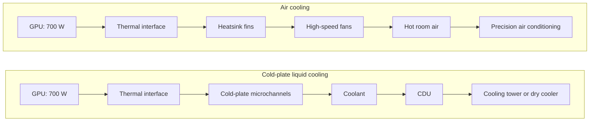
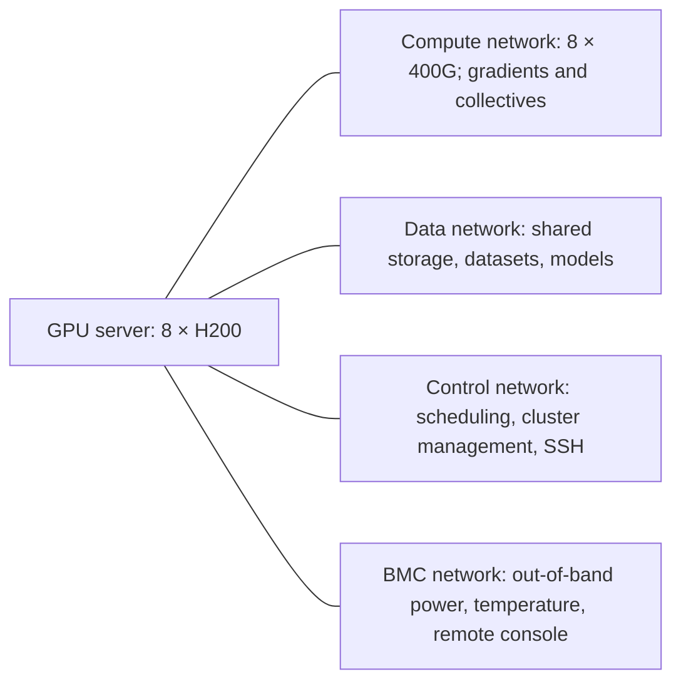
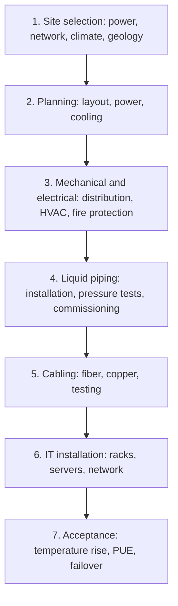

<!-- bilingual-navigation:start -->
[中文原文](../../%E7%AC%AC%E4%B8%80%E8%BE%91%EF%BC%9A%E9%80%A0%E5%9C%BA%E5%AD%90/%E7%AC%AC01%E7%AB%A0-IDC%E4%B8%8E%E6%99%BA%E7%AE%97%E4%B8%AD%E5%BF%83%E5%BB%BA%E8%AE%BE.md) | [English](ch01-data-center-construction.md) | [Contents](../README.md) | [Previous](introduction.md) | [Next](ch02-gpu-selection-and-delivery.md)

English translation of Wang Honglei's Chinese original. Edition and maintenance notes: [TRANSLATIONS.md](../../TRANSLATIONS.md).
<!-- bilingual-navigation:end -->

# Chapter 1: Data Center and AI Data Center Construction

## Opening: An Optical Transceiver Too Hot to Touch

During routine operations, the casing of an active 400G optical transceiver commonly reaches 60–80°C. This is well beyond a safe temperature for bare hands; touching it produces an immediate burning sensation.

An optical transceiver is only palm-sized, yet its power consumption has risen from 3–5 W in the 100G era to 10–12 W at 400G. As networks advance to 800G and 1.6T, power per port is expected to reach 15 W to more than 30 W. With standard QSFP-DD or OSFP package sizes remaining almost unchanged, heat generated per unit area is approaching the physical ceiling of air cooling.

The consequences extend beyond hot surfaces. Laser wavelengths drift, bit error rates deteriorate, and module life can be halved. High-frequency fan vibration can also worsen contamination and loss at optical interfaces.

This hot transceiver is a miniature illustration of AI data center infrastructure: once compute density rises far enough, cooling becomes a hard constraint on sustained, stable operation.

## 1.1 An AI Data Center Is More Than a Server Room with GPUs

An artificial intelligence data center (AIDC) is designed for dense computing workloads such as AI training and inference. Its fundamental difference from a traditional data center is the jump in power density of individual IT loads from hundreds to thousands of watts.

Traditional data centers primarily host general-purpose CPU workloads: web services, databases, and virtual machines that scale horizontally. A general-purpose 2U server typically consumes 300–600 W. With 12–16 servers in a standard 42U rack, 5–8 kW per rack is already a dense configuration.

AI data centers are different. A GPU training node is typically 4U, twice the height of an ordinary 2U server. In air-cooled deployments, a rack often holds only two GPU servers because both cooling and electrical capacity are insufficient for more. Even then, high-power rack fans are usually needed.

For a training node with NVIDIA H200 SXM GPUs, adding the GPUs, CPUs, memory, networking, motherboard, power supplies, and fans gives about 6.6 kW. Whole-system operating power commonly reaches 10–12 kW; the difference mainly comes from PSU conversion losses, chassis fans, management modules, and peak transients not individually listed. With four liquid-cooled nodes per rack, 40–48 kW becomes normal. Even an air-cooled rack with only two nodes exceeds 20 kW, several times a traditional CPU rack.

This increase calls for a system-wide redesign of power, cooling, networking, and operations. Putting GPU servers into an existing facility and relying on its air conditioning often creates later cooling failures and poor energy efficiency.

AI data centers are also often mistaken for replicas of supercomputing centers. Both have high-power nodes, but their workloads differ fundamentally:

| Dimension | Supercomputing center | AI data center |
|------|----------|----------|
| Main compute resources | CPUs plus accelerators; emphasis on FP64 double precision | GPU clusters; emphasis on FP16/BF16/FP8 low precision |
| Communication pattern | Primarily MPI point-to-point | Large-scale collective communication |
| Power per rack | 15–25 kW | 40–60 kW |
| Network topology | Fat-tree, mainly InfiniBand | Fat-tree/rail-optimized, 400G IB/RoCEv2 |
| Job characteristics | Long scientific computing jobs | Large model training at continuous full load for weeks or months |
| Cooling pressure | High | Extremely high |

Supercomputing centers have a more balanced mix of high-power nodes. In the AI data center described here, all nodes are GPU nodes running continuously at high power, leaving cooling systems little respite. Its cooling design cannot simply copy a supercomputing center.

## 1.2 The H200 Cluster Power Budget

To understand why AI infrastructure needs redesigning, first examine how much electricity a GPU server uses and where it goes.

Consider a standard 4U training node containing eight NVIDIA H200 SXM GPUs:

| Component | Specification | Power |
|------|------|------|
| GPU | H200 SXM × 8 | 700 W × 8 = 5.6 kW |
| CPU | Two high-end x86 sockets | About 350–450 W |
| Memory | 24 DDR5 DIMMs | About 240 W |
| Networking | 8 × 400G NICs + 1 × 400G management port | About 80–120 W |
| Motherboard, power supply, and fan losses | — | About 200–300 W |
| Total of listed components | — | About 6.6 kW |
| Whole-system operating power, including PSU conversion losses, chassis fans, management modules, and peak transients | — | About 10–12 kW |

The central figure is the GPU thermal design power (TDP) of 700 W per card. Eight cards total 5.6 kW, accounting for most of the component sum. Cooling design must therefore shift its focus toward removing heat directly from the GPUs.

<!-- translated-figure: images/ch01/fig02-h200-node-power.png -->
| Component in the original figure | Power |
|---|---:|
| 8 × H200 GPUs | 5.60 kW |
| 2 × x86 CPUs | 0.40 kW |
| 24 × DDR5 DIMMs | 0.24 kW |
| 8 × 400G network adapters | 0.10 kW |
| Motherboard, PSU, and fans | 0.30 kW |
| Listed component sum | Approximately 6.6 kW |
| Whole node, as estimated in the source | 10–12 kW |

The source attributes the gap to PSU conversion, chassis fans, management modules, and peak transients. These are the author's estimates rather than a measured power trace.

*Figure 1-2: H200 single-node power breakdown.*

Because servers are 4U and air-cooled racks typically hold only two, the space utilization of a standard 42U rack is low. Auxiliary rack fans further increase noise and energy use. GPU rack counts cannot be estimated using conventional CPU rack density.

At four nodes per rack, power reaches 40–48 kW. A traditional 5–8 kW CPU rack can be served by a 16 A or 32 A PDU configuration. An H200 rack needs three-phase power and redundant PDU feeds, with distribution capacity equivalent to six to eight conventional racks.

<!-- translated-figure: images/ch01/fig01-cpu-gpu-cabinet-power.png -->
| Rack type | Typical configuration in the source | Rack power |
|---|---|---|
| Conventional CPU | 12–16 × 2U servers at 300–600 W each | 5–8 kW |
| Air-cooled GPU | 2 × 4U nodes, each with eight H200 SXM GPUs | About 20 kW |
| Liquid-cooled GPU | 4 × 4U nodes, each with eight H200 SXM GPUs | 40–48 kW |

The original figure labels H200 SXM TDP as 700 W and single-node peak power as approximately 6.4 kW. Its node figure differs from the component and whole-system budgets in the surrounding text; preserve that distinction when reading these estimates.

*Figure 1-1: Power density of CPU and GPU racks.*

The impact on power delivery is direct. A single-phase 220 V/16 A feed supplies about 3.5 kW; a 32 A feed supplies about 7 kW. Dual redundant feeds cover the conventional 5–8 kW range. A 40–48 kW H200 rack needs three-phase 380 V power. Using `P = √3 × U × I`, 48 kW corresponds to approximately 73 A of three-phase current. Each feed therefore needs at least an 80 A three-phase PDU, with dual redundancy.

The cooling impact is even greater. Cooling capacity must at least equal IT power or heat will accumulate. A 5–8 kW rack can use room-level precision air conditioning with N+1 redundancy and underfloor or ducted supply. Room-level cooling cannot deliver the required cooling to a single 40–48 kW H200 rack; even row-level cooling approaches its limits, requiring liquid cooling.

Hotspots matter still more. An H200 concentrates 700 W in a package area of about 0.001 m², or 10 cm², producing roughly 70 W/cm². This exceeds what air cooling can effectively remove. Even when a rack uses liquid cooling, the GPU needs a directly attached cold plate. Microchannels provide the heat transfer coefficient needed for this local heat flux.

Space constraints are often overlooked. AI data centers determine rack count by cooling capacity. A 1,000 m² room might conventionally hold 100 racks at 5 kW, totaling 500 kW. With the same power and cooling budget, 40 kW AI racks allow only 12–13 racks. Compute density increases, but total power remains similar. A common strategy is to concentrate GPU racks in high-density islands with stronger cooling and leave other areas for lower-density CPU workloads.

For a 256-node H200 cluster—2,048 GPUs, roughly a medium-sized training cluster—the budget is:

| Item | Value |
|------|------|
| Nodes | 256 |
| Whole-system power per node | 11 kW, using the midpoint |
| Total IT power | 256 × 11 = 2,816 kW ≈ 2.8 MW |
| Racks at four nodes each | 64 |
| Power per rack | 44 kW |

A 1,000-rack AI data center at 40 kW per rack has a 40 MW IT load. Including cooling and losses at a PUE of 1.3, total demand is about 52 MW, comparable to the capacity of a small substation.

## 1.3 Why Air Cooling Is Reaching Its Limit

Air cooling is constrained by the heat transfer properties of air, not merely fan size.

Optical transceiver power illustrates the trend:

| Generation | Power per port | Surface temperature |
|------|------------|--------------|
| 100G | 3–5 W | Warm |
| 400G | 10–12 W | Scalding, 60–80°C |
| 800G/1.6T | 15 W to more than 30 W | Far beyond safe touch temperatures |

With QSFP-DD and OSFP package sizes nearly unchanged, heat flux reaches the physical limits of air cooling. Full-speed fans become ineffective, their vibration can interfere with precision optics, and their energy cost rises sharply.

Air cooling uses convection as air flows across a hot surface. Air has low specific heat capacity and density, limiting heat removal per unit volume. Beyond a certain heat flux, increasing air speed cannot provide enough heat transfer.

It is like blowing a fan over red-hot iron: once heat production is high enough, a larger fan is insufficient. A different medium, such as water, is required.

400G transceivers are already too hot to touch. The author argues that 800G and 1.6T will exceed air cooling's physical limits, based on package size and power consumption.

High temperatures also create secondary problems:

- Laser wavelength drift: rising temperature shifts the output wavelength, increasing errors once receiver tolerances are exceeded.
- Worsening bit error rate: BER deterioration directly affects network throughput and training stability.
- Shorter module life: cited data suggests that each 10°C rise in operating temperature approximately halves optical transceiver lifetime.

For training clusters running continuously at full load, these are consequential failures. A heat-induced network disruption may force a training job worth tens of thousands of yuan to restart.

## 1.4 Liquid Cooling: From Optional to Essential

When air cooling reaches its limits, liquid cooling becomes the practical choice. Liquids have far greater volumetric heat capacity, carrying thousands of times more heat per unit volume than air. Water also has a much higher heat transfer coefficient, suitable for high-heat-flux devices such as GPUs.

The two main approaches are cold-plate and immersion cooling.

### Cold-Plate Liquid Cooling

A metal cold plate with microchannels attaches to a hot chip such as a GPU or CPU. Coolant passes through the channels to remove heat. The chip does not touch the liquid; heat passes through a thermal interface material into the plate.

Advantages:

- Mature engineering and supply chains.
- Relatively small changes to existing server architectures.
- Easier maintenance, without removing servers from liquid.
- Sufficient capacity for H200 GPUs at 700 W each.

Disadvantages:

- Thermal resistance at the chip-to-plate interface.
- Potential limitations beyond 1,000 W per card.
- Complex piping and a need to manage leakage carefully.

Cold plates suit existing-facility retrofits and hybrid cooling architectures, making them a practical transitional approach.

### Immersion Liquid Cooling

Immersion cooling submerges the motherboard in a specially designed dielectric coolant. The liquid directly contacts heat-producing components, using high heat capacity or latent heat from phase change to achieve highly uniform cooling.

Advantages:

- The strongest cooling capability, without chip-to-cold-plate interface resistance.
- No fans and very low noise.
- Can keep optical transceiver temperatures within safe limits.
- Suitable for new, very large AI clusters.

Disadvantages:

- Less mature engineering.
- More complex maintenance, requiring servers to be lifted from the liquid.
- Expensive coolant, potentially tens of thousands of yuan per rack.
- Strict electrical insulation and material corrosion-resistance requirements.

Immersion offers very high efficiency, but an immediate transition is not appropriate for every deployment.

<!-- translated-figure: images/ch01/fig03-air-liquid-cooling.png -->

Air cooling is limited by air-side heat transfer. Liquid cooling uses the coolant's heat capacity and stronger heat transfer to remove local hotspots.

*Figure 1-3: Heat removal paths for air and liquid cooling.*

### Choosing an Approach

At 700 W per H200, cold plates provide adequate cooling with mature engineering, convenient maintenance, and manageable cost. They are the practical first choice. Unless power exceeds 1,000 W per card or the PUE target is exceptionally demanding—below 1.1—there is no need to rush into immersion.

Designs should nevertheless leave room for a future transition: spare pipe diameter, flow capacity, and coolant distribution unit (CDU) capacity can avoid tearing up floors and disturbing an operating cluster later.

## 1.5 Construction Requires More Than Buying Equipment

Buying the best GPUs, largest air conditioners, and most expensive UPS units does not by itself produce a successful AI data center. Power, cooling, networking, the physical environment, and operations must form a reliable, efficient system that can evolve.

### Site Selection: Four Hard Constraints

The site sets the project's upper limit. Later design cannot fully compensate for a poor choice. For an H200-class deployment, the four constraints are electrical capacity, network access, climate, and geological and flood safety.

**Electrical capacity:** A 32-node H200 cluster uses about 350–380 kW of IT power. At PUE 1.15, cooling and auxiliary systems bring this to about 400–440 kW. A 128-node, 1,024-GPU facility reaches 1.5–1.8 MW. The site must offer megawatt-scale capacity and dual utility feeds. Exclude sites with inadequate capacity or difficult expansion.

Evaluate future capacity as well as current availability. Construction may proceed from 32 nodes to 128 and then 512. Plan the utility application around the final scale to avoid relocation or waiting for grid upgrades.

**Network access:** The site needs high-bandwidth, low-latency access near backbone networks. An H200 cluster uses 400G IB/RoCEv2 internally and needs external uplinks of at least 100G. Multiple carriers' backbone access points reduce the risk of a single-carrier outage. Latency strongly affects distributed training; training across facilities requires millisecond-scale RTT.

**Climate:** Although liquid cooling removes heat through coolant, the CDU's dry cooler or cooling tower still depends on outdoor temperature. Cooler climates permit longer free-cooling operation, reducing CDU energy and PUE. An area averaging 10°C may provide 6,000–7,000 free-cooling hours per year, versus 2,000–3,000 hours at a 25°C average.

Assess dry-bulb and wet-bulb temperatures and extreme-heat days as well as annual averages. Analyze five years of local weather-station data to estimate free-cooling hours and PUE under different conditions.

**Geology and flooding:** An AI data center is a capital-intensive facility. The source recommends a site with seismic intensity below degree 7, above the local 50-year flood level, and with adequate ground-bearing capacity. A fully loaded liquid-cooled rack weighs about 800–1,200 kg. Exclude areas prone to geological hazards.

### Planning and Design: Three Core Decisions

After selecting a site, the central decisions are rack layout, power architecture, and cooling.

**Rack layout:** Four H200 nodes per rack consume 40–48 kW. Layout must account for liquid piping, electrical cabling, and network cable lengths. The liquid-cooled arrangement described here does not require hot/cold aisle containment, but maintenance clearance is still necessary, typically more than 1.2 m.

Arrange racks face-to-face or back-to-back. Run supply and return mains along the bottom or overhead trays of rack rows, keeping branch lengths as balanced as possible. Provide each rack with isolation valves and a flow meter, and reserve access for pipe maintenance.

**Power architecture:** High reliability usually calls for 2N redundancy: dual utility feeds, UPS systems, and PDUs, with each server's power supplies connected to separate feeds. Size each path for full load. Normally each carries 50%; either must take 100% after a failure.

For a 32-node cluster with a 350 kW IT load, allow 400 kW per path, or 800 kW total installed 2N capacity. The two utility feeds should come from different substations; confirm feasibility during site selection.

**Cooling:** The project described here uses cold-plate liquid cooling as a transitional approach, with facility and piping provisions for immersion upgrades. This balances initial investment against future conversion costs.

### Less Obvious Physical Deployment Constraints

Beyond power, cooling, and space, several easily overlooked constraints have substantial operational consequences.

**Multiple networks:** A GPU server usually connects to a compute network, also called the parameter network, for gradient synchronization; a data network for shared storage, datasets, and model loading; a control network for management and scheduling; and a BMC network for out-of-band management. This requires multiple NICs and many copper and fiber connections.

<!-- translated-figure: images/ch01/fig05-gpu-server-network.png -->

Plan fiber paths together with placement; avoid unnecessary ToR and building crossings within a training job.

*Figure 1-5: Multiple networks attached to a GPU server.*

An eight-GPU server needs a substantial number of fibers. Rack-level fiber density is several times that of a conventional CPU rack. Plan cabling early to avoid a maintenance nightmare.

**Latency sensitivity:** Distributed training, especially collective communication, is highly sensitive to latency. Label link lengths when GPU servers span buildings because fiber length directly affects signal delay. In practice, keep a training job's machines within the same top-of-rack (ToR) switch and building when possible to reduce latency and failure domains.

**Noise:** Powerful server fans and auxiliary rack fans make GPU rooms extremely loud. Extended work requires hearing protection, such as noise-reducing headphones or earplugs. Facility design and shift planning must account for occupational health as well as comfort.

**Weight and transport:** Fully loaded liquid-cooled racks can weigh 800–1,200 kg, imposing requirements on floors, access routes, and elevators. Plan equipment delivery order to avoid discovering too late that a rack cannot be moved or supported.

These constraints rarely appear in headline specifications, but any one can cause recurring operational problems.

### Construction and Acceptance

Construction proceeds with mechanical and electrical systems first, followed by liquid cooling, networking, and finally IT equipment.

The complete sequence is facility construction or renovation, mechanical and electrical installation, liquid-cooling piping, network cabling, IT installation, commissioning, and acceptance testing.

<!-- translated-figure: images/ch01/fig04-aidc-construction-flow.png -->

Complete the facility systems before the IT installation. Acceptance also covers leaks, full-load operation, and protective interlocks.

*Figure 1-4: AI data center construction workflow.*

Acceptance testing is essential and should include at least:

- Pressure and leak testing: typically a two-hour hold with less than 0.5% pressure loss.
- Full-load temperature rise: test GPUs and coolant under full load; the cited H200 outlet-water requirement is below 55°C.
- Measured PUE: total operating power divided by IT power; a liquid-cooled facility target is 1.1–1.2.
- Failover: verify automatic switching to backup paths or equipment, typically within 30 seconds.
- Safety interlocks: verify automatic protection, such as stopping pumps after leakage and throttling under overheating.

Commissioning is not the end. Flow balancing, PUE, and operating procedures require ongoing optimization over the facility's life.

## 1.6 Where This Layer Fits

The data center is the bottom layer of the entire chain. It determines several things.

First, how many machines can be installed. Electrical and cooling capacity set the cluster's upper bound, regardless of how many GPUs you want to buy.

Second, whether those machines can run reliably. Unstable cooling or power interrupts training and destabilizes inference. Advanced GPUs and optimized frameworks cannot compensate for an unstable physical foundation.

Third, long-term operating cost. For a megawatt-scale cluster, reducing PUE by 0.1 can save substantial electricity costs annually. Climate and energy-efficient design continue paying off over years of operation.

Fourth, expansion capacity. Reserving power, piping, and floor area in the first phase enables smooth growth. Reapplying for electrical capacity or reopening floors later can cost several times the initial investment.

Only after the site, power, cooling, and networking are ready can we meaningfully discuss GPU selection, network design, and training scheduling. The next chapter moves one layer upward to GPU cluster hardware selection and delivery.

## Summary

An AI data center is more than a traditional facility containing GPUs. Power density rising to tens of kilowatts per rack makes power delivery, cooling, layout, and fiber management system-wide concerns. Liquid cooling becomes essential. Site selection and construction must jointly address electrical capacity, connectivity, climate, and geological safety. This foundation determines cluster size, reliability, and long-term costs.

## Chapter Fact-Checking Checklist

### Reference Materials

- `docs/11-智算数据中心基础设施/课程规划.md`
- `docs/11-智算数据中心基础设施/第01节-智算中心vs传统数据中心/第01节-智算中心vs传统数据中心.md`
- `docs/11-智算数据中心基础设施/第12节-从0到1建设智算中心/第12节-从0到1建设智算中心.md`
- `数据中心-夜冷机房建设的一些信息.md`

### Sources of Key Figures

- Traditional CPU rack power, 5–8 kW: Lesson 1 course document.
- H200 rack power, 40–48 kW: course-plan reference case.
- H200 SXM TDP, 700 W per card: course-plan reference case.
- Listed component total, approximately 6.6 kW per node: Lesson 1 power breakdown table.
- Whole-system power, 10–12 kW per node: Lesson 1 course document.
- Peak node power, approximately 6.4 kW: the author's field measurements, close to the component sum.
- Typically two GPU servers per air-cooled rack: the author's field data.
- Typical GPU server height, 4U: the author's field data.
- 400G transceiver power, 10–12 W: Lesson 2 course plan and root-level document.
- Expected 800G/1.6T transceiver power, 15 W to more than 30 W: course plan and root-level document.
- Approximately halved transceiver lifetime per 10°C rise: root-level document.
- Traditional PUE of 1.5–1.6 and liquid-cooled PUE of 1.1–1.2: course-plan reference case.
- Two-hour pressure hold with less than 0.5% loss: Lesson 12 course document.
- H200 outlet-water temperature below 55°C: Lesson 12 course document.
- Failover within 30 seconds: Lesson 12 course document.
- Compute/data/control/BMC networks: the author's deployment experience.
- Keeping jobs within a ToR and building where possible: the author's deployment experience.
