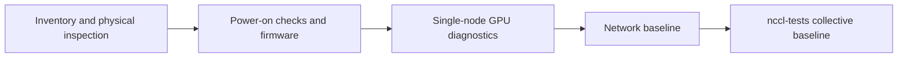

<!-- bilingual-navigation:start -->
[中文原文](../../%E7%AC%AC%E4%B8%80%E8%BE%91%EF%BC%9A%E9%80%A0%E5%9C%BA%E5%AD%90/%E7%AC%AC02%E7%AB%A0-GPU%E9%9B%86%E7%BE%A4%E7%A1%AC%E4%BB%B6%E9%80%89%E5%9E%8B%E4%B8%8E%E4%BA%A4%E4%BB%98.md) | [English](ch02-gpu-selection-and-delivery.md) | [Contents](../README.md) | [Previous](ch01-data-center-construction.md) | [Next](ch03-networking-rdma-rocev2.md)

English translation of Wang Honglei's Chinese original. Edition and maintenance notes: [TRANSLATIONS.md](../../TRANSLATIONS.md).
<!-- bilingual-navigation:end -->

# Chapter 2: GPU Cluster Hardware Selection and Delivery

## Opening: The Most Expensive Is Not Always the Best Fit

With the facility, power, and cooling ready, the next step is buying GPUs. This is more complicated than it sounds.

A common first reaction is to buy the most expensive option: H200 was a flagship training card in the two years preceding this book, so why not use it everywhere? That can make sense, but often wastes money or even harms the workload.

Training and inference have different requirements. Training needs large GPU memory, high interconnect bandwidth, and sustained full-load stability. Inference emphasizes concurrency, energy efficiency, and cost. Training cards can make inference unnecessarily expensive; inference cards may not have enough memory for training.

This chapter covers choosing GPUs for actual workload requirements and accepting delivered machines without introducing faulty hardware into production.

## 2.1 Training and Inference Cards

Data center GPUs broadly fall into training and inference categories. Their design objectives differ; this is not simply a distinction between powerful and weak hardware.

### Representative Training Hardware: B300 / GB300 / H200 / H100 / A100

Training repeatedly performs matrix multiplication, gradient computation, and parameter updates. It is particularly sensitive to:

**Memory capacity:** Parameters, optimizer states, gradients, and activations all occupy GPU memory. In FP16 training of Llama-2-70B, memory per card affects whether the model fits and the usable batch size. H200 has 141 GB of HBM3e, H100 has 80 GB, and A100 has 40 or 80 GB. Insufficient memory requires splitting the model across cards, increasing communication overhead.

**Memory bandwidth:** Training continually reads weights and activations. H200 provides approximately 4.8 TB/s and H100 about 3.35 TB/s. Higher bandwidth feeds Tensor Cores faster and improves compute utilization.

**Tensor Core performance:** Modern large model training relies heavily on matrix multiply-accumulate operations. The cited theoretical BF16 performance, including sparsity, is about 1,979 TFLOPS for H200 and H100, and 624 TFLOPS for A100. This determines the amount of computation possible per unit time.

**Interconnect bandwidth:** Distributed training synchronizes gradients across GPUs. Within an eight-GPU node, NVSwitch provides full connectivity. H200's NVLink 4 bandwidth is about 450 GB/s in one direction or 900 GB/s bidirectionally. Across nodes, IB/RoCEv2 NICs carry communication. Insufficient bandwidth becomes a training bottleneck.

**Power and cooling:** H200 SXM has a TDP of about 700 W per GPU; an eight-GPU node consumes 10–12 kW as a whole. This directly affects facility power and cooling, including the liquid-cooling decisions in Chapter 1.

### Common Inference Choices: L40S / L4 / A10 / 910B

Inference can also use high-end training cards. H200, H100, and even B300 may be the more dependable choice for low latency, high concurrency, or long contexts. Dedicated inference choices such as L40S, L4, and A10 offer lower cost and better energy efficiency for services running around the clock. China's Ascend 910B also has a place after suitable adaptation.

The objective is to serve as many concurrent requests as possible efficiently and affordably.

**Memory capacity:** Inference mainly stores weights and the KV cache. A 7B model's FP16 weights occupy about 14 GB; KV cache size grows with concurrency and sequence length. L40S has 48 GB and can serve models in the 7B–70B range.

**Energy efficiency:** Electricity is a major expense for continuous services. L40S provides sufficient compute at about 350 W, roughly half an H200's power.

**Concurrency:** Inference consists of many small requests; inference-oriented architectures suit concurrent streams.

**Interconnect requirements:** Most inference scenarios need less inter-GPU bandwidth than training. One GPU or two to four GPUs with tensor parallelism often suffice, making PCIe adequate.

### Comparison

| Dimension | Training cards: H200/H100 | Inference cards: L40S/L4 |
|------|---------------------|-------------------|
| Memory capacity | 80–141 GB | 24–48 GB |
| Memory bandwidth | 3.35–4.8 TB/s | About 864 GB/s |
| Tensor Core performance | About 1,979 TFLOPS, including sparsity | About 183 TFLOPS |
| Interconnect | NVLink + NVSwitch | PCIe |
| Power per card | About 700 W | About 72–350 W |
| Typical workloads | Large model training and large-scale fine-tuning | Online inference and model serving |

Determine the workload before choosing the card.

### Where Ascend 910B Fits

Chinese accelerators are another important option. Huawei's Ascend 910B targets training and inference, using the Da Vinci architecture, CANN software stack, and MindSpore framework.

Ascend and NVIDIA systems are usually physically separated and do not participate in a shared training job. Selection must consider:

- Compatibility with existing training frameworks.
- Completed model adaptation and performance validation.
- The operations team's hardware troubleshooting experience.
- Supply stability and future expansion.

Architecturally, NVIDIA uses streaming multiprocessors (SMs) containing CUDA and Tensor Cores. Ascend uses AI Cores with Cube, Vector, and Scalar units; Cube units handle matrix computation. NVIDIA uses CUDA, while Ascend uses CANN. CUDA programs cannot run directly on Ascend and require conversion or rewriting.

NVIDIA has mature support in PyTorch and TensorFlow. Ascend supports workloads through MindSpore, PyTorch adaptation plugins, and CANN, but some operators, custom CUDA kernels, and NCCL communication code need migration, including replacement with HCCL. Effort depends on model complexity and may involve operator replacement, communication changes, and numerical calibration.

NVIDIA's `nvidia-smi`, DCGM, and Nsight tooling is widely used and documented. Ascend's `npu-smi` and Ascend-dmi provide similar functions, but teams must learn different error codes, temperature thresholds, and firmware procedures. Drivers, firmware, and container images are incompatible between the ecosystems, making mixed operations complex.

Within one facility, NVIDIA and Ascend therefore commonly have separate physical deployments, networks, and storage. Peak compute alone is insufficient: consider model readiness, maintenance capability, and continued supply. A CUDA/PyTorch workload may require significant rewriting and lose performance after an abrupt migration. Where Chinese alternatives are explicitly required and adaptation is complete, Ascend 910B is viable.

In the author's deployments, comparable models on Ascend typically have MFU 5–10 percentage points below NVIDIA and take longer to troubleshoot. Choosing Ascend therefore also means investing in adaptation, tooling, and team training.

## 2.2 Five Dimensions of GPU Selection

Selection requires balancing several dimensions rather than maximizing one specification.

<!-- translated-figure: images/ch02/fig01-gpu-selection.png -->
| Workload | Examples in the source | Selection priorities | Deployment pattern |
|---|---|---|---|
| Large-scale training | H200 / H100 / Ascend 910B | Memory, NVLink/HCCS, compute | Eight-accelerator nodes with 400G networking |
| Inference | L40S / A100 / L20 | Cost, memory, power, density | Multiple GPUs or quantized models |
| Fine-tuning and development | A100 / L40S / Ascend 910B | Memory, then compute, then cost | One multi-GPU server or a small cluster |

*Figure 2-1: Matching GPUs to workload types.*

### Compute: Tensor Cores Determine Training Speed

The important training capability is Tensor Core matrix multiply-accumulate throughput, rather than CUDA Core count alone. The source illustrates this with a 16 × 16 × 16 operation equivalent to 8,192 FLOPs per clock, compared with multiple CUDA Core operations.

Focus on Tensor Core FP16/BF16/FP8 throughput rather than CUDA FP32 performance. H200's approximately 1,979 BF16 TFLOPS including sparsity is more informative than its CUDA Core count.

The SM is the GPU's basic compute unit. H200 has 132 SMs, each containing 128 CUDA Cores and four Tensor Cores: 16,896 CUDA Cores and 528 Tensor Cores in total.

An SM executes threads in warps of 32. All 32 execute the same instruction on different data, following the SIMT model. A shared branch is efficient; divergent branches must be executed separately, wasting capacity.

CUDA Cores suit scalar and elementwise arithmetic. Tensor Cores specialize in matrix operations. The source attributes more than 90% of training compute to Tensor Cores, making their count, supported precisions, and per-cycle throughput central selection criteria.

### Memory Capacity: How Large a Model Can Run

Larger models, batches, and sequences require more memory. When capacity is insufficient, reducing batch size or introducing model parallelism can reduce efficiency.

Typical FP16 weight sizes are:

- 7B: approximately 14 GB.
- 70B: approximately 140 GB.
- 405B: approximately 810 GB.

An H200's 141 GB can hold 70B weights, but training also needs optimizer states, gradients, and activations. Full-parameter 70B training therefore still normally requires multiple GPUs.

### Memory Bandwidth: Keeping Compute Units Fed

Compute can be fully utilized only when arithmetic intensity is high enough. Dividing H200's cited 1,979 TFLOPS by 4.8 TB/s gives about 412 FLOPs/byte. Roughly 412 floating-point operations per byte read are needed to use that peak compute capacity.

Matrix multiplication can achieve high arithmetic intensity; embedding lookups and LayerNorm are often bandwidth-bound. This motivates techniques such as FlashAttention that reduce HBM traffic.

The cited H200 hierarchy has about 228 KB of on-chip SRAM per SM, approximately 30 MB total at about 19 TB/s; approximately 50 MB of L2 at 12 TB/s; and 141 GB of HBM3e at 4.8 TB/s. SRAM is roughly four times faster than HBM but much smaller. FlashAttention tiles Q, K, and V into SRAM and avoids writing the full scores matrix back to HBM.

### Interconnect Bandwidth: Making Multiple GPUs Work Together

Large models need multiple GPUs, making communication critical.

Within an H200 node, four NVSwitch 3.0 chips fully connect eight GPUs. One-direction NVLink bandwidth between GPUs is about 370–450 GB/s. Across nodes, a 400 Gbps IB/RoCEv2 port provides approximately 50 GB/s of effective bandwidth in the source's estimate.

NCCL discovers physical paths at startup. The cited categories are `PATH_NVB`, through NVSwitch/NVLink, about 370 GB/s; `PATH_PXB`, through PCIe switches, about 64 GB/s; `PATH_PHB`, through a CPU PCIe host bridge, about 32 GB/s; and `PATH_SYS`, across NUMA nodes, about 16 GB/s. An unintended `PATH_SYS` route can reduce bandwidth more than twentyfold. During acceptance, use `nvidia-smi topo -m` to confirm NV18 connectivity between GPUs.

Insufficient interconnect bandwidth makes gradient synchronization dominate training time, leaving GPUs waiting and lowering utilization.

### NUMA and PCIe Topology

Eight-GPU H200 nodes commonly have two CPUs and two NUMA nodes. GPUs and NICs connect through PCIe root complexes. Pairing a GPU on NUMA 0 with a NIC on NUMA 1 sends data across QPI/UPI, increasing latency by 30–50% in the source's estimate.

In `nvidia-smi topo -m`, PIX indicates a shared PCIe switch, PXB multiple switches under the same CPU, PHB a host-bridge path in the same NUMA node, and SYS a cross-NUMA path. NCCL tries to choose NICs on the GPU's NUMA node to avoid `PATH_SYS`.

Acceptance should confirm that each GPU's primary NIC path is no worse than PXB, GPU pairs show NV18, and NIC interrupts are assigned to local NUMA cores. Poor topology may require changing NIC slots or BIOS SR-IOV/IOMMU settings. Cross-NUMA GPU–NIC pairing is a common cause of slow training.

### Power and Cost: Buying and Operating the Cluster

An H200 SXM costs tens of thousands of US dollars; an eight-GPU server exceeds US$250,000. Including networking, storage, facilities, electricity, and operations, the source estimates that a 256-GPU H200 cluster can exceed US$10 million.

Operating expense matters too. The source gives 700 W per H200 and estimates 2.8 MW of IT power and 3.4 MW at PUE 1.2 for a “256-card” cluster. These cluster-scale figures are retained from the original text; Chapter 1 associates approximately 2.8 MW with 256 eight-GPU **nodes**.

Selection must consider:

- Whether the workload really needs H200 memory and compute.
- Whether A100, L40S, or another cheaper option suffices.
- Whether utilization justifies the cost.
- Whether the expansion path is clear.

## 2.3 GPU Sharing and Virtualization

Expensive, scarce GPUs need high utilization. Sharing is harder than with CPUs because workloads can contend strongly for GPU resources. The three approaches discussed here are exclusive allocation, time slicing, and MIG.

### Exclusive GPUs

One physical GPU serves one job. This is the default for training, which occupies GPUs for long periods and needs predictable performance.

Advantages: no contention, predictable performance, and simple deployment.

Disadvantage: small jobs may leave much of the GPU idle.

### Time Slicing

Time slicing shares a GPU in software among containers or processes. The source describes this alongside NVIDIA MPS, which enables concurrent CUDA processes.

Each container sees a GPU allocation while the physical compute resources are shared over time.

Advantages: flexible configuration and better utilization for small jobs and development environments.

Disadvantages: weak isolation and contention for memory and compute. One job's memory use can cause others to run out of memory. It is unsuitable for latency-sensitive production inference.

### MIG

Multi-Instance GPU (MIG), introduced with NVIDIA Ampere, partitions one GPU into isolated hardware instances with dedicated compute, memory, and bandwidth.

The source gives A100 40 GB as an example supporting up to seven `1g.5gb` instances, each with one compute slice and 5 GB of memory. It also lists larger profiles such as `2g.20gb` and `3g.40gb`. H100 extends MIG capabilities with more flexible configurations.

Advantages: hardware isolation and predictable performance for multitenant inference.

Disadvantages described in the source: fixed partition granularity, limited flexibility, incompatibility with simultaneous time slicing, and repartitioning constraints tied to driver restart.

### Comparison

| Property | Exclusive GPU | Time slicing | MIG |
|------|----------|--------------|-----|
| Isolation | Complete | Software-level | Hardware-level |
| Performance guarantee | 100% | Shared contention | Dedicated resources |
| Memory | Entire GPU | Shared | Allocated partition |
| Flexibility | Low | High | Medium |
| Use cases | Training / large inference | Development / small jobs | Multitenant inference |

Clusters often combine these approaches: exclusive GPUs for training, exclusive or MIG allocations for inference, and time slicing for development and testing.

## 2.4 Hardware Delivery and Acceptance

Delivered GPU machines should not enter production immediately. Acceptance prevents faulty hardware from reaching the cluster.

### Receiving Inventory

Check:

- GPU models and counts against the purchase order.
- Serial numbers for warranty and asset tracking.
- Physical damage to heatsinks, brackets, and edge connectors.
- Power and network cables, RAID cards, SSDs, and other accessories.

Record each machine's GPU, NIC, and motherboard serial numbers, delivery date, and rack location. Warranty work, firmware upgrades, and troubleshooting depend on this information.

### Power-On Checks

Verify that all GPUs are detected:

```bash
nvidia-smi
```

The output should show every GPU's index, model, memory, temperature, and power. Missing or abnormal devices require checking seating, PCIe slots, power cables, and driver installation.

Inspect topology:

```bash
nvidia-smi topo -m
```

The output describes NVLink, PCIe, and NUMA relationships. Training nodes should show NVSwitch connectivity and NV18 between GPUs, indicating 18 NVLink connections.

A SYS relationship between a GPU and NIC means crossing NUMA nodes. NCCL tries to avoid it, but record it and adjust slots or BIOS settings if necessary.

### Baseline Tests

After power-on checks, run stress and performance tests:

<!-- translated-figure: images/ch02/fig02-gpu-delivery-acceptance.png -->


*Figure 2-2: GPU cluster delivery and acceptance workflow.*

The purpose is to record healthy performance for every machine. Later bandwidth or latency changes can then be compared with the baseline to identify slow nodes.

**1. NCCL AllReduce bandwidth**

```bash
mpirun -np 8 ./all_reduce_perf -b 8M -e 1G -f 2 -g 1
```

- `-np 8`: eight processes for eight GPUs.
- `-b 8M`: minimum message size of 8 MB.
- `-e 1G`: maximum message size of 1 GB.
- `-f 2`: double the message size each step.
- `-g 1`: one GPU per process.

Examine both bus bandwidth and algorithm bandwidth. The source expects intra-node H200 NVLink AllReduce to reach at least roughly 80% of theoretical bandwidth. A machine well below its peers needs investigation of PCIe, NVLink, and NUMA affinity.

**2. CUDA bandwidthTest**

```bash
./bandwidthTest --device=all --mode=shmoo
```

This checks memory-copy bandwidth, including device-to-device transfers, to assess HBM performance. The source expects H200 device-to-device results on the order of 4.8 TB/s.

**3. Extended stress testing**

```bash
gpu-burn 3600
```

Run at full load for at least an hour, watching for abnormal temperatures, XID errors, and disappearing GPUs. New hardware often reveals defects under sustained heat and load.

**4. Record the baseline**

Store in the asset system or CMDB:

- AllReduce bus bandwidth at 8 MB, 256 MB, and 1 GB.
- Device-to-device bandwidth from bandwidthTest.
- Peak temperature and final status after one hour of gpu-burn.
- `nvidia-smi topo -m` output.
- Driver, CUDA, and firmware versions.

### Interpreting Results and Finding Slow Nodes

Compare every machine in the batch, rather than looking only at averages. Sort results by bus bandwidth. Investigate any machine more than 10% below the batch average at 256 MB.

Common causes include PCIe degradation from Gen5 x16 to x8, NVLink faults, cross-NUMA NICs, CPU frequency limits, and thermal throttling. Check:

- `nvidia-smi --query-gpu=pcie.link.gen.current,pcie.link.width.current --format=csv` for PCIe generation and width.
- `nvidia-smi nvlink -s` for link status.
- `cat /sys/class/net/eth0/device/numa_node` for NIC NUMA placement.
- `dmesg -T | grep -i xid` for XID errors.
- `nvidia-smi dmon -s t` for the source's full-load monitoring check.

Repeat baseline testing monthly. When production slows, compare current results with the baseline to distinguish network, GPU, and training-configuration changes. Slow nodes may report no errors but still hold up the entire AllReduce operation.

### Troubleshooting XID Errors

NVIDIA drivers report GPU errors using XID numbers, covering issues such as ECC failures, PCIe disconnection, and engine faults.

A typical log entry is:

```
NVRM: Xid (PCI:0000:3b:00 GPU-I:00 GPU-CI:00): 63, pid=12345, name=python, Retiring page...
```

The original chapter's XID reference table is translated below:

| XID | Meaning | Severity | Suggested action |
|-----|------|--------|----------|
| 13 | Graphics engine exception | Channel-level | Watch for recurrence |
| 31 | FIFO MMU page fault | Channel-level | Check driver and memory |
| 43 | Channel verification error | Channel-level | Usually accompanies other errors |
| 48 | Double-bit ECC error | Serious | Inspect ECC statistics and memory health |
| 58 | GPU memory error | Serious | Isolate and replace immediately |
| 61/62 | PMU breakpoint or halt | Serious | Check power and temperature |
| 63 | Successful physical page retirement | Informational | Monitor retired-page growth |
| 64 | Failed physical page retirement | Serious | Faulty page remains unisolated |
| 74 | NVLink error | Context-dependent | Check links and connectors |
| 79 | GPU fallen off the bus | Fatal | Check PCIe slot, power, and riser |
| 90 | L2 cache error | Serious | Check temperature and power |
| 94 | Contained error | Channel-level | Operation can usually continue |
| 95 | Uncontained error | Fatal | GPU reset required |
| 98 | NVDEC7 video decoder error | Channel-level | In compute-only use, the source attributes this to hardware failure |
| 109 | GPU disconnection detected by firmware | Fatal | Replacement is considered likely |
| 119 | GSP RPC timeout | Fatal | Check firmware and driver |
| 120 | GSP firmware error | Fatal | Check firmware version |
| 140 | Unrecoverable ECC error | Fatal | Replace GPU |
| 168 | Reduced memory capacity | Warning | Accumulated retired pages |

The source describes XID 63 as permanent page retirement after an uncorrectable double-bit ECC error. Operation can continue, but frequent events suggest declining memory health. It associates accumulated retired pages exceeding a threshold with XID 168 and reduced usable memory.

It describes XID 79 as a disconnection reported by Kernel-RM and XID 109 as a firmware-originated GSP-RM report through an out-of-band channel, absent from the open-source definition it consulted. Both are treated there as unrecoverable events requiring inspection of PCIe slots, power, and risers, often followed by replacement.

During acceptance, run several multi-GPU tests with `NCCL_DEBUG=INFO` and monitor `dmesg`. The source expects no XID errors on new machines and recommends rejection or isolation for XID 48, 58, 74, 79, 95, 109, 119, 120, or 140.

### DCGM and Continuous Monitoring

Acceptance is only the beginning. NVIDIA Data Center GPU Manager (DCGM), commonly exposed to Prometheus through DCGM Exporter, supports ongoing health monitoring.

| DCGM field | Description | Associated XID in the source |
|-----------|------|----------|
| DCGM_FI_DEV_XID_ERRORS | Most recent XID number | All XIDs |
| DCGM_FI_DEV_ECC_DBE_VOL_TOTAL | Total double-bit ECC errors | 48 / 63 |
| DCGM_FI_DEV_RETIRED_DBE | Pages retired because of DBE | Result of 63 |
| DCGM_FI_DEV_RETIRED_PENDING | Pages awaiting retirement | 63 in progress |
| DCGM_FI_DEV_PCIE_REPLAY_COUNTER | PCIe replay count | Related to 109 |

The source proposes informational alerts for XIDs above zero and below 48; critical alerts for 48, 58, 74, 79, 95, 109, 119, 120, and 140; and warnings for continually increasing retired DBE pages. Monitoring can expose degradation before complete failure interrupts training.

DCGM also collects utilization, memory use, temperature, power, PCIe replays, and clock frequencies. Build Grafana dashboards by node and GPU to locate abnormal cards quickly.

### Firmware and Driver Version Management

Cluster stability depends on consistent versions of:

- GPU drivers, to avoid differences in topology discovery.
- VBIOS/GSP firmware, with coordinated fixes for known issues.
- CUDA Toolkit, matched to drivers and framework builds.
- NCCL, to avoid differing topology algorithms.
- Mellanox OFED/rdma-core, covering NIC drivers and RDMA userspace.

Use the change approval process, validate on test nodes, and roll out gradually. Record old versions and baselines, then retest NCCL bandwidth and inspect XIDs before expanding deployment.

BMC firmware also affects IPMI formats, fan control, and temperature thresholds. Standardize versions and alert thresholds.

Standardize BIOS settings too:

- Enable Above 4G Decoding for large GPU memory mappings.
- Match SR-IOV configuration to NIC requirements.
- Disable deep C-states to reduce CPU wake-up latency.
- Set PCIe speed to Auto or Gen5.
- Enable or disable IOMMU according to GPUDirect RDMA and virtualization requirements.

Record each machine's BIOS version, settings, BMC version, and driver version as the reference for future changes and troubleshooting.

### Delivery Acceptance Checklist

| Check | Command or method | Pass criterion |
|--------|----------|----------|
| GPU count | nvidia-smi -L | All GPUs present |
| GPU model | nvidia-smi | Matches purchase |
| Driver version | nvidia-smi | Meets cluster standard |
| Memory capacity | nvidia-smi -q -d MEMORY | Matches specification |
| PCIe link | nvidia-smi --query-gpu=pcie.link.gen.current,pcie.link.width.current --format=csv | Gen5 x16 |
| Intra-node topology | nvidia-smi topo -m | NV18 between GPUs |
| NVLink status | nvidia-smi nvlink -s | All 18 links healthy |
| NCCL bandwidth | mpirun -np 8 ./all_reduce_perf -b 8M -e 1G -f 2 -g 1 | Meets batch baseline |
| HBM bandwidth | ./bandwidthTest | Near specification |
| Stress test | gpu-burn 3600 | No errors, normal temperatures |
| XID monitoring | `dmesg -T \| grep -i xid` | No XIDs during acceptance |
| ECC status | nvidia-smi -q -d ECC | No new DBEs |
| Temperature | nvidia-smi dmon -s t | Full-load temperature within threshold |
| Power | nvidia-smi dmon -s p | Full-load power near TDP |
| Serial numbers | Manual verification | All recorded in asset system |

Make this checklist part of delivery, with a signed and archived acceptance report. Machines that have not completed acceptance should not join production.

## 2.5 Where This Layer Fits

GPU selection connects the facility with networking and training.

Facility electrical capacity limits GPU count, while cooling limits supported power. An air-cooled room cannot use liquid-cooled H200 rack density.

GPU hardware then shapes networking and frameworks: NVLink/NVSwitch topology determines NCCL paths, memory capacity influences model parallelism, and interconnect bandwidth determines distributed efficiency.

Selection mistakes are especially expensive because GPUs are costly, purchased in quantity, and difficult to replace and redeploy. Define workloads, performance limits, budget, and expansion plans before ordering.

With machines selected, the next chapter explains how to connect them for efficient distributed training.

## Summary

The best GPU is the one suited to the workload. Training emphasizes memory, interconnects, and Tensor Core throughput; inference emphasizes concurrency, energy efficiency, and cost. Acceptance must verify PCIe, NVLink, NCCL bandwidth, stress behavior, and XID logs, establishing a baseline for every machine. Incorrect procurement is costly to reverse.

## Chapter Fact-Checking Checklist

### Reference Materials

- `docs/10-大模型Infra工程师/第03节-GPU架构与CUDA基础/第03节-GPU架构与CUDA基础.md`
- `docs/10-大模型Infra工程师/第04节-机内物理路径/第04节-机内物理路径.md`
- `Ai领域sre细分知识/GPU虚拟化.md`
- `Ai领域sre细分知识/GPU调度与资源管理.md`
- `NVIDIA-XID错误码深度解析与排障指南.md`

### Sources of Key Figures

- H200 HBM3e, 141 GB and 4.8 TB/s: Lesson 3 course document.
- H200 BF16 performance, approximately 1,979 TFLOPS: Lesson 3.
- H200's 132 SMs, 128 CUDA Cores and four Tensor Cores per SM: Lesson 3.
- H200 NVLink 4, 450 GB/s one-way and 900 GB/s bidirectional: Lesson 3.
- Four NVSwitch 3.0 chips connecting eight H200 GPUs: Lesson 4.
- PCIe 5.0 x16, approximately 64 GB/s bidirectional as stated in the source: Lesson 4.
- Up to seven A100 MIG instances: GPU virtualization document.
- H200 SXM TDP of approximately 700 W: Chapter 1 materials.
- L40S power of approximately 350 W and 48 GB memory: public product specifications.
- XID 63/64/74/79/95/98/109/119/120/140/168 descriptions: NVIDIA-XID troubleshooting guide.
- NCCL `PATH_NVB`/`PATH_PXB`/`PATH_PHB`/`PATH_SYS` bandwidth: Lesson 4.
- H200 SRAM, 228 KB per SM and approximately 30 MB total: Lesson 3.
