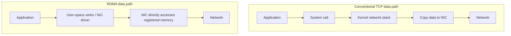

<!-- bilingual-navigation:start -->
[中文原文](../../%E7%AC%AC%E4%B8%80%E8%BE%91%EF%BC%9A%E9%80%A0%E5%9C%BA%E5%AD%90/%E7%AC%AC03%E7%AB%A0-%E6%99%BA%E7%AE%97%E7%BD%91%E7%BB%9C%E4%B8%8ERDMA-RoCEv2.md) | [English](ch03-networking-rdma-rocev2.md) | [Contents](../README.md) | [Previous](ch02-gpu-selection-and-delivery.md) | [Next](../part-2-platforms/introduction.md)

English translation of Wang Honglei's Chinese original. Edition and maintenance notes: [TRANSLATIONS.md](../../TRANSLATIONS.md).
<!-- bilingual-navigation:end -->

# Chapter 3: AI Networking and RDMA/RoCEv2

## Opening: A Network Is More Than a Pipe

People often imagine a data center network as plumbing: a wider pipe carries more traffic and performs better. This analogy broadly fits general cloud computing but can mislead in AI infrastructure.

An AI network must coordinate thousands of GPUs during training, with low latency, high bandwidth, little CPU involvement, and rapid recovery from congestion. Ordinary TCP/IP was not designed around this combination of goals.

This chapter explains these requirements and why RDMA, InfiniBand, and RoCEv2 have become standard choices for large-scale training.

## 3.1 Why Ordinary Ethernet Is Insufficient

Start with the traditional TCP/IP receive path.

### The TCP/IP Receive Path

A packet enters the NIC, which uses DMA to write it into memory and interrupts the CPU. A short hardware interrupt handler schedules a software interrupt. The kernel then parses Ethernet, IP, and TCP headers before copying payload data into the application's userspace buffer.

The stages are:

**1. Physical reception and DMA:** The PHY receives electrical or optical signals, and the MAC performs frame delimiting and FCS validation. The NIC's DMA engine writes valid frames over PCIe into a ring buffer without CPU copying.

**2. Hardware interrupt:** After DMA, the NIC raises an MSI-X interrupt. The CPU enters the driver's handler, which acknowledges and masks the interrupt, schedules deferred processing, and returns. This typically takes microseconds.

**3. Software interrupt and NAPI:** `net_rx_action` invokes the driver's polling function, reads the ring, constructs `sk_buff` structures, and passes packets through GRO to the stack. NAPI batches work through polling with interrupts disabled to prevent interrupt storms.

**4. Kernel protocol processing:** The packet passes through link, network, and transport layers. Processing includes protocol dispatch, IP checks, routing, Netfilter hooks, TCP checksums, state transitions, and connection lookup by four-tuple.

**5. Socket and application:** Data enters the socket receive queue and wakes the waiting process. When the application calls `recv()`, the kernel copies data into its userspace buffer.

### TCP/IP Overheads

**Interrupts:** At millions of packets per second, interrupt handling consumes substantial CPU time.

**Context switching and copying:** Moving data between kernel and userspace introduces overhead. The source describes a traditional send/receive operation as involving four context switches and multiple copies.

**Protocol processing:** Retransmission, congestion control, and flow control provide rich functionality at the cost of latency.

**CPU involvement:** CPU processing can become the bottleneck.

Web requests and database queries often tolerate millisecond latency and small payloads. Training instead synchronizes large gradients frequently and needs microsecond-scale latency with minimal CPU involvement.

In the source's eight-GPU teaching example, each step has approximately 256 MB of gradients and assumes pairwise traffic of `256 MB × 7 ≈ 1.8 GB`. At a cited PCIe 5.0 bandwidth of 64 GB/s, this takes about 28 ms, versus 4.9 ms at 370 GB/s over NVLink. At ten steps per second, the comparison is 280 ms versus 49 ms spent communicating each second.

### NUMA and Multiple Queues

In dual-socket systems, a NIC attached to CPU 0 but serviced by CPU 1's interrupt cores requires cross-UPI/QPI access to CPU 0's memory. The source estimates a 30–50% latency increase.

Modern NICs use receive-side scaling (RSS) with separate queues and interrupts. Configure queues with `ethtool -L eth0 combined 32`, bind interrupts through `/proc/irq/<IRQ>/smp_affinity_list`, and bind applications and memory locally with `numactl --cpunodebind=0 --membind=0`.

These optimizations can raise TCP/IP processing to 2–5 million packets per second per core, but do not match RDMA latency. RDMA bypasses the kernel networking stack.

### Copies and the Limits of TCP Zero-Copy

The receive path includes at least one CPU copy from `sk_buff` to userspace. The source traces the send path from userspace through socket buffers, TCP, IP, and the driver ring, then DMA to the NIC.

Linux offers `sendfile`, `splice`, `mmap` with `PACKET_MMAP`, and `io_uring`. These either target particular use cases or retain core kernel-stack processing, limiting their suitability for microsecond-scale AllReduce communication.

RDMA transfers directly between the NIC and application memory without kernel socket buffers or CPU copies. The source contrasts approximately 1–5 µs for RDMA with 10–50 µs for TCP.

## 3.2 What Is RDMA?

Remote Direct Memory Access lets one machine access another machine's memory without involving the remote CPU in the data transfer.

<!-- translated-figure: images/ch03/fig01-tcp-rdma-path.png -->


The TCP path involves the CPU in stack processing and copies. RDMA bypasses the kernel data path and avoids CPU-mediated data copying for the transfer; setup and control still involve software.

*Figure 3-1: TCP/IP and RDMA data paths.*

Consider servers A and B exchanging application data. TCP/IP requires B's CPU and kernel stack to process packets and copy data into application memory. With RDMA, the NIC can place data directly into registered application memory.

Its main advantages are:

**Kernel bypass:** The data path runs directly between the NIC and application memory.

**Zero-copy:** Data does not traverse multiple operating-system buffers.

**Low latency:** Communication drops from tens of microseconds to a few microseconds.

**Low CPU use:** CPU capacity remains available to the training framework.

These properties match distributed training requirements.

Applications must first register memory. Registration pins physical pages, establishes address mappings, and produces local and remote keys. The NIC can access only registered regions, with remote access checked using the `rkey`.

The source describes NCCL primarily using RDMA Write: the sender places gradients in registered GPU memory and submits a work request; its NIC reads that memory and sends the data; the remote NIC uses `remote_addr` and `rkey` to write directly into the receiving GPU's memory without remote CPU participation.

### Verbs and Memory Registration

RDMA's programming interface is called verbs. Key APIs include:

- `ibv_open_device()`: open an RDMA device.
- `ibv_query_device()`: query device capabilities, described in the source in terms of port speed and GDR support.
- `ibv_alloc_pd()`: allocate a protection domain for memory and queue-pair isolation.
- `ibv_create_cq()`: create a completion queue.
- `ibv_create_qp()`: create a queue pair with send and receive queues.
- `ibv_reg_mr()`: register a memory region.
- `ibv_post_send()` / `ibv_post_recv()`: post requests.
- `ibv_poll_cq()`: poll completions.

`ibv_reg_mr()` pins pages, maps addresses, and generates `lkey` and `rkey`. Pinning prevents swapping from invalidating the physical addresses used by the NIC.

GPUDirect RDMA permits GPU memory registration too. NCCL registers GPU memory during initialization and then transfers gradients between GPUs without staging in CPU memory. Setup APIs enter the kernel; the subsequent data path bypasses it.

### Connections and the QP State Machine

A queue pair (QP) contains a send queue (SQ) and receive queue (RQ). Setup involves:

1. Exchanging IP addresses, GIDs, QPNs, PSNs, keys, and virtual addresses through an out-of-band channel such as TCP.
2. Creating the QP and transitioning it through RESET → INIT → RTR, ready to receive → RTS, ready to send.
3. Registering memory and exchanging remote keys and addresses.
4. Posting send work requests; Send/Recv operations also require preposted receive requests.
5. Polling the completion queue.

RoCEv2 uses IP/UDP encapsulation and a reliable out-of-band setup channel. NCCL exchanges connection information over sockets, then uses RDMA for data. Setup failures may involve mismatched GIDs, incorrect VLANs, packet loss associated with PFC configuration, or a firewall blocking UDP 4791.

## 3.3 InfiniBand, RoCEv2, and iWARP

These are the three main RDMA approaches discussed here.

### InfiniBand

InfiniBand is designed for high-performance computing and has its own physical-through-transport stack. It requires IB adapters, switches, and cables.

Advantages:

- High performance and low latency.
- Native RDMA.
- Lossless operation and mature congestion control.
- Extensive use in HPC and early large AI clusters.

Disadvantages:

- High equipment cost.
- Separate infrastructure that cannot reuse Ethernet equipment.
- Specialized operational skills.
- A concentrated supplier market.

IB switches forward using a linear forwarding table (LFT), with routes precomputed by a subnet manager. Addressing uses 16-bit local identifiers (LIDs), without ARP. Link-layer credits provide lossless behavior without Ethernet PFC or ECN.

### RoCEv2

RDMA over Converged Ethernet version 2 runs InfiniBand transport over standard Ethernet and IP, allowing Ethernet infrastructure to carry RDMA.

<!-- translated-figure: images/ch03/fig02-rocev2-stack.png -->
| Layer, from transport toward the wire | RoCEv2 encapsulation |
|---|---|
| InfiniBand transport | Base Transport Header (BTH) and extended headers |
| UDP | Destination port 4791 |
| IP | IPv4 or IPv6 |
| Ethernet | Standard Ethernet frames |

*Figure 3-2: The RoCEv2 protocol stack.*

| Layer | Content |
|------|------|
| L2 | Ethernet header |
| L3 | IP header |
| L4 | UDP header, destination port 4791 |
| Transport | InfiniBand transport headers, including BTH |

Advantages:

- Reuses Ethernet switches and cabling.
- Lower cost than InfiniBand.
- Relatively straightforward deployment.
- Routability and flexible cross-subnet communication.

Disadvantages:

- Depends on lossless Ethernet configuration, including PFC/ECN.
- Demands careful switch and network tuning.
- Somewhat lower performance and stability than IB in the source's comparison.

RoCEv2 uses IP/MAC addressing and ARP. Switches perform IP routing and ECMP. Its verbs interface matches IB, allowing NCCL's `net_ib.cc` to support both.

### iWARP

Internet Wide Area RDMA Protocol places RDMA over TCP rather than UDP.

Advantages:

- Reuses TCP/IP infrastructure.
- TCP handles routing-related connectivity, congestion, and retransmission without requiring PFC/ECN.
- Easier deployment across wide-area or complex routed networks.

Disadvantages:

- Higher latency than RoCEv2 or IB because TCP processing remains involved.
- Requires iWARP-capable NICs.
- Limited adoption in AI training clusters.

Most AI deployments choose between IB and RoCEv2.

### Comparison

| Dimension | InfiniBand | RoCEv2 | iWARP |
|------|------------|--------|-------|
| Underlying network | Dedicated IB | Ethernet + IP | Ethernet + IP |
| Transport | Native IB | IB over UDP | RDMA over TCP |
| Adapter | IB HCA | RNIC | iWARP NIC |
| Switch | IB | Ethernet | Ethernet |
| Addressing | LID | IP + MAC | IP + MAC |
| Routing | SM-precomputed LFT | IP + ECMP | TCP/IP network routing |
| Loss handling | Credits | PFC + ECN + DCQCN | TCP retransmission |
| Latency | Lowest | Near IB | Higher |
| Cost | High | Medium | Medium |
| Operational complexity | Medium; IB skills required | High; PFC/ECN tuning | Medium |
| AI training use | Widespread | Increasingly mainstream | Limited |

### Choosing

**Scale:** RoCEv2 is attractive for smaller or cost-sensitive clusters. IB retains advantages at very large scale or with extreme performance requirements.

**Cost:** IB adapters, switches, and cables cost more; RoCEv2 is often more practical under budget constraints.

**Team capability:** IB requires specialized skills. Ethernet experience helps with RoCEv2, but lossless configuration still needs training.

**Supply:** IB's concentrated supply base can mean longer lead times; RoCEv2 offers more equipment choices.

The source observes growing RoCEv2 adoption, particularly as mature 400G Ethernet meets the needs of most deployments.

## 3.4 Key RoCEv2 Mechanisms

Understanding these mechanisms helps troubleshoot the network.

### PFC: Priority Flow Control

PFC pauses a particular traffic priority when a switch port's buffer approaches capacity.

Ordinary Ethernet PAUSE stops all traffic. PFC separates traffic into eight priorities using the 802.1Q priority code point (PCP). AI networks commonly map RoCE to a dedicated priority, such as 3, so pausing it does not stop management traffic.

Configuration points:

- Enable the same PFC priority on NICs and switches.
- Reserve a priority for RoCE instead of mixing it with ordinary TCP.
- Configure a PFC watchdog to detect and break deadlocks.
- Size buffers and thresholds for port speed and traffic patterns.

PFC prevents buffer-overflow loss for protected traffic, but misconfiguration can produce pause storms and collapse throughput.

### ECN: Explicit Congestion Notification

ECN signals congestion using IP header bits rather than dropping packets.

The low two bits of the IP ToS field encode:

- `00`: not ECN-capable.
- `01` or `10`: ECN-capable.
- `11`: congestion experienced.

Switches use two thresholds:

- `t_ECN`: begin marking congestion experienced (CE).
- `t_PFC`: trigger a PFC pause.

Normally `t_ECN < t_PFC`, so ECN reduces the sending rate before buffers reach the pause threshold. PFC is the last defense against loss during severe congestion.

Configuration points:

- Enable ECN for the RoCE priority.
- Set appropriate minimum and maximum thresholds.
- Map RoCE DSCP values to the intended priority.
- Ensure receiving NICs recognize ECN and generate congestion notification packets (CNPs).

After CE-marked traffic arrives, the receiver notifies the sender to slow down. The source uses “CQE” in this sentence; the DCQCN mechanism described immediately below identifies the network notification as CNP.

### DCQCN

Data Center Quantized Congestion Notification combines ECN-based detection, sender rate adaptation, and PFC as a last resort.

| Role | Location | Function |
|------|------|------|
| Reaction point, RP | Sending NIC | Reduce rate after CNP |
| Congestion point, CP | Switch | Mark ECN above a queue threshold |
| Notification point, NP | Receiving NIC | Send CNP after receiving ECN-marked traffic |

The source lists these illustrative parameters:

| Parameter | Meaning | Typical value |
|------|------|--------|
| α, alpha | Rate reduction factor | 0.5 |
| β, beta | Rate increase factor | 0.001 |
| g | Congestion probability estimate | 0–1 |
| t_ECN | ECN threshold | 150 KB |
| t_PFC | PFC threshold | 300 KB |

The RP reduces its rate according to α after CNP and restores it according to β when notifications stop. The source gives a CNP limit of one per flow per microsecond to avoid excessive control traffic.

The objective is high throughput with low latency and no PFC storms.

### Deployment Configuration

Both switches and hosts must cooperate. The source's H3C S9827 example is:

```
# Enable PFC
system-view
  interface HundredGigE1/0/1
    priority-flow-control enable
    priority-flow-control no-drop dot1p 3

# Configure ECN
  traffic-class 3
    ecn enable
    ecn minimum-queue-threshold 100KB
    ecn maximum-queue-threshold 1MB

# ECMP load balancing
  ip load-sharing mode source-dest-ip source-dest-port

# DSCP-to-priority mapping
  qos map-table dscp-dot1p
    import 26 export 3
```

For an mlx5 NIC:

```bash
# Inspect PFC configuration
mlx_qos -d /dev/mst/mt4131_pciconf0 --pfc

# Enable PFC for priority 3
mlx_qos -d /dev/mst/mt4131_pciconf0 --pfc 0,0,0,1,0,0,0,0
```

Host-side DCQCN settings are exposed through sysctl or NIC tools, depending on driver version. Names may include `rp_ai_rate`, `rp_byte_reset`, `rp_time_reset`, `np_cnp_dscp`, and `np_cnp_pcp`. Use the vendor tuning guide and validate at the intended scale before standardizing settings.

After configuration, test two-node bandwidth with `ib_write_bw`, inspect PFC/ECN behavior in packet captures, and run multi-node NCCL AllReduce for end-to-end validation.

### Packet Capture and Troubleshooting

RoCEv2 uses UDP destination port 4791. The source provides these tcpdump and Wireshark filters:

```bash
# Capture RoCEv2 traffic
tcpdump -i eth0 udp port 4791

# Wireshark filters
udp.port == 4791
roce.bth.opcode == 0x81  # CNP packets
ip.dsfield.ce == 1        # ECN CE-marked packets
```

The source describes Ethernet, IP, UDP, and InfiniBand transport headers as 14, 20, 8, and 24 bytes respectively, followed by optional extended headers and payload. The BTH opcode identifies operations such as `RDMA_WRITE_FIRST`, `RDMA_READ_REQUEST`, and CNP.

| Symptom | Possible cause | Check |
|------|----------|--------|
| Packet loss | Late PFC or unsuitable ECN thresholds | `t_PFC`, `t_ECN`, switch counters |
| High latency | Queues accumulate without ECN response | ECN marking ratio |
| Rate oscillation | Mismatched DCQCN parameters | α, β, CNP rate limiting |
| Missing CNP | Overly strict NP rate limit or asymmetric routing | CNP transmit counters |
| Deadlock | Cyclic PFC priority dependency | Topology and PFC watchdog |

Captures show control traffic and only part of the data path. Combine them with switch/NIC counters and perftest results. First verify single-flow bandwidth with `ib_write_bw` or `ib_read_bw`, then use many-to-many tests to assess ECMP and congestion control.

### GDR: GPUDirect RDMA

GDR lets NICs access GPU memory directly. Without it, data moves from GPU memory into CPU memory before transmission. With it, transfers run directly between local and remote GPU memory, reducing latency and CPU overhead.

The original chapter presents this `NCCL_IB_GDR_LEVEL` table:

| Level | Scope described in the source |
|------|------|
| 0 | Disable GDR |
| 1 | Same PCI device |
| 2 | Same PCIe switch |
| 3 | Same NUMA node |
| 4 | Same node |
| 5 | Across NUMA/system paths |

GDR is standard in the deployments discussed here but requires compatible NICs, drivers, and PCIe topology.

## 3.5 AI Network Selection

Beyond choosing IB or RoCEv2, consider the following.

### Topology

Common choices are fat-tree and rail-optimized layouts.

A fat-tree is a nonblocking or nearly nonblocking Clos network supporting arbitrary node pairs. It is general-purpose but uses many switches. For 128 nodes with eight 400G NICs each, the source's two-tier example uses 16 leaf and eight spine switches: 24 switches with 128 ports each and about 2,048 cables.

A rail-optimized topology connects corresponding GPU–NIC pairs to the same ToR or switch group. A rail usually corresponds to a NUMA or PCIe group. This reduces inter-switch communication for collectives such as AllReduce and is increasingly common in large training clusters.

| Dimension | Rail-optimized | Fat-tree |
|------|----------------|----------|
| Switch count | More in the source's comparison | Relatively fewer |
| Cable count | Similar | Similar |
| Multipath | Independent per rail | Global ECMP |
| Failure domain | A failed rail removes part of the bandwidth | A failed leaf affects a group of nodes |
| Use case | Very large training clusters | General AI data centers |

The cluster discussed by the author uses a unified fat-tree. Its reasoning is that all GPUs form one training job and a single GPU failure interrupts AllReduce; recovery relies on checkpoints rather than network redundancy preserving the job.

### Bandwidth and Oversubscription

Oversubscription is total downlink bandwidth divided by uplink bandwidth. A 1:1 ratio is nonblocking; 2:1 provides half as much uplink capacity as downlink capacity.

For 128 nodes, eight 400G NICs each require `128 × 8 × 400G = 409.6 Tbps`. With 64 downlinks and 64 uplinks per leaf, 16 leaves and eight spines provide `16 × 64 × 400G = 409.6 Tbps` of uplink capacity and a 1:1 ratio.

The source proposes halving leaf uplinks and reducing switch counts under a 2:1 budget option. This introduces congestion when all nodes communicate at full rate. Since AllReduce synchronizes traffic across nodes, a training network should use 1:1 capacity where possible.

Rail optimization connects the 128 NICs on each rail to a common ToR or switch group, reducing hops within that rail at the cost of more switches and rail-specific failure domains.

### Matching Bandwidth

Within nodes, GPUs use NVLink; between nodes, they use NICs. A large mismatch makes inter-node communication the bottleneck.

The source compares approximately 900 GB/s of bidirectional H200 NVLink bandwidth with approximately 50 GB/s from one 400 Gbps NIC. Eight-GPU training nodes therefore commonly have eight 400G NICs, pairing one NIC with each GPU.

### Latency

- Place a job's nodes in the same or adjacent racks where possible.
- Avoid crossing ToRs and buildings where practical.
- Label link lengths because fiber distance affects delay.

These are physical planning decisions, not problems that later tuning can eliminate.

### Physical Deployment and Fiber Management

Propagation through fiber takes about 5 µs per kilometer. Distributing a job across racks or floors increases round-trip latency even with adequate bandwidth.

Maintain a fiber inventory recording source switch port, destination NIC port, length, rack, and associated training job. Control patching changes so a short fiber is not casually replaced with a longer one.

Dust and oil increase optical loss, CRC errors, and retransmission. Use dedicated cleaning tools during installation and changes, and record error-rate baselines at acceptance.

### Observability

| Layer | Metrics | Collection |
|----------|----------|----------|
| Physical | Bit error rate, CRC errors, optical power, temperature | Switch CLI, SNMP |
| Link | PFC pause frames and pause duration | Switch port counters |
| Network | ECN marking ratio and CE count | Switch/NIC counters |
| Transport | RDMA bandwidth, latency, retransmissions | ibstat, perftest, NIC driver |
| Application | NCCL time share and AllReduce bandwidth | Framework logs, DCGM |
| Hardware | NIC temperature, fan speed, PCIe status | lspci, Mellanox tools |

Monitor `pfc_prio_x_rx_pause` and `pfc_prio_x_tx_pause` per port. Sustained rapid growth suggests congestion or insufficient downstream buffering. Track `ecn_marked_packets` and `ecn_ce_received`; a persistently high CE ratio indicates congestion control is not converging and may require DCQCN or topology changes.

Use `ib_write_bw`, `ib_read_bw`, and the source's `ib_lat` reference to measure RDMA performance. Periodically record bandwidth and latency from every machine to a reference node. Compare against these baselines before blaming the training framework.

### Monitoring Tools and Alert Thresholds

Combine switch, NIC, and host observations.

Switch-side examples:

```bash
# Port counters
show interface HundredGigE1/0/1 counters

# PFC status
show priority-flow-control

# ECN marking statistics
show congestion-control
```

NIC-side examples:

```bash
# RDMA port status
ibstat

# RDMA performance counters
perfquery

# Detailed NIC statistics
ethtool -S eth0
```

The source proposes:

| Metric | Threshold | Severity |
|------|------|------|
| Port bit error rate | >1e-12 | Warning |
| PFC pause frames | Increasing continuously for five minutes | Warning |
| ECN CE ratio | >5% | Warning |
| RDMA retransmission rate | >0.1% | Critical |
| NIC temperature | >85°C | Critical |
| NCCL share of training time | >30% | Warning |

Collect PFC, ECN, and RDMA counters into Prometheus and correlate them with training logs to catch network problems early.

### Capacity Planning

Plan before procurement using node count, GPUs per node, NIC count and speed, oversubscription, and expected expansion.

The 128-node example with eight 400G NICs and 1:1 capacity requires 409.6 Tbps of leaf downlinks and approximately 3,072 switch ports across leaves and spines, or 24 128-port switches.

If growth to 256 nodes is planned, install sufficient spine capacity initially and add leaves with new nodes to avoid recabling. Include spare NICs, transceivers, fibers, and consistent switch firmware in the plan.

## 3.6 Where This Layer Fits

Networking connects compute resources. Without it, more GPUs cannot work together effectively.

The network depends on facility layout: rack positions, fiber lengths, and ToR placement are decided during physical design.

It directly determines training efficiency: NCCL chooses paths from topology, while bandwidth and latency determine gradient synchronization speed. The book's later discussion of distributed training communication builds on this layer.

Changing deployed switches, NICs, and cables is expensive. Decide the protocol, topology, bandwidth, and lossless strategy during design.

## Summary

AI networks need low latency, high bandwidth, and low CPU use. RDMA provides microsecond-scale communication through kernel bypass and zero-copy. IB and RoCEv2 are the main approaches. RoCEv2 offers lower cost and a broader Ethernet ecosystem but requires correct PFC, ECN, and DCQCN configuration. Topology, bandwidth matching, fiber management, and observability all influence training efficiency.

## Chapter Fact-Checking Checklist

### Reference Materials

- `docs/ROCEv2网络协议深度解析.md`
- `Ai领域sre细分知识/roce.md`
- `数据报文在操作系统的流转过程.md`
- `docs/10-大模型Infra工程师/第04节-机内物理路径/第04节-机内物理路径.md`
- `docs/10-大模型Infra工程师/第11节-RoCE网络物理层/第11节-RoCE网络物理层.md`
- `docs/10-大模型Infra工程师/第12节-RDMA原理与KernelBypass/第12节-RDMA原理与KernelBypass.md`

### Sources of Key Figures

- PCIe 5.0 x16 at approximately 64 GB/s bidirectional, as stated in the source: Lesson 4.
- NVLink one-direction example at 370 GB/s: Lesson 4.
- Eight-GPU AllReduce with approximately 256 MB of gradients per step: Lesson 4 example.
- RoCEv2 destination port 4791: RoCEv2 protocol document.
- ECN values 00/01/10/11: RoCEv2 protocol document.
- Microsecond RDMA latency: `roce.md` and RoCEv2 protocol document.
- TCP's cited nine copies and four context switches: Lesson 12.
- A 128-node fat-tree using 24 switches: Lesson 11.
- DCQCN α=0.5, β=0.001, t_ECN=150 KB, t_PFC=300 KB: RoCEv2 protocol document.
- At most one CNP per microsecond: Lesson 11.
