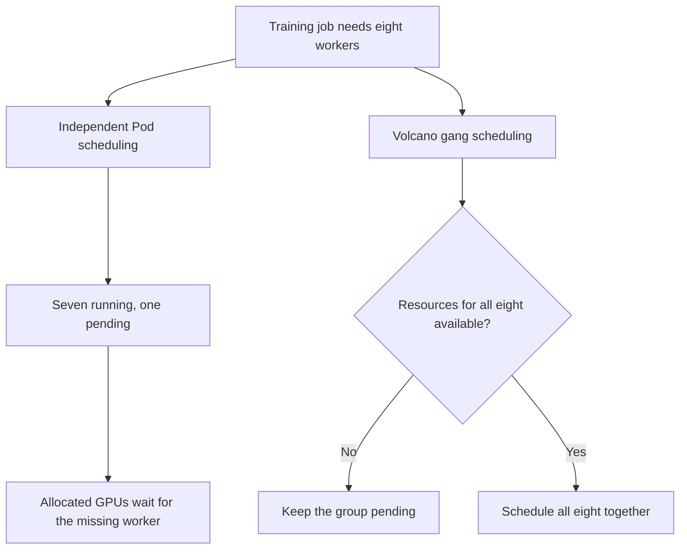
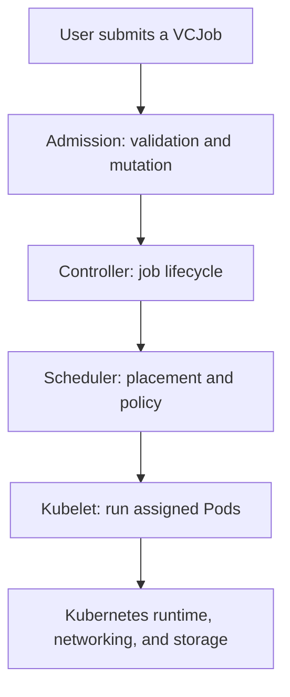

<!-- bilingual-navigation:start -->
[中文原文](../../%E7%AC%AC%E4%BA%8C%E8%BE%91%EF%BC%9A%E6%90%AD%E5%B9%B3%E5%8F%B0/%E7%AC%AC04%E7%AB%A0-Kubernetes%E4%B8%8EVolcano%E8%B0%83%E5%BA%A6%E5%B9%B3%E5%8F%B0.md) | [English](ch04-kubernetes-volcano.md) | [Contents](../README.md) | [Previous](introduction.md) | [Next](ch05-yunyun-platform.md)

English translation of Wang Honglei's Chinese original. Edition and maintenance notes: [TRANSLATIONS.md](../../TRANSLATIONS.md).
<!-- bilingual-navigation:end -->

# Chapter 4: Kubernetes and Volcano Scheduling

## Opening: Running Training on a Microservice Scheduler

Kubernetes was originally designed for microservices. Its scheduler places Pods individually, emphasizing availability, elasticity, and fast startup. Distributed training has different needs.

A training job may require eight, 64, or thousands of worker Pods to run together and establish communication. If seven workers start but the eighth lacks resources, seven GPUs sit waiting. Partial allocation can make the remaining resources harder to obtain and produce a deadlock.

This reflects different design goals rather than a Kubernetes bug. Batch schedulers such as Volcano provide the semantics training needs.

The scheduling platform determines who receives GPUs, when, and how workloads run. Poor scheduling prevents valuable hardware and networks from delivering value.

## 4.1 Why Run Training on Kubernetes?

Kubernetes has become a de facto data center operating system. Its benefits include:

**Unified resource abstractions:** GPUs, RDMA NICs, and high-speed storage can be requested through Pod resource declarations. Users ask for eight GPUs without selecting machine IDs.

**Images and isolation:** Container images package separate environments. PyTorch 2.3 and 2.1 jobs can share a cluster without contaminating each other's dependencies.

**A mature ecosystem:** Registries, CI/CD, monitoring, logging, and service discovery can be reused instead of rebuilt.

**Multitenancy:** Namespaces, RBAC, and ResourceQuota provide basic isolation for teams sharing a cluster.

**Extensibility:** Operators, CRDs, and webhooks allow custom workloads. Volcano is an example of this extensibility.

**Standard interfaces:** A common API and resource model support training platforms, monitoring, and billing without different management interfaces for every team.

The limitation is scheduling granularity and competition for resources. Microservices scale one Pod at a time; distributed training usually needs whole-job scheduling. This distinction is the starting point for AI scheduling design.

## 4.2 Problems with the Native Scheduler

The default scheduler assumes each Pod can run independently. That assumption does not fit tightly coupled training.

<!-- translated-figure: images/ch04/fig01-scheduler-deadlock-gang.png -->


*Figure 4-1: A seven-of-eight partial allocation versus Volcano gang scheduling.*

### Partial Scheduling Deadlock

Seven Pods of an eight-GPU job can occupy GPUs while the eighth remains Pending. The scheduler cannot atomically satisfy the all-or-nothing requirement, leaving the job stuck in NCCL initialization with resources idle.

### Resource Fragmentation

Suppose every node has eight GPUs and small jobs occupy one or two on each. Each node has six or seven free GPUs, but none can accommodate a new eight-GPU job requiring a whole node.

Default scheduling does not specifically optimize GPU packing. Fragmentation accumulates, lowering utilization and making large jobs difficult to place without letting small jobs fully exploit the remaining capacity.

### Coarse Priority and Preemption

Kubernetes supports PriorityClass and preemption, but acts on Pods rather than whole jobs. Evicting two workers from an eight-worker job leaves six waiting in collective communication. Other jobs may take the released resources, preventing the original job from becoming complete again.

Partial preemption breaks the gang. Even if resources return, communication timeouts may have already terminated the workers, requiring a full restart.

### Missing Queues and Fair Sharing

Teams need queues, weights, quotas, and fairness beyond native Kubernetes scheduling. Without these, one team's small jobs can fill the cluster while another team's large job waits indefinitely, creating both starvation and disputes over allocation.

## 4.3 Volcano's Role

Volcano is a Kubernetes batch scheduling system for compute-intensive workloads. A custom scheduler and CRDs extend Kubernetes scheduling semantics.

<!-- translated-figure: images/ch04/fig02-volcano-architecture.png -->


*Figure 4-2: Volcano components within Kubernetes.*

Its core components are:

**Controller Manager:** Watches VCJobs, manages their lifecycle, creates PodGroups and Pods, and updates job status.

**Scheduler:** Makes placement decisions using composable actions and plugins.

**Admission Webhook:** Validates and mutates submissions. The source describes submission as automatically producing a same-named PodGroup.

**VCJob, PodGroup, and Queue:** Custom resources representing batch jobs, Pod groups, and resource queues.

Volcano works with Kubernetes. Kubelet, CNI, CSI, and the rest of the underlying system remain Kubernetes components; Volcano handles scheduling decisions.

### GPU Device Plugins

GPUs are not built-in Kubernetes resources. Device plugins discover and advertise them.

NVIDIA's device plugin and the Ascend Device Plugin normally run as DaemonSets. They register local devices with Kubelet and expose extended resources such as `nvidia.com/gpu` and `huawei.com/Ascend910`.

A Pod requests `nvidia.com/gpu: 1` in its resource limits. After placement, Kubelet calls the plugin's Allocate interface to assign a specific device. Device files and required driver libraries become available in the container.

The scheduler selects the node; the device plugin allocates the card. It does not make cluster scheduling decisions.

On NVIDIA nodes, the plugin discovers `/dev/nvidia*` devices, reports resources, and cooperates with the NVIDIA container runtime. Ascend follows a similar pattern with its own resource name.

Plugin and driver versions must be compatible. After CUDA or Ascend driver changes, validate the plugin image too; otherwise device discovery or container startup may fail.

## 4.4 Gang Scheduling

Gang scheduling is Volcano's central capability. A PodGroup declares `minMember=N`; the scheduler admits and binds the group only when it can satisfy that minimum together. Otherwise the group remains Pending.

This avoids the seven-of-eight problem: insufficient resources do not leave a partially allocated job waiting on GPUs.

A typical PodGroup is:

```yaml
apiVersion: scheduling.volcano.sh/v1beta1
kind: PodGroup
metadata:
  name: train-job-001
spec:
  minMember: 8
  queue: training
  priorityClassName: high
```

For conventional DDP/FSDP jobs, `minMember` normally equals the worker count because all workers must join NCCL initialization.

Elastic training is an exception. If the code supports membership changes, the minimum might be two-thirds or three-quarters of the total. Most production jobs discussed here instead set it equal to replicas.

## 4.5 Queues and Multitenancy

Queues provide ordering and resource isolation, with weights, capacity limits, and reclamation policies.

| Queue | Purpose | Policy |
|------|------|------|
| training | Production training | High weight; preemption permitted |
| eval | Model evaluation | Medium weight; does not preempt training |
| infer | Online inference | Separate queue protected from training preemption |

The source describes dominant resource fairness (DRF) as balancing queues by their largest proportional resource share. Calculate each queue's fraction of every resource; the largest fraction is its dominant share. Prefer the queue with the smallest dominant share until allocations become balanced.

For example, a cluster has 100 GPUs and 1,000 CPU cores. Queue A uses 40 GPUs and 100 cores, so GPU is dominant at 40%. Queue B uses ten GPUs and 400 cores, so CPU is dominant at 40%. Their dominant shares are equal.

If A requests 20 more GPUs, its share becomes 60%. DRF favors B's demand until dominant shares are balanced again. This accounts for CPU and memory needs as well as GPUs instead of always favoring GPU-heavy consumers.

Two important queue settings are `capability`, a hard resource ceiling, and `weight`, a relative allocation preference under contention.

```yaml
apiVersion: scheduling.volcano.sh/v1beta1
kind: Queue
metadata:
  name: training
spec:
  weight: 60
  capability:
    cpu: 2000
    memory: 8000Gi
    nvidia.com/gpu: 80
  reclaimable: true
```

This queue has weight 60 and a maximum of 80 GPUs. The source explains `reclaimable: true` as allowing resources to be reclaimed for other queues when appropriate, so unused allocations do not remain stranded.

Kubernetes ResourceQuota and LimitRange add protection at the namespace and individual-Pod levels. Together with Volcano queues, they constrain both aggregate and per-workload consumption.

## 4.6 BinPack and GPU Fragmentation

BinPack concentrates Pods on fewer nodes, keeping other nodes fully available for larger jobs.

Gang scheduling determines whether a job can be placed; BinPack determines where. Scoring favors already occupied GPU nodes so new Pods fill existing gaps instead of spreading across empty machines.

BinPack cannot reconstruct a whole node from already scattered free GPUs. It works best alongside whole-job scheduling, packing workers within an admitted job.

## 4.7 Running Training Jobs on Volcano

A typical VCJob is:

```yaml
apiVersion: batch.volcano.sh/v1alpha1
kind: Job
metadata:
  name: llm-train-001
spec:
  minAvailable: 8
  schedulerName: volcano
  queue: training
  policies:
    - event: PodEvicted
      action: RestartJob
  tasks:
    - replicas: 8
      name: worker
      template:
        spec:
          containers:
            - name: trainer
              image: train:v1
              resources:
                limits:
                  nvidia.com/gpu: 1
              env:
                - name: NCCL_IB_HCA
                  value: "mlx5_0,mlx5_1,mlx5_2,mlx5_3,mlx5_4,mlx5_5,mlx5_6,mlx5_7"
                - name: NCCL_NET_GDR_LEVEL
                  value: "PHB"
          restartPolicy: OnFailure
```

Key fields:

- `schedulerName: volcano` selects Volcano; omitting it sends Pods to the default scheduler and loses gang semantics.
- `minAvailable: 8` admits the eight workers together and normally equals the replica count.
- `queue: training` selects the scheduling resource pool.
- `policies` define responses such as restarting the whole job after Pod eviction to preserve gang integrity.
- Environment variables configure NCCL communication.

### A More Complete Training YAML

Production VCJobs and PyTorchJobs include additional fields. The source's expanded PyTorchJob example is:

```yaml
apiVersion: kubeflow.org/v1
kind: PyTorchJob
metadata:
  name: pytorch-ddp-8gpu
  namespace: algo-team
spec:
  pytorchReplicaSpecs:
    Worker:
      replicas: 8
      restartPolicy: OnFailure
      template:
        spec:
          schedulerName: volcano
          priorityClassName: production-critical
          containers:
            - name: pytorch
              image: pytorch/pytorch:2.3.0-cuda12.1-cudnn8-runtime
              command:
                - torchrun
                - --nnodes=$(WORLD_SIZE)
                - --nproc_per_node=1
                - --rdzv_backend=c10d
                - --rdzv_endpoint=$(MASTER_ADDR):29500
                - train.py
              resources:
                limits:
                  nvidia.com/gpu: 1
                  memory: 100Gi
              volumeMounts:
                - mountPath: /mnt/data
                  name: data
                - mountPath: /dev/shm
                  name: dshm
          volumes:
            - name: data
              persistentVolumeClaim:
                claimName: training-data
            - name: dshm
              emptyDir:
                medium: Memory
                sizeLimit: 64Gi
```

`pytorchReplicaSpecs.Worker` defines the worker role. DDP is decentralized: workers are peers rather than a parameter-server architecture.

`replicas: 8` with `nproc_per_node=1` gives eight Pods and eight GPUs.

`restartPolicy: OnFailure` restarts failed Pods. The source describes eventual job failure after the retry limit. Avoid Always, which would restart successful training too.

`schedulerName: volcano` directs the controller-created Pods to Volcano. `priorityClassName: production-critical` selects the previously created PriorityClass. Its numerical value determines priority and eligibility to preempt lower-priority workloads; equal-priority workloads are not preempted by this rule.

The source describes the controller injecting `MASTER_ADDR`, `RANK`, and `WORLD_SIZE`, selecting the first Pod as the rendezvous host, and allowing `torchrun --nnodes=$(WORLD_SIZE)` to use those variables without manual configuration.

The memory-backed `emptyDir` mounted at `/dev/shm` provides shared memory for NCCL. Insufficient shared memory can cause errors or fallback to slower communication.

### NCCL Environment Variables in Pods

NCCL provides collectives such as AllReduce and broadcast. Correct Pod configuration is essential.

**NCCL_IB_HCA:** Select IB/RoCE devices, for example `mlx5_0,mlx5_1,mlx5_2,mlx5_3,mlx5_4,mlx5_5,mlx5_6,mlx5_7`. Match the actual node hardware.

**NCCL_NET_GDR_LEVEL:** Control GPUDirect RDMA distance. The source discusses PHB, SYS, and PIX in relation to PCIe and NUMA paths.

**NCCL_SOCKET_IFNAME:** Select the socket/bootstrap or fallback interface, avoiding unintended container virtual interfaces.

**NCCL_DEBUG:** INFO prints initialization details for troubleshooting.

These are platform-injected settings derived from node hardware and network design, not Kubernetes defaults.

Incorrect NCCL configuration commonly leaves all Pods Running while training stalls at “NCCL init” or “connecting to rank.” Check RDMA availability, `NCCL_IB_HCA`, and RoCE configuration.

**NCCL_IB_DISABLE:** Force sockets by disabling IB/RoCE. Useful diagnostically, but substantially slower and unsuitable as a permanent production workaround.

**NCCL_P2P_DISABLE:** Disable direct GPU peer-to-peer communication to isolate topology problems.

**NCCL_BUFFSIZE:** Set communication buffer size. Defaults usually suffice; high-bandwidth or large-model workloads may benefit from tuning.

**NCCL_TREE_THRESHOLD:** The source presents this as a Ring/Tree selection threshold and describes algorithm choice varying with message size and topology. The original setting is retained here as part of its example.

### MPIJob and TFJob

Kubeflow Training Operator provides framework-specific CRDs in addition to Volcano's generic job abstraction.

**MPIJob:** A launcher Pod invokes `mpirun` across workers. `slotsPerWorker` specifies GPUs per worker, and total processes equal workers multiplied by slots. It suits MPI-based uses of Megatron-LM and DeepSpeed.

**PyTorchJob:** Supports DDP/FSDP and injects `MASTER_ADDR`, `MASTER_PORT`, `WORLD_SIZE`, and `RANK`. The source describes peer workers with worker-0 as the default master endpoint, without an MPI launcher.

**TFJob:** Supports TensorFlow PS, Worker, and Chief roles with `TF_CONFIG`. PS stores parameters, workers compute gradients, and Chief handles checkpoints and aggregation. The source observes declining use of this pattern as TensorFlow 2.x favors decentralized strategies.

These resources carry framework-specific semantics and are not ordinary Deployments. Their Pods must select Volcano to participate in the intended scheduling integration.

### Common Mistakes

**Incorrect minMember:** Setting it below the required worker count lets an incomplete job start and time out waiting for missing ranks. Conventional jobs should match replicas.

**Missing schedulerName:** Some Pods run while others remain Pending under the default scheduler.

**Insufficient queue capacity:** A high-priority job can wait in a low-weight or capacity-limited queue. Inspect both `capability` and `weight`.

**Training preempts inference:** Protect online inference with appropriate queues and PriorityClasses to prevent service interruption.

**Confusing Services with the training data path:** NCCL traffic should use IB/RoCE devices. Kubernetes Services provide discovery; the overlay should not carry the intended high-performance training traffic.

**Ignoring PodGroup status:** Use `kubectl get podgroup` and describe output. The source discusses Running and Unschedulable states and messages such as `0/8 nodes are available: 8 Insufficient nvidia.com/gpu`.

**Mixing schedulers inside a group:** Every Pod in a PodGroup must consistently select Volcano or gang semantics break.

## 4.8 Operational Challenges

Volcano addresses scheduling, but successful training also requires:

**Networking:** Correct RDMA devices, addresses, and NCCL variables. CNI supplies container networking; device plugins expose RDMA hardware. Training uses RDMA rather than Services or overlays, with PFC/ECN configured on switches.

**Storage:** Large datasets need fast parallel filesystems or object storage. PVC performance affects `data_time`; slow loading leaves GPUs idle. Common choices include Lustre, GPFS, and CephFS.

**GPU visibility:** NVIDIA and Ascend device plugins expose accelerators. Verify plugin compatibility after driver upgrades.

**Recovery:** Jobs lasting days or weeks encounter node failures, network disruptions, and OOM. Retry policies help, but checkpoints belong to the training framework. Without them, retries begin from scratch.

**Scheduling delay:** Large gangs may wait a long time. Use priorities, preemption, reservations, and scheduling timeouts to manage waiting.

**Training/inference coexistence:** Inference needs low latency and availability; isolate it from training preemption.

**Scheduler observability:** Logs should reveal why a group is Pending, which plugin rejected it, and the resource shortfall. Monitor Volcano itself.

**Image startup time:** Multi-gigabyte images can take minutes to pull on every worker. Caching, local registries, and prewarming reduce gang startup delay.

**Security and isolation:** NetworkPolicy limits cross-tenant Pod communication. Privileged containers and host networking require care because they expose node-level resources.

**Multiple clusters:** Volcano itself does not select among clusters. The platform must account for different GPU types, topologies, and storage mount points.

### Example: Scheduling a 64-GPU Job

Assume eight nodes with eight GPUs each. A user submits a 64-worker job with `minAvailable=64`.

The gang plugin checks whether all workers can be placed together. With only 60 GPUs free, the group remains Pending and receives no partial allocation. Other existing jobs continue.

When another four GPUs are released, all 64 workers can be scheduled. BinPack tries to concentrate placement, subject to available capacity.

After placement, the device plugin assigns cards, CNI assigns addresses, and containers read NCCL settings and launch `torchrun`. Workers then establish the NCCL communicator.

A failure at any stage prevents startup. The scheduler decides placement, the plugin assigns devices, CNI provides addresses, and NCCL configuration enables communication.

## 4.9 Scheduler Actions and Plugins

Actions define phases of a scheduling cycle:

**enqueue:** Admit a PodGroup into scheduling, checking its minimum requirements.

**allocate:** Assign nodes, with gang checks for whole-group feasibility.

**preempt:** Reclaim lower-priority allocations for a higher-priority group.

**reclaim:** Recover resources across queues to improve utilization.

Plugins implement policies:

**gang:** All-or-nothing group scheduling.

**drf:** Dominant resource fairness.

**priority:** Prefer higher-priority jobs.

**binpack:** Reduce GPU fragmentation through packing.

**proportion:** Allocate according to queue weights.

Production configurations commonly combine gang, drf, priority, and binpack. Ordered actions and plugin callbacks form the scheduling loop.

Volcano normally coexists with the default scheduler. Training selects `schedulerName: volcano`, while ordinary services use the default; both share node capacity.

### Operating Volcano

**Installation:** After Helm installation, verify Controller, Scheduler, and Webhook with `kubectl get pods -n volcano-system`.

**Troubleshooting:** For prolonged Pending groups, inspect scheduler logs for inadequate capacity, excessive `minMember`, queue caps, or unmatched taints.

**Configuration:** Scheduler policy is managed through ConfigMaps. The source's deployment procedure restarts the Scheduler after plugin or weight changes and validates on a small scope before wider rollout.

### Scheduling Metrics

Track:

**Pending PodGroups:** Persistent growth suggests inadequate capacity or poor queue configuration.

**Queue utilization:** GPU, CPU, and memory use help assess weights and caps.

**Scheduling latency:** Time from submission until all workers are Running; large jobs may wait hours.

**GPU fragmentation:** Distribution of free GPUs by node; high fragmentation may require packing changes or consolidation of small jobs.

**Job failure rate:** Break down by queue, user, and GPU type to expose hardware or network problems.

**Node health:** GPU temperature, ECC errors, and NIC status; isolate unhealthy nodes before assigning work.

Combine Volcano metrics with Prometheus node and Pod data, then set appropriate alerts.

### Alternatives

The source compares Volcano with:

**Kueue:** A Kubernetes batch workload queue and quota approach, characterized there as close to native Kubernetes with strong community support and weaker gang capabilities than Volcano.

**YuniKorn:** An Apache batch scheduler with queues, priorities, and preemption, suited to mixed big-data and AI workloads but with a steeper learning curve.

**Custom schedulers:** Kubernetes Scheduler Framework offers maximum flexibility with higher maintenance cost.

yunyun chose Volcano for maturity, gang scheduling, queues, and fairness capabilities. Evaluate alternatives against the workload, team capacity, ecosystem, and Kubernetes compatibility.

## 4.10 Where This Layer Fits

The scheduling platform connects submitted jobs with infrastructure. It manages requests, queues, priorities, and lifecycle while depending on Kubernetes runtimes, networking, storage, and device management.

Accurate placement is ineffective if networking or GPU configuration is wrong. Above scheduling, users still need logs, monitoring, alerts, and cost accounting; the next chapter covers that platform work.

Scheduling stability directly affects utilization. Bad policies, queue weights, or priorities can leave GPUs idle or jobs starved. Regularly review queue use, Pending jobs, and fragmentation, adapting policy as workloads change.

## Summary

Volcano extends Kubernetes from individual-Pod placement to job-level scheduling through gang scheduling, queues, BinPack, and fairness policies. Actions and plugins compose the scheduling process. Device plugins expose GPUs, NCCL settings enable communication, and storage supplies data. Effective operation requires coordination across scheduling, devices, networks, storage, security, and observability.

## Chapter Fact-Checking Checklist

### Reference Materials

- `wechat-ai-infra/concepts/volcano/volcano.md`
- `Ai领域sre细分知识/volcano.md`
- `docs/07-Kubernetes容器体系/第22节-K8s上运行AI训练与推理/第22节-K8s上运行AI训练与推理.md`
- `docs/10-大模型Infra工程师/第27节-K8s与Volcano训练调度/`

### Sources of Key Concepts

- Seven-of-eight deadlock: `wechat-ai-infra/concepts/volcano/volcano.md`.
- PodGroup, VCJob, and Queue: both Volcano reference documents.
- DRF: `wechat-ai-infra/concepts/volcano/volcano.md`.
- Device plugins: Kubernetes course, Lesson 22.
- PyTorchJob injection of MASTER_ADDR/RANK/WORLD_SIZE: Kubernetes course, Lesson 22.
- NCCL_IB_HCA, NCCL_NET_GDR_LEVEL, and NCCL_SOCKET_IFNAME: scheduling experience and repository materials.
- BinPack and fragmentation: `wechat-ai-infra/concepts/volcano/volcano.md`.
- Queue capability and weight: `Ai领域sre细分知识/volcano.md`.
