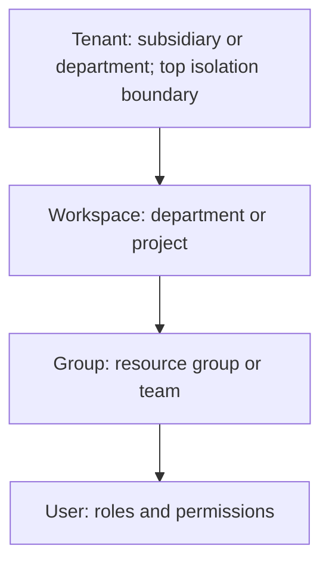

<!-- bilingual-navigation:start -->
[中文原文](../../%E7%AC%AC%E4%BA%8C%E8%BE%91%EF%BC%9A%E6%90%AD%E5%B9%B3%E5%8F%B0/%E7%AC%AC05%E7%AB%A0-yunyun%E5%B9%B3%E5%8F%B0%E5%BC%80%E5%8F%91.md) | [English](ch05-yunyun-platform.md) | [Contents](../README.md) | [Previous](ch04-kubernetes-volcano.md) | [Next](ch06-sre-change-management.md)

English translation of Wang Honglei's Chinese original. Edition and maintenance notes: [TRANSLATIONS.md](../../TRANSLATIONS.md).
<!-- bilingual-navigation:end -->

# Chapter 5: Developing yunyun—From Requirements to Architecture

## Opening: Turning Infrastructure into a Product

Powerful infrastructure delivers limited value if users must write YAML, locate machines, and retrieve logs manually every time. A platform turns infrastructure into a product, enabling self-service training, inference deployment, and resource visibility.

yunyun is the integrated AI training and inference platform used as a case study in this book. It is a reference implementation that shows how to build a working platform from scratch, rather than a definitive solution. This chapter examines the key decisions involved.

Platform development serves end users while managing underlying infrastructure. Product managers and engineers must understand both user needs and system constraints.

## 5.1 What Problems Should the Platform Solve?

The two main user groups are AI researchers and large model developers. They need:

**Training:** Submit distributed jobs, choose GPU count, image, and command, and view logs and metrics.

**Inference:** Deploy trained models as online services with scaling and canary releases.

**Development environments:** Notebooks and virtual machines for debugging and preprocessing.

**Resource management:** View team GPU usage and remaining quota.

**Tenant isolation:** Separate teams' data, resources, and permissions.

Implementing these capabilities connects Kubernetes, Volcano, KServe, storage, networks, monitoring, and billing. Each system has its own concepts and APIs; the platform absorbs that complexity.

Users care about starting training quickly, diagnosing failures, and deploying models. They do not primarily care how Pods are scheduled, PVCs mounted, or NCCL configured. Design around their goals while retaining sufficient underlying control.

## 5.2 Requirements: Write the PRD Before the Code

yunyun began with a product requirements document (PRD), defining what to build and why. Implementation belongs in the subsequent technical design.

A PRD includes:

**Personas:** Researchers prioritize efficient, reproducible experiments; developers prioritize inference latency and deployment flexibility. Describe roles, goals, pain points, and scenarios. A researcher might launch an eight-GPU job in the morning, inspect loss in the afternoon, and rerun with new parameters at night. A developer might deploy the trained model and load-test it.

**User stories:** Use “As a …, I want …, so that …”.

**Acceptance criteria:** Use “Given …, when …, then …”.

**Priorities:** Combine MoSCoW—Must, Should, Could, and Won't have—with P0/P1/P2 ordering.

A frequent mistake is turning the PRD into a discussion of databases, APIs, or frameworks. Those answer how; the PRD defines what.

yunyun organizes requirements around training, multitenancy, and support for multiple models. Modules cover training, inference, notebooks, virtual machines, model repositories, monitoring, billing, approvals, and notifications. Together they let users train, serve, and work in isolation.

### Example PRD Sections

A complete PRD commonly has 12 sections. A simplified yunyun example follows.

**1. Product overview**

yunyun is an internal enterprise private-cloud platform for AI training and inference. Researchers and developers use GPU resources for training, serving, and experiments without managing Kubernetes details.

**2. Personas**

AI researcher: trains models, deploys inference, and experiments in notebooks. Goals are fast GPU access and simple job and service submission. Pain points are slow allocation, disorganized job management, and difficult deployment.

Large model developer: develops or fine-tunes models and manages versions. The goal is an integrated training-to-deployment lifecycle. Pain points are scattered version management and disconnected workflows.

**3. User stories**

As an AI researcher, I want to submit distributed training jobs and monitor progress so that I can train large models efficiently on the GPU cluster.

**4. Acceptance criteria**

AC1: Given sufficient GPU quota, when a job is submitted, return its ID and show Pending.

AC2: Given successful Volcano scheduling, when all Pods are Running, show Running and make live logs available.

AC3: Given successful training with exit code 0, show Succeeded and training metrics.

AC4: Given a nonzero exit code, show Failed and make error logs and Events available.

AC5: Given insufficient quota, reject submission and show current quota usage.

**5. Priorities**

P0 / Must: training jobs, inference services, multitenancy/RBAC, authentication, and model repository.

P1 / Should: monitoring, alerts, billing, approvals, notifications, logs, cluster management, and CI/CD.

P2 / Could: training comparisons, inference A/B tests, and cost analysis.

Won't: federated multicluster scheduling, end-to-end tracing, and automated AIOps root-cause analysis in this release.

**6–12. Detailed functionality, nonfunctional requirements, interactions, data, dependencies, milestones, and risks**

These expand each module's features, performance, security, availability, page flows, business entities, external dependencies, release plan, and known risks.

**7. Nonfunctional requirements**

Training list queries respond within 500 ms; the platform supports 100 simultaneous users; service availability targets 99.9%; every API requires authentication, and sensitive actions are audited.

**8. Interaction flow**

Log in → select cluster → submit training → inspect status → inspect logs → completion → download model. Exceptions include insufficient quota, image pull failure, and scheduling timeout.

**9. Data requirements**

Business entities include jobs, users, tenants, quotas, model repositories, and inference services. Describe entities and relationships without committing to a database schema.

**10. Dependencies and constraints**

Kubernetes, Volcano, KServe, MySQL, Redis, and object storage; NVIDIA and Ascend clusters remain physically separate.

**11. Milestones**

M1: authentication and multitenancy. M2: training. M3: inference. M4: monitoring and billing.

**12. Risks and open questions**

Risk: limited team familiarity with Volcano and KServe. Open question: whether to support the complete Ascend 910B training workflow.

### Stories and Acceptance Criteria

A story describes the user's goal; acceptance criteria define completion. Three to seven criteria usually cover normal and exceptional paths. Too few suggest incomplete thinking; too many suggest the story needs splitting.

yunyun's submission story has five criteria: submission, scheduling, completion, failure, and insufficient quota.

Write criteria in business language—“return a job ID”—rather than implementation language such as “POST /api/v1/training returns JSON code=0.” Product, engineering, and QA then share the same definition of completion.

### Combining MoSCoW with P0/P1/P2

MoSCoW classifies scope; P0/P1/P2 gives rough sequencing. First decide what is required or excluded, then what comes first. yunyun manages its 16 modules this way.

The source recommends limiting Must requirements to about 60%. If 80% are Must, “important” is probably being confused with “required for release.” Important requirements can still be Should.

Won't is equally valuable: it excludes work from this release, not forever. Explicitly deferring federated scheduling kept yunyun from prematurely designing a complex architecture.

## 5.3 Architecture: A Modular Monolith

yunyun uses one repository and two binaries: `server` handles HTTP requests; `worker` handles background jobs. They share model, service, and repository layers, with Go interfaces separating modules.

Reasons for avoiding microservices initially:

**Operating cost:** Separate services lengthen deployment, debugging, and operational workflows.

**Clear boundaries:** Go interfaces provide compile-time type checking.

**Simple process communication:** Server and worker communicate over gRPC without introducing a discovery service or configuration center.

**Future separation:** Established interfaces make modules easier to split into independently deployed services when needed.

The essential discipline is to communicate through module interfaces, without directly accessing another module's database or internal structures. Code review and static analysis protect these boundaries; otherwise the system becomes an ordinary tightly coupled monolith.

| Dimension | Monolith | Microservices | Modular monolith |
|------|------|--------|-----------|
| Processes | 1 | N | 2: server + worker |
| Communication | Direct calls | HTTP/gRPC | Go interfaces + gRPC |
| Coupling | High | Low | Medium |
| Operational complexity | Low | High | Medium |
| Suggested team size | Fewer than 3 | More than 20 | 5–10 |

Choose an architecture for fit, not novelty.

### The Architecture Decision Record

ADR-008 records this decision. An architecture decision record preserves context, reasons, and consequences.

```markdown
# ADR-008: Modular Monolith versus Microservices

## Status
Accepted

## Context
yunyun is an integrated AI training and inference platform case study requiring rapid iteration.
Its 28 backend modules need clear boundaries.
Individual modules do not yet need independent scaling.

## Decision
Use a modular monolith:
- One Git repository.
- Two binaries: server for APIs and worker for background work.
- Go interfaces between modules.
- gRPC between server and worker.

## Rationale
1. Microservices impose excessive operations, deployment, and debugging cost.
2. Go interfaces provide compile-time checking rather than runtime HTTP contract failures.
3. Server and worker share model/service/repository code.
4. Clear module boundaries permit later separation.

## Consequences
- Benefits: fast development, simple deployment, easier debugging, code reuse.
- Costs: discipline is needed to preserve module boundaries.
- Future: independently scaling modules can become services.
```

New team members can read ADR-008 instead of reconstructing the rationale. A larger team can later revisit its assumptions.

yunyun has 11 ADRs covering frameworks, scheduling, inference, and permissions. ADR-001 selects Gin for ecosystem maturity, documentation, and the source's cited 70,000-plus GitHub stars. ADR-002 selects Volcano for gang scheduling and hierarchical queues. ADR-009 selects RBAC because ten roles and 69 permission codes cover the requirements.

Design documents show the system's structure; ADRs explain why it has that structure. Both are needed. Numbering is intentionally nonconsecutive because ADR-007 was abandoned but retained as part of the record.

## 5.4 Module Boundaries

Approximately 28 backend handlers are grouped by business domain:

**Users and permissions:** users, RBAC, tenants, and authentication.

**Training:** submission, state machine, Volcano integration, logs, and metrics.

**Inference:** deployment, KServe, versions, and scaling. It reuses the pattern of a database row, a Kubernetes CRD—in this case InferenceService—and a state machine.

**Resources:** clusters, nodes, quotas, and queues. Cluster management stores kubeconfigs; node management displays GPU health; quotas control tenant consumption.

**Shared platform services:** notifications, approvals, billing, monitoring, and logs.

Domain boundaries clarify where new features belong and reduce conflicts among developers.

### Three Layers per Module

Handlers validate HTTP requests and format responses. Services implement business rules, such as quota checks and Volcano YAML construction, and invoke Kubernetes APIs. Repositories handle GORM queries and persistence.

Within a process, services communicate through Go interfaces. Training can call the quota service synchronously with compile-time checking and no network or serialization overhead.

Between processes, server and worker use gRPC. Worker polls Kubernetes and synchronizes the database. Typed binary communication suits this internal interface, and either process can restart independently.

Do not bypass another module's interface to call its repository for convenience. That erodes the architecture's maintainability and future separability.

## 5.5 Designing Training Jobs

A yunyun training job has three representations:

<!-- translated-figure: images/ch05/fig01-training-task-trinity.png -->
| Representation of a training task | Responsibility |
|---|---|
| Database row | Creator, image, GPU count, queue, priority |
| Kubernetes VCJob | Pod resources, scheduling, environment, lifecycle events |
| State machine | Explicit transitions between Pending, Running, Completed, and Failed |

A usable training platform keeps all three representations consistent.

*Figure 5-1: One database row, one Kubernetes VCJob, and one state machine.*

**Database row:** Business metadata such as creator, image, GPU count, status, queue, and priority.

**VCJob:** Runtime resources managed by Kubernetes and Volcano, including Pods, volumes, and scheduling policies.

**State machine:** The lifecycle from Pending through Running to Completed or Failed.

### State Transitions

Define both states and the events that permit movement between them.

**Pending:** Submitted and queued, without GPU allocation.

**Running:** Scheduled, with GPUs assigned and containers training.

**Completed:** Successful exit code 0; terminal and irreversible.

**Failed:** OOM, errors, timeouts, or scheduling failure; retry can return it to Pending.

| From | Event | To | Initiator |
|--------|------|--------|--------|
| Pending | Pods scheduled successfully | Running | Worker observes Running Pods |
| Pending | Scheduling timeout | Failed | Worker detects timeout |
| Running | Successful exit, code 0 | Completed | Worker observes Succeeded Pods |
| Running | OOM or other failure | Failed | Worker observes Failed Pods |
| Running | User stops job | Failed | Handler receives stop |
| Failed | User retries | Pending | Handler receives retry |

Completed cannot transition again. Failed can be retried. Most state updates are asynchronous.

Every 30 seconds, worker queries Pending and Running database rows, checks Kubernetes, maps Pod states to platform states, and updates the database. API responses therefore may lag behind Kubernetes.

The state machine rejects invalid operations, such as retrying a completed job, preventing duplicate starts and billing.

Training APIs include lifecycle operations beyond CRUD. Start, stop, and retry use POST because the source treats them as non-idempotent actions; ordinary CRUD uses standard REST methods.

Logs are fetched live through the Pod Logs API rather than stored in the relational database. Select Pods with `volcano-job=<k8s_job_name>` and request the last N lines.

### End-to-End Submission

The frontend sends a request to server. The handler validates it and obtains tenant and workspace context from authentication. The service checks GPU quota, loads target-cluster information, and builds a VCJob containing the image, command, GPU count, queue, priority, and NCCL settings.

Using client-go DynamicClient, the service creates the VCJob and records business metadata as Pending. Volcano then schedules the group.

Worker polls every 30 seconds, updates Running after scheduling, and later maps exit status to Completed or Failed. Users inspect live logs throughout.

The platform connects its API, Kubernetes, Volcano, Pods, and database so the user sees a simple submission and status workflow.

## 5.6 Multitenancy

Tenant isolation enables multiple teams to share the platform.

<!-- translated-figure: images/ch05/fig02-tenant-isolation.png -->


*Figure 5-2: yunyun's four-level tenant hierarchy.*

The hierarchy is:

**Tenant:** Subsidiary or major department; the highest data isolation boundary.

**Workspace:** Department within a tenant.

**Group:** Resource group within a workspace.

**User:** The individual with assigned roles and permissions.

Each level has quota and permission controls. Tables carry `tenant_id`, `workspace_id`, and `group_id` for scoped queries.

### RBAC

yunyun grants permissions to roles and roles to users, rather than maintaining per-object ACLs.

Its ten roles are:

- `platform_admin`: all platform permissions.
- `tenant_admin`: administer one tenant.
- `workspace_admin`: administer one workspace.
- `group_admin`: administer one group.
- `researcher`: create training jobs and models.
- `engineer`: deploy inference services.
- `viewer`: read-only access.
- `billing_admin`: billing administration.
- `cert_admin`: certificate administration.
- `auditor`: read-only access plus audit logs.

The 69 permission codes use `module:resource:action`, such as `training:job:create` and `inference:service:scale`. Strings are readable and searchable.

Users can hold multiple roles; their permissions are the union. Middleware runs in order: authentication → tenant context → authorization.

`tenant_id` is an isolation field rather than a foreign key in this design. Middleware derives tenant membership from the authenticated `user_id`, injects it into context, and GORM scopes add `WHERE tenant_id=? AND workspace_id=?`. Do not trust client-supplied tenant IDs, which could permit unauthorized access.

### JWT and Permission Middleware

Login issues a 30-minute access token containing `user_id`, `tenant_id`, and roles, plus a seven-day refresh token containing `user_id` for obtaining new access tokens.

JWT signatures prevent tampering but do not encrypt payloads. Use HTTPS, short access-token lifetimes, refresh tokens restricted to renewal, and a logout blacklist.

After authentication, permission middleware retrieves the user's roles and permission codes and checks the request. Missing authorization returns 403 Forbidden.

Authentication establishes identity; authorization determines allowed actions. Their order matters.

### Quotas

Tenants have GPU, CPU, and memory limits. Training submission checks `used_gpu + new_gpu <= quota.gpu_limit`. The check and creation must be atomic in the same transaction to prevent concurrent over-allocation.

Quota is a service-layer business rule, with dynamically calculated usage. A database transaction ensures two concurrent requests cannot both pass against the same remaining capacity.

### Isolation Model

yunyun uses shared tables in a shared database and schema, distinguished by tenant IDs. This is inexpensive, operationally simple, and convenient for cross-tenant statistics, but a missing filter can expose data.

Automatic context injection and repository scopes address this risk: authentication extracts the user, tenant middleware looks up membership, and GORM applies filters without requiring each developer to write them manually.

Separate schemas or databases offer stronger isolation at greater cost. The source considers separate databases appropriate for stringent financial or medical compliance environments, while shared tables fit this internal platform's limited tenant count.

## 5.7 From Reference Implementation to Production

yunyun is explicitly an unfinished reference implementation. It has 28 backend modules, three frontend applications, and clean `go vet` and `vue-tsc` results, but production requires more:

**Availability:** Replicated databases, caches, and queues; multiple server instances; worker leader election to prevent duplicate polling.

**Security:** API authorization, audits, secret management, NetworkPolicy, and Pod Security Standards.

**Backup and recovery:** Job configurations, models, and databases, including MySQL replication, Redis Sentinel, and etcd backups.

**Events:** Replace polling with Kubernetes Watch or an event system such as Kafka where appropriate.

**Observability:** Prometheus, Grafana, and Loki for business and system metrics, alerts, and aggregated logs.

### Production Readiness Work

1. MySQL replication and automatic failover.
2. Redis Sentinel or cluster mode.
3. At least two server instances and worker leader election.
4. Vault or sealed secrets for JWT secrets, database passwords, and kubeconfigs.
5. Auditing of login, job creation, permission changes, and other sensitive actions.
6. NetworkPolicy to restrict cross-tenant communication.
7. Pod Security Standards to restrict privileged containers.
8. Scheduled database backups and replicated model storage.
9. Worker migration to Kubernetes Watch and Kafka.
10. Prometheus, Grafana, Alertmanager, and Loki.
11. Minute-level GPU usage accounting and monthly bills.
12. Canary or rolling releases for platform upgrades.
13. Database and cache capacity planning as users grow.
14. RTO/RPO targets and disaster-recovery exercises.
15. Dependency vulnerability scanning and updates.
16. Operations, user, and API documentation.

These are outside the prototype's core demonstration but must be considered before adoption. Each costs time and money, so phase them according to actual needs.

There is no universal endpoint: availability-focused teams prioritize redundancy and recovery; cost-sensitive teams may prioritize billing and utilization. The reference implementation supplies an architecture to extend, and the checklist is a starting point.

## 5.8 Where This Layer Fits

The platform packages infrastructure as usable services. It depends on Kubernetes, Volcano, storage, networks, and GPU management; instability below cannot be hidden by a polished interface. Platform and infrastructure teams must collaborate closely.

For researchers and developers, the platform determines the effort needed to use resources. For operations, it determines management efficiency.

PRDs, architectural decisions, module boundaries, and tenant models are product choices as well as technical choices. They shape long-term evolution. Good design simplifies the user experience while retaining operational control.

## Summary

yunyun illustrates that AI platform development starts with requirements, not a technology list. A PRD defines scope; a modular monolith balances speed and maintainability; ADRs preserve decisions; domain modules, state machines, and tenant-aware RBAC support the core workflows. Production still requires availability, security, recovery, and observability work. The next chapter covers SRE and change management.

## Chapter Fact-Checking Checklist

### Reference Materials

- `docs/09-yunyun系统开发实战/第01节-需求分析与PRD撰写/第01节-需求分析与PRD撰写.md`
- `docs/09-yunyun系统开发实战/第02节-架构风格决策/第02节-架构风格决策.md`
- `docs/09-yunyun系统开发实战/第06节-训练任务模块全栈实现/第06节-训练任务模块全栈实现.md`
- `docs/09-yunyun系统开发实战/第05节-多租户与RBAC体系/第05节-多租户与RBAC体系.md`

### Sources of Key Concepts

- Product rather than technical PRD; 12-section structure; user stories; Given/When/Then criteria; MoSCoW with P0/P1/P2: Lesson 1.
- Modular monolith, ADR-008, 28 handlers, and two binaries: Lesson 2.
- Database row + VCJob + state machine, four states and six transitions, and 30-second polling: Lesson 6.
- Four-level tenancy, ten roles, 69 permission codes, and tenant_id as an isolation field: Lesson 5.
- The gap between reference implementation and production: Lesson 1.
