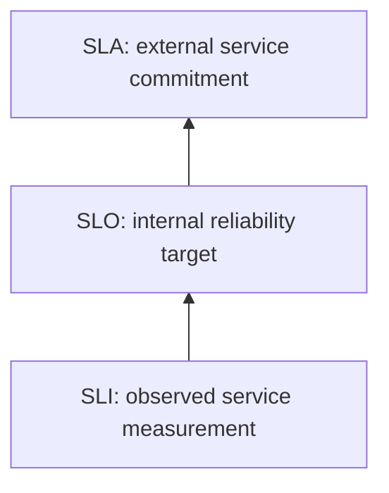

<!-- bilingual-navigation:start -->
[中文原文](../../%E7%AC%AC%E4%BA%8C%E8%BE%91%EF%BC%9A%E6%90%AD%E5%B9%B3%E5%8F%B0/%E7%AC%AC06%E7%AB%A0-SRE%E4%B8%8E%E8%BF%90%E7%BB%B4%E5%8F%98%E6%9B%B4%E8%A7%84%E8%8C%83.md) | [English](ch06-sre-change-management.md) | [Contents](../README.md) | [Previous](ch05-yunyun-platform.md) | [Next](../part-3-workloads/introduction.md)

English translation of Wang Honglei's Chinese original. Edition and maintenance notes: [TRANSLATIONS.md](../../TRANSLATIONS.md).
<!-- bilingual-navigation:end -->

# Chapter 6: SRE and Operational Change Management

## Opening: Having Someone on Call Does Not Make a System Reliable

Operations is often imagined as watching screens and fixing problems quickly. Human vigilance alone cannot make a system reliable: automation reacts faster, and people cannot remember every change detail.

Site Reliability Engineering (SRE) applies software engineering to operational problems. It aims to improve the whole system, reduce repetitive work, and make changes controlled and reversible.

This matters especially for large GPU clusters, where long-running jobs have broad failure impact. Weeks of training can encounter node faults, network disruptions, and OOM. Continuous manual supervision is unrealistic; automation and recovery mechanisms are necessary.

DevOps is a culture of cooperation between development and operations. SRE is one practical engineering approach to implementing it.

SRE means more than having operations staff write code. Repeated actions become scripts, scripts become platform capabilities, and platforms become automated recovery systems. Each stage reduces manual intervention.

## 6.1 SRE versus Traditional Operations

Traditional operations emphasizes keeping systems running through manual work and scripts. SRE combines reliability with engineering efficiency.

| Dimension | Traditional operations | SRE |
|------|----------|-----|
| Method | Manual work and scripts | Software engineering |
| Goal | Keep running | Reliability and efficiency |
| Repetitive work | High | Low |
| Changes | Manual execution | Automated pipelines |
| Incident handling | Manual investigation | Observability and automated response |
| Knowledge retention | Informal handover | Postmortems |

### Example: A GPU Disappears

Traditionally, an alert prompts an engineer to log in, run `nvidia-smi`, confirm the fault, cordon the node, drain Pods, and label it for isolation. Recovery depends on the responder's experience and speed.

An SRE approach automates the repeated isolation actions, notifies the responder, and follows with a postmortem. Humans handle confirmation and complex judgment.

The author's H200 experience reports roughly two to three GPUs requiring fault handling per 24 hours in a 2,048-GPU cluster. A 1,000-GPU cluster would average about one to 1.5 per day, or hundreds annually. Automation can reduce repeated recovery work from more than ten minutes to a few minutes.

SRE also reduces future failures. Postmortems may expose a defective firmware batch and motivate coordinated upgrades or isolation. Turning individual incidents into systemic improvements is the central value.

### Toil and the 50/50 Principle

Toil is repetitive, automatable operational work without enduring value. Google's SRE approach limits operational toil to no more than half the team's time. If 70% goes to repeated manual work, engineering improvements are needed.

The source presents a 50/50 allocation between engineering—automation, observability, and tools—and operational response, including alerts, on-call work, and recovery.

Typical AI infrastructure toil includes restarting training, isolating GPU nodes, clearing disks, and adding capacity. Automate these progressively.

### Four Automation Levels

**Level 1, manual:** Log in and execute commands.

**Level 2, scripted:** A person launches a script, reducing execution errors.

**Level 3, platform:** Trigger the operation through a UI or API, as in yunyun.

**Level 4, automatic recovery:** An alert initiates action, such as node isolation after a DCGM XID event.

Higher levels respond faster but cost more to build. Prioritize frequent toil.

Check three properties: repetition, automatability, and lack of lasting value. Novel investigations, monitoring design, and postmortems require engineering judgment or create durable improvements, so they are not toil.

If toil stays above 50%, inventory it by frequency and time spent. Repeated NCCL-timeout recovery, queue-weight adjustments, disk cleanup, and inference Pod restarts are candidates for scripts, platform features, or automatic recovery.

## 6.2 SLI, SLO, and SLA

Reliability becomes manageable when measured.

<!-- translated-figure: images/ch06/fig01-sli-slo-sla.png -->


*Figure 6-1: SLI → SLO → SLA.*

**Service level indicator (SLI):** An observed measure, such as 99.95% successful inference requests over five minutes.

**Service level objective (SLO):** An internal target, such as at least 99.9% availability.

**Service level agreement (SLA):** An external contractual commitment, usually less stringent than the internal objective to leave a buffer.

### Availability Calculations

| SLO | Allowed downtime per month | Per year |
|-----|---------------|---------------|
| 99% | 438 minutes | 87.6 hours |
| 99.9% | 43.8 minutes | 8.76 hours |
| 99.99% | 4.38 minutes | 52.6 minutes |
| 99.999% | 26.3 seconds | 5.26 minutes |

A 30-day month contains 43,200 minutes, so 99.9% allows `43,200 × 0.001 = 43.2` minutes. The table's 43.8-minute approximation uses a 30.44-day month.

The source argues that each additional nine can increase investment by roughly an order of magnitude. Choose a target for business needs and cost; a 100% objective leaves no room for failure or change.

An overly strict target discourages iteration: at 99.99%, one small release might consume much of a 4.38-minute monthly budget. Too loose a target harms users. Balance importance and affordability, with an SLA buffer below the internal SLO.

### AI Infrastructure SLIs

Inference examples:

- Success rate: successful requests divided by total requests.
- P99 latency: the response time below which 99% of requests fall.
- Availability: the fraction of time the service is reachable.

Training platform examples:

- Completion rate: completed jobs divided by submitted jobs.
- Scheduling success rate: successfully scheduled jobs divided by submissions.
- Mean scheduling wait: time from submission to Running.

Select measures users experience, rather than CPU utilization alone. Two to four core SLIs per service usually provide focus.

### Calculation Examples

Ten million monthly inference requests with 10,000 failures yield:

`(10,000,000 - 10,000) / 10,000,000 = 99.9%`.

At a 99.9% SLO, the service has used its full allowance and should reduce aggressive changes.

For training, 190 completions out of 200 submissions yield `190 / 200 = 95%`. Repeatedly operating at a 95% target boundary suggests stability needs improvement.

Collect SLIs continuously, for example:

```
sum(rate(http_requests_total{service="inference",code!~"5.."}[5m]))
/ sum(rate(http_requests_total{service="inference"}[5m]))
```

## 6.3 Golden Signals and Observability

Google SRE's four golden signals are:

**Latency:** Request duration; P99 for inference, `data_time` and step time for training.

**Traffic:** QPS for inference; job submissions and GPU utilization in the training-cluster examples.

**Errors:** Inference 5xx rates, packet loss, retransmissions, and NCCL timeouts.

**Saturation:** How close GPU memory, bandwidth, or disk I/O is to capacity. Saturation often warns before failures.

Observability has three main forms:

**Metrics:** Time series for alerts and trends, commonly Prometheus and Grafana.

**Logs:** Event details for diagnosis, commonly Loki or ELK.

**Traces:** A request's path through gateway, inference, model loading, and postprocessing, revealing where time is spent.

Training platforms prioritize metrics and logs; inference services often need all three.

### Reading the Signals Together

If inference P99 rises from 200 to 800 ms, traffic may be unchanged, errors slightly higher, and GPU memory nearly full. Memory pressure may have reduced effective batching and increased latency.

If training failures increase, compare duration, submission volume, error rate, and GPU/network saturation to distinguish networking, storage, and hardware causes.

### Building the Observability System

Installing Prometheus and Grafana is only part of the work. Build collection, storage, querying, alerting, and visualization together.

**Metrics:** DCGM Exporter covers GPUs, Node Exporter covers hosts, and custom exporters cover business measures.

**Logs:** Fluentd or Promtail forwards container logs to Loki or ELK. Large training logs need deliberate retention and indexing.

**Alerts:** Page for immediate action, such as inference downtime. Use lower-urgency channels for issues such as disk utilization above 80%.

**Dashboards:** Organize by role: operations sees cluster capacity, researchers see training metrics, and SRE sees SLO performance.

## 6.4 Error Budgets

An SLO defines an acceptable failure allowance. At 99.9% availability, approximately 43.8 minutes of monthly downtime form the error budget.

Rapid consumption should slow nonessential change and shift effort to stability.

| Budget consumed | Release policy in the source |
|----------|------|
| <25% | Aggressive changes possible |
| 25–50% | Normal cadence |
| 50–75% | Cautious, less frequent releases |
| 75–100% | Stop feature releases; corrective changes only |
| >100% | Budget exhausted; review and improve |

### Example Decision

Suppose a 99.9% service has about 43 minutes of monthly budget. By day ten, two incidents have consumed 35 minutes: `35 / 43 ≈ 81%`.

The table calls for stopping feature releases and allowing fixes only. Investigate whether recent changes caused the incidents and prioritize rollback or repair.

Exhaustion stops releases, not the running business. The team's focus shifts to stability.

A 95% training-completion SLO permits five failures per 100 jobs. Exceeding that allowance calls for investigation of hardware, networking, and scheduling.

### Burn Rate

Burn rate measures how quickly the budget is consumed. A single 30-minute outage against a 43-minute monthly allowance warrants action even before the budget is empty.

An example multi-window alert is:

```yaml
- alert: SLOBurnRateHigh
  expr: |
    (
      job:slo_errors_per_request:ratio_rate5m > (14.4 * 0.001)
      and
      job:slo_errors_per_request:ratio_rate1h > (14.4 * 0.001)
    )
  annotations:
    summary: "More than 2% of the SLO error budget consumed in one hour; freeze releases"
```

Both five-minute and one-hour error rates must exceed 14.4 times the allowed 0.1% rate, indicating rapid budget consumption.

## 6.5 Three Elements of Change Management

Changes are a major source of instability. Each should establish who approved it, when it runs, and how to recover.

<!-- translated-figure: images/ch06/fig02-change-management.png -->
| Element | What it must establish |
|---|---|
| Approval: who | Advance approval for routine work; expedited handling and subsequent records for emergencies; clear accountability |
| Window: when | Lower-traffic timing with enough time to validate and roll back before the window ends |
| Rollback: how | Explicit triggers, prepared commands, validation criteria, and deadlines |

*Figure 6-2: Approval, change window, and rollback plan.*

**Approval:** Match review to risk. Routine changes are submitted at least one working day ahead; emergencies may use expedited approval with documentation afterward.

**Window:** Concentrate impact in low-traffic periods. Complete validation or rollback before the window closes.

**Rollback:** Define triggers, commands, validation, and deadlines in advance. Do not improvise commands during execution.

| Change type | Approval |
|----------|----------|
| Emergency | Expedited |
| Routine | Standard |
| Performance optimization | Standard, with baseline and target |
| Customer request | Standard, with confirmed requirements |
| Cross-department change | Standard, with collaborating team's requirements |

A typical chain is requester → first-level reviewer → SRE team lead → on-call SRE executor.

Rollback template:

```bash
# Trigger: inference P99 > 500 ms for 3 minutes, or error rate > 1%
# Roll back:
helm rollback inference-svc 23 --namespace serving
# Validate:
kubectl rollout status deployment/inference-svc -n serving
curl -s http://inference-svc:8080/healthz
# Deadline: if not recovered within 5 minutes, escalate to SEV1
```

### Change Runbooks

Document the requirement's origin, description, and background. Divide execution into backup, change, validation, and rollback.

For each phase, specify actions, complete commands, and verification. Record execution results. Rollback must also state its trigger.

Prepare commands beforehand, label risks for actions such as `rm`, `shutdown`, and `reboot`, and avoid undefined variables or incomplete arguments.

### Limited Rollout Validation

Validate in test or staging first, then proceed in batches after observation. Update one node's configuration, restart services progressively, or test script changes on limited traffic before expanding.

### Example: Inference Batch-Size Change

A 02:00 change aims to increase throughput by adjusting batch size. Update one replica, observe P99 and errors for ten minutes, then roll out the rest. Roll back if P99 exceeds 500 ms or errors exceed 1%.

The first replica looks healthy, but at 50% rollout P99 rises past the trigger. Revert to the prior Helm revision. After recovery, review the relationship between batch size and latency. A prepared rollback and bounded window limit impact.

## 6.6 Release Strategies

**Rolling update:** Replace Pods incrementally, bringing new ones ready before removing old ones. The source emphasizes readiness probes and `maxUnavailable=0` for uninterrupted capacity.

**Blue-green:** Prepare a second environment and switch traffic after validation. Switching and rollback are fast, but resources roughly double.

**Canary:** Send 1–5% of traffic to the new version to validate core metrics.

**Progressive rollout:** After validation, increase traffic in stages such as 10% → 30% → 50% → 100%.

### Comparison

| Strategy | Resource overhead | Traffic transition | Rollback | Use case |
|------|----------|----------|----------|----------|
| Blue-green | 2× | All at once | Fastest | Ample capacity, rapid recovery |
| Canary | 1.x× | Initial 1–5% validation | Fast | Risky changes needing validation |
| Progressive | 1.x× | Staged increases | Medium | Large populations needing observation |
| Rolling | 1 + maxSurge | Pod by Pod | Medium | Routine Kubernetes updates |

Training platforms commonly use rolling and progressive updates; latency-sensitive inference often uses canaries and progressive traffic shifts.

Rolling updates can still fail if readiness probes are absent or `maxUnavailable` reduces capacity too far. A newly started but unready Pod may receive traffic and return 502s.

Blue-green is valuable when seconds-level recovery matters, provided the extra capacity is planned.

The source distinguishes canary validation—whether to proceed—from progressive rollout—how to expand afterward. Skipping the distinction can lead to immediate full release without adequate validation.

### Combining Strategies

**Canary + progressive:** Validate 1–5%, then expand through 10%, 30%, 50%, and 100%; Argo Rollouts canary steps are an example.

**Blue-green + canary:** Send 1% to green, validate, then switch all traffic from blue.

**Rolling + progressive:** Combine Deployment replacement with Ingress traffic splitting to control exposure.

### Rollback Mechanisms

**GitOps:** Git is Argo CD's source of truth. Prefer `git revert` to preserve history and let Argo CD synchronize. An emergency `argocd app rollback` must be followed by a Git change that restores agreement.

**Helm:** `helm rollback <release> <revision>` restores a previous release revision.

**Image rollback:** Restore an earlier Deployment image when configuration is unchanged.

Immutable tags are essential. A `latest` tag may retrieve a different image during rollback. yunyun uses branch, the first seven commit characters, and date to identify each build uniquely.

Frequent releases require reliability limits. A healthy error budget supports change; rapid consumption calls for restraint. This turns release pacing into an engineering decision.

## 6.7 AI Data Center Change Risks

**Networking:** PFC, ECN, routing, and BGP changes can affect RDMA across the fabric. Validate first and use controlled windows. The source emphasizes switch-side PFC/ECN and host-side tuning.

**Firmware and drivers:** GPU/NIC firmware and CUDA driver updates may disrupt training. Assess scope, prepare recovery, and validate a small batch first.

**Scheduling policy:** Queue weights and preemption affect fairness. Bad settings can starve teams; test limited changes.

**Storage:** Parallel filesystem or object-store expansion and upgrades can increase `data_time`. Their broad impact calls for low-traffic windows.

**GPU nodes:** Before admission, verify plugins, RDMA, and storage mounts. Before removal, drain workloads to avoid abrupt interruption.

**CUDA compatibility:** Validate common training images on test nodes before upgrading. Retain some old-driver nodes during migration if needed.

**Firmware rollback:** Recovery may require maintenance mode and out-of-band access. Confirm that the previous firmware image is available before starting.

### Additional Review Requirements

Classify by scope and risk. Topology changes, core switches, and storage expansion need cross-team review, commonly in weekend overnight windows away from training peaks.

The source requires two-person execution review: one operates, one verifies. Distribute the runbook a day ahead so affected teams can prepare.

Validate rollback before execution. For irreversible changes, such as some schema migrations, explicitly document forward-only repair with prepared scripts and checks.

## 6.8 Postmortem Culture

After incidents, focus on system and process improvement rather than personal blame. A postmortem includes:

- Timeline.
- Impact.
- Root cause.
- Triggering factors.
- Recovery.
- Follow-up actions.

Assign each action an owner and deadline. Blame discourages disclosure and weakens learning.

Review postmortems monthly to check completion and recurring patterns. Repetition suggests the previous improvements were insufficient.

### Example Postmortem

**Overview:** An inference incident caused 15 minutes of service disruption.

**Timeline:**

- 02:00: begin image upgrade.
- 02:05: 5% canary traffic shows abnormal P99 latency.
- 02:08: rollback trigger reached; rollback begins.
- 02:15: recovery complete.

**Impact:** Reduced inference availability, affecting approximately 5% of requests.

**Root cause:** An incompatible dependency caused timeouts for particular inputs.

**Triggering factor:** The source notes that canary coverage missed the problematic input pattern.

**Recovery:** Restore the previous image.

**Actions:**

1. Add problematic input cases to canary validation; owner Zhang San, due next week.
2. Improve dependency compatibility checks; owner Li Si, due within two weeks.
3. Add inference timeout alerts; owner Wang Wu, due this week.

## 6.9 Where This Layer Fits

SRE spans the entire infrastructure chain. Users experience whether training works and inference is available, regardless of the underlying cause.

Infrastructure, network, and platform teams must coordinate. Every production change belongs in the process, not only changes made by operations staff.

SRE moves a system from dependence on repair toward resistance to failure. In complex AI infrastructure with frequent faults and broad impact, this requires sustained engineering and organizational support.

## Summary

SRE applies software engineering to reliability: reduce toil, measure user-visible performance, build observability, and control change. SLIs, SLOs, and SLAs quantify reliability; error budgets guide release pace; golden signals guide monitoring; approvals, windows, and rollback plans bound change risk. Release strategies reduce exposure, and postmortems drive improvement. AI networking, firmware, drivers, scheduling, and storage each add specific operational risks.

## Chapter Fact-Checking Checklist

### Reference Materials

- `docs/SRE运维变更流程规范.md`
- `docs/05-SRE方法论/第01节-SRE与SLI-SLO体系/第01节-SRE与SLI-SLO体系.md`
- `docs/05-SRE方法论/第03节-变更管理与发布策略/第03节-变更管理与发布策略.md`
- `docs/10-大模型Infra工程师/第43节-集群变更管理灰度发布与混沌工程/第43节-集群变更管理灰度发布与混沌工程.md`

### Sources of Key Figures

- SLO/downtime table: SRE methodology, Lesson 1.
- 43.8 minutes monthly at 99.9%: `30.44 × 24 × 60 × 0.001`.
- Canary traffic of 1–5%: SRE methodology, Lesson 3.
- Error-budget decision table: SRE methodology, Lesson 1.
- Toil at no more than 50%: Google SRE principles and repository materials.
- Four automation levels: SRE methodology, Lesson 1.
- Two to three GPU faults per day in a 2,048-H200 cluster: `docs/NCCL-RDMA-IB/H200-RoCEv2-training-fullstack-v4.md`.
