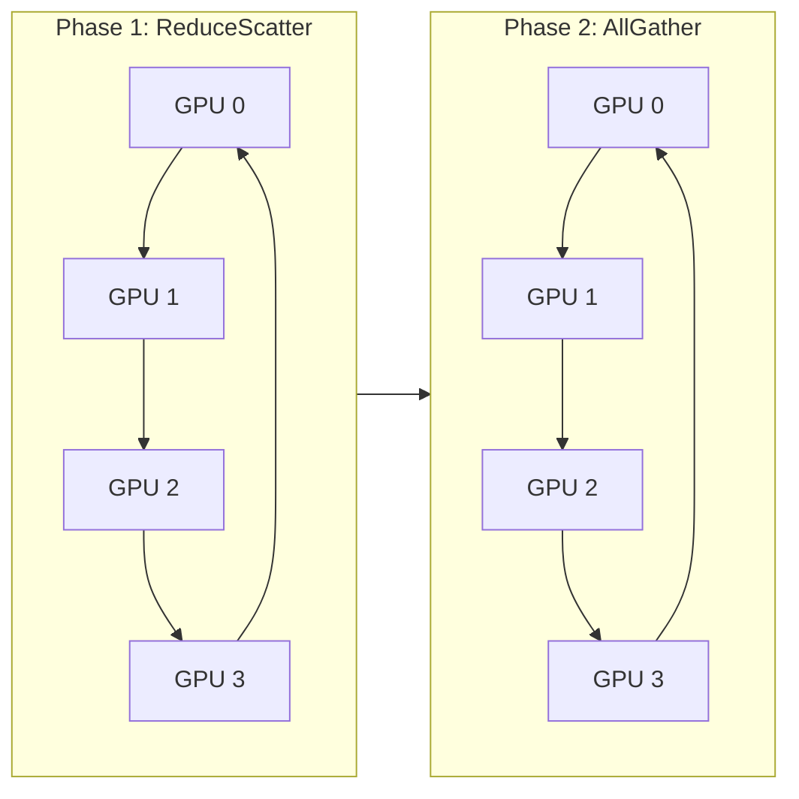

<!-- bilingual-navigation:start -->
[中文原文](../../%E7%AC%AC%E4%B8%89%E8%BE%91%EF%BC%9A%E8%B7%91%E4%B8%9A%E5%8A%A1/%E7%AC%AC07%E7%AB%A0-%E5%88%86%E5%B8%83%E5%BC%8F%E8%AE%AD%E7%BB%83%E9%80%9A%E4%BF%A1.md) | [English](ch07-distributed-training-communication.md) | [Contents](../README.md) | [Previous](introduction.md) | [Next](ch08-training-tuning-troubleshooting.md)

English translation of Wang Honglei's Chinese original. Edition and maintenance notes: [TRANSLATIONS.md](../../TRANSLATIONS.md).
<!-- bilingual-navigation:end -->

# Chapter 7: Distributed Training Communication—NCCL, HCCL, and Ring AllReduce

## Opening: With Multiple GPUs, Communication Takes Center Stage

Large models rarely train on one GPU. GPT-3-scale models have hundreds of billions of parameters: one device lacks memory and would take too long. Production jobs commonly use tens, hundreds, or thousands of GPUs.

The central problem is coordination. After computing local gradients, GPUs synchronize them so model parameters remain consistent. Slow communication leaves the entire cluster waiting, lowers utilization, and lengthens training.

Single-GPU optimization focuses on kernels; cluster optimization also depends on network hardware, NCCL configuration, and parallelism strategy. All three matter.

## 7.1 Data Parallelism and Gradient Synchronization

Data parallelism divides training data among GPUs, keeps a full model replica on each, computes local gradients, then aggregates them before updating each replica.

The critical operation is aggregation across N GPUs. A 7B model has approximately 14 GB of FP16 gradients per replica. Synchronizing every step over hundreds of thousands of steps creates enormous traffic.

### Synchronous and Asynchronous Training

Synchronous training waits for all workers before aggregation and update, keeping replicas consistent. It is the dominant large-model approach.

Asynchronous workers update independently and exchange gradients periodically. This offers flexibility but introduces consistency challenges and is uncommon in large-model pretraining.

### One Node versus Many

Eight GPUs connected by NVLink/NVSwitch have very low latency and bandwidth on the order of 900 GB/s. Communication may be modest relative to computation.

At 1,024 GPUs across nodes, IB/RoCEv2 bandwidth is lower and congestion and latency become central. The source cites 100 or 200 GB/s per inter-node port in this comparison. Parallelism, NCCL settings, and topology need deliberate design.

### Parameter Servers versus AllReduce

Early systems sent gradients to central parameter servers, which aggregated and redistributed them. With N GPUs and K bytes of gradients each, the central servers receive and transmit N × K bytes, becoming bandwidth hotspots.

AllReduce removes that center. In Ring AllReduce, each GPU communicates with its neighbors and sends approximately 2K bytes, almost independent of N.

| Dimension | Parameter server | AllReduce |
|------|-----------|-----------|
| Central node | Required | None |
| Bandwidth hotspot | Central ingress/egress | No single central hotspot |
| Traffic per GPU | About K sent + K received | About 2K, nearly independent of N |
| Scaling | Central bottleneck grows with N | Near-linear scaling in the source's comparison |
| Implementations | Early TensorFlow PS | NCCL, HCCL, Gloo |

Modern large-model training generally uses AllReduce; parameter servers remain in some sparse or framework-specific workloads.

### Flattened Gradients and Buckets

PyTorch communication operates on flattened gradient buffers rather than layer-aware objects. For LLaMA-7B, flattened `weight.grad` and `bias.grad` values total about seven billion FP16 elements, or 14 GB. NCCL receives an address and length, without knowing which layer owns an element.

DDP divides gradients into buckets, commonly about 25 MB, to overlap communication with backward computation. As soon as a bucket is ready, its AllReduce starts. Buckets can cross layer boundaries.

AllReduce therefore occurs during backward propagation as gradients become available, rather than after the forward pass.

## 7.2 Collective Primitives

**Broadcast:** Copy one participant's data to everyone, commonly for initial model synchronization.

**Reduce:** Aggregate values onto one participant, using an operation such as sum or mean.

**AllReduce:** Aggregate and deliver the same result to every participant, as in gradient synchronization.

**Scatter:** Split one participant's data among workers.

**Gather:** Collect distributed pieces onto one participant.

**AllGather:** Give every participant all pieces, for example when collecting activations in tensor parallelism.

**ReduceScatter:** Reduce values and distribute different portions of the result; the first phase of Ring AllReduce.

**AllToAll:** Each participant sends a different portion to every other participant, as in MoE token routing.

NCCL and HCCL implement these primitives for frameworks. Their input/output semantics explain the traffic generated by each parallelism strategy.

### Four-GPU Examples

**Broadcast:** GPU0 starts with `[1,2,3,4]`; afterward every GPU has it.

**Reduce, sum:** Inputs `[1,2,3,4]`, `[5,6,7,8]`, `[9,10,11,12]`, and `[13,14,15,16]` produce `[28,32,36,40]` on GPU0. Other inputs remain as described in the source.

**AllReduce, sum:** The same inputs produce `[28,32,36,40]` on every GPU.

**Scatter:** GPU0's `[1,2,3,4,5,6,7,8]` becomes `[1,2]`, `[3,4]`, `[5,6]`, and `[7,8]` on GPUs 0–3.

**Gather:** Reverse that scatter onto one GPU.

**AllGather:** Every GPU starts with a portion and finishes with the complete data.

**ReduceScatter:** Aggregate first, then distribute portions of the reduced result.

**AllToAll:** Each GPU starts with four destination-specific blocks and receives the corresponding block from every sender. MoE uses this for token exchange.

## 7.3 Ring AllReduce

Ring AllReduce is a classic bandwidth-efficient algorithm for GPU clusters.

<!-- translated-figure: images/ch07/fig01-ring-allreduce.png -->


After ReduceScatter, each GPU owns one fully reduced portion. AllGather circulates those portions until every GPU has the complete result.

*Figure 7-1: ReduceScatter followed by AllGather.*

### Basic Idea

Arrange N GPUs in a ring. Each communicates with its two neighbors, and each gradient buffer is divided into N chunks.

During **ReduceScatter**, each GPU forwards a chunk, adds received values to the matching local chunk, and repeats for N−1 steps. Each finishes with one fully reduced chunk.

During **AllGather**, those completed chunks circulate for another N−1 steps until every GPU has the full result.

### Four-GPU Walkthrough

Initially:

- GPU0: A0, B0, C0, D0.
- GPU1: A1, B1, C1, D1.
- GPU2: A2, B2, C2, D2.
- GPU3: A3, B3, C3, D3.

Letters identify chunks; subscripts identify contributors. Every GPU ultimately needs A0+A1+A2+A3, B0+B1+B2+B3, and so on.

In the first step, GPU0 sends A0 to GPU1, GPU1 sends B1 to GPU2, GPU2 sends C2 to GPU3, and GPU3 sends D3 to GPU0. Each simultaneously sends and receives K/4 bytes.

In the second step, each adds its local contribution and forwards the partial sum; GPU1, for example, sends A0+A1 to GPU2.

After the third step, every GPU owns one complete reduced chunk. The source labels this final ownership as GPU0→A, GPU1→B, GPU2→C, and GPU3→D; the specific ownership is a ring-indexing convention, while the required property is one reduced chunk per GPU.

Three AllGather steps distribute all four completed chunks to everyone.

Each GPU sends N−1 chunks of size K/N in each of the two phases:

```
Total transmitted per GPU = 2 × (N-1) × K / N = 2 × (N-1)/N × K
```

As N grows, the factor approaches 2, so traffic per GPU approaches 2K.

### Strengths and Limits

**High bandwidth utilization:** Neighbor communication avoids all senders concentrating on one server.

**Bounded traffic per GPU:** `2 × (N-1)/N × K` changes little as GPU count grows.

NCCL therefore uses Ring among its standard algorithms. Long rings nevertheless accumulate latency, motivating Tree or hierarchical Tree/Ring approaches for large inter-node deployments.

### Tree AllReduce

A balanced tree reduces upward to its root and broadcasts downward. It needs approximately `2 log₂(N)` communication stages; for 1,024 nodes, about 20. A ring needs 1,023 steps per phase.

The source mentions NCCL TREE variants, including the `TREEFLLG` label and `NCCL_ALGO=RING|TREEFLLG` in its materials. These labels are retained as source examples.

Small eight-GPU NVLink groups often benefit from Ring's bandwidth efficiency; large inter-node groups may favor Tree's lower latency.

### Estimating Communication Time

For a 7B model with FP16 gradients and eight GPUs, using the large-N approximation:

- K = 14 GB.
- Per-GPU traffic ≈ 2K = 28 GB.
- At 450 GB/s, time ≈ 28/450 ≈ 62 ms.

Channels, PCIe, and CPU overhead alter the actual result, but 60 ms of communication in a 200 ms step is clearly significant.

Across a 50 GB/s link, the same 28 GB takes about 560 ms. The source describes inter-node bandwidth as commonly one-eighth to one-tenth of NVLink, explaining why multi-node training is more communication-bound.

## 7.4 NCCL

NVIDIA Collective Communications Library optimizes GPU collectives through:

**Topology awareness:** Discover NVLink, PCIe, and network paths.

**Transport selection:** Use local GPU interconnects within nodes and IB/RoCEv2 across them.

**Channels:** Run multiple communication streams in parallel.

**Algorithms:** Choose Ring, Tree, or other approaches based on size and topology.

Framework code can be simple:

```python
import torch.distributed as dist

dist.init_process_group(backend='nccl')
dist.all_reduce(tensor, op=dist.ReduceOp.SUM)
```

The complexity is inside the communication library.

### Versions and Compatibility

The source's H200/CX7 reference matrix is NVIDIA driver 550+, CUDA 12.4+, NCCL 2.20+, PyTorch 2.3+, and MLNX_OFED 24.04+.

Mismatches can cause initialization errors, QP failures, or nonzero correctness errors in nccl-tests. Standardize versions and check all nodes with automation such as Ansible before deployment.

### Initialization and Topology Discovery

Startup proceeds through bootstrap, discovery, Ring/Tree construction, and QP setup.

**Bootstrap:** Ranks find each other through TCP sockets and exchange world size, rank, and master information.

**Discovery:** NCCL scans GPUs, NVLink, PCIe, and NICs and builds a graph of devices and paths annotated with bandwidth and latency.

The source describes these path classes:

- `PATH_NVL`: direct NVLink, fastest.
- `PATH_NVB`: NVLink through NVSwitch, very fast.
- `PATH_PHB`: shared PCIe host bridge, associated here with local GPU–NIC affinity and GDR.
- `PATH_PXN`: an intermediate path involving PCIe/NUMA routing in the source's description.
- `PATH_SYS`: cross-socket or remote-NUMA route, slowest in the comparison.

Many SYS paths warrant checking GDR, GPU–NIC placement, and `NCCL_NET_GDR_LEVEL`. GDR avoids CPU-memory staging. The source's preferred configuration pairs each of eight GPUs with a local NIC under the same host bridge or NUMA domain.

**Ring/Tree construction:** Each channel receives a route based on the graph. Channels run independently and in parallel.

**QP setup:** IB/RoCE communication uses queue pairs. Failures may stall startup or report `Failed to modify QP to RTR`.

GID selection matters for routed deployments. The source warns that an incorrect `NCCL_IB_GID_INDEX` can select an unusable link-local address and produce `no usable GID found`.

### Reading Logs

With `NCCL_DEBUG=INFO`, inspect:

- `NET/IB : Using interface mlx5_*` for selected devices.
- `NCCL_ALGO=RING` or `TREE*` for algorithm information.
- `8 channels` or `Channel 00/08` for channel count.
- `PATH_NVL/PATH_PHB/PATH_SYS` for route information.

`Channel 00/02` instead of the expected eight may indicate channel limits or missing NIC discovery. Predominantly SYS paths suggest a topology/GDR problem in the source's troubleshooting model.

### Common Startup Failures

**Bootstrap stalls:** After `Bootstrap: Using master_addr=...`, no progress may mean an unreachable master port, firewall filtering, or a full conntrack table.

**Missing NICs:** Discovering four mlx5 devices instead of eight may involve CX7 split-port settings or `NCCL_IB_HCA`. Inspect Split configuration with `mstconfig -d mlx5_0 q`.

**Wrong GID:** An unsuitable address can produce `no usable GID found` or `Failed to connect to remote peer`.

**QP setup failure:** Check network filtering, OFED compatibility, and QP capacity. In the source's 8,000-GPU example, each node connects to about 999 others; eight NICs share about 125 peers each, and four QPs per peer give about 500 QPs per NIC, well below the cited `max_qp=131072`. Capacity is therefore usually not the cause.

### Debugging Controls

Use `NCCL_DEBUG=INFO` for detail, `NCCL_IB_DISABLE=1` to isolate RDMA by forcing sockets, `NCCL_SOCKET_IFNAME=eth0` to select an interface, and `NCCL_P2P_DISABLE=1` to isolate GPU P2P issues.

For a timeout, first identify the stalled phase, then distinguish networking, topology, and configuration problems.

## 7.5 NCCL Environment Variable Reference

The original chapter's settings and values are reproduced below; they describe its source environment rather than a newly validated compatibility matrix.

**Debugging:**

| Variable | Purpose | Example |
|----------|------|----------|
| NCCL_DEBUG | Log level | WARN / INFO / TRACE |
| NCCL_DEBUG_SUBSYS | Subsystem filter | INIT / GRAPH / NET / TUNING / ALL |
| NCCL_TIMEOUT | Global timeout in seconds, as listed in the source | 1800 for 8,000 GPUs |
| NCCL_BOOTSTRAP_TIMEOUT | Bootstrap timeout | 300 |

**IB/RoCE:**

| Variable | Purpose | Example |
|----------|------|----------|
| NCCL_IB_DISABLE | Disable IB | 0 enabled / 1 disabled |
| NCCL_IB_HCA | Select devices | mlx5_0,mlx5_1,...,mlx5_7 |
| NCCL_IB_GID_INDEX | GID index | 1 or 3 |
| NCCL_SOCKET_IFNAME | Bootstrap interface | ib0 / bond0 |
| NCCL_NET_GDR_LEVEL | GDR path scope | PHB / PXN / SYS |
| NCCL_IB_TIMEOUT | IB timeout | 18 cited as default; 22 suggested for 1,024 GPUs |
| NCCL_IB_RETRY_CNT | Retry count | 7 |

**Topology and algorithms:**

| Variable | Purpose | Example |
|----------|------|----------|
| NCCL_ALGO | Force algorithm | RING / TREE / TREEFLLG |
| NCCL_MAX_NRINGS | Maximum rings | 8, matching eight NICs |
| NCCL_MIN_NCHANNELS | Minimum channels | 8 |
| NCCL_BUFFSIZE | Communication buffer | Match message size |
| NCCL_TOPO_FILE | Manual topology file | /path/to/topo.xml |

Use WARN normally, INFO temporarily for diagnosis, and TRACE only for very short, small tests because of log volume.

Start with automatic selection. Override only with evidence. Missing NICs, ineffective GDR, and insufficient channels are often more important than the selected collective algorithm.

## 7.6 HCCL

Huawei Collective Communication Library serves Ascend 910B, optimizing HCCS and RoCE communication. It offers familiar primitives including AllReduce, AllGather, ReduceScatter, and AllToAll.

Differences include hardware, variables such as `HCCL_INTRA_ROCE_ENABLE` and `HCCL_RDMA_TIMEOUT`, and tools: `msnpureport`, `hccn_tool`, and `hccl_test`.

The operational approach remains: validate one node, then multiple nodes, then the training framework.

### Comparison

| Dimension | NCCL | HCCL |
|------|------|------|
| Hardware | NVIDIA GPU | Ascend NPU |
| Intra-node fabric | NVLink / NVSwitch | HCCS |
| Inter-node network | IB / RoCEv2 | RoCE |
| Debug variables | NCCL_DEBUG family | HCCL_INTRA_ROCE_ENABLE and others |
| Network tools | ibstat / ib_write_bw | hccn_tool / msnpureport |
| Benchmarks | nccl-tests | hccl_test |
| Algorithms | Ring / Tree | Similar hierarchical Ring/Tree approaches |

The two ecosystems are normally physically separate and do not run a single shared training or inference workload. Troubleshooting concepts nevertheless transfer.

### HCCL Troubleshooting

1. Verify all eight NPUs and a basic local AllReduce.
2. Run two-, four-, and eight-node `hccl_test` baselines.
3. Carry the validated configuration into the framework.

Use `hccn_tool -i 0 -ip -g` for NIC addresses and `msnpureport -s` for the source's network-status check. Start with hardware, then software; start locally, then expand.

## 7.7 Communication and Parallelism

<!-- translated-figure: images/ch07/fig02-parallel-communication.png -->
| Parallelism | What is partitioned | Main communication | Typical context |
|---|---|---|---|
| Data parallelism (DP) | Input data | AllReduce | A model that fits on one GPU |
| Tensor parallelism (TP) | Parameters within a layer | AllGather / ReduceScatter | Fast local interconnect |
| Pipeline parallelism (PP) | Model layers | Point-to-point | Very large models |
| Expert parallelism (EP) | MoE experts | AllToAll | Mixture-of-experts models |

*Figure 7-2: Parallelism strategies and their main communication primitives.*

**Data parallelism, DP:** AllReduce gradients, with traffic proportional to model size.

**Tensor parallelism, TP:** Shard layers across GPUs, using frequent activation/gradient collectives such as AllGather and ReduceScatter. Frequent smaller transfers favor intra-node links.

**Pipeline parallelism, PP:** Partition layers across stages and transfer intermediate activations; traffic is relatively limited.

**Expert parallelism, EP/MoE:** Place experts on different GPUs and exchange tokens through AllToAll, demanding strong many-to-many networking.

### AllToAll and MoE

A router chooses experts for each token. AllToAll dispatches tokens to the GPUs hosting those experts, and another AllToAll returns results.

AllReduce gives everyone the same aggregate; AllToAll gives each recipient different addressed data, more like parcel sorting.

The source counts `N × (N-1)/2` simultaneous pairwise paths for AllToAll, growing quadratically, versus two neighbors per Ring participant. Its illustrative 900 GB/s example divides six paths among four GPUs into about 150 GB/s each, compared with about 450 GB/s across two Ring paths.

Each forward and backward pass uses two AllToAll operations per MoE layer. Eight layers therefore yield 32 AllToAll operations per step in the example, plus an AllReduce for gradients. AllToAll often dominates MoE communication.

### Memory–Communication Tradeoffs

DP keeps full replicas and uses substantial memory. TP reduces per-GPU parameters but adds collectives. PP reduces per-stage memory but introduces pipeline bubbles. EP distributes experts but adds AllToAll.

Choose against three constraints: memory capacity, network bandwidth, and compute. Real training often combines strategies into 3D or 4D parallelism, making communication planning essential.

## 7.8 Measuring Performance with nccl-tests

nccl-tests calls NCCL directly to measure collective latency and bandwidth.

```bash
./all_reduce_perf -b 8 -e 1G -f 2 -g 8
```

- `-b 8`: start at eight bytes.
- `-e 1G`: end at 1 GB.
- `-f 2`: double each step.
- `-g 8`: use eight GPUs.

**algbw** is message size divided by time, representing application throughput. **busbw** normalizes for collective traffic. For Ring AllReduce:

```
busbw = algbw × 2 × (N-1) / N
```

The source uses busbw to assess links. Tests establish baselines before admitting nodes, cables, or switches; separate framework problems from link problems; and find slow machines in a large cluster.

### Reference Baselines

For eight H200s on NVLink 4 with a 1 GB message, the source gives AllReduce busbw above 525 GB/s, AllGather and ReduceScatter above 262 GB/s, and AllToAll above 150 GB/s.

Its multi-node AllReduce references are above 300 GB/s at two nodes, 250 GB/s at eight, and 150 GB/s at 32.

Run per-node tests, take the median, and flag nodes below 80% of it. Inspect `ibstat`, `ib_write_bw`, and negotiated PCIe speed. Median resists outliers; the source favors a 20% deviation threshold over 10% to reduce false alarms.

### Investigation Order

1. Run `ib_write_bw` to remove NCCL from the test. Low results indicate hardware or link issues.
2. Check `ibstat`: State Active, Physical state LinkUp, and Rate 400 for the cited 400G setup.
3. If perftest is healthy but NCCL is slow, inspect devices, channel count, and GDR.
4. If only multi-node runs are slow, inspect inter-node links, fat-tree routing, and slow participants.

`ibping` proves connectivity, not bandwidth. A link degraded to 100G may respond while training still times out.

### Sample Output

```
#       size    count   type  redop   time  algbw  busbw  error
#        (B)    (elements)          (us)  (GB/s) (GB/s)
#          1G  268435456  float  sum  3389  310.2  542.9  0e+00
```

Correctness errors should be zero. Otherwise check NCCL, CUDA, drivers, and firmware consistency.

Messages below 4 KB naturally have low bandwidth because latency dominates. Use 8 MB or 1 GB to assess large-message throughput.

Multi-node testing also probes bisection bandwidth: the capacity between two halves of the cluster. The source recommends synchronized clocks, permitted communication ports, and consistent software versions across nodes.

## 7.9 Common Communication Problems

**NCCL timeout:** A slow or failed participant can hold up everyone. Begin with local nccl-tests, expand across nodes, then inspect NICs and switches.

**High data_time:** Data loading or preprocessing leaves GPUs waiting.

**Low busbw:** Link downtraining, switch settings, fiber faults, or NCCL configuration.

**Numerical differences:** Different floating-point reduction orders can produce small discrepancies; deterministic execution may trade performance for repeatability.

**Stalled initialization:** Bootstrap connectivity, firewall rules, or GID selection. Inspect master-port access, iptables, and `show_gid`.

**NIC downtraining:** `ibstat` showing 200 or 100 instead of 400 suggests negotiation degradation, often from loose cables, dirty optics, or a faulty port. Reseating or replacement may restore it.

The common method is to identify the failing layer and narrow the scope.

### Typical Timeout Causes

A timeout is a symptom, not the root cause.

**Slow nodes:** A 400G NIC falling to 200G, poor NUMA pairing, or uneven IRQ placement slows the collective.

**Loss or disconnection:** Inspect link health, QP state, Symbol Error, and PortXmitDiscards counters.

**QP and filtering issues:** Firewalls or CNI policies may interfere with setup or required communication paths.

**Timeout/retry settings:** At large scale, changing the source's `NCCL_IB_TIMEOUT` example from 18 to 22 may tolerate transient delays, but does not repair an underlying fault.

### Low busbw

Suspect physical causes early: contaminated optics, bent fibers, degraded PCIe, and switch misconfiguration. Healthy local tests with slow distributed tests point toward inter-node links and routing.

### Numerical Differences

Floating-point addition is not associative, so reduction order can produce differences around 1e-7 in the source's example. This affects parallel reductions generally, not only Ring. It usually does not prevent convergence. Strict reproducibility may require deterministic settings with a performance cost.

## 7.10 Where This Layer Fits

Communication depends on stable, low-latency networking and shapes framework and parallelism choices. The same model may need different partitioning on a different fabric.

Problems are often systemic rather than isolated code bugs, requiring knowledge of networking, frameworks, and NCCL logs.

Establish a hardware baseline, inspect automatic topology and transport choices with INFO logging, then use training metrics to decide whether parallelism or algorithm changes are needed. Every change should have evidence.

Communication amplifies both efficiency and failure: healthy links quietly support the job; unhealthy links can stop the cluster. Across NCCL and HCCL, the sequence is the same—hardware, configuration, then algorithms.

## Summary

AllReduce largely replaces central parameter servers in modern training. Ring keeps per-GPU traffic close to twice the gradient size as scale grows. NCCL and HCCL map collectives to hardware; networking, GDR, channels, and algorithms affect performance. Diagnose from hardware baselines through configuration before forcing algorithm choices.

## Chapter Fact-Checking Checklist

### Reference Materials

- `yidian/nccl-ring-allreduce/从参数到AllReduce-概念全链条.md`
- `yidian/nccl-ring-allreduce/博客笔记-PyTorch-DDP与Ring-AllReduce-51cto.md`
- `yidian/nccl-ring-allreduce/All-to-All与MoE专家并行-从原理到实现.md`
- `wechat-ai-infra/concepts/nccl-tests/nccl-tests.md`
- `wechat-ai-infra/concepts/nccl-debug/nccl-debug.md`
- `wechat-ai-infra/concepts/nccl-timeout/nccl-timeout.md`

### Sources of Key Figures

- FP16 gradients for 7B parameters: seven billion × two bytes = 14 GB.
- Ring traffic and busbw formulas: nccl-tests and Ring AllReduce materials.
- Single-node H200 AllReduce above 525 GB/s and AllToAll above 150 GB/s: baseline document.
- Two/eight/32-node AllReduce above 300/250/150 GB/s: baseline document.
- NCCL_IB_TIMEOUT values 18 and 22: timeout document.
- Slow-node threshold at 80% of median: nccl-tests document.
