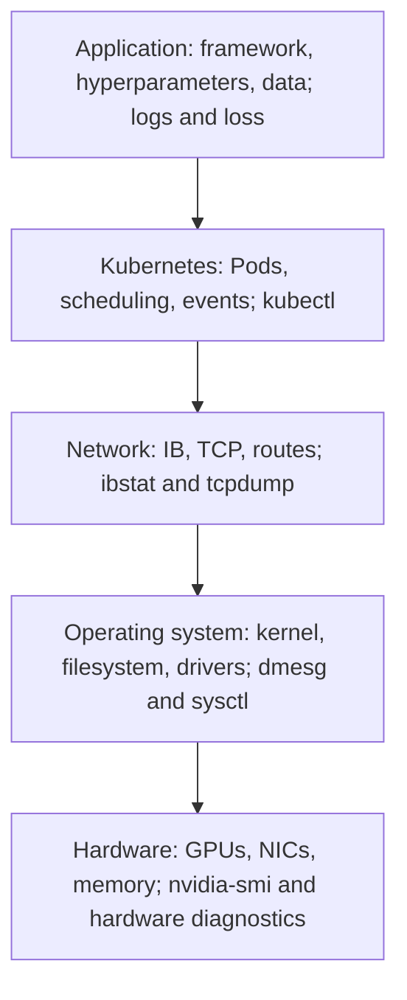
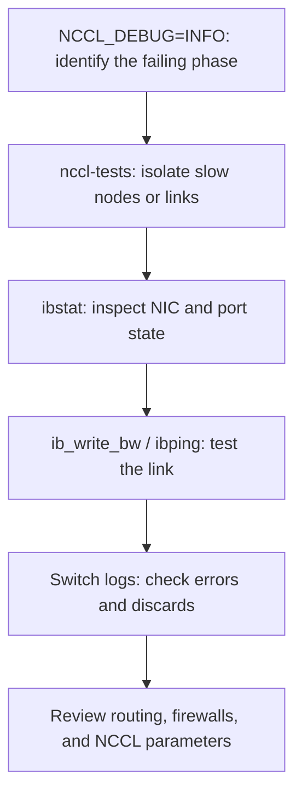

<!-- bilingual-navigation:start -->
[中文原文](../../%E7%AC%AC%E4%B8%89%E8%BE%91%EF%BC%9A%E8%B7%91%E4%B8%9A%E5%8A%A1/%E7%AC%AC08%E7%AB%A0-%E8%AE%AD%E7%BB%83%E4%BB%BB%E5%8A%A1%E8%B0%83%E4%BC%98%E4%B8%8E%E6%8E%92%E9%9A%9C.md) | [English](ch08-training-tuning-troubleshooting.md) | [Contents](../README.md) | [Previous](ch07-distributed-training-communication.md) | [Next](ch09-inference-deployment-benchmarking.md)

English translation of Wang Honglei's Chinese original. Edition and maintenance notes: [TRANSLATIONS.md](../../TRANSLATIONS.md).
<!-- bilingual-navigation:end -->

# Chapter 8: Training Tuning and Troubleshooting

## Opening: Slow Training Does Not Immediately Identify the Culprit

When training fails, people often blame the network. Experience shows that basic environment issues—wrong drivers, CUDA problems, or missing image dependencies—can keep experienced engineers investigating for hours.

Troubleshooting needs a clear order. This chapter explains how to locate bottlenecks and common failures.

Training consumes real money. At an illustrative RMB 25 per GPU-hour, 8,000 H200s running 10,000 steps at 15 seconds per step cost approximately `8,000 × 25 × (15 × 10,000 / 3,600) = RMB 8.33 million`, or about US$1.16 million at RMB 7.2 per dollar. These are example assumptions, not current prices. Every efficiency improvement affects cost.

The author's priority is environment → network → storage → framework. Investigating networking for two hours when a timeout comes from mismatched drivers wastes time. This order comes from production experience.

## 8.1 Key Performance Metrics

**step_time:** Time per step, including loading, forward and backward computation, synchronization, and optimizer updates:

```
step_time = data_time + forward_time + backward_time + sync_time + optimizer_time
```

`sync_time` mainly covers gradient collectives; optimizer time is often small. Decompose the step first and optimize its dominant component.

**data_time:** Loading and preprocessing time. A high share indicates GPUs waiting on storage or CPU work.

**GPU utilization:** Activity reported through DCGM. Sustained values below 70% merit investigation in the source's guidelines.

**MFU:** Model FLOPs utilization. The source considers 35–60% normal and below 20% substantial waste.

**tokens/s:** Training throughput:

```
tokens per step = batch_size × seq_len × world_size × accumulation_steps
tokens/s = tokens per step / step_time
```

This is a useful common reporting measure. The source expresses MFU as:

```
MFU = (theoretical model FLOPs × throughput) / peak hardware FLOPs
```

At 8,000 GPUs, a one-percentage-point difference can mean tens or hundreds of thousands of yuan, depending on duration.

**Loss:** A healthy trend decreases. The source gives these experience-based patterns:

- Healthy: gradual decline, with a 5–10% relative decrease per thousand steps cited as an industry rule of thumb.
- Stalled: a high plateau lasting more than 1,000 steps may indicate learning-rate or data imbalance problems.
- Spike: a jump from 2.0 to 5.0 in one step may indicate excessive learning rate, a bad batch, or exploding gradients.
- NaN: restore a checkpoint rather than continuing a corrupted run.

Its examples describe pretraining loss falling from about 10 to 3–4 over 500–2,000 steps, and SFT loss from 4 to 0.5–1.5 over several hundred steps.

**grad_norm:** The source's reference range is 0.1–1.5, with attention above 2.0.

Display these together in W&B, SwanLab, or Grafana.

### Core DCGM Metrics

The source recommends DCGM Exporter on every GPU node:

- `DCGM_FI_DEV_GPU_UTIL`: utilization, 0–100%.
- `DCGM_FI_DEV_MEM_COPY_UTIL`: memory-copy activity.
- `DCGM_FI_DEV_GPU_TEMP`: the source considers 70°C normal and 80°C worth attention.
- `DCGM_FI_DEV_POWER_USAGE`: H200 full-load power is about 700 W per card.

Interpret utilization in context:

- Persistently below 70%: investigate the data pipeline first.
- Oscillating 0–100%: possible communication bursts; compare step-time stability.
- 70–85%: common in the source's DDP/FSDP deployments.
- Near 100% with long steps: activity can include inefficient kernels or communication waiting.

### Combining Metrics

Low activity plus `data_time` above half of step time strongly suggests loading limitations.

Stable step time with flat loss points toward hyperparameters or data. Inspect learning rate, gradient norm, warmup, and samples.

A loss spike with `grad_norm > 2.0` suggests an excessive rate or bad batch. If clipping does not stabilize it, lower the rate or inspect data.

Low MFU with high GPU activity suggests ineffective work: synchronization gaps, inefficient kernels, or poor parallelism.

**Learning rate and scheduler:** The minimind 64M example uses `lr=5e-4` and cosine decay to a 0.1 floor. Larger models often need lower peaks and longer warmup.

**Warmup:** Raise the rate gradually from zero, commonly over 1–3% of total steps. Starting immediately at a high rate can cause spikes or NaNs.

## 8.2 Optimizing the Data Pipeline

Increase DataLoader workers, use efficient formats such as WebDataset/TFRecord/Arrow, parallelize CPU preprocessing, and cache data locally or near the cluster.

The objective is to keep GPUs supplied. Remote reads, online tokenization, heavy preprocessing, and too few workers can all stall them.

### Practical Details

**num_workers:** The source suggests half to two-thirds of CPU cores. Too few cannot feed GPUs; too many increase process overhead. Check Pod CPU limits.

**Formats:** Many small files overload metadata and IOPS. WebDataset, LMDB, and TFRecord can replace scattered reads with larger operations.

**Pretokenization:** Store tokenized binary data to remove expensive online processing.

**Placement:** Preprocess in DataLoader workers, leaving the main process available for GPU coordination.

**Caching:** Keep repeatedly accessed data on local NVMe or a nearby distributed cache.

**Packing:** Combine short samples into longer sequences to reduce padding and increase useful tokens/s and MFU.

| Format | Advantages | Disadvantages | Use case |
|------|------|------|----------|
| Raw text | Readable | Small-file IOPS pressure | Small experiments |
| WebDataset | Efficient sequential I/O | Preprocessing required | Large training |
| LMDB | Fast random access | Cost to build | Random access |
| TFRecord | Mature ecosystem | Conversion required | TensorFlow/PyTorch |

### Investigating data_time

This measures loading and preprocessing, primarily involving storage and CPU rather than gradient communication.

Inspect bandwidth and IOPS with `iostat`, worker count and CPU activity with `top`, small-file counts, and remote reads. The source gives `data_time > 1500 seconds` as an experience-based indicator of a storage problem.

| Storage | Characteristics | Use case |
|------|------|----------|
| Local NVMe | Fast, limited capacity | Hot-data cache |
| Lustre | Concurrent parallel filesystem | Large training |
| JuiceFS | Object-store-backed filesystem and cache | Multicluster sharing |
| NFS | Simple, modest performance | Small experiments |

Large training generally needs more bandwidth and IOPS than ordinary NFS can supply.

### CPU Bottlenecks

Low GPU activity may come from CPU constraints:

- Eight allocated cores where preprocessing needs 32 or more.
- Too few workers.
- Online tokenization.
- Heavy preprocessing in the main process.

Use `top`, the source's `cat /sys/fs/cgroup/cpu/cpu.stat` check for throttling, and `vmstat` for swapping. Allocate adequate CPU; the source also discusses retaining requests while removing limits where appropriate.

If loading slows progressively, inspect memory leaks, cache behavior, and page reclaim with memory metrics and `vmstat`.

## 8.3 Mixed Precision

FP16 or BF16 reduces memory use and improves throughput relative to FP32.

**FP16:** Five exponent bits and ten fraction bits; limited range can underflow small gradients.

**BF16:** Eight exponent bits and seven fraction bits; FP32-like range with less precision. Ampere and later NVIDIA architectures support it well.

### Loss Scaling

Multiply the loss by a scale before backward to keep FP16 gradients representable, then unscale before the update. Frequent reductions or persistent instability warrant checking the rate and data.

### BF16 versus FP16

BF16 generally removes the need for loss scaling, simplifying operation, although lower precision can affect some models. Frameworks, kernels, and communication libraries must support the chosen format; NCCL supports both.

### Choosing the Format

FP16 offers more fraction precision with scaling complexity. BF16 offers range, simpler tuning, and strong hardware support. Sensitive models or operators may favor FP16 with scaling. Validate through controlled comparisons.

### Learning Rate and Batch Size

Larger batches often permit higher rates. The minimind 64M example uses `lr=5e-4`, batch 32; the source's 7B reference is around `5e-5`.

Warmup commonly occupies 1–3% of training. Larger models need more early stabilization, often with `grad_clip=1.0`.

### Numerical Troubleshooting

Possible issues include BF16 reduction precision, accumulation overflow, and ZeRO-3 gather precision loss. Compare FP32 AllReduce, loss-scaling changes, selected operators at higher precision, and a fixed parallelism strategy.

## 8.4 Environment Consistency

Errors affecting only some ranks often indicate inconsistent Python packages, CUDA, NCCL, or drivers:

```bash
ansible gpu_nodes -m shell -a "python --version"
ansible gpu_nodes -m shell -a "nvcc --version | grep release"
ansible gpu_nodes -m shell -a "python -c 'import torch; print(torch.cuda.nccl.version())'"
ansible gpu_nodes -m shell -a "nvidia-smi | grep 'Driver Version'"
```

In Kubernetes, verify that all workers use the same image.

The source's H200 matrix is driver 550+, CUDA 12.4+, NCCL 2.20+, PyTorch 2.3+, and MLNX_OFED 24.04+. Mismatches can cause initialization, QP, and correctness failures. Standardize before deployment and control subsequent changes.

## 8.5 Communication Tuning

Use compatible stable NCCL, correct NIC selection, and GDR before changing algorithms or buffers.

### Important Settings

**NCCL_IB_HCA:** Select the intended IB/RoCE devices if automatic discovery is wrong.

**NCCL_NET_GDR_LEVEL:** PHB permits the source's local host-bridge path; SYS allows farther paths that may perform worse.

**NCCL_ALGO:** Ring may suit small groups and Tree large inter-node jobs; prefer automatic selection initially.

**NCCL_BUFFSIZE:** Larger buffers may improve large-message throughput at a memory cost.

**NCCL_IB_TIMEOUT / NCCL_IB_RETRY_CNT:** The source suggests increasing its timeout example from 18 to 22 at 1,024 GPUs. This may reduce false timeouts but does not repair faults.

### Overlapping Computation and Communication

DDP launches a bucket's AllReduce when gradients are ready. Larger buckets reduce call count but delay startup and can weaken overlap. Tune the balance.

### Checklist

1. Verify version compatibility.
2. Inspect NIC choice, GDR, and channels with INFO logs.
3. Establish local and multi-node nccl-tests baselines.
4. Check firewalls and CNI policies.
5. Adjust timeout/retry settings if scale warrants it.

Only then consider forced algorithms or buffer changes.

## 8.6 Choosing Parallelism

- Model fits on one GPU: data parallelism.
- Model too large: tensor and pipeline parallelism.
- Very long sequences: sequence parallelism.
- MoE: expert parallelism.

DP is simple but retains full replicas. TP shards layers and communicates frequently, favoring NVLink. PP partitions layers with smaller transfers but pipeline bubbles. EP distributes experts and requires strong AllToAll performance.

### Decision Process

1. Does the full model fit? If yes, start with DP.
2. Is size driven by many layers or large individual layers? Consider PP or TP respectively.
3. Are sequences long enough to justify sequence parallelism?

Combine strategies and compare memory, communication, and compute experimentally. There is no universal configuration.

## 8.7 Checkpoint Strategy

Having all 8,000 ranks write full checkpoints creates an I/O disaster.

The source recommends rank 0 for a complete model, DeepSpeed-native handling under ZeRO-3, and FSDP `FullStateDictConfig` with CPU offload. Framework-specific distributed checkpoint semantics determine which ranks must participate.

For asynchronous saving, copy state to CPU and write in a background thread while training continues. Finish one save before starting another.

Plan capacity: 7B FP16 weights alone are about 14 GB; optimizer and training state add tens of gigabytes. A full disk can terminate a healthy run.

## 8.8 Troubleshooting Priority

Use environment → network → storage → framework settings. The source attributes approximately 40%, 30%, 20%, and 10% of incidents to these categories.

<!-- translated-figure: images/ch08/fig01-five-layer-troubleshooting.png -->


*Figure 8-1: Five layers of training troubleshooting.*

| Layer | Scope | Tools |
|------|---------|---------|
| Application | Framework, hyperparameters, data | Logs, loss |
| Kubernetes | Pods, scheduling, events | kubectl, Events |
| Network | IB/TCP, routing, filtering | ibstat, tcpdump |
| OS | Kernel, filesystem, drivers | dmesg, sysctl |
| Hardware | GPUs, NICs, memory | nvidia-smi, ibstat |

## 8.9 Common Failures

### NCCL Timeout

Symptom: a stalled job reporting a collective-operation timeout.

<!-- translated-figure: images/ch08/fig02-nccl-timeout.png -->


*Figure 8-2: NCCL timeout investigation.*

Begin with INFO logs, nccl-tests, NIC state/rate, switch errors/discards, and routing, subnet management, and filtering.

Sanitized source example:

```
[2026-04-20] [project] >> [rank23]: [Rank 2] Watchdog caught collective
operation timeout: WorkNCCL(SeqNum=28182, OpType=_REDUCE_SCATTER_BASE)
ran for 1800042 milliseconds before timing out.
```

ReduceScatter waited about 1,800 seconds. Locate the affected rank and inspect its node and links.

1. Identify rank and channel in INFO logs.
2. Reproduce with `all_reduce_perf` and find consistently slow participants.
3. Check State, Physical state, and Rate using `ibstat`.
4. Use pairwise `ib_write_bw` to isolate slow links.
5. Check connectivity with `ibping`.
6. Check `nvidia-smi` and `dmesg` for missing GPUs/XIDs.
7. For RoCE, inspect PFC/ECN and filtering.
8. If justified, adjust timeouts/retries and observe recurrence.

Longer timeouts only mask symptoms without a root-cause repair.

### Bootstrap Timeout

If startup stops after `master_addr`, test the master port, firewall, port range, and conntrack capacity. At 8,000 GPUs, connections may exhaust defaults; increasing `nf_conntrack_max` is a temporary mitigation.

The source lists:

```bash
export NCCL_TIMEOUT=1800          # Source example: 30 minutes may be insufficient at 8,000 GPUs
export NCCL_BOOTSTRAP_TIMEOUT=300  # Separate bootstrap timeout in the source configuration
```

Investigate connectivity before tuning timeouts.

### High data_time

Inspect storage bandwidth, worker count, preprocessing, and remote reads. The source repeats its `>1500 seconds` storage heuristic.

### Out of Memory

Reduce batch size, enable activation checkpointing, consider ZeRO/FSDP, and inspect leaks.

Insufficient sharding can cause OOM even at large scale. ZeRO-1 retains parameters and gradients; ZeRO-3 shards them too.

For 7B BF16 training, the source estimates parameters at 14 GB, gradients at 14 GB, optimizer state at 56 GB, and activations depending on batch and sequence length.

At 8,000-way sharding, its simplified ZeRO-1 estimate approaches 28 GB plus optimizer shards. Ideal ZeRO-3 persistent state is `(14+14+56)/8000 ≈ 10.5 MB`, excluding runtime buffers and other memory.

| Option | Memory benefit | Cost |
|------|--------|------|
| ZeRO-3 instead of ZeRO-1/2 | Shard parameters and gradients | More communication |
| Activation checkpointing | Source estimate: 60–80% fewer activation bytes | About 30% more computation |
| Smaller microbatch | Proportional activation reduction | Lower throughput |
| CPU optimizer offload | Remove optimizer state from GPU | Source estimate: 2–3× slower |
| Gradient accumulation | Larger effective batch without matching activation growth | More microsteps |
| FlashAttention | Avoid quadratic attention intermediates | Model support required |

### Memory Leaks

Linear memory growth suggests retained tensors or graphs:

```python
if step % 50 == 0:
    torch.cuda.empty_cache()
    allocated = torch.cuda.memory_allocated() / 1e9
    print(f"Step {step}: allocated={allocated:.2f}GB")
```

Inspect `torch.cuda.memory_summary()` and tensor lifetimes. Common causes are missing `detach`, accumulated graphs, and callback references.

### Abnormal Loss

Check learning rate, bad samples, clipping, and mixed-precision underflow. After NaN, restore the last complete checkpoint and lower the rate.

Persistent `grad_norm > 2.0` with loss spikes points toward data or learning rate. Healthy loss with high norms may indicate conservative clipping.

### Data Quality

Bad, repeated, or malformed samples can produce spikes or NaNs. Check lengths, outliers, vocabulary bounds, and sampled output. Script checks for empty, repetitive, and incorrectly encoded text rather than inspecting every sample manually.

### Joint Loss and Gradient Analysis

- Flat loss, high norm: clipping, difficult optimization, data, or initialization.
- Falling loss, rising norm: possibly excessive rate before a spike.
- Both spike: bad batch or excessive rate.
- Flat loss, near-zero norm: vanishing gradients; inspect activations and connections.

Log norms before and after clipping to distinguish the raw distribution from the applied update.

## 8.10 Problems at Very Large Scale

Growing from 16 to 8,000 GPUs magnifies otherwise minor issues.

### HF_MODULES_CACHE Contention

With Transformers `trust_remote_code`, concurrent writes to shared dynamic-module caches can cause:

```
AttributeError: module 'transformers_modules...' has no attribute 'XXXTokenizer'
```

The source isolates local process caches:

```bash
export HF_MODULES_CACHE=/tmp/hf_modules_${LOCAL_RANK}
```

Beyond 4,000 GPUs, it also uses a `--no-python` wrapper so variables are set before Python starts.

### Initial Broadcast Timeout

Broadcasting model state from rank 0 can bottleneck startup. The source independently initializes weights with identical seeds and skips the broadcast in its workaround.

### Uneven Import Times

Some ranks enter NCCL while others still import Transformers, with reported stalls at `cxiWaitEventWait`. Prewarming imports before `torchrun` populates filesystem caches and reduces skew.

### Excessive ZeRO-3 Communication

At 8,000 GPUs, gathers and reduce-scatter can become problematic. The source describes quadratic topology complexity and uses ZeRO-2 as a workaround, trading more memory for less parameter communication.

### Zero Reduced Gradients

The source reports an interaction between `convert_to_iter_based=True` and DeepSpeed accumulation. Removing it resolved zero gradient reductions in that case.

### Scale in Stages

Use eight GPUs locally → 64 under one leaf → 256 across leaves → 1,024 across spines → 4,096 → 8,000.

Require at least 70% of the expected nccl-tests baseline, no timeouts, and no errors at every stage. Do not expand a failing setup.

### Freeze the Validated Configuration

Retain launch scripts, wrappers, entry-point monkey patches, DeepSpeed settings, and training configurations. Document all fixes for reproduction and handover.

### Code Deadlocks

Live processes with zero GPU activity and no NCCL error may have asymmetric collectives:

```python
# Incorrect: only rank 0 enters the barrier
if dist.get_rank() == 0:
    dist.barrier()

# Correct: every rank participates
dist.barrier()
```

If rank 0 saves while others enter the next AllReduce without coordination, they can time out. Use shorter diagnostic timeouts, `faulthandler`, and `py-spy` to inspect stacks.

### GPU Hardware Faults

Symptoms include `nvidia-smi` failures, CUDA errors, XIDs, and kernel logs. The source highlights XID 31 as a FIFO MMU page fault, 48 as serious double-bit ECC, and 79 as disconnection often requiring replacement.

Check device presence, run `dcgmi diag -r 3`, and inspect `nvidia-smi -q -d ECC`. The source's policy removes cards reporting uncorrected ECC errors from service.

## 8.11 Tooling

**Monitoring:** DCGM Exporter, Prometheus, Grafana.

**Logs:** Loki or ELK.

**Communication:** nccl-tests, `ibstat`, `ibping`, `ib_write_bw`.

**Profiling:** `torch.profiler` and Nsight Systems.

**Training dashboards:** W&B, SwanLab, or TensorBoard, showing loss, norm, learning rate, tokens/s, and data_time together, with rank-level views.

### Tool Levels

Start with dashboards, which the source estimates reveal 70% of issues. Then read framework logs, NCCL INFO, and Events. Reserve profilers for deeper problems because of their overhead.

### torch.profiler

```python
with torch.profiler.profile(
    activities=[torch.profiler.ProfilerActivity.CPU,
                torch.profiler.ProfilerActivity.CUDA],
    record_shapes=True,
    profile_memory=True,
) as prof:
    for step in range(10):
        train_step()

print(prof.key_averages().table(sort_by="cuda_time_total", row_limit=20))
```

Inspect leading `cuda_time_total` operators. AllReduce or `ncclKernel` suggests communication; `aten::copy_` suggests data movement.

### Nsight Systems

A full timeline exposes gaps across kernels and communication:

```bash
nsys profile \
  --trace=cuda,nccl,nvtx,osrt \
  --gpuctxsw=true \
  --output=profile_rank0 \
  --force-overwrite=true \
  python train.py
```

Capture only one or two nodes because trace volume is large.

### Lightweight Timing

The source also provides wall-clock instrumentation:

```python
step_start = time.time()
t0 = time.time()
batch = next(dataloader)
data_time = time.time() - t0

t0 = time.time()
loss = model(batch)
loss.backward()
compute_time = time.time() - t0

t0 = time.time()
optimizer.step()
opt_time = time.time() - t0

step_time = time.time() - step_start
```

Compare loading, compute, and optimizer proportions to choose an investigation direction.

## 8.12 Where This Layer Fits

Tuning determines whether training finishes on time and within budget. Facilities, networks, GPUs, scheduling, and SRE can all expose failures here.

Engineers need breadth and enough depth to identify the failing layer. Metrics, logs, and profiles turn impressions into evidence.

Pretraining emphasizes throughput, MFU, and long-term loss trends. SFT emphasizes stable convergence and avoiding overfitting; the source commonly limits it to two or three epochs.

Its observation hierarchy is five-second dashboards, logs every 100 steps, and operator-level profiles. It attributes 70% of diagnosis to dashboards, 25% to logs, and 5% to profiling.

Models, clusters, and datasets differ. Repeatable investigation and complete monitoring are more valuable than memorized settings. Record incidents and conclusions in a team knowledge base to improve future judgment.

## Summary

Decompose step time and interpret utilization, MFU, loss, and gradient norm together. Investigate environment, networking, storage, then framework settings. Expand gradually. Checkpoint design, precision, parallelism, and diagnostic tools jointly determine training efficiency and reliability.

## Chapter Fact-Checking Checklist

### Reference Materials

- `docs/10-大模型Infra工程师/第26节-训练排障决策树/第26节-训练排障决策树.md`
- `docs/13-大模型开发/第34节-训练监控与性能调优/第34节-训练监控与性能调优.md`
- `docs/13-大模型开发/第39节-训练超参数选择与实战调优/第39节-训练超参数选择与实战调优.md`
- `docs/8000卡分布式训练排障手册.md`
- `docs/8000卡训练任务/训练任务排障过程总计.md`
- `wechat-ai-infra/concepts/nccl-timeout/nccl-timeout.md`

### Sources of Key Figures

- MFU 35–60%, norm 0.1–1.5 with attention above 2.0, and utilization below 70%: training-monitoring document.
- Loss decrease of 5–10% per thousand steps: explicitly an industry rule of thumb.
- Incident proportions 40/30/20/10% and data_time above 1,500 seconds: troubleshooting decision tree.
- Timeout values 18 and 22: timeout document.
- Sanitized log: the source's AGENTS.md example.
- Training cost: illustrative RMB 25/GPU-hour and RMB 7.2/US$, using the formula above; not a live quotation.
