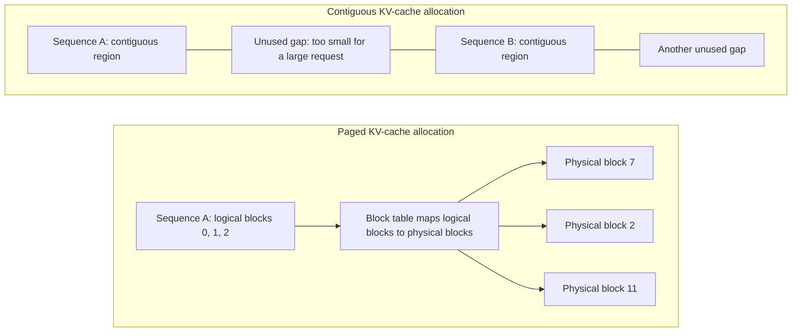

<!-- bilingual-navigation:start -->
[中文原文](../../%E7%AC%AC%E4%B8%89%E8%BE%91%EF%BC%9A%E8%B7%91%E4%B8%9A%E5%8A%A1/%E7%AC%AC09%E7%AB%A0-%E6%8E%A8%E7%90%86%E5%BC%95%E6%93%8E%E9%83%A8%E7%BD%B2%E4%B8%8E%E5%8E%8B%E6%B5%8B.md) | [English](ch09-inference-deployment-benchmarking.md) | [Contents](../README.md) | [Previous](ch08-training-tuning-troubleshooting.md) | [Next](ch10-ai-infrastructure-engineer.md)

English translation of Wang Honglei's Chinese original. Edition and maintenance notes: [TRANSLATIONS.md](../../TRANSLATIONS.md).
<!-- bilingual-navigation:end -->

# Chapter 9: Inference Engine Deployment and Load Testing

## Opening: Training Is an Investment; Inference Is an Ongoing Operation

Training is expensive, but a completed model still needs to serve users continuously. Inference cost and experience determine whether the model becomes useful in practice.

Users want a quick first token and smooth generation; operators want each GPU to serve more people. These goals often conflict, requiring careful scheduling.

Training converts compute, electricity, and time into weights. Inference consumes compute, memory bandwidth, and electricity for every token. An application with a million daily active users may process billions of tokens per day, eventually spending more on serving than training.

Optimization therefore aims to serve more users per unit cost while meeting experience targets. It requires understanding models, GPUs, engines, and distributed deployment.

This chapter covers engine selection, configuration, performance validation, and reports that support deployment decisions.

## 9.1 Training and Inference Differ Fundamentally

Training typically uses large batches and fixed-length sequences, seeking lower loss, high throughput, and stable exclusive GPU use over days or weeks.

Inference handles smaller requests of varying lengths, emphasizing latency, concurrency, and cost while sharing GPUs continuously. A training restart is inconvenient; an inference interruption immediately affects users.

| Dimension | Training | Inference |
|------|------|------|
| Goal | Learn parameters | Predict with parameters |
| Batches | Large, fixed length | Small, variable length |
| Duration | Days to weeks | Continuous |
| Optimization | Throughput | Latency and throughput |
| Resources | Exclusive | Shared |

Autoregressive inference generates one token at a time and retains prior keys and values in a KV cache. As contexts grow, that cache can dominate memory use. This is central to subsequent optimization choices.

## 9.2 Core Metrics

**TTFT, time to first token:** Time from request submission to the first generated token, strongly influenced by prefill and queueing.

**TPOT, time per output token:** Average interval during generation, reflecting decode performance and perceived fluency.

**ITL, inter-token latency:** Individual intervals between successive tokens, emphasizing jitter as well as averages.

**Throughput:** Tokens or completed requests per second.

**Concurrency:** Requests being handled simultaneously.

**GPU memory:** Weights, KV cache, and activations.

Higher concurrency often increases TTFT and TPOT. Lower latency can reduce achievable concurrency. Find the balance acceptable to the workload.

## 9.2.1 Prefill and Decode Compute Characteristics

**Prefill is generally compute-bound.** It processes the whole prompt through attention and feed-forward layers. For a 2,048-token Llama-2-7B prompt, the source estimates about 2,048 FLOPs/byte, above its H200 reference crossover of `1,979 TFLOPS / 4.8 TB/s ≈ 412 FLOPs/byte`, including sparsity. It cites prefill MFU of 60–80%.

**Decode is generally memory-bound.** One-token feed-forward multiplication resembles `[1, hidden_size] × [hidden_size, intermediate_size]`. Weight reads remain large while arithmetic shrinks. The source estimates about one FLOP/byte, leaving compute units underused while weights and KV data are read.

Batching decode requests shares weight reads across more useful computation, explaining the value of continuous batching.

| Dimension | Prefill | Decode |
|------|---------|--------|
| Tokens per sequence per step | N, the prompt | 1 |
| Core multiplication | [N, d] × [d, d] | [1, d] × [d, d] |
| Illustrative 7B intensity | About 2,048 FLOPs/byte | About 1 FLOP/byte |
| Main constraint | Compute | Memory bandwidth |
| Cited batch-one MFU | 60–80% | 5–15% |

## 9.3 The Two Inference Phases

<!-- translated-figure: images/ch09/fig01-prefill-decode.png -->
| Stage | Input and work | Output | Main bottleneck described in the source |
|---|---|---|---|
| Prefill | Process the whole prompt; compute and store each token's K/V | First generated token | Compute |
| Decode | Reuse cached K/V; process the growing sequence one new token at a time | One token per step | Memory bandwidth |

*Figure 9-1: Prefill and decode.*

Prefill computes keys and values for the complete prompt, stores them, and produces the first output token. Decode generates subsequent tokens and appends their KV state.

When both phases share a GPU, a long prefill can delay other requests' decode. Chunked prefill and prefill/decode separation address this interference.

Prefill optimization targets compute utilization, long prompts, efficient attention kernels, and tensor parallelism. Decode optimization targets batching, smaller caches, fewer weight reads, and reduced kernel-launch overhead through CUDA Graphs.

## 9.3.1 KV Cache Memory Pressure

Estimate cache bytes per token as:

```
KV per token = 2 × L × H_kv × d_head × b
```

L is layer count, H_kv the number of KV heads, d_head the head dimension, and b bytes per element: two for FP16, one for FP8.

For Llama-2-7B FP16, `2 × 32 × 32 × 128 × 2 = 524,288` bytes, approximately 0.5 MB per token in the source's notation. A 4,096-token request needs about 2 GB; 100 such requests need about 200 GB, exceeding one H200's 141 GB.

For Llama-2-70B with GQA, `2 × 80 × 8 × 128 × 2 = 327,680` bytes, about 0.3125 MB per token. At 8,192 tokens, that is about 2.5 GB per request and 250 GB for 100 requests across the deployment described with TP=8.

Grouped-query attention reduces KV-head count. Without GQA, the source's hypothetical 70B comparison reaches 2.5 MB per token and 20 GB per 8,192-token request.

Weights have fixed size, while caches grow with concurrency and length. Even with GQA, enough requests consume all remaining memory. PagedAttention, cache quantization, prefix reuse, and disaggregation address this pressure.

## 9.4 Main Inference Engines

The source focuses on vLLM, TensorRT-LLM, and SGLang.

### vLLM

vLLM originated at UC Berkeley; PagedAttention is its central memory-management innovation.

<!-- translated-figure: images/ch09/fig02-paged-attention.png -->


Contiguous allocation can leave unusable gaps between requests. PagedAttention allocates fixed-size blocks on demand: logical order does not require physical adjacency. The block numbers here illustrate the mapping; a partially used final block can still waste some space.

*Figure 9-2: Contiguous allocation versus paged KV cache allocation.*

PagedAttention divides KV state into fixed-size blocks, drawing on virtual-memory paging. The source uses a default block size of 16 tokens. A per-request block table maps logical blocks to noncontiguous physical blocks, allocated on demand and returned when finished.

External fragmentation nearly disappears; the final block wastes at most 15 token slots in this example. The source cites cache utilization improving from 20–40% to about 96%.

CUDA Graphs record sequences of kernel calls and replay them, reducing CPU/GPU launch overhead during small decode iterations. The source cites Python overhead falling from 30–40% to below 5% and throughput improving 1.5–2×, while noting graph constraints when batch shapes or membership change.

Advantages:

- Active open-source ecosystem.
- Efficient paged memory and higher concurrency.
- Continuous batching: completed requests leave and new requests join between decode iterations.
- Multiple hardware backends.
- OpenAI-compatible serving APIs that simplify application integration.

Continuous batching and paged allocation reinforce each other: new requests can immediately obtain available blocks without finding contiguous memory.

Disadvantages in the source's comparison:

- Some new models or quantization formats may lag.
- Peak performance may trail TensorRT-LLM.
- Python orchestration can add overhead relative to predominantly C++ engines.

For a 70B-class model on eight H200s, the source qualitatively describes short-prompt TTFT in tens to roughly a hundred milliseconds, prefill at thousands of tokens/s, and decode at hundreds or fewer depending on request mix. FP8 weights and caches reduce memory use and can improve throughput. Real prompt distributions must determine production capacity, rather than theoretical or community reference numbers.

### TensorRT-LLM

NVIDIA's engine builds optimized execution paths for its GPUs, emphasizing Tensor Core and memory-bandwidth use.

Advantages:

- Strong NVIDIA performance, with the source citing 10–30% higher raw throughput than vLLM in its comparison.
- FP8, INT8, and INT4 optimizations.
- Close integration with NVIDIA hardware features.

Disadvantages described by the source:

- NVIDIA-only hardware.
- Closed components and reduced visibility in parts of the stack.
- New-model adaptation and release dependencies.
- Engine-building and configuration complexity.
- Less flexible model reload and hot-update workflows.

It suits stable model deployments seeking peak performance. Frequent model changes may favor vLLM's flexibility.

### SGLang

SGLang emphasizes structured generation and efficient scheduling, particularly for agent workflows and multi-turn conversations.

Advantages:

- Efficient JSON/regex-constrained generation.
- RadixAttention prefix caching.
- Complex prompts and multi-turn reuse.
- The source describes Mooncake integration across GPU HBM → host DRAM → Mooncake DRAM → NVMe → 3FS.
- KV offload for long-context capacity beyond local GPU memory.

Disadvantages in the source's assessment:

- A newer ecosystem.
- A smaller community than vLLM.
- Less model coverage.
- A shorter production track record.

### Choosing

The source favors vLLM for generality and multiple hardware types, TensorRT-LLM for NVIDIA-focused peak performance, and SGLang for structured generation, complex scheduling, and long-context or agent cache reuse.

| Dimension | vLLM | TensorRT-LLM | SGLang |
|------|------|-------------|--------|
| Origin | UC Berkeley and open-source community | NVIDIA | Berkeley research community |
| KV management | PagedAttention, block tables | Specialized management | RadixAttention, radix tree |
| Model coverage | Very broad | Per-model adaptation | Broad and growing |
| Ease of use | High | Engine-building complexity | Medium |
| Raw throughput | High | Often higher in the source's comparison | Similar order to vLLM |
| Structured generation | Supported | Supported | Central strength |
| Hardware listed by source | NVIDIA/AMD/Intel/TPU/Gaudi | NVIDIA | Primarily NVIDIA |
| Openness described by source | Open source | Some closed components | Open source |

## 9.5 Deployment Considerations

Loading weights is only the beginning.

**Precision:** FP16, BF16, FP8, INT8, or INT4 trade memory and throughput against numerical quality.

**Parallelism:** TP shards within layers, PP partitions layers, and DP adds independent replicas. The source describes TP as the more mature and common vLLM deployment choice for inference.

**Orchestration:** KServe, Seldon, or a custom gateway can provide balancing, versions, and progressive releases.

**Scaling:** Adapt replicas to QPS and latency across daily peaks and troughs.

**Long contexts:** Chunked prefill, prefix caching, and sparse attention can lower costs.

**Capacity example:** The source's GLM-5.2 example assumes 744B parameters, approximately 744 GB of FP8 weights, or 93 GB per GPU at TP=8. It gives MLA cache at about 70 KB/token in BF16: roughly 9.2 GB for 128K context, about 150 GB for 16 requests and 294 GB for 32. FP8 cache halves those figures. With about 50 GB for activations/reserve and approximately 1.1 TB across eight H200s, it estimates around 16 concurrent 128K requests with BF16 cache or 30 with FP8. These are the book's capacity assumptions; account for weights, caches, and runtime overhead together.

## 9.5.1 Quantization Formats

The source's illustrative comparison is:

| Format | Bits | Memory reduction | Speedup | Quality loss | Hardware listed |
|------|------|---------|---------|---------|---------|
| FP16 | 16 | Baseline | Baseline | 0 | General GPUs |
| FP8 | 8 | 50% | 1.5–2× | <1% | H100/H200 |
| INT8, GPTQ | 8 | 50% | 1.5–2× | 1–3% | A100 and later |
| INT4, AWQ | 4 | 75% | 2–3× | 2–5% | A100 and later |
| INT4, GPTQ + Marlin | 4 | 75% | 3–4× | 2–5% | A100 and later |

Its selection guidance is:

- H100/H200: FP8 uses native Tensor Core operations and reduces weight traffic without first expanding everything to FP16.
- Severe memory constraints: INT4 AWQ with Marlin, which fuses dequantization and matrix multiplication to reduce memory traffic.
- A100 quantization: consider INT8 GPTQ.
- Quality first: retain FP16.

KV quantization is separate from weight quantization. FP16 uses two bytes per element, FP8 one, and INT4 half a byte. Smaller caches directly increase concurrency without changing weight size. The source describes little FP8 impact below 2,048 tokens and favors FP8 over INT4 for contexts above 8K.

## 9.5.2 Serving Architecture

Production needs routing, balancing, version rollout, and rollback.

**KServe** provides an InferenceService CRD, canaries, A/B testing, and autoscaling with Kubernetes integration. Model-name routing, prompt-length routing, and disaggregated serving can require extra development.

**Custom gateways** can provide:

- Routing by model name.
- Balancing by prompt or expected output length.
- Assignment to prefill/decode pools according to their queues.
- Progressive model releases and automatic rollback.
- Rate limits, circuit breakers, and fallback behavior.

The original project's AGENTS.md favored self-hosted open-source systems for flexibility, control, available expertise, ecosystem support, and reduced vendor dependence.

Regardless of architecture, readiness must mean the model can actually serve. Do not send traffic merely because the process has started.

## 9.5.3 Important Optimizations

**Chunked prefill:** Split a long prompt into chunks and interleave them with decode work. The source's 8,000-token example compares 40–80 ms pauses without chunking with 3–5 ms per chunk. It attributes default enablement to vLLM versions after v0.5.0; this is retained as a source-version claim.

**Prefix caching:** Reuse KV blocks for shared prefixes, especially system prompts and RAG. The source reports 80–95% hit rates and 5–10× TTFT improvement in highly shared-prefix cases.

**Prefill/decode disaggregation:** Separate compute-heavy prefill from bandwidth-heavy decode, at the cost of transferring caches. The source's hypothetical 70B model without GQA uses about 2.5 MB per token, or 5 GB at 2,048 tokens and 500 GB for 100 requests. Such transfers need high-bandwidth networking. The chapter describes PD separation as an architecture built around the engine.

**Speculative decoding:** A smaller model proposes tokens and the larger model verifies them. Benefit depends on acceptance rate and requires model-specific validation.

## 9.5.4 Observability

Monitor:

- TTFT P50/P99.
- TPOT P50/P99.
- Tokens/s and requests/s.
- Queue depth, such as `num_requests_waiting`.
- GPU activity and memory use.
- Prefix-cache hit rate.
- Errors and timeouts.

Export to Prometheus/Grafana. The source's example triggers include TTFT P99 above two seconds, TPOT P99 above 100 ms, or continuously growing queues, prompting scaling or tuning.

## 9.6 Load Testing

A single-request latency result is insufficient.

Test concurrency, prompt/output length, batching, and sustained stability. Tools include vLLM's serving benchmarks, TensorRT-LLM benchmarks, and custom realistic traffic generators.

First, match production distributions rather than fixed-length synthetic requests. Prompts may range from tens to tens of thousands of tokens, with variable outputs.

Second, increase concurrency gradually and plot TTFT, TPOT, and throughput, locating the point where queueing rises sharply.

Third, saturate the system to understand its ceiling. The maximum is a diagnostic limit, not a deployment target.

Fourth, run for hours to detect memory leaks, latency drift, and growing error rates. Production networking, storage, and logging can change laboratory results.

## 9.6.1 Load-Test Report Template

Include environment, configuration, measurements, bottlenecks, and deployment recommendations. The source uses GLM-5-FP8 on eight H200s.

**Environment:** GLM-5-FP8; 8 × H200 SXM with 141 GB each; intra-node NVLink and inter-node RoCEv2; single-node TP=8; vLLM stable; `vllm bench serve`; ShareGPT V3 conversation distribution.

**Configuration:** `gpu_memory_utilization=0.9`, `max_model_len=4096`, `max_num_seqs=256`, `max_num_batched_tokens=4096`, and `enable_chunked_prefill=True`.

**Example measurements:**

| Condition | Concurrency | Req/s | Tokens/s | TTFT, ms | TPOT, ms |
|---------|------|-------|----------|----------|----------|
| 20 RPS limit, concurrency cap 20 | 20 | 2.24 | 447 | 130 | 44 |
| Unlimited rate, cap 1,000 | 1000 | 9.17 | 1830 | 6769 | 731 |
| Unlimited rate, cap 10,000 | 10000 | 12.78 | 2560 | 335415 | 311 |

Source: Chapter 14 of `docs/vLLM推理引擎深度解析.md`.

The observations are:

1. Diminishing throughput gains: 50× concurrency yields 4.1× throughput, then another 10× yields only 1.4×. The system is near saturation around 1,000 concurrent requests in this example.
2. TTFT grows dramatically as requests queue for prefill: 130 ms, 6,769 ms, then 335,415 ms.
3. TPOT rises less than TTFT: 44 ms to 311 ms between the lowest and highest concurrency cases. The source relates this to bandwidth-bound decode, whose service time differs from queueing delay.

**TTFT versus input length:**

| Scenario | Input tokens | Concurrency | P99 TTFT, ms |
|------|---------|------|-------------|
| short_low | 128 | 1 | 72 |
| medium_low | 512 | 1 | 182 |
| long_low | 2048 | 1 | 289 |
| ultra_low | 8192 | 1 | 1028 |
| extreme_low | 32768 | 1 | 4295 |

A 256× input increase corresponds to about 60× TTFT. The source interprets this as increased prefill computation and describes its complexity as between linear and quadratic.

**TPOT versus input length:**

| Scenario | Input tokens | Concurrency | P99 TPOT, ms |
|------|---------|------|-------------|
| short_low | 128 | 1 | 26 |
| ultra_low | 8192 | 1 | 27 |
| extreme_low | 32768 | 1 | 27 |

In these measurements, batch-one TPOT stays near 26–27 ms. The source attributes the result to weight-read costs that do not change with prompt length.

**Bottlenecks:** Low concurrency underuses compute; medium concurrency introduces prefill queueing; large batches lengthen decode forwards. Across-node TP=16 was 8–27% slower than one node at low concurrency because of collective overhead.

**Deployment guidance from the source:** Target 60–70% of saturation throughput. A separate `saturation_rate` test reached about 5,246 tokens/s, or 6.8 req/s, but P99 TTFT exceeded ten minutes. The ShareGPT test above reached about 2,560 tokens/s at 10,000 concurrency. The source recommends approximately 3.5–4.5 req/s and concurrency 50–100 for its production case, targeting TTFT below one second and TPOT below 50 ms. Limit concurrency when first-token latency matters rather than pursuing unusable peak throughput.

## 9.7 Common Production Problems

**Memory exhaustion:** Rapid cache growth. The source suggests reducing `max_num_seqs`, considering block-size settings, quantization, and prefix reuse.

**Latency jitter:** Varied lengths hurt batching. Consider bounded waits, chunked prefill, and length-aware routing.

**Slow first token:** Long prompts require more computation. Consider TP, faster attention, prefix caching, and dedicated prefill capacity.

**Model versions:** Support coexistence, progressive release, and rollback. The source suggests validating a new version with 10% A/B traffic before full deployment.

**Cross-node slowdown:** At TP=16, RoCEv2 AllReduce can outweigh added compute at low concurrency. Extra nodes help only when their capacity overcomes communication cost. The source favors single-node TP=8 for many online services with tens to hundreds of concurrent requests.

**Unsupported backends:** For errors such as “No valid attention backend found,” inspect the Reasons matrix. Read columns for common unsupported features and rows for the closest usable backend. Their intersection may reveal a version mismatch requiring a different image or engine version rather than parameter changes.

**Copied flags without context:** The source warns against adding `--distributed-executor-backend ray` to its single-node setup; default multiprocessing is simpler there. Its two-node TP=16 case uses Ray. Copy configuration boundaries along with the flags.

## 9.8 Where This Layer Fits

Inference is the user-facing end of AI infrastructure. Its latency, reliability, and cost depend on trained weights, platform deployment capabilities, GPUs, and networking.

Training produces the model; inference determines whether it is affordable and pleasant to use.

The engineering sequence is to improve memory allocation with paging, utilization with continuous batching, bandwidth and capacity with quantization, repeated/long-context work with caching and disaggregation, and finally choose operating limits through load tests.

Optimize the system under realistic request distributions and resource contention. A laboratory-best parameter can fail in production. A strong inference engineer can explain configuration choices with measurements.

## Summary

Inference is an ongoing cost. Prefill is generally compute-bound, decode generally bandwidth-bound, and KV caches can dominate memory. vLLM, TensorRT-LLM, and SGLang have different strengths. Quantization, caching, disaggregation, and continuous batching work together. Test realistic traffic to find an acceptable latency/throughput balance before deployment.

## Chapter Fact-Checking Checklist

### Reference Materials

- `docs/22-VLLM推理全解析/第02节-vLLM核心架构/第02节-vLLM核心架构.md`
- `yidian/第一期-vLLM推理引擎介绍.md`
- `yidian/第二期-vLLM推理深入与实践.md`
- `docs/vLLM推理引擎深度解析.md`
- `docs/10-大模型Infra工程师/第50节-vLLM推理引擎/第50节-vLLM推理引擎.md`
- `docs/13-大模型开发/第54节-vLLM部署/第54节-vLLM部署.md`
- `docs/18-生产案例/第04节-vLLM启动两连翻到PD调优/第04节-vLLM启动两连翻到PD调优.md`
- `AGENTS.md`, the original project's open-source selection principles.

### Sources of Key Concepts

- TTFT/TPOT/ITL, compute-bound prefill, bandwidth-bound decode, KV formulas, and engine comparisons: vLLM deep-dive document.
- PagedAttention and approximately 96% utilization: vLLM architecture course, Lesson 2.
- Quantization comparison: the second vLLM practice article.
- GLM-5-FP8 measurements: Chapter 14 of the deep-dive document.
- GLM-5.2's cited 744B parameters, 744 GB FP8 weights, and 70 KB/token BF16 MLA cache: `docs/19-论文解读系列/第06节-FlashAttention与PagedAttention/第06节-FlashAttention与PagedAttention.md`.
- 70B performance on eight H200s: qualitative ranges rather than independently verified benchmarks.
- Open-source selection principle: the original project's AGENTS.md.
