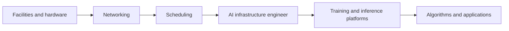

<!-- bilingual-navigation:start -->
[中文原文](../../%E7%AC%AC%E4%B8%89%E8%BE%91%EF%BC%9A%E8%B7%91%E4%B8%9A%E5%8A%A1/%E7%AC%AC10%E7%AB%A0-AI%20Infra%E5%B7%A5%E7%A8%8B%E5%B8%88.md) | [English](ch10-ai-infrastructure-engineer.md) | [Contents](../README.md) | [Previous](ch09-inference-deployment-benchmarking.md) | [Next](ch11-industry-observations.md)

English translation of Wang Honglei's Chinese original. Edition and maintenance notes: [TRANSLATIONS.md](../../TRANSLATIONS.md).
<!-- bilingual-navigation:end -->

# Chapter 10: The AI Infrastructure Engineer

## Opening: A Role Spanning the Site and the Model

An AI infrastructure engineer may discuss facility power, investigate an overnight NCCL timeout, debate parallelism with researchers, and write a platform for self-service job submission.

Large-model training is a systems problem. Chips, networks, storage, scheduling, frameworks, and applications must work together. This role connects them.

The engineer need not be the foremost expert in every area, but must understand researchers' needs, explain training traffic to network specialists, and build usable tools. That connecting ability is the role's central value.

This chapter outlines scope, capabilities, and growth paths. Teams define the role differently, so the aim is a useful map rather than a universal job description.

## 10.1 What the Role Covers

**Infrastructure:** Facility power, cooling, rack layout, topology, GPU acceptance, firmware, and hardware incidents.

**Platforms:** Training, inference, and scheduling systems that make GPUs usable. Outputs include web interfaces, APIs, schedulers, and monitoring. The user sees simplicity; the platform team must understand the underlying complexity.

**Runtime:** Failed jobs, poor performance, and inference latency. Work includes NCCL settings, parallelism, and profiling.

**Operating standards:** Change processes, SLIs/SLOs, emergency plans, and postmortems. These are easily overlooked but essential at scale.

### 10.1.1 A Typical Day

At 08:30, inspect Grafana for GPU activity, job states, queues, packet loss, and unresolved overnight alerts. A node at zero utilization may have finished normally or suffered a scheduling problem. Check the WeCom on-call group for open escalations.

At 09:30, accept newly installed nodes with `nvidia-smi` and nccl-tests, admitting them only after bandwidth meets baseline.

At 11:00, a 70B job reports a timeout. Logs point to rank 23; NIC counters show symbol errors. Coordinate with networking to identify faulty optics, temporarily move the job, and later update the runbook.

At 14:00, participate in a Volcano upgrade window: validate in testing, perform a limited rollout, then expand after checking results.

At 16:00, help researchers tune parallelism, perhaps TP=8, PP=2, DP=4 for the particular model and sequence length, with matching NCCL settings.

At 18:00, automate faulty-node isolation through `kubectl cordon` and `kubectl drain`, creating a hardware replacement ticket.

At 20:00, an inference TPOT alert reveals nearly full KV cache. Temporarily lower `max_num_seqs`, add a replica, and report recovery, leaving root-cause review for the postmortem.

The role alternates among technologies, teams, development, and operations. It requires rapid context switching, comfort with uncertainty, and a service mindset: researcher and developer productivity is the ultimate goal.

## 10.2 Capability Model

<!-- translated-figure: images/ch10/fig01-ai-infra-competency.png -->
| Capability area | Representative skills |
|---|---|
| Hardware and networking | GPU architecture, PCIe/NVLink, RDMA/RoCE/InfiniBand, switches |
| Distributed training | DDP/FSDP/TP/PP, NCCL/HCCL, parallelism choices, profiling |
| Platforms and scheduling | Kubernetes, Volcano/KServe, tenancy, platform development |
| SRE and operations | SLI/SLO, observability, change management, incident response |

*Figure 10-1: AI infrastructure engineering capabilities.*

**Hardware and networking:** GPU architecture, PCIe, NVLink, RDMA/RoCEv2, IB, and switches; interpreting `nvidia-smi`, `ibstat`, and `ethtool`.

**Operating systems:** Linux networking, interrupts, NUMA, filesystems, kernel tuning, CPU affinity, huge pages, and buffers.

**Kubernetes and containers:** Pods, Deployments, Services, CNI, CSI, device plugins, Volcano, YAML, and Events.

**Distributed training:** DDP, FSDP, TP, PP, SP, NCCL/HCCL, logs, and collectives such as Ring AllReduce, AllGather, and ReduceScatter.

**Inference:** vLLM, TensorRT-LLM, SGLang, TTFT, TPOT, throughput, concurrency, and scaling; selecting engines and parameters for a workload.

**Platform development:** At least one backend language such as Go or Python, API and database design, tenants, and permissions.

**SRE:** SLIs/SLOs, error budgets, changes, observability, and postmortems. The source gives an illustrative 99.9% availability target with 43.8 minutes of monthly allowance, and an eight-minute recovery objective: detection one minute, alerting one, response two, diagnosis two, repair one, validation one.

**Communication and judgment:** Cross-team coordination, investigation, documentation, and prioritization.

These capabilities support one another. Hardware and systems knowledge help explain a problem; Kubernetes and workload knowledge help solve it; platforms and SRE make solutions repeatable at scale. Communication converts individual experience into team capability.

No one must master everything equally. Build enough breadth to understand the chain and depth in a chosen area.

## 10.3 Balancing Breadth and Depth

Possible specializations include:

**Networking:** RDMA, IB, PFC/ECN, and congestion control.

**Training:** Communication, parallelism, and profiling with research teams.

**Platforms:** Scheduling, tenancy, and self-service products.

**Inference:** Engines, serving, scaling, latency, throughput, and cost.

**SRE:** Observability, automation, changes, and response systems.

Begin with an overall map, then specialize according to both interest and team needs. Filling an important capability gap often produces the clearest early impact.

### 10.3.1 Learning Paths

**Networking:**

- Foundations: TCP/IP, RDMA, and RoCEv2 versus IB; Chapter 3 and `wechat-ai-infra/concepts/infiniband/infiniband.md` are source references.
- Practice: configure RoCEv2, run nccl-tests, and observe PFC/ECN effects with `ibstat`, `ib_write_bw`, and `ethtool`.
- Advanced: read NCCL `net_ib`, learn verbs, QPs, and credits, and tune device selection and GDR.
- Milestone: independently diagnose low NCCL bandwidth and coordinate lossless settings across hosts and switches.

**Training:**

- Foundations: DDP/FSDP/TP/PP/SP and a working PyTorch distributed run; understand Ring's phases and traffic.
- Practice: train minimind or an Intern model across nodes and inspect data_time, throughput, and loss scale.
- Advanced: read Megatron-LM/DeepSpeed and profile with Nsight Systems.
- Milestone: design 3D parallelism for a 70B model, reach a target MFU, and diagnose timeouts and slow nodes.

**Platforms:**

- Foundations: Kubernetes, Volcano, REST, CNI, CSI, and device plugins.
- Practice: build a small Go/Python platform with authentication, job submission, logs, and resource monitoring.
- Advanced: design tenant queues, quotas, priorities, and preemption; understand Queue, PodGroup, and fairness policies.
- Milestone: lead an internal platform design that lets researchers submit work without operations assistance.

**Inference:**

- Foundations: vLLM, prefill/decode, caches, quantization, and metric tradeoffs.
- Practice: deploy 7B serving, load-test concurrency, and tune `max_num_seqs`, `gpu_memory_utilization`, and `max_num_batched_tokens`.
- Advanced: disaggregation, prefix caching, Mooncake tiers, and engine selection.
- Milestone: design an available, economical serving architecture and produce a deployment load-test report.

**SRE:**

- Foundations: SLIs/SLOs, budgets, Prometheus/Grafana, on-call, MTTR, MTBF, and postmortems.
- Practice: define objectives for GPU availability, successful training, and communication baseline compliance.
- Advanced: automate common GPU and NCCL incidents and establish change and rollout processes.
- Milestone: reduce a P1 incident's recovery from hours to minutes and establish blameless review.

These paths are not linear. Real infrastructure problems repeatedly cross their boundaries.

## 10.4 Judgment Outlasts Memorized Settings

Versions, hardware, and optimal parameters change rapidly. Judgment comes from:

**Principles:** Understanding why a technique exists helps determine when it matters. PagedAttention addresses fragmentation, so its benefit depends on workload and memory pressure.

**Methods:** Knowing where to begin an unfamiliar timeout is more useful than memorizing every possible answer.

**Experience:** Handling incidents, tuning jobs, and deploying services develops practical intuition.

**Evidence:** “A larger batch improved throughput 30% but increased TPOT 50%” supports a decision; “I think it should be larger” does not.

Risk judgment matters too. A possible 10% speedup may threaten a long-running job. Consider business priorities, error budgets, windows, and rollback before deciding how to validate it.

## 10.4.1 A Practical Toolbox

**GPU:** `nvidia-smi` for devices/processes, `nvidia-smi topo -m` for topology, `nvidia-smi nvlink -s` for links, and `dcgmi` for diagnostics.

**Network:** `ibstat`, `ibv_devinfo`, `ib_write_bw`, `ib_read_bw`, `ethtool -S`, `ping`, and `ibping`.

**Training:** NCCL INFO logs, nccl-tests, Nsight Systems timelines, and `torch.profiler`.

**Inference:** Engine Prometheus metrics, Grafana, and serving benchmarks.

**Platform:** `kubectl`, Helm, Prometheus/Grafana/Loki, and the source's Volcano `vcctl` reference.

Choose a tool from a hypothesis about the failing layer rather than running every available command.

## 10.5 What Interviews Assess

Foundational questions cover DDP/FSDP, parallelism, Ring AllReduce, RoCEv2, and gang scheduling. Scenarios ask how to train 70B on H200, investigate timeouts, or scale inference. Engineering questions cover tenancy, state machines, and change management.

Interviewers seek evidence of real incidents, lessons extracted from them, clear explanations for different audiences, and honesty about unknowns. Connecting concepts matters more than reciting them.

### 10.5.1 Example Questions

**1. Explain DDP and FSDP and when to use each.**

This tests memory–communication tradeoffs. DDP retains complete replicas and AllReduces gradients. FSDP shards parameters, gradients, and optimizer state, reducing memory at a communication cost. For 70B FP16 weights, approximately 140 GB nearly fills a 141 GB H200 before runtime state, so additional sharding or TP is needed. Eight-way TP within an NVLink node is a common option, depending on the full workload.

**2. How do you investigate NCCL timeout?**

Identify the rank and collective in logs; run nccl-tests; inspect NIC/GPU health and topology; verify device binding and settings; investigate intermittent network disruptions and optical errors.

**3. Design Kubernetes vLLM serving that scales at peak demand.**

Use Deployment, Service, and Ingress. Scale from GPU activity, `vllm:num_requests_waiting`, P99 latency, and token throughput using HPA with Prometheus Adapter/custom metrics. Readiness must wait for model loading. Loading takes minutes, so prewarm or reserve spare replicas.

**4. How can training and inference share capacity over time?**

One approach separates pools and adjusts their sizes. Another allows preemptible training to consume spare resources while reserving inference capacity. Challenges include latency interference, memory contention, and checkpoint recovery after training preemption.

**5. Design a cluster with 1,000 H200 GPUs.**

Use eight-GPU NVLink/NVSwitch nodes, NDR400 IB or RoCEv2 across a fat-tree, and topology-aware communication. Store datasets/checkpoints on Lustre, GPFS, or CephFS with local NVMe caching. Use batch queueing/admission and gang-aware scheduling through systems such as Volcano or the source's Kueue alternative. Group node pools by hardware, manage templates with GitOps/Helm, and provide shared resource/job dashboards.

**6. How should an LLM/RAG service degrade if embeddings fail?**

New ingestion cannot produce embeddings, and retrieval may be unavailable. Reuse cached embeddings, fall back to plain LLM answers, or use lexical retrieval such as BM25/TF-IDF—the source lists these as a lightweight alternative. Monitor embedding latency/errors and use circuit breakers to prevent cascading failure.

## 10.6 Growth Stages

**Junior:** Independently accept nodes, run training, and resolve common problems using Kubernetes, NCCL, and inference basics.

**Intermediate:** Optimize communication, design parallelism, contribute to platforms, and own a specialization.

**Senior:** Lead facility/cluster planning, technical direction, complex incidents, and cross-domain tradeoffs.

Growth comes from hands-on problems and written records. The key difference is often how quickly someone finds a useful starting point in an unfamiliar failure.

### 10.6.1 Communication and Ownership

**Cross-team communication:** Explain parallelism to researchers, collective traffic to networking, and risk to management in terms each audience needs.

**Documentation:** Runbooks, postmortems, architecture documents, and procedures are part of the work. They turn experience into team assets and reduce repeated mistakes and recovery time. Update the runbook after solving an undocumented problem.

**Prioritization:** Compare impact, recovery difficulty, blocked work, and budget consumption when many issues compete.

**Blameless review:** Reconstruct timelines, use methods such as five whys, and produce actionable improvements rather than blame.

**Learning:** Ask what a technology solves, where it fits, and whether it helps your environment. Avoid novelty without purpose.

**Ownership:** Follow cross-domain problems through to resolution rather than waiting for someone else to advance them.

### 10.6.2 A Fictional Growth Example

The following is explicitly a fictional illustration based on common career patterns.

Xiao Zhang begins with node acceptance, running `nvidia-smi` and nccl-tests. After three months, he can judge acceptance independently and writes a checklist.

At six months, a mentor helps him investigate his first timeout through logs, ranks, and baselines. He adds the investigation to the runbook.

After a year, he tunes a medium-sized job's TP/PP/DP and NCCL settings for a 15% throughput improvement, learning why principles matter more than memorized parameters.

After two years, he mentors newcomers and contributes to architecture. His documentation becomes their quickest learning resource. He also notices that meetings suffer when he overwhelms listeners with details and practices explaining a problem in one sentence.

After three years, he leads a timeout postmortem. Five whys reveals missing monitoring of aging optics, prompting optical-temperature and error-rate metrics, updated procedures, and a team-wide writeup.

Growth proceeds through repeated cycles of problem solving, documentation, communication, and reflection, with new challenges at each stage.

### 10.6.3 Common Mistakes

**Ignoring the business:** Better metrics may not help if researchers struggle or operational complexity rises.

**Chasing novelty over reliability:** A faster new version can introduce production bugs.

**Copying NVIDIA procedures to Ascend:** NPU/CANN/HCCL devices, topology, variables, and numerical behavior differ.

**Neglecting documentation and process:** Personal expertise alone does not scale a team.

**Optimizing one component without the whole system:** A local NCCL improvement may affect other jobs; assess overall impact.

## 10.7 Where This Role Fits

<!-- translated-figure: images/ch10/fig02-ai-infra-roles.png -->

The engineer understands the interfaces across the chain and coordinates work between the specialist roles.

*Figure 10-2: The engineer connects the full infrastructure chain.*

Hardware knowledge connects suppliers and facilities; network knowledge connects the fabric team; platform skills connect developers; training knowledge connects researchers; inference knowledge connects business cost and experience.

Without these connections, facilities may miss training requirements, frameworks may exceed network capability, platforms may miss user workflows, and serving may become unaffordable.

This combination of breadth, experience, communication, and judgment is difficult to develop. Its value is turning a laboratory model into a sustainable service. Continued learning and cross-domain capability are lasting strengths.

## Summary

AI infrastructure engineers connect hardware, networks, systems, frameworks, platforms, and SRE. They diagnose concrete problems and communicate across teams. Hands-on work and documentation drive growth. Judgment and ownership retain value longer than memorized settings.

## Chapter Fact-Checking Checklist

### Reference Materials

- `yidian/PJH-面试题/面试题-AI Infra工程师.md`
- `docs/10-大模型Infra工程师/第60节-SRE方法论/第60节-SRE方法论.md`
- `docs/10-大模型Infra工程师/` course series.
- `AGENTS.md`, the original project's stack and capability guidance.

### Sources of Key Concepts

- Interview requirements: the AI infrastructure interview collection.
- SLIs/SLOs, budgets, MTTR, and postmortems: SRE methodology, Lesson 60.
- Role definition: synthesis of project experience.
- Learning paths: common industry requirements and the repository's technology stack.
