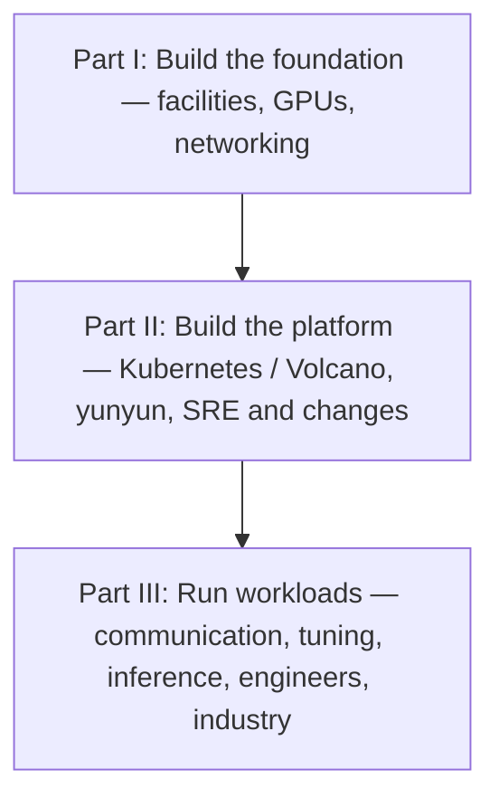

<!-- bilingual-navigation:start -->
[中文原文](../../%E7%AC%AC%E4%B8%89%E8%BE%91%EF%BC%9A%E8%B7%91%E4%B8%9A%E5%8A%A1/%E7%AC%AC11%E7%AB%A0-AI%20Infra%E8%A1%8C%E4%B8%9A%E8%A7%82%E5%AF%9F%E4%B8%8E%E8%B6%8B%E5%8A%BF%E5%88%A4%E6%96%AD.md) | [English](ch11-industry-observations.md) | [Contents](../README.md) | [Previous](ch10-ai-infrastructure-engineer.md) | [Next](../afterword.md)

English translation of Wang Honglei's Chinese original. Edition and maintenance notes: [TRANSLATIONS.md](../../TRANSLATIONS.md).
<!-- bilingual-navigation:end -->

# Chapter 11: AI Infrastructure Industry Observations and Trends

## Opening: The Stack Keeps Changing

Practices from two years ago may already be outdated, and today's choices may need reassessment in another two years. Engineers need to understand trends as well as current manuals.

This chapter presents questions to keep watching, based on the author's contemporary observations. Source references accompany factual material; forecasts retain the label **[Author's view]**. Read it as an evolving agenda, not a set of guaranteed outcomes.

## 11.1 China's Accelerator Ecosystem Is Maturing

NVIDIA remains the dominant ecosystem in the source's account, while Chinese alternatives are developing rapidly. Ascend 910B, with CANN, HCCL, and MindSpeed, is its main example.

Operational differences include:

**Hardware:** Ascend uses NPUs, HCCS, and RoCE rather than NVIDIA GPUs, NVLink, and IB. The source describes eight 910B devices in an HCCS ring with about 392 GB/s bidirectional bandwidth; some communication traverses the ring.

**Software:** HCCL replaces NCCL, CANN replaces CUDA, and MindSpeed supplies some capabilities associated with Megatron-LM/DeepSpeed. PyTorch migration includes changes from `backend="nccl"` to `backend="hccl"` and from `device="cuda"` to `device="npu"`.

**Tools:** `npu-smi info` for devices, `msnpureport` for the source's network checks, `hccn_tool` for NIC configuration, and `hccl_test` for baselines.

**Separate deployments:** NVIDIA and Ascend operate as physically separate clusters in the original project, without a single workload spanning both ecosystems.

CANN connects frameworks such as PyTorch, MindSpore, and Paddle to Ascend hardware. Its layers include framework adapters such as torch_npu/MindSpeed, graph engine GE, AscendCL runtime, TBE/AICore/AIVE operators, and drivers/firmware. Migration also involves operator compilation, AOE tuning, and numerical behavior.

Common operating difficulties are version alignment across drivers, firmware, CANN, and torch_npu; expensive first-step AOE compilation requiring warmup; HCCS ring-aware TP grouping; and settings such as `HCCL_RDMA_DEVICE`, `HCCL_INTRA_ROCE_ENABLE`, and `HCCL_CONNECT_TIMEOUT` that cannot simply copy NCCL configuration.

A separate operations system, tooling, procedures, and training are therefore needed. Adoption is an organizational capability decision as well as procurement.

**[Author's view]:** Over the next three to five years from the book's writing, Chinese accelerators will move from usable to convenient. Software must mature through real large-scale workloads. Existing NVIDIA deployments face high migration costs, while new clusters and sensitive workloads may find alternatives more attractive. The decisive milestone is reliable thousand-device training, rather than a single-card benchmark alone.

## 11.2 RoCEv2's Share Will Continue to Grow

Early large AI clusters often used IB, but the source observes increasing RoCEv2 adoption.

Drivers include lower cost through Ethernet infrastructure, more suppliers and shorter lead times, mature 400G performance, and IP/UDP routing flexibility. IB instead uses LID/GID addressing and subnet-manager route computation.

RoCEv2's challenge is coordinated lossless configuration. PFC, ECN, and DCQCN must work across switches and hosts. The original project's instructions emphasized switch-side PFC/ECN and host-side tuning. Misconfiguration can reduce throughput or cause loss.

IB's credits and precomputed routes offer deterministic behavior at higher cost and with a concentrated supply base. RoCEv2 trades configuration complexity for a broader ecosystem.

| Dimension | InfiniBand | RoCEv2 |
|------|------------|--------|
| Physical network | Native IB | Ethernet |
| Addressing | LID / GID | IP + MAC |
| Routing | SM-precomputed LFT | ECMP |
| Subnet manager | Required | Not required |
| Loss handling | Link credits | PFC + ECN + DCQCN |
| Cost | High | Medium |
| Supplier ecosystem in the source | Concentrated | Multiple vendors |

**[Author's view]:** RoCEv2 will become a default option for new large training clusters unless latency requirements are exceptional. IB will remain a high-end choice, and existing installations will not be replaced wholesale.

Supply diversity also matters. Ethernet vendors include H3C, Ruijie, and Digital China, offering more procurement options and negotiation flexibility.

Buying RoCE-capable NICs and switches does not guarantee full NCCL performance. Lossless tuning and host/switch coordination require skilled network staff. Teams that underestimate this face packet loss, degraded rates, and timeouts. Budget for the engineering capability as well as equipment.

## 11.3 Inference Cost Will Become a Central Competitive Issue

Training is a large initial expense; serving incurs cost for every token, growing with model size and usage.

The source illustrates a billion-token-per-day service with a 70B FP16 model, assuming token costs from a few hundredths to a few tenths of a yuan. It consequently cites daily costs from tens to hundreds of millions of yuan, and describes a 30% reduction as saving hundreds of thousands per day. These illustrative amounts are retained as the author's example, including its inconsistent savings scale; they are not current measured prices.

This pressure puts inference optimization alongside training in importance. Serving becomes an ongoing source of both cost and innovation.

Approaches include:

**Quantization:** FP8, INT8, and INT4 reduce memory and bandwidth pressure. The source favors native FP8 on H100/H200.

**Speculative decoding:** A small model proposes tokens and a large one verifies them, reducing effective decode work when acceptance is high.

**Prefix caching:** Reuse repeated system prompts and conversation prefixes, with the source citing 80–95% hits for standardized prompts.

**Long-context optimization:** Sparse attention, sliding windows, and cache compression.

**Prefill/decode separation:** Assign compute-heavy prefill and bandwidth-heavy decode to suitable pools, paying the cost of cache transfer between them.

**Tiered cache storage:** Mooncake-style systems extend GPU HBM through host/remote DRAM, NVMe, and 3FS. The source compares 50–150 ms restoration from 3FS with about 3,300 ms to prefill 16K tokens again.

These techniques combine: FP8 reduces storage, caching removes repeated work, and disaggregation reduces interference between phases.

| Technique | Target | Main benefit cited | Use case |
|------|---------|---------|---------|
| FP8 | Weights and KV cache | Half the memory, 1.5–2× speed | H100/H200 |
| INT4 | Weights | 75% memory reduction | Severe memory constraints |
| Prefix caching | Repeated prompts | 5–10× lower TTFT | RAG and conversations |
| PD separation | Phase resource allocation | Tune latency and throughput separately | Concurrent online services |
| Speculation | Decode steps | Fewer effective large-model steps | Decode-bound workloads |
| Cache tiers | Long-context storage | Capacity beyond one GPU | Agents and long documents |

**[Author's view]:** Competition will shift from merely running models to serving them economically. Quantization, prefix caching, and phase separation will increasingly become standard production capabilities.

## 11.4 Self-Hosted Open Source Remains a Leading Choice

The book's projects generally prefer self-hosted open source because the field changes quickly and needs customization.

**Control:** Read and modify scheduling, engine, and communication code for particular hardware and workloads. Fix bugs locally or contribute upstream without waiting for a proprietary release.

**People:** Kubernetes, Volcano, vLLM, and Prometheus communities develop transferable skills and improve hiring and knowledge sharing.

**Ecosystem:** Open tools span training, serving, and monitoring. A commercial platform may still need costly integration with an existing Kubernetes/Volcano installation.

**Reduced dependence:** Multiple hardware and software options improve negotiation and make expansion, migration, and cost control less dependent on one vendor.

Self-hosting still requires development, maintenance, version management, bug fixes, and community tracking. Small teams with limited expertise may find a commercial system more practical.

Commercial products can accelerate initial deployment and provide specialized support, sometimes delivering a usable platform within weeks. The author nevertheless describes open-source self-hosting as the main approach for large Chinese AI data centers; the original project's guidance mentioned commercial alternatives when explicitly relevant.

The tradeoff is flexibility and control versus initial convenience and support. The source sees greater long-term benefit from open source for technically capable teams with thousand-GPU scale and complex workloads.

**[Author's view]:** Over the three years following the book's writing, self-hosted open source will remain dominant in China's AI infrastructure market because it can adapt to technology and business needs. Proprietary offerings retain niches in particular compliance settings, industries, and smaller teams. Open-source advantages will remain strong in engines, scheduling, and monitoring.

## 11.5 Skilled Engineers Will Remain Scarce

The role spans hardware, networks, systems, frameworks, platforms, and SRE. Developing that combination takes time.

The author observes model companies, cloud providers, financial institutions, and traditional enterprises recruiting while relatively few engineers can independently own thousand-GPU reliability. Some employers pay heavily for experience because training new staff takes years.

Reasons include:

**Cross-domain demands:** Each specialty is difficult; connecting them is harder.

**Long development time:** The source estimates three to five years to independently handle complex problems.

**Demand outpacing training:** Infrastructure investment grows faster than systematic university and training programs.

**Rare practical exposure:** Some failures emerge only at large scale. Distinguishing network, GPU, configuration, and software causes of a timeout requires experience beyond textbooks.

**Rapid change:** New hardware, models, and software require continuing learning.

**Few bridge specialists:** Cloud engineers may know Kubernetes but not distributed training; researchers may know models but not infrastructure.

**[Author's view]:** The shortage will persist for several years. Competition is for people who use GPUs effectively as well as for GPUs themselves. Engineers with both NVIDIA and Ascend experience will be particularly scarce.

Organizations need explicit capability models, real practice environments, mentors, and a culture of documentation and sharing. Individuals should specialize on top of a broad foundation while staying aware of adjacent areas.

## 11.6 Cost-Reduction Techniques Will Reach Production Faster

The author expects economic pressure to accelerate deployment of:

**FP8 inference:** Native H100/H200 support, with the source's cited sub-1% quality loss, halved memory, and 1.5–2× speedup, makes it attractive for new serving deployments.

**Prefix caching:** Shared system prompts and conversations offer immediate TTFT benefits; vLLM and SGLang support automatic reuse in the source's account.

**PD separation:** Better cache-transfer systems such as Mooncake make deployment more practical, particularly for demanding latency/cost targets.

**Tiered KV storage:** Agents and long-document services can retain contexts on cheaper media instead of recomputing prefill.

Each introduces engineering work. Quantization needs quality evaluation; cache reuse needs compatible prompt structure; separation needs sufficient network bandwidth; cache tiers require host memory and SSD budgets. Benefits are not automatic.

**[Author's view]:** The shared objective is to use scarce GPU memory where it matters most. Future serving optimization will increasingly revolve around how caches are stored, reused, moved, and evicted.

## 11.7 Chinese Accelerators and NVIDIA Will Coexist

The source does not expect complete near-term replacement of NVIDIA. The ecosystems will serve different clusters and workloads.

NVIDIA offers mature software, tools, community, and available expertise. Chinese alternatives offer supply-chain considerations, policy support, cost potential, and targeted optimization, attracting some new, government/enterprise, and sensitive deployments.

Teams may therefore maintain both CUDA/NCCL and CANN/HCCL systems, with separate clusters in the project's architecture.

Practical differences include:

1. Monitoring: `nvidia-smi`, DCGM, and its exporter versus `npu-smi` and Ascend interfaces.
2. Images: CUDA/cuDNN/NCCL versus CANN/torch_npu/HCCL.
3. Diagnosis: NCCL logs and `ibstat` versus HCCL logs and `msnpureport`.
4. Baselines: nccl-tests versus `hccl_test`.

Build parallel procedures and develop engineers who understand both, rather than copying NVIDIA settings unchanged.

**[Author's view]:** Managing both ecosystems will become a basic capability of medium and large teams. The question is how to keep both reliable and useful.

## 11.8 Team Organization Will Evolve

Early deployments may divide work among a few generalists: operations handles machines, a developer handles the platform, and a researcher handles training. This responds quickly but lacks specialization at scale.

At thousands of GPUs, teams often divide into cluster reliability/hardware/networking, platform development, SRE, training optimization, and inference optimization.

Specialization deepens expertise and enables parallel work, but raises coordination costs. If hardware staff do not know about platform changes, upgrades can expose compatibility problems.

**[Author's view]:** Larger teams will combine a shared platform and standard workflows with specialist groups. Cross-group coordination becomes essential to avoid new information silos.

## 11.9 Hardware Evolution Changes Infrastructure Choices

The source emphasizes H200's memory-capacity and bandwidth improvements over H100: 141 GB HBM3e reduces pressure from weights and caches. It also describes FP8 hardware progress as making quantized inference more natural.

Its forward-looking discussion names B200 and GB200 as subsequent hardware to evaluate for compute, memory, and interconnect improvements. Hardware gains require software work: drivers, NCCL, topology, and quantization must be reassessed.

Successive Ascend products likewise need software that keeps pace with hardware and adapts mainstream models quickly. Single-card specifications alone do not determine competitiveness.

**[Author's view]:** Engineers should prepare for hardware change rather than rely only on one generation's experience. FP8 and disaggregated-serving experience can help prepare for larger models and future systems.

More memory can reduce cross-node TP requirements and change parallelism choices. Faster local interconnects also change where communication-intensive work should run and how architectures are partitioned.

**[Author's view]:** Hardware evolution belongs in long-term planning. Revisit model parallelism, quantization, network topology, and cooling with each generation rather than automatically retaining the previous design.

## 11.10 Reviewing the Whole Book

<!-- translated-figure: images/ch11/fig01-book-chain-review.png -->

*Figure 11-1: From the ground up to the model.*

Part I built the foundation: facilities, GPUs, and networking.

Part II built the platform: Kubernetes/Volcano, yunyun, and SRE/change management.

Part III ran the workloads: communication, training diagnosis, inference deployment, the engineering role, and industry observations.

These layers interact. Facility layout shapes topology; network quality shapes NCCL; scheduling shapes utilization; platforms shape user productivity. Together they determine training and serving cost and experience.

Four themes run throughout:

**End-to-end thinking:** Power and cooling support GPUs; networking supports distributed communication; scheduling makes capacity useful; serving optimization keeps the model affordable. Engineers maintain the connections.

**Evidence:** SLOs, budgets, tuning, and capacity plans require measurements. Experience helps form hypotheses, but data supports decisions.

**Self-hosted open source:** Control and customization help teams follow a rapidly changing field while retaining options for commercial tools where appropriate.

**Continuous evolution:** Hardware, models, and software change. This is why the book presents notes and a map rather than immutable instructions.

**[Author's view]:** Over the next three to five years from the book's writing, the field will move from getting models running to making them affordable, reliable, and usable. Engineers who understand the chain, cooperate across teams, and use evidence will be especially valuable. Build the map, choose a specialty, and keep working at it.

## Summary

The author expects long-term coexistence of NVIDIA and Chinese accelerators, increased RoCEv2 adoption, and greater emphasis on inference cost. Self-hosted open source offers flexibility for large deployments. People who connect domains and use expensive hardware effectively remain central to success.

## Chapter Fact-Checking Checklist

### Reference Materials

- The preceding ten chapters.
- `docs/10-大模型Infra工程师/` course series.
- `wechat-ai-infra/concepts/cann/cann.md`
- `wechat-ai-infra/concepts/hccl/hccl.md`
- `wechat-ai-infra/concepts/infiniband/infiniband.md`
- `docs/vLLM推理引擎深度解析.md`
- `AGENTS.md`, the original project's open-source and ecosystem-separation principles.

### Sources of Key Facts

- Ascend NPU/CANN/HCCL: the CANN and HCCL documents.
- Separate NVIDIA/Ascend deployments: original project constraints.
- Cited 392 GB/s HCCS ring and 400G RoCE: HCCL document.
- RoCEv2 UDP and PFC/ECN/DCQCN; IB addressing and subnet management: InfiniBand document.
- Open-source preference: original AGENTS.md.
- FP8, prefix cache, PD separation, and Mooncake figures: vLLM deep dive.

### Forecasts and Opinions

**[Author's view]** passages are judgments based on the source's contemporary observations, not factual guarantees. They cover accelerator maturity, network choices, inference economics, open-source market position, staffing shortages, dual-ecosystem operations, and adoption of cost-reduction techniques.
