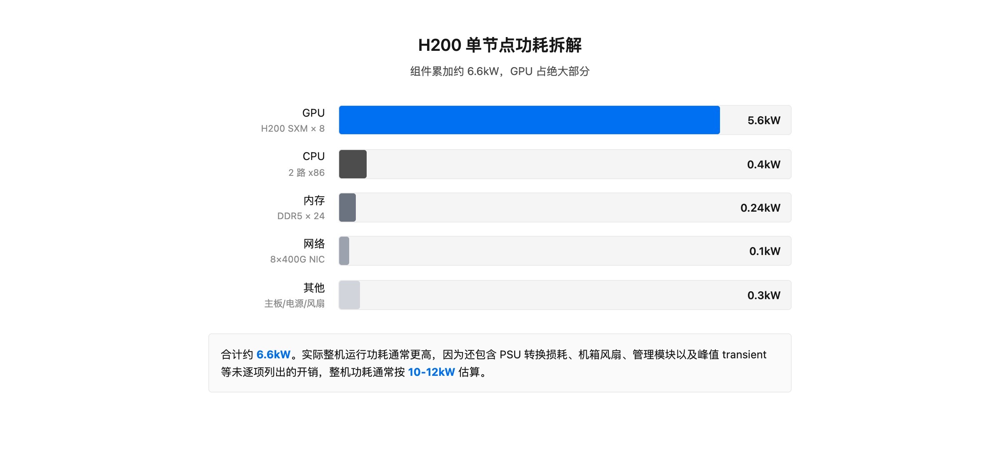
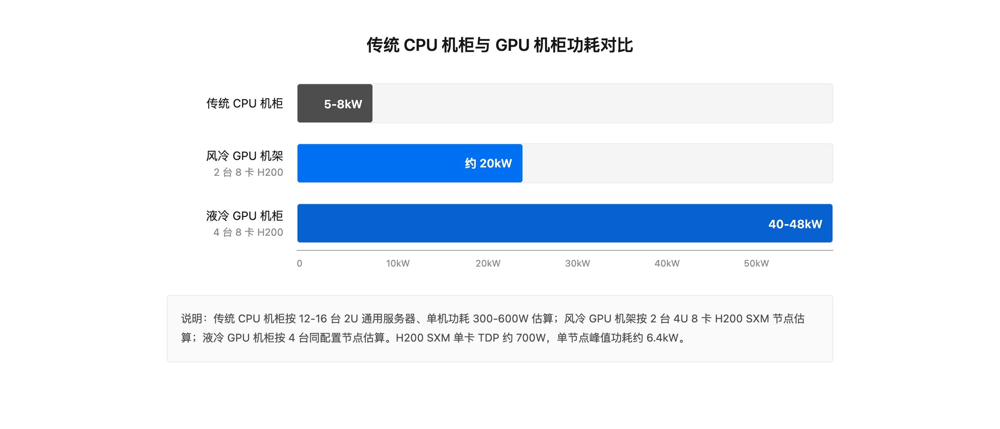
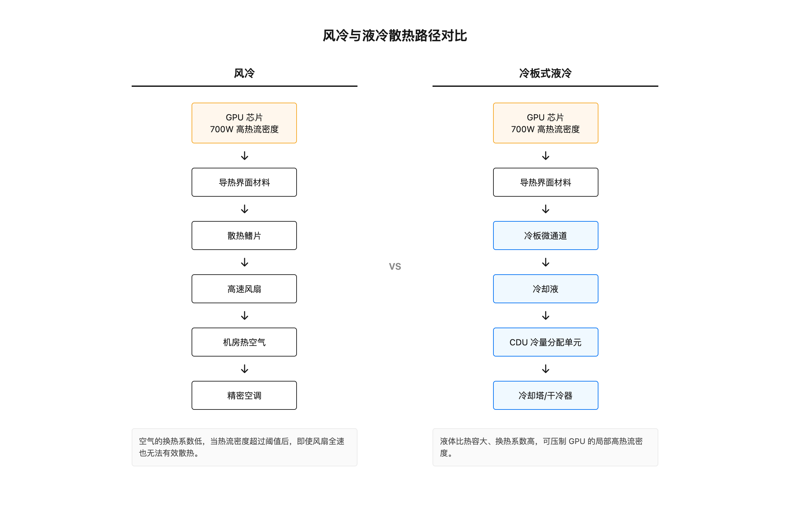
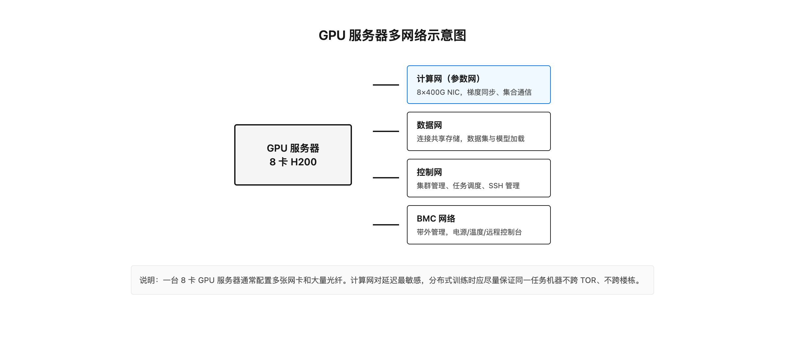
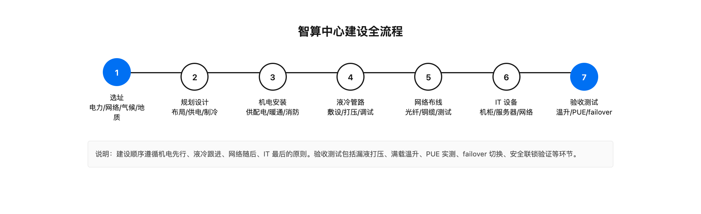

# 第 1 章 IDC 与智算中心建设

## 引子：一个烫手的光模块

在日常运维中，徒手触摸工作状态下的 400G 光模块，外壳温度通常达到 60℃ 至 80℃。这个温度已经远超人体安全阈值，触碰瞬间会有明显的灼烧感。

一个光模块只有巴掌大小，功耗却从 100G 时代的 3 至 5 瓦，跃升到 400G 时代的 10 至 12 瓦。当网络速率继续向 800G、1.6T 演进时，单端口功耗预计将达到 15 瓦至 30 瓦以上。在 QSFP-DD 或 OSFP 这类标准封装体积几乎不变的前提下，单位面积的发热量已经逼近风冷散热的物理天花板。

高温带来的问题不只是烫手。激光器波长会漂移，误码率会恶化，模块寿命会折半。更关键的是，风扇高频振动反而可能加剧光学端面的污染与损耗。

这个烫手的光模块，是智算中心基础设施的一个缩影。它说明一个道理：当算力密度提升到一定程度后，散热不再是可选优化项，而是决定整个系统能否持续稳定运行的硬约束。

## 1.1 智算中心不是装了 GPU 的机房

智算中心，全称人工智能数据中心（Artificial Intelligence Data Center，AIDC），是面向人工智能训练与推理等高密度算力负载的数据中心形态。它与传统数据中心最本质的区别，不是楼更大、网更快，而是单个 IT 负载的功率密度从百瓦级跃升到了千瓦级。

传统数据中心以 CPU 通用计算负载为主，承载 Web 服务、数据库、虚拟机等横向扩展型业务。一台 2U 通用服务器的功耗通常在 300 瓦至 600 瓦之间，一个标准 42U 机柜部署 12 至 16 台服务器，整机柜功耗 5 千瓦至 8 千瓦已是高密度配置。

智算中心则完全不同。一台 GPU 训练节点通常是 4U 高度，是普通 2U 服务器的两倍。在风冷场景下，一个机架往往只能放 2 台 GPU 服务器，原因有两个：一是散热跟不上，二是电源容量不够。即便如此，机架上通常还要配大功率机架风扇辅助散热。

以搭载 NVIDIA H200 SXM GPU 的训练节点为例，按源素材的功耗拆解表，GPU、CPU、内存、网络、主板电源风扇等组件累加约 6.6 千瓦。而整机运行功耗通常达到 10 千瓦至 12 千瓦，两者差异主要来自 PSU 转换损耗、机箱风扇、管理模块以及峰值 transient 等未逐项列出的开销。按 4 节点/机柜的液冷配置，单机柜 40 千瓦至 48 千瓦成为常态；而在风冷场景下，一个机架只放 2 台，单机架功耗也达到 20 千瓦以上。这个数字是传统 CPU 机柜的数倍。

这种跃升带来的不是简单的设备升级，而是供电、制冷、网络、运维全链路的系统性重构。把几台 GPU 服务器塞进传统机房、靠现有空调硬扛，本质上是在传统数据中心里跑 GPU 负载，而不是在建设智算中心。这种混搭往往是后期散热故障和能效恶化的根源。

智算中心也常被误认为是超算中心的翻版。二者确实都有高功率节点，但负载特征存在本质差异：

| 维度 | 超算中心 | 智算中心 |
|------|----------|----------|
| 主力算力 | CPU 加加速器混合，强调 FP64 双精度 | GPU 集群，强调 FP16/BF16/FP8 低精度 |
| 通信模式 | MPI 点对点为主 | 大规模集合通信 |
| 单机柜功率 | 15 千瓦至 25 千瓦 | 40 千瓦至 60 千瓦 |
| 网络拓扑 | Fat-Tree，InfiniBand 为主 | Fat-Tree/轨道优化，400G IB/RoCEv2 |
| 作业特征 | 长时间科学计算作业 | 大模型训练数周或数月连续满载 |
| 制冷压力 | 高 | 极高 |

关键区别在于，超算中心虽然也有高功率节点，但占比相对均衡；智算中心则是全 GPU 节点、全高功率、全连续满载，制冷系统几乎没有喘息窗口。这意味着智算中心不能简单照搬超算中心的散热方案。

## 1.2 H200 集群的功耗账本

要理解智算中心为什么需要重新设计基础设施，必须先看清楚一台 GPU 服务器到底消耗多少电，以及这些电都去了哪里。

以一台 4U 高度、搭载 8 张 NVIDIA H200 SXM GPU 的标准 AI 训练节点为例，功耗构成大致如下：

| 组件 | 规格 | 功耗 |
|------|------|------|
| GPU | H200 SXM × 8 | 700 瓦 × 8 = 5.6 千瓦 |
| CPU | 2 路高端 x86 | 约 350 瓦至 450 瓦 |
| 内存 | DDR5 × 24 条 | 约 240 瓦 |
| 网络 | 8×400G NIC + 1×400G 管理口 | 约 80 瓦至 120 瓦 |
| 主板、电源、风扇损耗 | - | 约 200 瓦至 300 瓦 |
| 合计（组件累加） | - | 约 6.6 千瓦 |
| 整机运行功耗（含 PSU 转换损耗、机箱风扇、管理模块、峰值 transient） | - | 约 10 千瓦至 12 千瓦 |

其中，GPU 热设计功耗（TDP）700 瓦/卡是核心。8 张卡合计 5.6 千瓦，占组件累加功耗的绝大部分。这意味着散热设计的重心必须从整机散热转向 GPU 定点散热。

*图 1-2：H200 单节点功耗构成*

因为 GPU 服务器是 4U 高度，加上风冷场景下单机架通常只部署 2 台，一个标准 42U 机柜的空间利用率并不高。风冷机架还要配大功率机架风扇，进一步增加了噪声和能耗。所以在规划机房时，不能按传统 CPU 机柜的密度去估算 GPU 机柜数量。

按 4 节点/机柜的主流配置，单机柜功耗达到 40 千瓦至 48 千瓦。这个数字意味着什么？传统 CPU 机柜 5 千瓦至 8 千瓦，一根 16 安培或 32 安培的 PDU 就能覆盖；而 H200 机柜需要三相电、多路 PDU 冗余供电，单柜配电容量相当于传统机柜的 6 至 8 个。

*图 1-1：CPU 机柜与 GPU 机柜功耗密度对比*

功耗密度对供电的冲击是直接的。传统机柜采用单相 220 伏/16 安培供电，最大功率约 3.5 千瓦，单路 32 安培约 7 千瓦，双路冗余刚好覆盖 5 千瓦至 8 千瓦。H200 机柜单柜 40 千瓦至 48 千瓦，需三相 380 伏供电。按公式 P = √3 × U × I 计算，48 千瓦对应约 73 安培三相电流，单路 PDU 至少需配置 80 安培三相 PDU，且必须双路冗余。

功耗密度对制冷的冲击更明显。制冷量必须大于等于 IT 功耗，否则热量积累、温度失控。传统机柜 5 千瓦至 8 千瓦，房间级精密空调加 N+1 冗余即可，冷风通过地板下送风或风管送达。H200 机柜 40 千瓦至 48 千瓦，房间级空调根本无法把这么大的冷量送到单柜，即使行级空调也接近极限，必须引入液冷。

更关键的问题是热点。H200 单卡 700 瓦集中在约 0.001 平方米（约 10 平方厘米）的封装面积上，热流密度达到约 70 瓦/平方厘米，远超风冷换热系数能有效带走的范围。这也是为什么 GPU 节点即使整机柜用了液冷，GPU 本身仍需冷板直接贴合。只有冷板微通道的换热系数才能压制这种局部高热流密度。

功耗密度对空间的冲击往往被忽视。智算中心往往不是塞满机柜，而是按制冷能力定机柜数。一个 1000 平方米机房，传统布局可放 100 个 5 千瓦机柜，总 IT 负载 500 千瓦；同样的机房改做智算中心，按 40 千瓦/柜算只能放 12 至 13 个机柜，总 IT 负载约 500 千瓦。算力密度提升了，但总功耗相近。因此智算中心常采用高密岛策略，把 GPU 机柜集中在制冷能力强的区域，其余区域仍跑低密 CPU 负载。

以一个 256 台 GPU 节点的 H200 集群为例，即 2048 张 H200，约相当于一个中等规模训练集群：

| 项目 | 数值 |
|------|------|
| 节点数 | 256 台 |
| 单节点整机功耗 | 11 千瓦（取中值） |
| 总 IT 功耗 | 256 × 11 = 2816 千瓦 ≈ 2.8 兆瓦 |
| 机柜数（4 节点/柜） | 64 柜 |
| 单柜功耗 | 44 千瓦 |

一个 1000 柜规模的智算中心，IT 负载按 40 千瓦/柜计算就是 40 兆瓦，加上制冷和损耗，按 PUE 1.3 计算总用电约 52 兆瓦。这相当于一个小型变电站的供电能力。

## 1.3 风冷为什么撑不住了

风冷撑不住，不是风扇不够大，而是空气这种介质的换热能力本身存在物理极限。

光模块功耗演进很能说明问题：

| 时代 | 单端口功耗 | 外壳温度体感 |
|------|------------|--------------|
| 100G | 3 瓦至 5 瓦 | 温热 |
| 400G | 10 瓦至 12 瓦 | 灼烫，60℃ 至 80℃ |
| 800G/1.6T | 15 瓦至 30 瓦以上 | 远超安全阈值 |

在 QSFP-DD 或 OSFP 标准封装体积几乎不变的前提下，单位面积发热量，也就是热流密度，达到风冷散热的物理天花板。风扇全速运转不仅无法有效降温，其高频振动还会干扰光模块的精密光学性能，能耗代价也急剧攀升。

风冷换热的本质是用空气流过发热表面，通过对流把热量带走。空气的比热容低、密度小，单位体积能带走的热量有限。当热流密度超过一定阈值后，即使风速再高，空气与发热面之间的换热系数也无法满足散热需求。

这就好比用风扇吹一块烧红的铁块。风扇小的时候还能起点作用，但当铁块温度足够高、发热功率足够大时，再大的风扇也吹不凉。必须换介质，比如用水。

400G 光模块已经是烫手山芋，800G 和 1.6T 将彻底突破风冷的物理极限。这不是预测，而是由封装体积和功耗数字决定的必然结论。

高温带来的连锁问题也不容忽视：

- 激光器波长漂移：温度升高会导致激光器输出波长偏移，超出接收端容忍范围后误码率上升。
- 误码率恶化：BER 劣化直接影响网络吞吐和训练稳定性。
- 模块寿命折半：有数据显示，光模块工作温度每升高 10℃，寿命大约缩短一半。

对于需要长时间连续满载运行的 AI 训练集群来说，这些都不是小问题。一次因高温导致的网络抖动，可能让价值数万元的训练任务中断重来。

## 1.4 液冷：从可选项到必选项

当风冷撞上物理极限，液冷就成了唯一现实的选择。液体的比热容远大于空气，单位体积能带走的热量是空气的数千倍。水的换热系数也远高于空气，可以压制 GPU 这种高热流密度器件。

当前行业主流的液冷架构分为两条路径：冷板式液冷和浸没式液冷。

### 冷板式液冷

冷板式液冷是在 GPU、CPU 等高发热芯片表面贴合一块带有微通道的金属冷板，冷却液流经微通道直接带走热量。芯片本身不接触液体，通过导热界面材料把热量传给冷板。

优点：
- 工程成熟，产业链完善
- 对现有服务器架构改动较小
- 运维相对简单，维护时不需要把服务器从液体中取出
- 当前 H200 700 瓦/卡的功耗完全可覆盖

缺点：
- 冷板与芯片之间存在导热界面热阻
- 单卡功耗超过 1000 瓦后可能不够
- 管路复杂，漏液风险需要严格管理

冷板式液冷适用于存量机房改造和混合散热架构，是当前最务实的过渡方案。

### 浸没式液冷

浸没式液冷是把服务器主板完全浸没在特殊设计的介电冷却液中，冷却液直接与发热器件接触，利用液体的高比热容或相变潜热实现极致均温散热。

优点：
- 散热能力最强，无导热界面热阻
- 无风扇，极致静音
- 可将光模块温度牢牢锁定在安全阈值内
- 适用于新建超大规模智算集群

缺点：
- 工程成熟度相对较低
- 运维复杂，维护时需要把服务器从液体中吊出
- 冷却液成本高，单机柜冷却液可能数万元
- 需严格满足电气绝缘与材质耐腐蚀等安全规范

浸没式液冷是终极高效方案，但不是所有场景都适合一步到位。

*图 1-3：风冷与液冷散热路径对比*

### 选型决策

以当前 H200 集群为例，700 瓦/卡的功耗下，冷板式液冷完全够用，工程成熟、运维方便、成本可控，是更务实的首选。除非单卡功耗超过 1000 瓦，或对 PUE 有极致要求（低于 1.1），否则不必急于上浸没式。

但设计时应预留浸没升级接口。比如管径、流量、CDU 容量留余量，未来功耗上升时可平滑升级，避免重新破地面布管路、影响运行中的集群。

## 1.5 建设智算中心不是堆设备

建设智算中心不是买最好的 GPU、最大的空调、最贵的 UPS 就能成功。它是一个系统工程，需要把电力、制冷、网络、环境、运维五条线在一个物理空间里拧成一个可靠、高效、可演进的整体。

### 选址：四个硬约束

智算中心的选址决定了整个项目的天花板。选址错了，后面设计再好也补不回来。H200 集群级别的智算中心选址有四个硬约束：电力容量、网络接入、气候条件、地质与防洪。

**电力容量**：H200 集群功耗密度极高。32 节点集群 IT 功耗约 350 千瓦至 380 千瓦，加上制冷和辅助（PUE 按 1.15 计），总功耗约 400 千瓦至 440 千瓦。如果是 128 节点 1024 卡规模的智算中心，总功耗达到 1.5 兆瓦至 1.8 兆瓦。选址地必须能提供兆瓦级电力容量，且双路市电接入是基本要求。电力容量不够或扩容困难的地方直接排除。

电力容量评估不仅要看当前可用容量，还要看未来扩容潜力。智算中心通常分阶段建设，第一期 32 节点、第二期扩到 128 节点、第三期可能 512 节点。选址时电力报装应按终期规模规划，避免后期扩容时电力不够要重新选址或等待电网改造。

**网络接入**：智算中心需要大带宽、低延迟的网络接入，与骨干网距离近。H200 集群使用 400G IB/RoCEv2 网络，对外互联至少需要 100G 以上的上行带宽。选址地应有多个运营商的骨干网接入点，避免单运营商故障导致断网。网络延迟对分布式训练影响极大，跨机房训练要求 RTT 在毫秒级。

**气候条件**：液冷系统虽然主要靠冷却液散热，但 CDU 的干冷器/冷却塔仍受室外气温影响。年均气温低的地方，冷却塔可以更长时间运行在自然冷却模式，CDU 能耗更低，PUE 更低。以年均气温 10℃ 的地区为例，自然冷却时长可达 6000 至 7000 小时/年；年均气温 25℃ 的地区只有 2000 至 3000 小时/年。

气候评估不只是看年均气温，还要看干球温度、湿球温度、极端高温天数。选址时获取当地气象站近 5 年数据做分析，计算自然冷却可用时长和不同工况下的 PUE 预估。

**地质与防洪**：智算中心是重资产设施，选址地地震烈度应低于 7 度，地势应高于当地 50 年一遇洪水位，地基承载力满足机房荷载要求。液冷机柜满载约 800 至 1200 千克/机柜。地质灾害高发区直接排除。

### 规划设计：三个核心决策

选址确定后，规划设计有三个核心决策：机柜布局、供电架构、制冷方案。

**机柜布局**：H200 集群采用 4 节点/机柜的布局，单机柜功耗 40 千瓦至 48 千瓦。机柜排列需要考虑液冷管路走向、供电电缆走线、网络线缆长度。液冷机房不需要冷热通道隔离，但机柜间距仍需满足运维操作空间，通常 1.2 米以上。

设计要点包括：机柜面对面或背对背排列；液冷供回水主管沿机柜列底部或顶部桥架敷设，分支管路到每机柜长度尽量均衡；每机柜配独立支路阀和流量计，便于隔离维护；留出管路检修通道。

**供电架构**：H200 集群供电可靠性要求高，通常采用 2N 冗余架构：双路市电接入、双路 UPS、双路 PDU，每台服务器双电源分别接两路 PDU。单路容量按满载设计，正常运行两路各带 50% 负载，一路故障时另一路接管 100%。

对于 32 节点集群（IT 功耗 350 千瓦），单路供电容量按 400 千瓦设计（留余量），2N 总容量 800 千瓦。2N 架构需要两路市电从不同变电站接入，选址时就要确认可行性。

**制冷方案**：当前项目选冷板式液冷作为过渡方案，机房和管路设计预留浸没式升级接口。这样未来功耗上升时可平滑升级，避免一次性投入过大或后期改动成本过高。

### 物理部署的隐性约束

除了电力、制冷、空间这些显性指标，智算中心的物理部署还有许多容易被忽视但实际影响很大的约束。

**多网络并存**。一台 GPU 服务器通常同时接入多张网络：计算网（也叫参数网，用于训练过程中的梯度同步）、数据网（连接共享存储，用于数据集和模型加载）、控制网（用于集群管理和任务调度）、BMC 网络（用于带外管理）。这意味着每台服务器需要多张网卡和大量网线/光纤。

*图 1-5：GPU 服务器多网络并存示意图*

一台 8 卡 GPU 服务器的光纤数量相当可观，一个机柜的光纤密度更是传统 CPU 机柜的数倍。布线设计必须提前规划，否则后期理线会成为运维噩梦。

**延迟敏感**。分布式训练对网络延迟极其敏感，尤其是大规模集合通信阶段。GPU 机器跨楼栋部署时，必须标记链路长度，因为光纤长度直接影响信号延迟。工程实践中通常尽量让同一训练任务的机器不跨 TOR（Top of Rack，机柜顶部交换机），不跨楼栋，以减少通信延迟和故障域。

**噪音问题**。GPU 服务器本身风扇功率大，加上风冷机架的大功率辅助风扇，GPU 机房通常非常嘈杂。长时间在机房内工作需要佩戴降噪耳机或耳塞。这一点在做机房设计和运维排班时都需要考虑，不是单纯的舒适度问题，而是职业健康安全问题。

**承重与运输**。液冷机柜满载后重量可达 800 至 1200 千克/机柜，对机房楼板承重、运输通道宽度、电梯载重都有要求。设备进场顺序也要提前规划，避免机柜到位后发现无法搬运或楼板承重不足。

这些隐性约束不会出现在技术指标表里，但任何一个没处理好，都会让智算中心在运行后频繁出问题。

### 施工与验收

智算中心建设遵循机电先行、液冷跟进、网络随后、IT 最后的顺序。

完整施工流程包括：机房土建改造、机电安装、液冷管路安装、网络布线、IT 设备安装、系统调试、验收测试。

*图 1-4：智算中心建设全流程*

验收测试是关键环节，至少应包括：

- 漏液打压：液冷管路保压测试，通常保压 2 小时压降小于 0.5%
- 满载温升：满负载下 GPU 和冷却液的温升测试，H200 出水温度通常要求低于 55℃
- PUE 实测：实际运行下总功耗与 IT 功耗的比值，液冷机房目标 1.1 至 1.2
- failover 切换：故障时自动切换到备用路径或设备的测试，切换时间通常要求小于 30 秒
- 安全联锁：漏液停泵、过热降频等危险工况下的自动保护逻辑验证

建设不是终点。智算中心投入运行后，还需要根据实际负载持续优化流量平衡、PUE、运维流程，实现全生命周期管理。

## 1.6 这一环在整个链路中的位置

IDC 与智算中心建设是全链路的最底层。它决定了几件事：

第一，后面能放多少机器。电力容量和制冷能力直接决定了集群规模的上限。不是想买多少 GPU 就能买多少，而是机房能供多少电、散多少热，才能放多少机器。

第二，机器能不能跑稳。制冷和供电不稳定，训练任务会中断、推理服务会抖动。再先进的 GPU、再优化的训练框架，建在不稳定的基础设施上都是空中楼阁。

第三，长期运营成本。PUE 每降低 0.1，对一个兆瓦级集群来说，每年节省的电费都是可观的。选址时的气候条件、设计时的能效优化，都会在后续数年的运营中持续产生回报。

第四，扩展空间。智算中心建设通常分阶段进行。第一期预留好电力、管路、机房面积，第二期扩容时才能平滑扩展。否则后期重新走电力审批、重新破地面布管路，代价可能是初期的数倍。

有了场地、电力、制冷和网络这些物理底座，才谈得上选什么 GPU、用什么网络、怎么调度训练任务。下一章我们就从底座往上走一层，看看 GPU 集群的硬件选型与交付。

## 小结

智算中心不是装了 GPU 的传统机房。功率密度从千瓦级跃升到几十千瓦级，让供电、制冷、机柜布局和光纤管理都成为系统性问题。液冷从可选项变成必选项，选址和建设必须同时考虑电力容量、网络接入、气候条件和地质安全。IDC 这一环决定后续所有上层建筑能放多少机器、能否跑稳、长期成本多高。

## 本章事实核对清单

### 参考资料

- `docs/11-智算数据中心基础设施/课程规划.md`
- `docs/11-智算数据中心基础设施/第01节-智算中心vs传统数据中心/第01节-智算中心vs传统数据中心.md`
- `docs/11-智算数据中心基础设施/第12节-从0到1建设智算中心/第12节-从0到1建设智算中心.md`
- `数据中心-夜冷机房建设的一些信息.md`

### 关键数字来源

- 传统 CPU 机柜功耗 5 千瓦至 8 千瓦：来自第 01 节课程文档
- H200 机柜功耗 40 千瓦至 48 千瓦：来自课程规划案例锚点
- H200 SXM TDP 700 瓦/卡：来自课程规划案例锚点
- 单节点组件累加功耗约 6.6 千瓦：来自第 01 节课程文档功耗拆解表
- 单节点整机功耗 10 千瓦至 12 千瓦：来自第 01 节课程文档
- 单节点峰值功率约 6.4 千瓦：来自作者提供的一线数据，与组件累加值接近
- 风冷场景单机架通常部署 2 台 GPU 服务器：来自作者提供的一线数据
- GPU 服务器通常为 4U 高度：来自作者提供的一线数据
- 400G 光模块功耗 10 瓦至 12 瓦：来自第 02 节课程规划及根目录文档
- 800G/1.6T 光模块功耗预计 15 瓦至 30 瓦以上：来自课程规划及根目录文档
- 光模块工作温度每升高 10℃ 寿命缩短约一半：来自根目录文档
- PUE 传统 1.5 至 1.6，液冷 1.1 至 1.2：来自课程规划案例锚点
- 漏液打压保压 2 小时压降小于 0.5%：来自第 12 节课程文档
- H200 出水温度低于 55℃：来自第 12 节课程文档
- failover 切换时间小于 30 秒：来自第 12 节课程文档
- 计算网/数据网/控制网/BMC 网：来自作者提供的一线部署经验
- 不跨 TOR、不跨楼栋的部署原则：来自作者提供的一线部署经验

### 数据不一致说明

- 单节点组件累加功耗（约 6.6kW）与整机运行功耗（10-12kW）存在差异，已在正文和图 02 中说明差异来源为 PSU 损耗、机箱风扇、管理模块、峰值 transient 等未逐项列出的开销

### 推断性内容

- 智算中心建设遵循机电先行、液冷跟进、网络随后、IT 最后的顺序，这是基于第 12 节课程文档的归纳
- 冷板式液冷是当前 H200 集群更务实的选择，这是基于课程文档中冷板与浸没对比的总结
