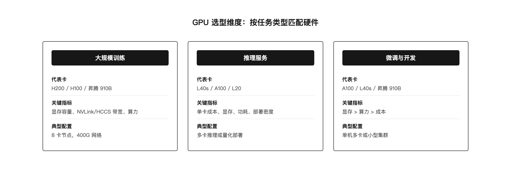
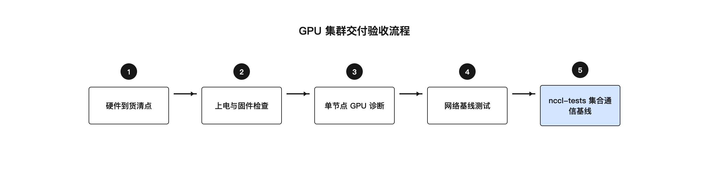

# 第 2 章 GPU 集群硬件选型与交付

## 引子：不是越贵越好

有了机房、电力和制冷，下一步就是买 GPU。但这一步远没有想象中简单。

很多人第一反应是：买最贵的。既然 H200 是本书成书前两年训练卡里的旗舰，那就全上 H200。这个思路在某些场景下成立，但在更多场景下会浪费钱，甚至影响业务。

训练和推理对 GPU 的需求完全不同。训练需要大显存、高互联带宽、长时间稳定满载。推理则更看重并发能力、能效比和成本。用训练卡跑推理，单卡成本过高。用推理卡跑训练，模型可能根本塞不下。

本章讨论两件事情。第一，在真实项目中怎么根据业务需求选对 GPU。第二，机器到场后怎么验收，避免把有问题的硬件放进生产集群。

## 2.1 训练卡与推理卡的区别

数据中心 GPU 大致可以分为两类：训练卡和推理卡。它们的差异不是简单的"强和弱"，而是设计目标不同。

### 训练卡的代表：H200 / H100 / A100

训练卡的核心任务是加速大模型训练。训练过程需要反复执行矩阵乘法、梯度计算和参数更新。它对以下指标极其敏感：

**显存容量**：大模型训练时，模型参数、优化器状态、梯度、激活值都要占用显存。以 Llama-2-70B 的 FP16 训练为例，单卡显存容量决定能不能放下模型，也决定能使用多大的 batch size。H200 的 HBM3e 显存为 141GB，H100 为 80GB，A100 为 40GB 或 80GB。显存不够时，必须启用模型并行，把模型切到多张卡上，通信开销随之增加。

**显存带宽**：训练时 GPU 需要频繁从显存读取权重和激活值。H200 的 HBM3e 带宽约为 4.8 TB/s，H100 约为 3.35 TB/s。显存带宽越高，数据喂给 Tensor Core 的速度越快，算力利用率越高。

**Tensor Core 算力**：现代大模型训练几乎完全依赖 Tensor Core 做矩阵乘加。H200 的 BF16 理论算力约为 1979 TFLOPS（含稀疏性），H100 约为 1979 TFLOPS（含稀疏性），A100 约为 624 TFLOPS（含稀疏性）。这个指标决定单位时间内能完成多少计算。

**卡间互联带宽**：分布式训练时，梯度同步依赖卡间通信。单节点内 8 卡通过 NVSwitch 实现全互联，H200 的 NVLink 4 单向带宽约 450 GB/s，双向约 900 GB/s。跨节点则依赖 IB/RoCEv2 网卡。互联带宽不足时，通信会成为训练瓶颈。

**功耗与散热**：H200 SXM 单卡 TDP 约 700W，8 卡节点整机功耗 10 千瓦至 12 千瓦。这直接决定了机房制冷和供电设计，也影响第 1 章讨论的液冷方案选择。

### 推理卡的代表：L40s / L4 / A10

推理卡的设计目标是：在尽量低的成本下，高效服务尽可能多的并发请求。

**显存容量**：推理通常只需要加载模型权重和 KV Cache。7B 模型 FP16 权重约 14GB，KV Cache 随并发数和序列长度增长。L40s 提供 48GB 显存，可以服务 7B 到 70B 级别的模型。

**能效比**：推理服务通常 7×24 小时运行，电费是主要运营成本。L40s 等推理卡在提供足够算力的同时，功耗显著低于训练卡。L40s 单卡功耗约 350W，约为 H200 的一半。

**并发能力**：推理任务通常由多个小请求组成，推理卡的架构更适合多流并发处理。

**互联要求**：推理通常不需要像训练那样高的卡间互联带宽。单卡或 2-4 卡张量并行即可满足大部分推理场景，因此 PCIe 连接通常够用。

### 训练卡与推理卡对比

| 维度 | 训练卡（H200/H100） | 推理卡（L40s/L4） |
|------|---------------------|-------------------|
| 显存容量 | 80GB 至 141GB | 24GB 至 48GB |
| 显存带宽 | 3.35 TB/s 至 4.8 TB/s | 约 864 GB/s |
| Tensor Core 算力 | ~1979 TFLOPS（含稀疏性） | ~183 TFLOPS |
| 卡间互联 | NVLink + NVSwitch | PCIe |
| 单卡功耗 | ~700W | ~72W 至 350W |
| 典型场景 | 大模型训练、大规模微调 | 在线推理、模型服务 |

这个对比说明了一个基本道理：选卡之前，先搞清楚这张卡要跑什么负载。

### 昇腾 910B 的位置

除了 NVIDIA，国产 GPU 也是智算中心建设的重要选项。昇腾 910B 是华为面向 AI 训练和推理的加速器，采用达芬奇架构，支持 CANN 软件栈和 MindSpore 框架。

昇腾 910B 通常与 NVIDIA 生态物理隔离部署，不跨集群训练。选型时需要考虑：

- 软件生态是否与现有训练框架兼容
- 模型是否已经过昇腾适配和性能验证
- 运维团队是否有昇腾硬件排障经验
- 供应链稳定性和后续扩容能力

从硬件架构看，昇腾 910B 与 NVIDIA GPU 有显著差异。NVIDIA 以 SM 为基本计算单元，每个 SM 包含 CUDA Core 和 Tensor Core。昇腾 910B 以 AI Core 为核心，采用达芬奇架构中的 Cube、Vector、Scalar 三类计算单元，矩阵计算由 Cube 单元负责。两者编程模型不同：NVIDIA 使用 CUDA，昇腾使用 CANN 异构计算架构。CUDA 程序不能直接运行在昇腾上，需要经过模型转换或重写。

从软件生态看，PyTorch、TensorFlow 等主流框架在 NVIDIA 上的支持最为成熟。昇腾通过 MindSpore、PyTorch 适配插件和 CANN 工具链提供支持，但部分算子、自定义 CUDA kernel、NCCL 集合通信代码需要迁移到 HCCL 上。迁移工作量取决于模型复杂度，涉及算子替换、通信原语调整、精度校准等环节。

从运维角度看，NVIDIA 的监控和排障工具链（nvidia-smi、DCGM、NSight）使用广泛，社区资料丰富；昇腾的 npu-smi、Ascend-dmi 等工具功能类似，但团队需要额外学习错误码、温度阈值、固件升级流程。两套生态的驱动、固件、容器镜像都不兼容，混合部署会带来极大的运维复杂度。

因此，在同一个智算中心内部，NVIDIA 与昇腾通常物理隔离、网络隔离、存储隔离。选型时不能只看算力峰值，还要看模型是否已完成适配、团队是否有维护能力、供应链是否能稳定续货。如果业务模型主要基于 PyTorch 和 CUDA 生态，贸然切换到昇腾可能导致训练代码重写和性能损失；如果业务有明确的国产替代要求，且模型已完成昇腾适配，则昇腾 910B 是可行选项。

实际部署中，昇腾 910B 与 NVIDIA 通常物理隔离、独立建设。同等模型在昇腾上的 MFU 通常比 NVIDIA 低 5 到 10 个百分点，故障定位耗时也更长。这意味着选型昇腾不只是硬件采购决策，还涉及模型适配、工具链建设和团队培养。

## 2.2 GPU 选型的五个维度

选型不是看单一指标，而是综合平衡。实际决策中通常考虑以下五个维度。


*图 2-1：按任务类型匹配 GPU*

### 算力：Tensor Core 决定训练速度

GPU 训练快，关键不在 CUDA Core 数量，而在 Tensor Core 的矩阵乘加能力。Tensor Core 一个时钟周期可以完成 16×16×16 的矩阵乘加，相当于 8192 个 FLOP。CUDA Core 做同样的事情需要更多周期。

因此，看 GPU 算力时，应该关注 Tensor Core 的 FP16/BF16/FP8 峰值算力，而不是 CUDA Core 的 FP32 算力。H200 的 BF16 峰值约 1979 TFLOPS（含稀疏性），这个数据比 CUDA Core 数量更能反映训练性能。

要理解这个差异，需要了解 GPU 的内部结构。GPU 的基本计算单元是 SM（Streaming Multiprocessor）。H200 有 132 个 SM，每个 SM 有 128 个 CUDA Core 和 4 个 Tensor Core。按此计算，H200 共有 16,896 个 CUDA Core 和 528 个 Tensor Core。

SM 执行的最小单位是 Warp，一个 Warp 包含 32 个线程。32 个线程同时执行同一条指令，只是处理的数据不同，这就是 SIMT（Single Instruction, Multiple Threads）模型。当 32 个线程走同一个分支时效率最高；如果走不同分支，GPU 必须串行执行两个分支，造成 warp divergence，浪费算力。

CUDA Core 适合标量运算，比如逐元素加法、乘法。Tensor Core 专门做矩阵乘加。以 16×16×16 的矩阵乘法为例，一个 Tensor Core 一个周期就能完成，而 CUDA Core 需要多次运算。训练任务中 90% 以上的算力来自 Tensor Core，因此 Tensor Core 数量、支持的精度格式、每周期吞吐，是衡量训练卡性能的核心指标。

### 显存容量：决定能跑多大的模型

显存是训练选型的硬约束。模型越大、batch size 越大、序列越长，需要的显存越多。如果显存不够，只能减小 batch size 或启用模型并行，两者都会降低训练效率。

以常见模型为例：

- 7B 模型 FP16 权重约 14GB
- 70B 模型 FP16 权重约 140GB
- 405B 模型 FP16 权重约 810GB

单卡 141GB 的 H200 可以放下 70B 模型权重，但训练时还需要 optimizer 状态、梯度、激活值，实际可用空间远小于 141GB。因此对于 70B 模型的全参数训练，通常仍需多卡并行。

### 显存带宽：决定算力能不能吃饱

显存带宽和算力之间存在一个基本关系：只有计算强度足够高，算力才不会被带宽拖慢。H200 的理论算力约为 1979 TFLOPS，显存带宽约为 4.8 TB/s，算力与带宽的比值约为 412 FLOPs/Byte。这意味着每读取 1 字节数据，需要执行约 412 次浮点运算，才能完全利用算力。

矩阵乘法等计算密集型操作容易达到这个强度，但内存访问密集型操作（如 Embedding 查找、LayerNorm）往往受限于带宽。这也是为什么 FlashAttention 等技术强调减少 HBM 访问次数。

GPU 的显存层次也决定了带宽瓶颈的位置。H200 片上 SRAM 每 SM 约 228KB，总计约 30MB，带宽可达约 19 TB/s；L2 Cache 约 50MB，带宽约 12 TB/s；HBM3e 容量 141GB，带宽约 4.8 TB/s。SRAM 比 HBM 快约 4 倍，但只有 30MB。FlashAttention 的核心思想就是把 Q、K、V 分块放进 SRAM 计算，不把完整的 scores 矩阵写回 HBM，从而减少 HBM 读写。

### 互联带宽：决定多卡能不能协同好

单卡再强，也放不下大模型。分布式训练需要多卡协同，卡间通信成为关键。

单节点内，H200 通过 4 颗 NVSwitch 3.0 实现 8 卡全互联，任意两卡之间经 NVLink 通信，单向带宽约 370 GB/s 至 450 GB/s。跨节点则通过 IB/RoCEv2 网卡，单端口 400Gbps，实际有效带宽约 50 GB/s。

NCCL 在启动时会自动扫描系统拓扑，识别 GPU 之间的物理路径。常见路径类型包括：PATH_NVB（经 NVSwitch 的 NVLink，约 370 GB/s）、PATH_PXB（经 PCIe Switch，约 64 GB/s）、PATH_PHB（跨 CPU PCIe，约 32 GB/s）、PATH_SYS（跨 NUMA，约 16 GB/s）。如果 NCCL 误走 PATH_SYS，带宽可能下降 20 倍以上。因此交付验收时要用 `nvidia-smi topo -m` 确认所有 GPU 间都是 NV18 连接。

互联带宽不足时，梯度同步会成为瓶颈。NCCL 通信时间占比过高，会导致 GPU 大量空闲等待，算力利用率下降。

### NUMA 与 PCIe 拓扑的影响

H200 8 卡节点通常配备 2 颗 CPU，形成 2 个 NUMA 节点。GPU 和网卡通过 PCIe Root Complex 连接到不同 NUMA 节点。如果 GPU 在 NUMA 0，而对应网卡在 NUMA 1，数据需要跨 QPI/UPI 总线传输，延迟增加 30% 到 50%。

`nvidia-smi topo -m` 输出的 PIX 表示同一 PCIe Switch 下，PXB 表示跨 PCIe Switch 但同 CPU，PHB 表示同 NUMA 节点，SYS 表示跨 NUMA。NCCL 做拓扑发现时会尽量让 GPU 使用同 NUMA 的网卡，避免 PATH_SYS。

交付验收时应确认：每张 GPU 到其主用网卡的路径不超过 PXB；所有 GPU 间为 NV18；网卡中断绑定到同 NUMA 的核心。如果 topology 不理想，应考虑调整网卡插槽或 BIOS 的 SR-IOV/IOMMU 设置。跨 NUMA 的 GPU-网卡配对是训练变慢的常见根因之一。

### 功耗与成本：决定能不能买得起、养得起

H200 SXM 单卡价格数万美元，整机 8 卡超过 25 万美元。加上网络、存储、机房、电力、运维，一个 256 卡 H200 集群的投资可能超过千万美元。

成本不只是采购成本。H200 单卡 700W，256 卡集群 IT 功耗约 2.8MW，按 PUE 1.2 计算总用电约 3.4MW，一年电费就是一笔可观支出。

因此，选型时必须考虑：

- 业务是否真的需要 H200 的显存和算力
- 是否有更便宜的替代方案（如 A100、L40s）
- 集群利用率能否覆盖成本
- 未来扩容路径是否清晰

## 2.3 GPU 共享与虚拟化

GPU 昂贵且稀缺，提高利用率是永恒主题。但 GPU 不像 CPU 那样容易分时共享，因为它的资源独占性强，多个任务共享同一块卡容易产生性能争用。

当前主流的 GPU 共享方案有三种：独占 GPU、Time Slicing、MIG。

### 独占 GPU

最简单的方案：一块物理 GPU 只给一个任务用。这是训练任务的默认选择，因为训练需要长时间占用 GPU，对性能敏感，不能容忍资源共享带来的不确定性。

优点：无资源争用，性能可预测，部署简单。

缺点：利用率可能不高。如果任务较小，一块卡只跑一个进程，其余算力就浪费了。

### Time Slicing

Time Slicing 是软件级共享方案。多个容器或进程按时间片轮流使用同一块 GPU，底层依赖 NVIDIA MPS（Multi-Process Service）实现 CUDA 进程的并发执行。

从容器视角看，每个容器都觉得自己独占一块 GPU；从物理层面看，多个容器分时复用同一块卡的计算资源。

优点：配置灵活，可以提高 GPU 利用率，适合小任务和开发测试环境。

缺点：隔离性弱。多个任务共享显存和计算单元，容易产生资源争用；一个任务占用显存过多，可能导致其他任务 OOM。不适合对延迟敏感的生产推理。

### MIG

MIG（Multi-Instance GPU）是 NVIDIA Ampere 架构引入的硬件级分区技术。它把一块物理 GPU 划分为多个隔离的实例，每个实例拥有独立的计算单元、显存和带宽。

以 A100 40GB 为例，最多可划分为 7 个 1g.5gb 实例，每个实例 1 个计算单元、5GB 显存。也可以划分为 2g.20gb、3g.40gb 等更大规格的实例。H100 的 MIG 技术进一步增强，支持更灵活的分区配置。

优点：硬件级隔离，性能可预测，适合多租户推理服务。

缺点：分区粒度固定，灵活性差；启用 MIG 后无法同时使用 Time Slicing；分区方案在驱动重启前不能修改。

### 三种方案对比

| 特性 | 独占 GPU | Time Slicing | MIG |
|------|----------|--------------|-----|
| 隔离级别 | 完全隔离 | 软件级隔离 | 硬件级隔离 |
| 性能保证 | 100% | 共享争用 | 资源独占 |
| 显存 | 完整显存 | 共享显存 | 分配显存 |
| 灵活性 | 低 | 高 | 中 |
| 适用场景 | 训练/大规模推理 | 开发测试/小任务 | 多租户推理服务 |

实际运营中，很多集群采用混合策略：训练任务用独占 GPU，推理服务根据需求选择独占或 MIG，开发测试环境用 Time Slicing 提高利用率。

## 2.4 硬件交付与验收

GPU 机器到货后，不能简单插电就用。交付验收是避免把问题硬件引入生产环境的关键环节。

### 到货清点

首先要核对硬件清单：

- GPU 型号、数量是否与采购一致
- 序列号（SN）是否齐全，便于后续质保和资产管理
- 外观检查：散热器、挡板、金手指是否有损伤
- 配件检查：电源线、网络线、RAID 卡、SSD 等是否到位

建议用表格记录每台机器的 GPU SN、网卡 SN、主板 SN、到货日期、机柜位置。后续保修、固件升级、故障定位都依赖这些信息。

### 上电检查

上电后，用系统命令检查 GPU 是否被正确识别：

```bash
nvidia-smi
```

输出应显示所有 GPU 的卡号、型号、显存、温度、功耗等信息。如果少卡或显示异常，需要检查：

- GPU 是否插紧
- PCIe 插槽是否工作正常
- 电源线是否接好
- 驱动是否安装正确

同时检查 PCIe 链路速度：

```bash
nvidia-smi topo -m
```

这个命令显示 GPU 之间的拓扑关系，包括 NVLink、PCIe、NUMA 等信息。训练节点应能看到所有 GPU 通过 NVSwitch 互联，GPU 之间显示 NV18，表示 18 条 NVLink 连接。

如果 GPU 和网卡之间显示 SYS，表示跨 NUMA 节点。NCCL 会尽量避免这种拓扑，但交付时应记录，必要时调整网卡插槽或 BIOS 配置。

### 基线测试

上电检查通过后，需要跑压力测试建立性能基线：


*图 2-2：GPU 集群交付验收流程*

基线测试的核心目的不是跑一遍就完，而是记录每台机器在健康状态下的性能数据。后续运行中如果通信带宽下降、延迟升高，可以和基线对比，快速定位慢节点。

建议执行以下测试：

**1. NCCL AllReduce 带宽测试**

```bash
mpirun -np 8 ./all_reduce_perf -b 8M -e 1G -f 2 -g 1
```

参数说明：
- `-np 8`：启动 8 个进程，对应 8 张 GPU
- `-b 8M`：最小数据量 8MB
- `-e 1G`：最大数据量 1GB
- `-f 2`：每次数据量翻倍
- `-g 1`：每个进程使用 1 张 GPU

测试结果应关注 bus bandwidth 和 algo bandwidth。H200 8 卡节点机内 NVLink AllReduce 带宽应接近理论值的 80% 以上。如果某台机器明显低于同批次其他机器，需要排查 PCIe、NVLink、NUMA 亲和性等问题。

**2. CUDA bandwidthTest**

```bash
./bandwidthTest --device=all --mode=shmoo
```

这个测试检查 GPU 显存到显存的拷贝带宽，验证 HBM 带宽是否正常。H200 的 device-to-device 带宽应接近 4.8 TB/s 量级。

**3. 长时间压力测试**

```bash
gpu-burn 3600
```

gpu-burn 让 GPU 持续满载运行，通常跑 1 小时以上，观察是否出现温度异常、XID 错误、掉卡等问题。新机器在高温满载下最容易暴露硬件隐患。

**4. 记录基线数据**

建议把以下数据录入资产管理系统或 CMDB：

- NCCL AllReduce 8MB/256MB/1GB 各档位的 bus bandwidth
- bandwidthTest 的 device-to-device 带宽
- gpu-burn 1 小时后的最高温度和最终状态
- `nvidia-smi topo -m` 输出
- 驱动版本、CUDA 版本、固件版本

### 基线测试结果的解读与慢节点定位

跑完基线测试后，不能只看平均带宽，要对比同批次所有机器。建议把数据整理成表格，按 bus bandwidth 排序。如果某台机器在 256MB 档位比均值低 10% 以上，就需要定位原因。

常见慢节点根因包括：PCIe 链路降级（从 Gen5 x16 降到 x8）、NVLink 链路异常、网卡跨 NUMA、CPU 频率被限制、散热不良导致降频。排查时可依次检查：

- `nvidia-smi --query-gpu=pcie.link.gen.current,pcie.link.width.current --format=csv` 确认 PCIe 速率
- `nvidia-smi nvlink -s` 确认 NVLink 状态
- `cat /sys/class/net/eth0/device/numa_node` 确认网卡 NUMA 节点
- `dmesg -T | grep -i xid` 检查是否有 XID 错误
- `nvidia-smi dmon -s t` 观察满载温度是否触发 thermal throttle

建立基线后，建议每月复测一次。生产环境出现训练变慢时，先用当前数据与基线对比，区分是网络问题、GPU 问题还是训练参数变化。慢节点往往不会直接报错，但会拖慢整个分布式训练任务，因为 AllReduce 需要等待最慢的参与者。

### XID 错误码排查

NVIDIA GPU 通过 XID 错误码上报硬件异常。XID 是驱动层对 GPU 错误的统一编号，每个编号对应一类特定问题，常见的是显存 ECC 错误、PCIe 掉线、引擎异常等。

典型的 XID 日志格式如下：

```
NVRM: Xid (PCI:0000:3b:00 GPU-I:00 GPU-CI:00): 63, pid=12345, name=python, Retiring page...
```

常见 XID 错误码含义：

| XID | 含义 | 严重性 | 建议操作 |
|-----|------|--------|----------|
| 13 | 图形引擎异常 | 通道级 | 观察是否复现 |
| 31 | FIFO MMU 页错误 | 通道级 | 检查驱动和显存 |
| 43 | 通道验证错误 | 通道级 | 通常伴随其他错误 |
| 48 | ECC 双比特错误 | 严重 | 检查 ECC 统计，关注显存健康 |
| 58 | 显存错误 | 严重 | 立即隔离并更换 |
| 61/62 | PMU 断点或停机 | 严重 | 检查供电和温度 |
| 63 | 物理页下线成功 | 信息性 | 监控 retired 页数趋势 |
| 64 | 物理页下线失败 | 严重 | 坏页未被隔离，需关注 |
| 74 | NVLink 错误 | 视情况 | 检查 NVLink 链路和连接器 |
| 79 | GPU 掉线 | 致命 | 检查 PCIe 插槽、供电、Riser |
| 90 | L2 缓存错误 | 严重 | 检查温度和供电 |
| 94 | 已隔离错误 | 通道级 | 通常可继续运行 |
| 95 | 未隔离错误 | 致命 | 需要 GPU 重置 |
| 98 | NVDEC7 视频解码引擎错误 | 通道级 | 纯计算场景出现说明硬件故障 |
| 109 | GPU 掉线（固件层检测） | 致命 | 大概率换卡 |
| 119 | GSP RPC 超时 | 致命 | 检查固件和驱动 |
| 120 | GSP 固件错误 | 致命 | 检查固件版本 |
| 140 | 不可恢复 ECC 错误 | 致命 | 换卡 |
| 168 | 显存容量减少 | 警告 | 因 retired 页累积导致 |

XID 63 表示显存发生了不可纠正的 ECC 双比特错误，GPU 正在将该物理页永久下线。XID 63 本身是信息性事件，GPU 可以继续运行，但频繁出现说明显存健康度在恶化。当累积 retired 页数超过阈值时，会触发 XID 168，表示可用显存容量减少。

XID 79 和 XID 109 都表示 GPU 掉线。XID 79 在开源驱动中有定义，由 Kernel-RM 检测到 GPU 掉线后上报；XID 109 在开源代码中没有定义，由 GSP-RM 固件直接通过 OOB 通道上报。两者都意味着 GPU 已不可恢复，通常需要检查 PCIe 插槽、供电、Riser 卡，最终大概率换卡。

验收期间建议打开 `NCCL_DEBUG=INFO` 跑几次多卡通信测试，同时监控 dmesg 中的 XID 日志。新机器不应该出现任何 XID 错误。如果出现 XID 48、XID 58、XID 74、XID 79、XID 95、XID 109、XID 119、XID 120、XID 140 等错误，应直接退换或隔离。

### DCGM 与持续监控

验收只是起点，生产环境需要持续监控 GPU 健康状态。NVIDIA DCGM（Data Center GPU Manager）是常用的监控工具，通过 DCGM Exporter 可以把指标暴露给 Prometheus。

与 XID 相关的 DCGM 字段包括：

| DCGM 字段 | 说明 | 关联 XID |
|-----------|------|----------|
| DCGM_FI_DEV_XID_ERRORS | 最后一个 XID 错误号 | 所有 XID |
| DCGM_FI_DEV_ECC_DBE_VOL_TOTAL | 双比特 ECC 错误总数 | XID 48 / 63 |
| DCGM_FI_DEV_RETIRED_DBE | 因 DBE 下线的页数 | XID 63 的结果 |
| DCGM_FI_DEV_RETIRED_PENDING | 待下线页数 | XID 63 进行中 |
| DCGM_FI_DEV_PCIE_REPLAY_COUNTER | PCIe 重传计数 | XID 109 相关 |

建议配置告警规则：XID 错误号大于 0 且小于 48 时提示信息；出现 48、58、74、79、95、109、119、120、140 时触发严重告警；retired DBE 页数持续增长时触发警告。持续监控能在硬件彻底损坏前发现异常，减少训练任务中断。

除 XID 外，DCGM 还采集 GPU 利用率、显存占用、温度、功耗、PCIe 重传、时钟频率等字段。建议把 DCGM 指标接入 Grafana，建立按节点、按 GPU 的监控面板，便于快速定位异常卡。

### 固件与驱动版本管理

GPU 集群的稳定性不仅取决于硬件本身，还取决于驱动、固件、CUDA 工具链的版本一致性。建议统一以下版本：

- GPU 驱动：所有节点使用同一版本，避免不同驱动版本导致的拓扑识别差异
- VBIOS / GSP 固件：统一升级，修复已知硬件错误
- CUDA Toolkit：与驱动版本匹配，与训练框架编译版本匹配
- NCCL：统一版本，避免不同版本拓扑算法差异
- Mellanox OFED / rdma-core：网卡驱动和 RDMA 用户态库

版本变更应走变更审批流程，先在测试节点验证，再分批灰度。变更前记录当前版本和基线性能，变更后复测 NCCL 带宽和 XID 日志，确认无异常再推广。

BMC 也需要纳入管理。BMC 固件版本不一致可能导致 IPMI 监控数据格式不同、风扇调速策略不同、温度阈值不同。建议把所有节点的 BMC 升级到统一版本，并配置统一告警阈值。

BIOS 设置同样影响 GPU 性能。建议统一以下设置：

- 启用 Above 4G Decoding，确保 GPU 大显存可正确映射
- 设置 SR-IOV 状态与网卡需求一致
- 关闭 C-state 深度休眠，降低 CPU 唤醒延迟
- 设置 PCIe 链路速率为 Auto 或 Gen5
- 启用 IOMMU 或按需关闭，取决于 GDR 和虚拟化方案

交付验收时应记录每台机器的 BIOS 版本、设置摘要、BMC 版本、驱动版本，作为后续变更和排障的基准。

### 交付验收 Checklist

建议把验收流程做成 checklist，每台机器逐项确认：

| 检查项 | 命令/方法 | 通过标准 |
|--------|----------|----------|
| GPU 数量 | nvidia-smi -L | 显示全部 GPU |
| GPU 型号 | nvidia-smi | 与采购一致 |
| 驱动版本 | nvidia-smi | 符合集群标准 |
| 显存容量 | nvidia-smi -q -d MEMORY | 与规格一致 |
| PCIe 链路 | nvidia-smi --query-gpu=pcie.link.gen.current,pcie.link.width.current --format=csv | Gen5 x16 |
| 机内拓扑 | nvidia-smi topo -m | GPU 间为 NV18 |
| NVLink 状态 | nvidia-smi nvlink -s | 18 条 NVLink 正常 |
| NCCL 带宽 | mpirun -np 8 ./all_reduce_perf -b 8M -e 1G -f 2 -g 1 | 达到同批次基线 |
| HBM 带宽 | ./bandwidthTest | 接近规格值 |
| 压力测试 | gpu-burn 3600 | 无报错、温度正常 |
| XID 监控 | `dmesg -T | grep -i xid` | 验收期间无 XID |
| ECC 状态 | nvidia-smi -q -d ECC | 无新增 DBE |
| 温度 | nvidia-smi dmon -s t | 满载温度在阈值内 |
| 功耗 | nvidia-smi dmon -s p | 满载功耗接近 TDP |
| SN 记录 | 手动核对 | 全部录入资产系统 |

建议把 checklist 纳入交付流程，验收报告由工程师签字后归档。未经完整验收的机器不应加入生产集群。

## 2.5 这一环在整个链路中的位置

GPU 选型与交付连接着上下两层。

向上，它受 IDC 能力的约束。机房的电力容量决定了能放多少张卡，制冷能力决定了能跑多高功耗的机型。如果机房只能支持风冷，那就不能按液冷机柜的密度部署 H200。

向下，它影响网络和训练框架的设计。NVLink 和 NVSwitch 的拓扑决定了 NCCL 通信路径；GPU 的显存容量决定了模型并行的策略；卡间互联带宽决定了分布式训练的效率。

选型错误往往是最贵的错误。因为 GPU 单价高、数量多，一旦采购失误，退换和重新部署的成本都很高。所以在下单前，必须明确业务需求、计算性能边界、成本预算和扩展计划。

选好了机器，下一章就要解决另一个关键问题：怎么把这些机器用网络连起来，让它们在分布式训练中高效通信。

## 小结

GPU 选型没有最好只有最合适。训练卡重显存、互联带宽和 Tensor Core 算力，推理卡重并发、能效比和成本。交付验收不是看型号对就够了，必须验证 PCIe 速率、NVLink 拓扑、NCCL 带宽、压力测试和 XID 日志，建立每台机器的基线。选型错误是最贵的错误，因为 GPU 单价高、数量多、退换难。

## 本章事实核对清单

### 参考资料

- `docs/10-大模型Infra工程师/第03节-GPU架构与CUDA基础/第03节-GPU架构与CUDA基础.md`
- `docs/10-大模型Infra工程师/第04节-机内物理路径/第04节-机内物理路径.md`
- `Ai领域sre细分知识/GPU虚拟化.md`
- `Ai领域sre细分知识/GPU调度与资源管理.md`
- `NVIDIA-XID错误码深度解析与排障指南.md`

### 关键数字来源

- H200 HBM3e 141GB、带宽 4.8 TB/s：来自第 03 节课程文档
- H200 BF16 算力约 1979 TFLOPS：来自第 03 节课程文档
- H200 132 个 SM、每 SM 128 CUDA Core、4 个 Tensor Core：来自第 03 节课程文档
- H200 NVLink 4 单向 450 GB/s、双向 900 GB/s：来自第 03 节课程文档
- H200 8 卡节点 4 颗 NVSwitch 3.0 全互联：来自第 04 节课程文档
- PCIe 5.0 x16 双向约 64 GB/s：来自第 04 节课程文档
- A100 MIG 最多 7 个实例：来自 GPU 虚拟化文档
- H200 SXM TDP 约 700W：来自第 1 章素材
- L40s 功耗约 350W、显存 48GB：来自公开产品规格
- XID 63/64/74/79/95/98/109/119/120/140/168 含义：来自 NVIDIA-XID 排障指南
- NCCL PATH_NVB/PATH_PXB/PATH_PHB/PATH_SYS 带宽：来自第 04 节课程文档
- H200 SRAM 每 SM 228KB、总计约 30MB：来自第 03 节课程文档
