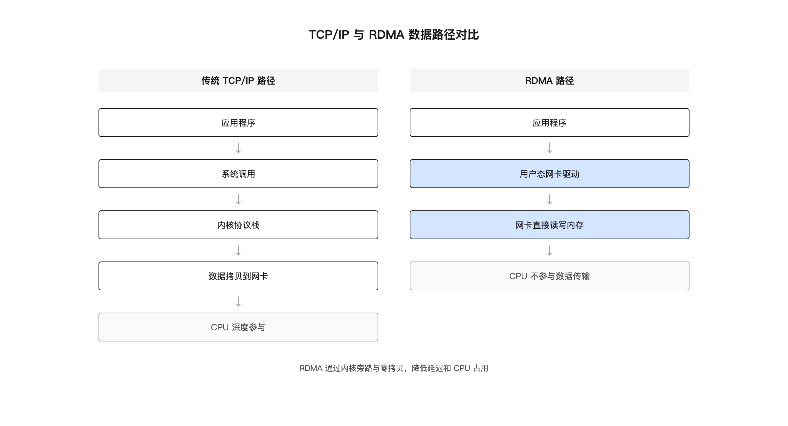
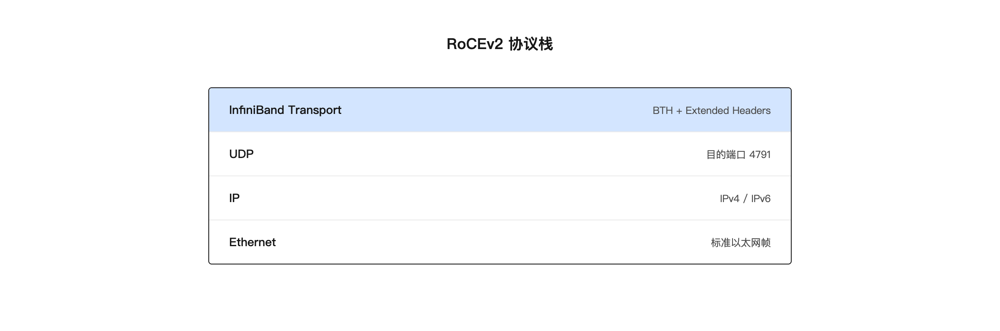

<!-- bilingual-navigation:start -->
[中文原文](%E7%AC%AC03%E7%AB%A0-%E6%99%BA%E7%AE%97%E7%BD%91%E7%BB%9C%E4%B8%8ERDMA-RoCEv2.md) | [English](../en/part-1-infrastructure/ch03-networking-rdma-rocev2.md) | [目录](../README.md) | [上一页](%E7%AC%AC02%E7%AB%A0-GPU%E9%9B%86%E7%BE%A4%E7%A1%AC%E4%BB%B6%E9%80%89%E5%9E%8B%E4%B8%8E%E4%BA%A4%E4%BB%98.md) | [下一页](../%E7%AC%AC%E4%BA%8C%E8%BE%91%EF%BC%9A%E6%90%AD%E5%B9%B3%E5%8F%B0/%E7%AC%AC%E4%BA%8C%E8%BE%91%E5%89%8D%E8%A8%80.md)

本版仅为中文正文添加双语导航；英文译本及维护说明见 [TRANSLATIONS.md](../TRANSLATIONS.md)。
<!-- bilingual-navigation:end -->

# 第 3 章 智算网络与 RDMA/RoCEv2

## 引子：网络不是水管

很多人把数据中心网络想象成水管：带宽越大，流量越大，性能越好。这个比喻在通用云计算里大致成立，但在智算中心里会误导人。

智算中心的网络不是简单地把数据从 A 点搬到 B 点。它要让数千张 GPU 在训练过程中高效协同。智算网络要求低延迟、高带宽、低 CPU 占用，还要在拥塞时快速恢复。普通 TCP/IP 网络的设计目标不是这些。

本章讨论智算网络的特殊性，以及为什么 RDMA、InfiniBand、RoCEv2 会成为大规模 AI 训练的标准选择。

## 3.1 普通以太网为什么不够

要理解智算网络的特殊需求，先看看传统 TCP/IP 网络处理一个数据包的流程。

### TCP/IP 数据包接收路径

数据包从网线进入网卡。网卡通过 DMA 把数据写入内存，然后触发硬中断通知 CPU。CPU 进入中断上下文，做最少量的处理后触发软中断。软中断再调用内核协议栈，逐层解析 Ethernet、IP、TCP 头部。最后把数据拷贝到用户态的应用程序缓冲区。

具体步骤如下：

**第一阶段：物理接收与 DMA**。网卡从网线接收电信号或光信号，PHY 芯片完成模数转换，MAC 控制器进行帧定界和 FCS 校验。校验通过后，网卡 DMA 引擎通过 PCIe 总线把数据帧写入 Ring Buffer。这个过程中 CPU 不参与数据搬运。

**第二阶段：硬中断**。DMA 完成后，网卡触发 MSI-X 中断。CPU 暂停当前任务，进入网卡驱动的中断处理函数。硬中断只做最少工作：确认中断、屏蔽中断线、调度软中断，然后立即返回。整个硬中断处理时间通常在微秒级。

**第三阶段：软中断与 NAPI**。软中断执行 `net_rx_action`，调用驱动的 poll 函数轮询 Ring Buffer，把数据包构建成 sk_buff，经过 GRO 合并后上送协议栈。NAPI 模式关闭中断以轮询方式批量处理，避免高速网络下的中断风暴。

**第四阶段：内核协议栈处理**。sk_buff 经过数据链路层、网络层、传输层。链路层根据协议类型分发；网络层做 IP 校验、路由查找、Netfilter 钩子处理；传输层做 TCP 校验和、状态机处理、四元组查找。

**第五阶段：Socket 层与应用程序读取**。数据放入 socket 接收队列，唤醒等待的进程。应用程序调用 `recv()` 时，内核把数据从 sk_buff 拷贝到用户空间缓冲区。

### TCP/IP 的开销

这个流程有几个开销：

**中断开销**：每收到一个包都要触发中断。在高速网络下，每秒可能收到数百万个包，CPU 大量时间花在中断处理上。

**上下文切换**：数据从内核态拷贝到用户态，涉及上下文切换和内存拷贝。传统 TCP 收发一次数据需要 4 次上下文切换和多次内存拷贝。

**协议栈处理**：TCP/IP 协议栈功能丰富，支持重传、拥塞控制、流量控制，但这些功能也带来了延迟。

**CPU 参与**：整个过程中 CPU 深度参与，而 CPU 的处理能力成为瓶颈。

对于 Web 服务、数据库查询这类业务，TCP/IP 网络完全够用。因为单次请求的数据量不大，延迟在毫秒级也可以接受。但分布式训练不同：GPU 之间要频繁同步梯度，每次同步的数据量很大，延迟要求微秒级，CPU 最好不要参与。

以 8 卡 AllReduce、每步梯度数据量约 256MB 的教学示例为例（素材中假设 8 卡两两互传约 256MB×7=1.8GB）。如果走 PCIe，PCIe 5.0 双向带宽约 64GB/s，需要约 28ms。而走 NVLink 370GB/s 只需约 4.9ms。训练每秒跑 10 步时，PCIe 会浪费 280ms/秒在通信上，NVLink 只浪费 49ms。这个差距直接决定训练效率。

### NUMA 与多队列的影响

在 2 路 CPU 服务器上，网卡和 CPU 存在 NUMA 亲和性问题。如果网卡插在 CPU 0 的 PCIe 槽，但中断被路由到 CPU 1 的核心处理，CPU 1 需要跨 UPI/QPI 总线读取 CPU 0 本地内存中的 sk_buff，延迟增加 30% 到 50%。

现代网卡支持多队列（RSS），每个队列有独立中断。通过 `ethtool -L eth0 combined 32` 可以配置队列数，再通过 `/proc/irq/<IRQ>/smp_affinity_list` 把中断绑定到同 NUMA 的核心。应用程序也应通过 `numactl --cpunodebind=0 --membind=0` 绑定到网卡所在 NUMA 节点。

TCP/IP 下这些优化能把单核处理能力提升到 2-5 Mpps，但仍然无法与 RDMA 的微秒级延迟相比。智算网络选择 RDMA 的根本原因是 bypass 整个内核协议栈。

### TCP/IP 数据拷贝次数与零拷贝局限

传统 TCP 路径下，一个数据包从网卡到应用至少经历一次 CPU 拷贝：从 sk_buff 到用户空间缓冲区。发送路径则包括：用户空间到 socket buffer、socket buffer 到 TCP 层、TCP 层到 IP 层、IP 层到驱动 Ring Buffer，最终 DMA 到网卡。

Linux 提供了一些零拷贝技术，如 sendfile、splice、mmap + PACKET_MMAP、io_uring。但这些技术要么只适用于特定场景，要么仍然无法绕过内核协议栈的核心处理。对于通用的分布式训练 AllReduce，TCP/IP 无法满足微秒级延迟要求。

RDMA 的零拷贝是彻底的：数据路径上只有一次 NIC 直接读写应用内存，没有内核 socket buffer 参与，也没有 CPU 拷贝。这正是 RDMA 延迟能做到 1-5 微秒、而 TCP 延迟在 10-50 微秒量级的根本原因。

## 3.2 RDMA 是什么

RDMA（Remote Direct Memory Access，远程直接内存访问）是一种允许一台机器直接访问另一台机器内存的技术，无需目标机器的 CPU 参与。


*图 3-1：TCP/IP 与 RDMA 数据路径对比*

想象两台服务器 A 和 B。A 上的应用程序想读取 B 上某块内存的数据。在传统 TCP/IP 方式下，B 的 CPU 要先从网卡接收数据包，经过协议栈处理，再把数据从内核拷贝到用户态，最后交给应用程序。RDMA 方式下，B 的网卡直接把数据写入 B 的应用程序内存，B 的 CPU 整个过程都不参与。

RDMA 的核心优势：

**内核旁路（Kernel Bypass）**：数据直接在网卡和应用内存之间传输，不经过内核协议栈。

**零拷贝（Zero-Copy）**：数据不需要在操作系统缓冲区之间多次拷贝。

**低延迟**：通信延迟从 TCP/IP 的几十微秒降到 RDMA 的几微秒。

**低 CPU 占用**：CPU 不参与数据传输，可以把算力留给训练框架。

这些特性正好匹配分布式训练的需求。

RDMA 要求应用程序先把内存注册给网卡。注册过程会锁定物理页，建立虚拟地址到物理地址的映射，并生成本地 key 和远端 key。网卡只能读写已注册的内存区域，安全性由 rkey 验证保证。

NCCL 主要使用 RDMA Write 操作。发送端把梯度放入已注册的 GPU 显存，构造 Work Request 提交给网卡，网卡直接从本地 GPU 显存读取数据并通过网络发出。接收端网卡收到数据后，根据 remote_addr 和 rkey 直接写入远端 GPU 显存。整个过程中接收端 CPU 不参与，这正是 NCCL 选择 RDMA Write 的原因。

### RDMA verbs API 与内存注册

RDMA 的编程接口称为 verbs，全部在用户态执行。关键 API 包括：

- `ibv_open_device()`：打开 RDMA 设备
- `ibv_query_device()`：查询端口速率、GDR 支持等设备属性
- `ibv_alloc_pd()`：分配 Protection Domain，作为内存和 QP 的隔离域
- `ibv_create_cq()`：创建完成队列 CQ
- `ibv_create_qp()`：创建 Queue Pair，包含发送队列 SQ 和接收队列 RQ
- `ibv_reg_mr()`：注册内存区域 MR
- `ibv_post_send()` / `ibv_post_recv()`：提交发送或接收请求
- `ibv_poll_cq()`：轮询完成队列

内存注册是 RDMA 的基础。`ibv_reg_mr()` 会锁定物理页（pin），建立虚拟地址到物理地址的映射，并生成 lkey 和 rkey。pin 的目的是防止操作系统把物理页 swap 出去，否则网卡按物理地址读写时会访问错误数据。

GPU 显存也能通过 GDR 注册给网卡。NCCL 在初始化时调用 `ibv_reg_mr()` 注册 GPU 显存，后续 AllReduce 直接通过 RDMA Write 在 GPU 显存之间传输梯度，不需要 CPU 内存中转。初始化阶段 verbs API 会进入内核，但数据收发阶段完全在用户态。

### RDMA 连接建立与 QP 状态机

RDMA 通信基于 Queue Pair（QP）。一个 QP 包含发送队列 SQ 和接收队列 RQ。通信前需要完成以下步骤：

1. 双方通过带外方式（如 TCP socket）交换 IP、GID、QPN、PSN、rkey、虚拟地址等连接信息
2. 创建 QP 并修改其状态：RESET → INIT → RTR（Ready to Receive）→ RTS（Ready to Send）
3. 注册内存区域 MR，交换 rkey 和地址
4. 发送端提交 Work Request 到 SQ，接收端对于 Send/Recv 操作需要提前提交 Recv Request 到 RQ
5. 通过 Completion Queue 轮询操作完成状态

RoCEv2 使用 IP+UDP 封装，因此连接建立阶段需要可靠的带外通道。NCCL 在初始化时通过 socket 建立连接并交换上述信息，之后所有数据路径都走 RDMA。连接建立失败常见原因包括：GID 不匹配、VLAN 配置错误、PFC 未开启导致初始化阶段丢包、防火墙阻断 UDP 4791。

## 3.3 InfiniBand、RoCEv2 与 iWARP

实现 RDMA 有三条主要技术路线：InfiniBand、RoCEv2 和 iWARP。

### InfiniBand

InfiniBand 是一种专为高性能计算设计的网络技术，从物理层到传输层都是独立的协议栈。它不是以太网，需要专用的 IB 网卡、IB 交换机和 IB 线缆。

优点：
- 性能高，延迟低
- 原生支持 RDMA
- 无损网络，拥塞控制成熟
- 在大规模 HPC 和早期 AI 集群中应用广泛

缺点：
- 成本高，设备贵
- 需要独立网络设备，不能复用以太网基础设施
- 运维人员需要专门技能
- 供应商相对集中

InfiniBand 的交换机被称为"傻瓜交换机"，只查 LFT（Linear Forwarding Table）做转发。路由由子网管理器（Subnet Manager）预先计算。IB 使用 LID（16-bit Local Identifier）寻址，不需要 ARP。链路层采用 Credit 机制实现天然零丢包，不需要 PFC 或 ECN。

### RoCEv2

RoCEv2（RDMA over Converged Ethernet v2）是把 InfiniBand 的传输层协议运行在标准以太网和 IP 网络上。它允许 RDMA 技术复用现有的以太网基础设施。


*图 3-2：RoCEv2 协议栈*

RoCEv2 的协议栈：

| 层级 | 内容 |
|------|------|
| L2 | Ethernet Header |
| L3 | IP Header |
| L4 | UDP Header，目的端口 4791 |
| Transport | InfiniBand Transport Header（BTH 等） |

优点：
- 可以复用以太网交换机和网线
- 成本低于 InfiniBand
- 部署相对简单
- 支持路由，跨子网通信更灵活

缺点：
- 依赖无损以太网，需要 PFC/ECN 等配置
- 对交换机和网络调优要求较高
- 性能和稳定性略低于 IB

RoCEv2 使用标准 IP+MAC 寻址，需要 ARP 解析。交换机自主做路由决策和 ECMP 多路径转发。verbs API 与 IB 完全相同，NCCL 的 net_ib.cc 可以一套代码同时支持 IB 和 RoCEv2。

### iWARP

iWARP（Internet Wide Area RDMA Protocol）是另一条在 TCP/IP 网络上实现 RDMA 的路线。与 RoCEv2 不同，iWARP 把 RDMA 操作封装在 TCP 之上，而不是 UDP。

优点：
- 基于 TCP，可以复用现有的 TCP/IP 网络基础设施
- 路由和拥塞控制由 TCP 处理，不需要 PFC/ECN
- 在广域网或路由复杂的场景更容易部署

缺点：
- 延迟高于 RoCEv2 和 IB，因为 TCP 协议栈仍然参与
- 需要支持 iWARP 的专用网卡
- 在 AI 训练集群中应用较少

在智算中心场景下，iWARP 不是主流选择。大多数训练集群在 InfiniBand 和 RoCEv2 之间做选择。

### 三种 RDMA 实现对比

| 维度 | InfiniBand | RoCEv2 | iWARP |
|------|------------|--------|-------|
| 底层网络 | 独立 IB 网络 | 以太网 + IP | 以太网 + IP |
| 传输层封装 | IB 原生 | IB over UDP | RDMA over TCP |
| 网卡 | IB HCA | RNIC | iWARP NIC |
| 交换机 | IB 交换机 | 以太网交换机 | 以太网交换机 |
| 寻址 | LID | IP + MAC | IP + MAC |
| 路由 | SM 预计算 LFT | IP 路由 + ECMP | TCP/IP 路由 |
| 无损机制 | Credit 机制 | PFC + ECN + DCQCN | TCP 重传 |
| 延迟 | 最低 | 接近 IB | 较高 |
| 成本 | 高 | 中 | 中 |
| 运维复杂度 | 中（需学 IB） | 高（PFC/ECN 调优） | 中 |
| AI 训练应用 | 广泛 | 越来越主流 | 较少 |

### 怎么选

选型通常取决于几个因素：

**规模**：小规模集群或对成本敏感的场景，RoCEv2 更划算。超大规模集群或对性能有极致要求，IB 仍有优势。

**成本**：IB 的网卡、交换机、线缆成本都高于 RoCEv2。如果预算有限，RoCEv2 是更务实的选择。

**团队能力**：IB 需要专门的运维技能；RoCEv2 可以复用现有以太网运维经验，但无损网络配置也需要学习。

**供应**：IB 设备供应商相对集中，交付周期可能较长；RoCEv2 设备选择更多。

当前行业趋势是：RoCEv2 在 AI 训练集群中的占比越来越高，特别是 400G 以太网成熟后，RoCEv2 的性能已经能满足大多数场景。

## 3.4 RoCEv2 的关键机制

RoCEv2 能工作，依赖几个关键机制。理解它们对网络排障很有帮助。

### PFC：优先级流控

PFC（Priority Flow Control，优先级流控）是以太网的一种流控机制。当交换机端口缓冲区接近满载时，它会向发送端发送暂停帧，让发送端暂停发送特定优先级的流量。

传统以太网 PAUSE 帧会暂停所有流量，粒度太粗。PFC 按 802.1Q VLAN 的 PCP（Priority Code Point）字段把流量分为 8 个优先级，可以单独暂停某一优先级的流量。智算网络通常把 RoCE 流量映射到一个特定优先级（如 priority 3），只暂停 RoCE 流量，不影响管理流量。

PFC 配置要点：

- 在交换机和网卡两端同时开启同一优先级的 PFC
- 选择 RoCE 专用优先级，避免与普通 TCP 流量混在一起
- 配置 PFC watchdog，检测并解除 PFC 死锁
- 交换机缓冲区和阈值需要根据端口速率、流量模型调整

PFC 保证了高优先级流量不会因为缓冲区溢出而丢包，从而实现"无损以太网"。但 PFC 也有风险：如果配置不当，可能引发全局暂停风暴，导致整个网络吞吐量下降。

### ECN：显式拥塞通知

ECN（Explicit Congestion Notification，显式拥塞通知）让网络设备在发生拥塞时，通过 IP 头部标记通知发送端降速，而不是直接丢包。

ECN 字段在 IP 头部的 ToS 字段低 2 位：

- 00：非 ECN 感知
- 01 或 10：ECN capable
- 11：拥塞发生

交换机配置两个阈值：

- t_ECN：队列深度超过此阈值时，开始标记 ECN CE
- t_PFC：队列深度超过此阈值时，触发 PFC 暂停

通常 t_ECN 小于 t_PFC。理想情况下，ECN 先起作用，让发送端降速，避免队列继续增长到触发 PFC。只有在拥塞非常严重、ECN 来不及缓解时，PFC 才作为最后手段避免丢包。

ECN 配置要点：

- 在交换机上为 RoCE 优先级启用 ECN
- 合理设置最小阈值和最大阈值
- 确保 RoCE 流量的 DSCP 值正确映射到优先级
- 接收端网卡需要能识别 ECN 标记并生成 CNP

当接收端收到 CE（Congestion Experienced）标记后，会通过 CQE 通知发送端。发送端降低发送速率，缓解拥塞。

### DCQCN

DCQCN（Data Center Quantized Congestion Notification）是 RoCEv2 中常用的端到端拥塞控制算法。它结合 ECN 和 PFC 的能力：

- 通过 ECN 检测拥塞
- 发送端根据 ECN 标记调整发送速率
- 在严重拥塞时，PFC 作为最后手段避免丢包

DCQCN 涉及三个角色：

| 角色 | 位置 | 功能 |
|------|------|------|
| RP（Reaction Point） | 发送端网卡 | 收到 CNP 后降低发送速率 |
| CP（Congestion Point） | 交换机 | 队列超过阈值时标记 ECN |
| NP（Notification Point） | 接收端网卡 | 收到 ECN 标记后发送 CNP |

DCQCN 主要参数：

| 参数 | 说明 | 典型值 |
|------|------|--------|
| α（Alpha） | 降速因子 | 0.5 |
| β（Beta） | 升速因子 | 0.001 |
| g | 估计拥塞概率 | 0 至 1 |
| t_ECN | ECN 标记阈值 | 150KB |
| t_PFC | PFC 触发阈值 | 300KB |

RP 收到 CNP 后按 α 降低当前速率；未收到 CNP 时按 β 逐步恢复速率。CNP 发送有速率限制，通常每个流每 1 微秒最多发送一个，避免控制流量本身造成拥塞。

DCQCN 的目标是在保持低延迟的同时，最大化网络吞吐量，避免 PFC 风暴。

### RoCEv2 部署配置要点

RoCEv2 的无损特性需要交换机和主机两端配合配置。以下是一个典型部署中的关键配置项。

交换机侧（H3C S9827 示例）：

```
# 开启 PFC
system-view
  interface HundredGigE1/0/1
    priority-flow-control enable
    priority-flow-control no-drop dot1p 3

# 配置 ECN
  traffic-class 3
    ecn enable
    ecn minimum-queue-threshold 100KB
    ecn maximum-queue-threshold 1MB

# ECMP 负载均衡
  ip load-sharing mode source-dest-ip source-dest-port

# DSCP 到优先级映射
  qos map-table dscp-dot1p
    import 26 export 3
```

主机侧（mlx5 网卡示例）：

```bash
# 查看 PFC 配置
mlx_qos -d /dev/mst/mt4131_pciconf0 --pfc

# 开启 priority 3 的 PFC
mlx_qos -d /dev/mst/mt4131_pciconf0 --pfc 0,0,0,1,0,0,0,0
```

DCQCN 参数通常在主机侧通过 sysctl 或网卡工具配置。具体参数名称因驱动版本而异，常见包括 rp_ai_rate、rp_byte_reset、rp_time_reset、np_cnp_dscp、np_cnp_pcp 等。建议参考网卡厂商调优指南，结合集群规模实测后固化。

配置完成后，用 `ib_write_bw` 测试两节点带宽，用 RoCEv2 抓包确认 PFC 和 ECN 标记正常，再用 NCCL tests 跑多节点 AllReduce 验证端到端性能。

### RoCEv2 抓包与排障

RoCEv2 使用 UDP 端口 4791，可以用 tcpdump 或 Wireshark 抓包。常用过滤表达式：

```bash
# 只抓 RoCEv2 流量
tcpdump -i eth0 udp port 4791

# Wireshark 过滤
udp.port == 4791
roce.bth.opcode == 0x81  # 过滤 CNP 包
ip.dsfield.ce == 1        # 过滤 ECN CE 标记包
```

RoCEv2 包结构包括 Ethernet Header（14 字节）、IP Header（20 字节）、UDP Header（8 字节）、InfiniBand Base Transport Header（24 字节），以及可选的 Extended Transport Header 和 Payload。BTH 中的 OpCode 指明操作类型，如 RDMA_WRITE_FIRST、RDMA_READ_REQUEST、CNP 等。

排障时常见现象与检查点：

| 现象 | 可能原因 | 检查点 |
|------|----------|--------|
| 丢包 | PFC 触发过晚或 ECN 阈值不当 | 检查 t_PFC、t_ECN、交换机计数器 |
| 延迟高 | ECN 未触发导致队列积压 | 检查 ECN 标记比例 |
| 速率波动 | DCQCN 参数不匹配 | 检查 α、β、CNP 限速 |
| CNP 未收到 | NP 限速过严或路由不对称 | 检查 CNP 发送计数 |
| 死锁 | PFC 优先级循环依赖 | 检查拓扑和 PFC watchdog |

抓包只能看到控制面和部分数据面信息。性能问题通常需要结合交换机计数器、网卡计数器和 perftest 结果综合判断。建议先跑 `ib_write_bw` 或 `ib_read_bw` 确认单流带宽，再跑多对多测试确认 ECMP 和拥塞控制是否正常工作。

### GDR：GPU Direct RDMA

GDR（GPU Direct RDMA）让网卡可以直接读写 GPU 显存，数据不需要先经过 CPU 内存。

在没有 GDR 时，GPU 数据要先从显存拷贝到 CPU 内存，再从 CPU 内存通过网络发送。有了 GDR，数据直接从 GPU 显存发送到对端 GPU 显存，进一步降低延迟和 CPU 开销。

NCCL 通过 `NCCL_IB_GDR_LEVEL` 控制 GDR 使用范围：

| 级别 | 含义 |
|------|------|
| 0 | 禁用 GDR |
| 1 | 同一 PCI 设备可用 |
| 2 | 同一 PCIe Switch 可用 |
| 3 | 同一 NUMA 节点可用 |
| 4 | 同一节点可用 |
| 5 | 跨 NUMA/跨系统也可用 |

GDR 是智算网络中的标准配置，但需要网卡、驱动、PCIe 拓扑都支持。

## 3.5 智算网络选型要点

选型智算网络时，除了 InfiniBand 还是 RoCEv2，还要考虑以下因素。

### 拓扑结构

常见拓扑有 Fat-Tree 和轨道优化（Rail-Optimized）。

Fat-Tree 是一种无阻塞或近似无阻塞的 Clos 网络，适合任意两节点通信。它的优点是通用性好，缺点是交换机数量多。以 128 节点、每节点 8 张 400G 网卡为例，采用 2 层 Fat-Tree 需要 16 台 Leaf 交换机和 8 台 Spine 交换机，共 24 台 128 口交换机，线缆约 2048 条。

轨道优化拓扑把同一轨道上的 GPU 连接到同一台 TOR 交换机。所谓"轨道"，通常指同一 NUMA 或同一 PCIe 组内的 GPU-网卡对。轨道优化减少跨交换机通信，更适合 AllReduce 等集合通信模式，在大规模训练集群中越来越流行。

| 维度 | Rail-Optimized | Fat-Tree |
|------|----------------|----------|
| 交换机数量 | 较多 | 相对较少 |
| 线缆数量 | 相近 | 相近 |
| 多路径方式 | 每 Rail 独立 | ECMP 全局 |
| 故障域 | 单 Rail 故障影响部分带宽 | 单 Leaf 故障影响一组节点 |
| 适用场景 | 超大规模训练集群 | 通用智算中心 |

用户集群采用统一 Fat-Tree 而非 Rail-Optimized，原因是训练任务中所有 GPU 是一个整体，任何单卡故障都会中断 AllReduce。网络冗余对训练任务没有帮助，容灾靠 checkpoint 恢复。

### Fat-Tree 带宽与收敛比计算

Fat-Tree 的设计目标是提供无阻塞或低收敛比的任意两节点通信。收敛比（oversubscription）指下联总带宽与上联总带宽的比值。1:1 表示无阻塞，2:1 表示上联带宽只有下联的一半。

以用户集群为例：128 节点，每节点 8 张 400G 网卡，总下联需求 128 × 8 × 400G = 409.6 Tbps。采用 2 层 Fat-Tree，每台 Leaf 64 口下联、64 口上联，需要 16 台 Leaf 和 8 台 Spine，共 24 台交换机，总上联带宽 16 × 64 × 400G = 409.6 Tbps，收敛比 1:1。

如果预算有限，可以采用 2:1 收敛比，Leaf 上联端口减半，交换机数量也减半，但所有节点同时满速通信时会出现拥塞。训练任务通常 AllReduce 同步时所有节点同时发数据，因此训练网络建议 1:1 无阻塞。

轨道优化拓扑则把同一轨道的 128 张网卡接到同一台或一组 TOR 交换机，AllReduce 时同一轨道内通信不跨 Leaf，减少交换跳数。代价是交换机数量增加，且故障域与轨道绑定。

### 带宽匹配

单节点内 GPU 之间用 NVLink 通信，跨节点用网络。网络带宽最好能与节点内带宽匹配，否则跨节点通信会成为瓶颈。

H200 单节点 NVLink 双向带宽约 900 GB/s。跨节点如果只有一张 400Gbps 网卡，实际有效带宽约 50 GB/s，差距很大。因此 8 卡训练节点通常配置 8 张 400G NIC，让每张 GPU 对应一张网卡，提高跨节点通信能力。

### 延迟敏感

分布式训练对延迟敏感，因此：

- 同一训练任务的节点尽量部署在同一机柜或相邻机柜
- 避免跨 TOR、跨楼栋通信
- 链路长度需要标记，因为光纤长度直接影响信号延迟

这些要求在物理部署时就要规划好，不是网络调优阶段能解决的。

### 物理部署与光纤管理

智算网络的延迟对物理层非常敏感。光信号在光纤中的传播速度约为每公里 5 微秒。同一训练任务的节点如果分布在不同机柜或不同楼层，即使带宽充足，AllReduce 的往返延迟也会增加。

因此交付时需要标记每条光纤的长度和对应端口。建议建立光纤台账，记录：源交换机端口、目的网卡端口、长度、所属机柜、所属训练任务。变更时禁止随意插拔，避免把短纤换成长纤导致延迟变化。

光纤清洁同样影响误码率。灰尘或油污会增加光链路损耗，导致 CRC 错误和重传。安装和变更时应使用专用清洁工具，并在交付验收时检查误码率基线。

### 可观测性

智算网络需要监控：

| 指标类别 | 具体指标 | 采集方式 |
|----------|----------|----------|
| 物理层 | 端口误码率、CRC 错误、光功率、温度 | 交换机 CLI、SNMP |
| 链路层 | PFC 暂停帧数量、PAUSE 时长 | 交换机端口计数器 |
| 网络层 | ECN 标记包比例、CE 计数 | 交换机、网卡计数器 |
| 传输层 | RDMA 发送/接收带宽、延迟、重传 | ibstat、perftest、网卡驱动 |
| 应用层 | NCCL 通信时间占比、AllReduce 带宽 | 训练框架日志、DCGM |
| 硬件健康 | 网卡温度、风扇转速、PCIe 链路状态 | lspci、mlnx tools |

这些指标对早期发现网络问题至关重要。

以 PFC 监控为例，应关注每个端口的 `pfc_prio_x_rx_pause` 和 `pfc_prio_x_tx_pause` 计数器。如果某个端口的 PFC 暂停帧持续快速增长，说明该链路存在拥塞或下游缓冲区不足。以 ECN 监控为例，应关注 `ecn_marked_packets` 和 `ecn_ce_received` 计数器。CE 标记比例长期偏高，说明网络拥塞控制没有有效收敛，需要调整 DCQCN 参数或拓扑。

RDMA 性能指标可以通过 `ib_write_bw`、`ib_read_bw`、`ib_lat` 等 perftest 工具测量。生产环境中建议定期跑基线测试，记录每台机器到参考节点的带宽和延迟。当训练变慢时，先和基线对比，判断是网络问题还是训练框架问题。

### 常用监控工具与告警阈值

智算网络监控需要结合交换机、网卡、主机三个层面。

交换机侧常用命令：

```bash
# 查看端口计数器
show interface HundredGigE1/0/1 counters

# 查看 PFC 状态
show priority-flow-control

# 查看 ECN 标记统计
show congestion-control
```

网卡侧常用命令：

```bash
# 查看 RDMA 端口状态
ibstat

# 查看 RDMA 性能计数器
perfquery

# 查看网卡详细统计
ethtool -S eth0
```

建议告警阈值：

| 指标 | 阈值 | 级别 |
|------|------|------|
| 端口误码率 | >1e-12 | 警告 |
| PFC 暂停帧持续增长 | 连续 5 分钟增长 | 警告 |
| ECN CE 比例 | >5% | 警告 |
| RDMA 重传率 | >0.1% | 严重 |
| 网卡温度 | >85°C | 严重 |
| NCCL 通信时间占比 | >30% | 警告 |

这些工具和阈值帮助运维团队在网络问题影响训练之前发现并处理。建议把 PFC、ECN、RDMA 计数器统一采集到 Prometheus，结合训练框架日志做关联分析。

### 智算网络容量规划

网络容量规划应早于采购。核心输入包括：节点数量、每节点 GPU 数量、每节点网卡数量和速率、预期收敛比、未来扩容比例。

以 128 节点、每节点 8 张 400G 网卡、1:1 无阻塞为例，总 Leaf 下联带宽为 409.6 Tbps，Leaf 与 Spine 共需约 3072 个交换机端口，折合 24 台 128 口交换机。

如果计划未来扩容到 256 节点，可以一次性部署足够的 Spine 交换机，Leaf 随节点增加。这样可以避免扩容时重新布线。容量规划还应考虑网卡、光模块、光纤的备件库存，以及交换机固件版本的一致性。

## 3.6 这一环在整个链路中的位置

网络连接着算力。没有好的网络，GPU 再多也协同不起来。

向上，网络依赖 IDC 的物理空间。机柜布局、光纤长度、TOR 位置，都在机房设计阶段确定。

向下，网络直接影响训练效率。NCCL 根据网络拓扑选择通信路径，网络带宽和延迟决定梯度同步的速度。下一章要讨论的分布式训练通信，就是建立在这个网络底座之上的。

网络选型错误同样代价高昂。交换机、网卡、线缆一旦部署，改动成本高。所以在设计阶段就要明确：用 IB 还是 RoCEv2、什么拓扑、多少带宽、怎么保证无损。

## 小结

智算网络的核心需求是低延迟、高带宽、低 CPU 占用，普通 TCP/IP 无法满足。RDMA 通过内核旁路和零拷贝实现微秒级延迟，InfiniBand 和 RoCEv2 是两种主要实现。RoCEv2 成本低、开放性好，但需要正确配置 PFC、ECN 和 DCQCN 才能保证无损。网络拓扑、带宽匹配、光纤管理和可观测性，都会直接影响后续分布式训练的效率。

## 本章事实核对清单

### 参考资料

- `docs/ROCEv2网络协议深度解析.md`
- `Ai领域sre细分知识/roce.md`
- `数据报文在操作系统的流转过程.md`
- `docs/10-大模型Infra工程师/第04节-机内物理路径/第04节-机内物理路径.md`
- `docs/10-大模型Infra工程师/第11节-RoCE网络物理层/第11节-RoCE网络物理层.md`
- `docs/10-大模型Infra工程师/第12节-RDMA原理与KernelBypass/第12节-RDMA原理与KernelBypass.md`

### 关键数字来源

- PCIe 5.0 x16 双向约 64 GB/s：来自第 04 节机内物理路径课程文档
- NVLink 370GB/s 单向通信示例：来自第 04 节课程文档
- 8 卡 AllReduce 每步传输约 256MB 梯度：来自第 04 节课程文档示例
- RoCEv2 目的端口 4791：来自 ROCEv2 协议文档
- ECN 字段值 00/01/10/11：来自 ROCEv2 协议文档
- RDMA 延迟微秒级：来自 roce.md 和 ROCEv2 协议文档
- TCP 9 次拷贝 + 4 次上下文切换：来自第 12 节 RDMA 课程文档
- RoCEv2 128 节点 Fat-Tree 24 台交换机：来自第 11 节 RoCE 网络物理层课程文档
- DCQCN α=0.5、β=0.001、t_ECN=150KB、t_PFC=300KB：来自 ROCEv2 协议文档
- CNP 每 1μs 最多一个：来自第 11 节课程文档
