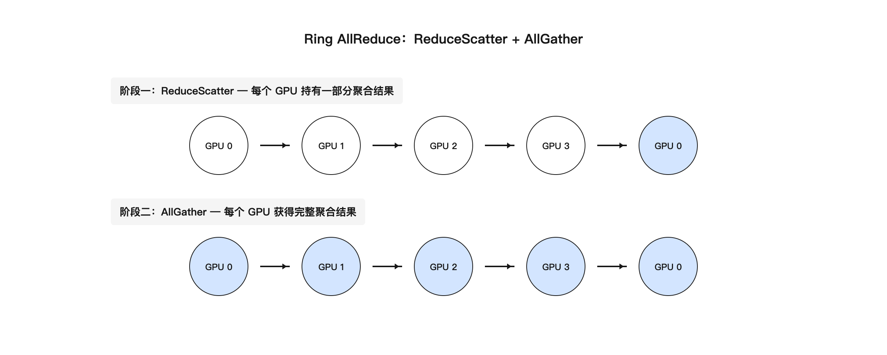
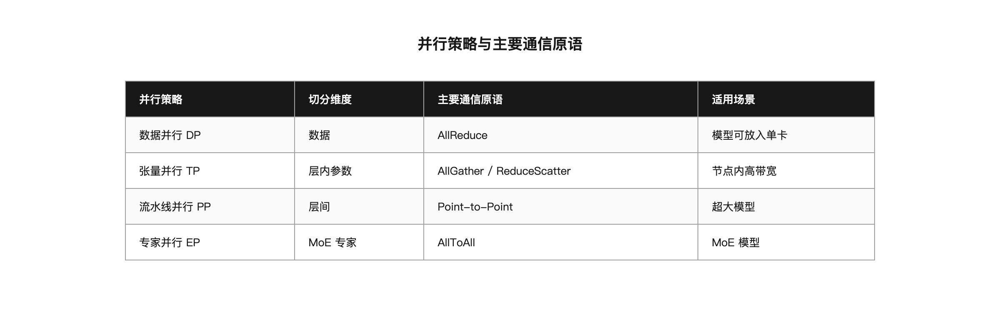

# 第 7 章 分布式训练通信：NCCL / HCCL 与 Ring AllReduce

## 引子：单卡变多卡，通信成为主角

大模型训练很少只用一张 GPU。GPT-3 级别模型参数量上千亿，单卡显存放不下，计算时间也太久。实际生产中，一个训练任务往往同时启动几十、几百甚至上千张 GPU。

多卡训练的核心问题不是每张卡算得快不快，而是它们能不能高效协同。每张卡算完自己的梯度后，需要把梯度同步给所有卡，这样所有卡的参数才能保持一致。这个同步过程就是分布式训练通信。

通信一旦变慢，整个集群都在等。通信做得不好，GPU 利用率会很低，训练时间成倍增加。本章讨论分布式训练通信的基本概念、常见算法和工具。

理解通信层，需要把视角从单张 GPU 拉到整个集群。单卡优化看 kernel 效率，多卡优化看通信效率。通信效率又取决于网络硬件、NCCL 参数、并行策略三个因素。三者缺一不可。

## 7.1 数据并行与梯度同步

最常见的分布式训练方式是数据并行（Data Parallelism）。它的思路很简单：

- 把训练数据分成若干份，每份交给一张 GPU
- 每张 GPU 上有一份完整的模型副本
- 每张 GPU 用自己的数据计算梯度
- 把所有 GPU 的梯度汇总起来，更新每张 GPU 上的模型参数

这里的关键是第四步：如何把 N 张 GPU 的梯度汇总。

假设有 8 张 GPU，每张 GPU 上都有 7B 参数模型的梯度。总梯度大小约为 14GB（fp16）。每训练一步，都要把这 14GB 数据在所有 GPU 之间同步一次。训练一天可能要走几十万步，通信量非常惊人。

### 同步与异步

多卡梯度同步分为同步和异步两种方式。

同步方式下，每张 GPU 完成前向和反向计算后，必须等所有 GPU 都完成才能进行梯度聚合和参数更新。这种方式保证所有卡上的模型始终一致，是大模型训练的主流。

异步方式下，每张 GPU 可以独自更新参数，定期交换梯度。异步方式理论上通信更灵活，但模型一致性难以保证，实际生产中很少用于大模型预训练。

### 单机与多机的差异

单机 8 卡和多机 1024 卡的通信环境完全不同。

单机内，GPU 之间通过 NVLink 或 NVSwitch 互联，带宽可达 900 GB/s 量级，延迟极低。此时通信通常不是瓶颈，数据并行可以跑得很好。

多机之间通过 IB 或 RoCEv2 连接，单端口带宽通常为 100 GB/s 或 200 GB/s，远低于 NVLink。跨机通信的延迟和拥塞控制成为主要矛盾。此时并行策略、NCCL 参数、网络拓扑都需要仔细设计。

### 参数服务器与 AllReduce 的对比

早期分布式训练常用参数服务器（Parameter Server，简称 PS）。它的思路是设置一台或几台中心服务器，每张 GPU 把本地梯度发给中心服务器，服务器做聚合后再把结果广播回去。

PS 架构在小规模时简单直观，但有一个结构性缺陷：中心服务器的上下行带宽会成为瓶颈。假设有 N 张 GPU，每张 GPU 的梯度大小为 K，那么中心服务器在聚合阶段要接收 N×K 数据，广播阶段要发送 N×K 数据。N 越大，中心服务器压力越大。

 AllReduce 则不同。它去掉中心节点，让所有 GPU 互相协作，同时完成聚合和分发。在 Ring AllReduce 中，每张 GPU 只和左右邻居通信，总传输量接近 2K，基本不随 N 增长。这意味着集群扩容时，通信开销不会线性恶化。

两者的对比如下：

| 维度 | 参数服务器 | AllReduce |
|------|-----------|-----------|
| 中心节点 | 需要 | 不需要 |
| 带宽热点 | 中心服务器上下行 | 无单点热点 |
| 每张卡传输量 | 约 K（发给中心）+ K（接收结果） | 约 2K，与 N 无关 |
| 可扩展性 | N 增大时中心节点成为瓶颈 | N 增大时仍接近线性 |
| 典型实现 | 早期 TensorFlow PS | NCCL、HCCL、Gloo |

因此，现代大模型训练几乎都用 AllReduce 做梯度同步。PS 只在某些稀疏场景或特定框架中保留。

### 梯度展平与 bucket

在 PyTorch 中，AllReduce 的对象不是按层组织的梯度，而是把所有梯度展平后拼接成的一维数组。

以 LLaMA-7B 为例，所有层的 weight.grad 和 bias.grad 被展平后拼在一起，总长度约 7B 个 fp16/half 数值，即约 14GB。NCCL 只拿到这块 float 数组的起始地址和长度，不关心 0 号元素属于哪一层。

为了 overlap 计算和通信，PyTorch DDP 会把这 14GB 按 bucket 切开，每个 bucket 大约 25MB。一个 bucket 的梯度计算完成后，就立即启动该 bucket 的 AllReduce，而不等所有梯度都算完。这样通信和反向传播可以重叠，减少纯等待时间。

bucket 的边界不等于层的边界。一个 bucket 可能横跨多层。这种设计让通信尽可能早地开始，是 DDP 高效的关键之一。

需要纠正一个常见误解：AllReduce 不是发生在前向传播之后，而是发生在反向传播期间。梯度在 backward 中逐层产生，bucket 满了就开始 AllReduce，与反向传播重叠执行。

## 7.2 集合通信原语

分布式训练里常用的集合通信操作有：

**Broadcast**：一个节点把数据发给所有节点。常用于初始化时同步模型权重，确保每张 GPU 从同一份参数开始训练。

**Reduce**：多个节点的数据按照某种操作（如求和、求平均）汇总到一个节点。训练里单独使用较少，多作为 AllReduce 的内部步骤。

**AllReduce**：每个节点都有数据，汇总后每个节点都得到相同的结果。数据并行中的梯度同步就是典型的 AllReduce。

**Scatter**：一个节点把数据分成多份，分别发给不同节点。常用于把输入数据切分到多个 worker。

**Gather**：多个节点把数据发给一个节点汇总。与 Scatter 方向相反。

**AllGather**：每个节点都拿到所有人的数据。张量并行中收集激活值时会用到。

**ReduceScatter**：先做 Reduce，再把结果分散到不同节点。它是 AllReduce 内部的一个阶段，在 Ring AllReduce 中先完成 ReduceScatter，再完成 AllGather。

**AllToAll**：每个节点都把自己数据的一部分发给其他每个节点。常用于 MoE 专家并行的 token 交换。

这些原语由 NCCL、HCCL 等通信库实现，训练框架只需要调用接口。理解每个原语的输入输出，有助于判断不同并行策略下的通信开销。

### 输入输出示例

以 4 张 GPU 为例，每个 GPU 初始持有一个长度为 4 的数组：

**Broadcast**：GPU0 持有 [1,2,3,4]，其他 GPU 为空。Broadcast 后，所有 GPU 都持有 [1,2,3,4]。

**Reduce（求和）**：4 张 GPU 分别持有 [1,2,3,4]、[5,6,7,8]、[9,10,11,12]、[13,14,15,16]。Reduce 到 GPU0 后，GPU0 持有 [28,32,36,40]，其他 GPU 不变。

**AllReduce（求和）**：同样输入，AllReduce 后所有 GPU 都持有 [28,32,36,40]。

**Scatter**：GPU0 持有 [1,2,3,4,5,6,7,8]，Scatter 后 GPU0 持有 [1,2]，GPU1 持有 [3,4]，GPU2 持有 [5,6]，GPU3 持有 [7,8]。

**Gather**：Scatter 的逆过程，把分散的数据收集到一个 GPU。

**AllGather**：每张 GPU 持有一部分数据，AllGather 后每张 GPU 都持有完整数据。张量并行中常用。

**ReduceScatter**：先做 Reduce 再 Scatter，结果分散到各 GPU。Ring AllReduce 的第一阶段就是 ReduceScatter。

**AllToAll**：每张 GPU 有 4 个数据块，分别要发给 4 张 GPU。AllToAll 后，每张 GPU 收到来自其他 GPU 对应位置的数据块。MoE 训练中用于 token 交换。

## 7.3 Ring AllReduce 算法

AllReduce 有很多种实现方式。在大规模 GPU 集群中，Ring AllReduce 是最经典的算法之一。


*图 7-1：Ring AllReduce 两阶段*

### 基本思想

Ring AllReduce 把 N 张 GPU 排成一个环。每张卡只和左右邻居通信。通信分为两个阶段：ReduceScatter 和 AllGather。

假设有 4 张 GPU，每张 GPU 上有同样大小的梯度数据。Ring AllReduce 先把数据切成 N 块，每张 GPU 负责一块。

**ReduceScatter 阶段**：

- 每张 GPU 把自己的第 k 块数据传给下一个 GPU
- 收到数据的 GPU 把收到的数据和本地对应位置的数据相加
- 这样转 N-1 圈后，每张 GPU 都持有一部分完整的聚合结果

**AllGather 阶段**：

- 每张 GPU 把自己聚合好的那块数据传给下一个 GPU
- 收到后本地保存
- 再转 N-1 圈后，每张 GPU 都拥有完整的聚合结果

### 具体推导

用 4 张 GPU、4 块数据来走一遍，可以更清楚通信量为什么可控。

初始状态：

- GPU0：A0, B0, C0, D0
- GPU1：A1, B1, C1, D1
- GPU2：A2, B2, C2, D2
- GPU3：A3, B3, C3, D3

这里 A、B、C、D 是数据块的编号，下标是各 GPU 上的原始值。目标是每张 GPU 都拿到 A0+A1+A2+A3、B0+B1+B2+B3 等聚合结果。

**ReduceScatter 第一步**：GPU0 发送 A0 给 GPU1，GPU1 发送 B1 给 GPU2，GPU2 发送 C2 给 GPU3，GPU3 发送 D3 给 GPU0。每张卡同时收发一块大小为 K/4 的数据。

**ReduceScatter 第二步**：各卡把收到的块与本地对应块相加，再传给下一个 GPU。例如 GPU1 现在持有 A0+A1，把它传给 GPU2。

**ReduceScatter 第三步**：再转一圈，每张 GPU 都完成一个完整块的聚合。最终：

- GPU0 持有完整的 A 块聚合结果
- GPU1 持有完整的 B 块聚合结果
- GPU2 持有完整的 C 块聚合结果
- GPU3 持有完整的 D 块聚合结果

**AllGather 阶段**：每张 GPU 把聚合好的块传给下一个 GPU。转 3 圈后，每张 GPU 都拿到 A、B、C、D 四块完整结果。

整个过程中，每张 GPU 发送的数据量是多少？ReduceScatter 发送 N-1 次，每次 K/N；AllGather 也发送 N-1 次，每次 K/N。总发送量为：

```
总传输量 = 2 × (N-1) × K / N = 2 × (N-1)/N × K
```

当 N 很大时，(N-1)/N 接近 1，所以总传输量接近 2K。这意味着无论集群有多少张卡，每张卡大约只发送两倍数据量。

### 为什么 Ring 算法好

Ring AllReduce 有两个重要优点：

**带宽利用率高**：每张卡只和相邻卡通信，不存在所有卡同时往一个节点发数据的情况，避免网络热点。

**传输总量可控**：每张卡发出的总数据量为 2×(N-1)/N × K，K 是原始梯度大小。当 N 很大时，这个系数接近 2，意味着通信量几乎不随 GPU 数量增长。

这些特性让它成为 NVIDIA NCCL 中 AllReduce 的默认算法之一。不过 Ring 算法也有局限：大规模集群中环太长，延迟累积明显，所以 NCCL 在大规模跨机场景会采用 Tree 算法或 Tree+Ring 分层方案。

### Tree AllReduce 简介

Tree AllReduce 把节点组织成一棵平衡树。通信分为两个阶段：先向上做 Reduce，把数据聚合到根节点；再向下做 Broadcast，把结果分发给所有节点。

对于 N 个节点，Tree 的跳数约为 2log₂(N)。比如 1024 个节点时，跳数约为 20。而纯 Ring 需要转 1023 圈。因此 Tree 在大规模跨机场景下延迟更低。

NCCL 实际使用的 TREE 算法还包括 TREEFLLG 等变体，会根据拓扑自动选择。日志里看到 `NCCL_ALGO=RING|TREEFLLG` 表示 NCCL 保留了在不同场景切换的能力。

小集群（如单机 8 卡）通常用 Ring，因为 NVLink 全互联带宽高，Ring 能充分发挥。大规模跨机集群则倾向于 Tree，因为跨机链路延迟成为主要矛盾。

### 通信量估算

估算一次 AllReduce 需要多少时间，可以帮助判断训练是否通信受限。

以 7B 模型、fp16 梯度、8 张 GPU、NVLink 单链路 450 GB/s 为例：

- 梯度总量 K = 14 GB
- Ring AllReduce 每张卡总发送量 ≈ 2K = 28 GB
- 实际通信时间 ≈ 28 GB / 450 GB/s ≈ 62 ms

这只是一个粗略估算。实际时间还受 channel 数、PCIe 瓶颈、CPU 开销影响。但它足以说明：如果 step_time 是 200 ms，通信占 60 ms，那通信就是主要瓶颈之一。

跨机场景下，IB 链路带宽通常只有 NVLink 的 1/8 到 1/10。同样的 28 GB 数据，在 50 GB/s 的 IB 链路上需要约 560 ms。这就是为什么多节点训练更容易受通信限制。

## 7.4 NCCL：NVIDIA 的集合通信库

NCCL（NVIDIA Collective Communications Library）是 NVIDIA 实现的高效集合通信库，专门优化 GPU 之间的通信。

NCCL 会自动做很多事情：

**拓扑感知**：启动时探测 GPU 之间的连接方式，包括 NVLink、PCIe、网络等，选择最快的通信路径。

**协议选择**：节点内优先用 NVLink 和 PCIe，节点间用 RDMA/RoCEv2 或 InfiniBand。

**通道管理**：根据数据量和拓扑创建多条通信通道，提高并行度。

**算法选择**：根据 GPU 数量、数据大小、网络拓扑自动选择 Ring、Tree 等算法。

训练代码通常只需要几行：

```python
import torch.distributed as dist

dist.init_process_group(backend='nccl')
dist.all_reduce(tensor, op=dist.ReduceOp.SUM)
```

真正复杂的工作都在 NCCL 内部。

### NCCL 版本与兼容性

NCCL 版本、CUDA 版本、驱动版本、固件版本需要匹配。素材中给出的 H200 + CX7 环境参考矩阵为：NVIDIA 驱动 550+、CUDA 12.4+、NCCL 2.20+、PyTorch 2.3+、MLNX_OFED 24.04+。

版本不匹配可能引发各种奇怪问题：NCCL 初始化失败、QP 建立异常、nccl-tests 报 error 不为 0。上线前应在所有节点统一版本，并用 ansible 批量检查。

### NCCL 初始化与拓扑发现

NCCL 在训练启动时会经历几个阶段：Bootstrap 握手、拓扑发现、Ring 或 Tree 构建、QP 建立，最后才是正式通信。

**Bootstrap 握手**：所有 rank 通过 TCP Socket 找到彼此，确认 world size、rank 编号、master 地址等基本信息。

**拓扑发现**：NCCL 扫描本机的 GPU、NVLink、PCIe、网卡等硬件，构建一张拓扑图。图中的节点是 GPU 和 NIC，边是它们之间的通信路径，每条边标注带宽和延迟。

拓扑图中的路径类型有几种：

- PATH_NVL：直连 NVLink，速度最快
- PATH_NVB：经 NVSwitch 的 NVLink，速度很快
- PATH_PHB：同 PCIe Host Bridge，GPU 与网卡同 NUMA，可开启 GPUDirect RDMA
- PATH_PXN：跨 PCIe Bridge 或跨 NUMA，速度中等
- PATH_SYS：跨 socket 或远端 NUMA，数据要绕 CPU 内存，速度最慢

如果日志中出现大量 PATH_SYS，说明 GDR 未生效，需要检查 GPU 与网卡是否在同一 NUMA 下，或者 NCCL_NET_GDR_LEVEL 是否设置正确。

GPUDirect RDMA 让 GPU 显存可以直接被网卡访问，不需要经过 CPU 内存拷贝。开启 GDR 能显著提升跨机通信带宽。GDR 生效的前提是 GPU 和 NIC 在同一 PCIe Host Bridge 下，也就是 NUMA 亲和。

实际部署中，8 卡 GPU 节点通常配有 8 张 IB/RoCE 网卡。理想情况下，每张 GPU 绑定一张网卡，且两者在同一 NUMA 下。如果绑定错误，数据要走跨 socket 路径，性能会大幅下降。

**Ring/Tree 构建**：基于拓扑图，NCCL 为每个 channel 选择通信路径。小集群常用 Ring，大规模跨机集群常用 Tree。每条 channel 内部独立执行算法，多个 channel 并行以提升带宽。

**QP 建立**：在 InfiniBand 或 RoCEv2 上，NCCL 会创建 Queue Pair 用于 RDMA 通信。QP 建立失败通常表现为初始化阶段卡住或报 `Failed to modify QP to RTR`。

跨子网场景下，NCCL 还需要正确选择 GID（Global Identifier）。如果 `NCCL_IB_GID_INDEX` 设置错误，NCCL 可能只能找到 link-local 的 GID，无法跨子网通信，日志会出现 `no usable GID found`。

### 从日志中读取关键信息

开启 `NCCL_DEBUG=INFO` 后，初始化阶段会输出大量信息。关键日志包括：

- `NET/IB : Using interface mlx5_*`：确认 NCCL 使用了哪些 IB 网卡
- `NCCL_ALGO=RING` 或 `TREE*`：确认当前使用的 AllReduce 算法
- `8 channels`、`Channel 00/08`：确认 channel 数量是否匹配网卡数
- `PATH_NVL/PATH_PHB/PATH_SYS`：确认 GPU 到网卡的路径类型

如果日志中 `Channel 00/02` 表示只开了 2 条 channel，远少于预期，可能是 `NCCL_MIN_NCHANNELS` 或 `NCCL_MAX_NCHANNELS` 被限制，或者 NCCL 没识别到全部网卡。

如果路径类型以 PATH_SYS 为主，说明 GDR 未生效，数据要经过 CPU 内存拷贝，通信带宽会大幅下降。

### NCCL 启动阶段常见问题

**Bootstrap 卡住**：如果日志只输出 `Bootstrap: Using master_addr=...` 后就停止，说明 rank 间握手失败。常见原因是 master 端口不通、防火墙拦截、或 conntrack 表满。

**网卡识别不全**：如果 NCCL 只识别到 4 个 mlx5 网卡而不是 8 个，可能是 CX7 双口模式未开启，或者 NCCL_IB_HCA 环境变量未指定。需要检查 `mstconfig -d mlx5_0 q` 的 Split 配置。

**GID 选择错误**：跨 IB 子网时，NCCL 必须选择全局可路由的 GID，而不是 link-local 的 GID。错误选择会导致 `no usable GID found` 或 `Failed to connect to remote peer`。

**QP 建立失败**：常见原因包括防火墙拦截 RDMA 端口、OFED 驱动版本不兼容、或 max_qp 不足。8000 卡场景下每台机器对外连接约 999 台，8 个 NIC 分担后每个 NIC 约 125 个远端，按每个连接约 4 个 QP 估算约 500 个 QP，远小于 typical max_qp=131072，因此 QP 容量通常不是瓶颈。

### NCCL 调试

NCCL 提供了很多环境变量用于调优和排查：

**NCCL_DEBUG=INFO**：输出详细的初始化、拓扑和通信信息。

**NCCL_IB_DISABLE=1**：禁用 InfiniBand，强制走 IP Socket。

**NCCL_SOCKET_IFNAME=eth0**：指定用于 Socket 通信的网卡。

**NCCL_P2P_DISABLE=1**：禁用 GPU 之间的 P2P 通信。

这些参数在排查通信问题时非常有用。例如当训练出现 NCCL timeout，可以先开启 NCCL_DEBUG=INFO 查看卡在哪一步，再判断是网络问题、拓扑问题还是配置问题。

## 7.5 NCCL 环境变量速查

实际排障中，最常用的 NCCL 环境变量可以分为调试类、IB/RoCE 配置类、拓扑算法类三大类。

**调试类**：

| 环境变量 | 作用 | 典型取值 |
|----------|------|----------|
| NCCL_DEBUG | 日志级别 | WARN / INFO / TRACE |
| NCCL_DEBUG_SUBSYS | 子系统过滤 | INIT / GRAPH / NET / TUNING / ALL |
| NCCL_TIMEOUT | 全局超时（秒） | 1800（8000 卡场景） |
| NCCL_BOOTSTRAP_TIMEOUT | Bootstrap 阶段超时 | 300 |

**IB/RoCE 配置类**：

| 环境变量 | 作用 | 典型取值 |
|----------|------|----------|
| NCCL_IB_DISABLE | 是否禁用 IB | 0（用 IB）/ 1（禁用） |
| NCCL_IB_HCA | 指定 IB 网卡 | mlx5_0,mlx5_1,...,mlx5_7 |
| NCCL_IB_GID_INDEX | 跨子网 GID 索引 | 1 或 3 |
| NCCL_SOCKET_IFNAME | Bootstrap 用网卡 | ib0 / bond0 |
| NCCL_NET_GDR_LEVEL | GDR 启用路径级别 | PHB / PXN / SYS |
| NCCL_IB_TIMEOUT | IB 重传超时 | 18（默认）/ 22（1024 卡建议） |
| NCCL_IB_RETRY_CNT | 重传次数 | 7 |

**拓扑与算法类**：

| 环境变量 | 作用 | 典型取值 |
|----------|------|----------|
| NCCL_ALGO | 强制算法 | RING / TREE / TREEFLLG |
| NCCL_MAX_NRINGS | 最大 Ring 数 | 8（匹配 8 张网卡） |
| NCCL_MIN_NCHANNELS | 最小 channel 数 | 8 |
| NCCL_BUFFSIZE | 通信缓冲区大小 | 根据消息大小调整 |
| NCCL_TOPO_FILE | 手动拓扑文件 | /path/to/topo.xml |

生产环境推荐默认使用 NCCL_DEBUG=WARN，排障时临时改为 INFO。TRACE 会产生海量日志，只在极小数据量、极短运行时间内使用。

调参时建议遵循一个原则：先用 NCCL 自动选择，只在明确证据表明自动选择不合理时才强制指定。很多性能问题不是算法选错，而是网卡没识别全、GDR 没生效、或 channel 数不匹配。把这些问题解决后，通常不需要额外调参。

## 7.6 HCCL：昇腾的集合通信库

昇腾 910B 使用 HCCL（Huawei Collective Communication Library）作为集合通信库，作用和 NCCL 类似。

HCCL 针对昇腾芯片的 HCCS（Huawei Cache Coherence System）和 RoCE 网络做了优化。它的基本原语和 NCCL 相似，都提供 AllReduce、AllGather、ReduceScatter、AllToAll 等操作。

主要区别：

**硬件生态不同**：NCCL 面向 NVIDIA GPU 和 NVLink，HCCL 面向昇腾 NPU 和 HCCS。

**环境变量不同**：HCCL 使用 `HCCL_INTRA_ROCE_ENABLE`、`HCCL_RDMA_TIMEOUT` 等参数。

**工具链不同**：昇腾用 `msnpureport` 查看网络状态，用 `hccn_tool` 配置网卡，用 `hccl_test` 做性能基线。

运维思路是相通的：先跑通单节点，再验证多节点基线，最后接入训练框架。

### NCCL 与 HCCL 的差异对比

| 维度 | NCCL | HCCL |
|------|------|------|
| 适用硬件 | NVIDIA GPU | 昇腾 NPU |
| 机内高速互联 | NVLink / NVSwitch | HCCS |
| 机间网络 | IB / RoCEv2 | RoCE |
| 调试环境变量 | NCCL_DEBUG 系列 | HCCL_INTRA_ROCE_ENABLE 等 |
| 网卡配置工具 | ibstat / ib_write_bw | hccn_tool / msnpureport |
| 性能测试工具 | nccl-tests | hccl_test |
| 默认算法 | Ring / Tree | Ring / Tree 类似分层 |

需要强调的是，NVIDIA 与昇腾生态通常物理隔离，不跨集群训练或推理。运维人员只要掌握其中一套排查逻辑，另一套可以快速迁移。

### HCCL 排障基本流程

昇腾集群排障的基本流程与 NVIDIA 类似：

1. 单节点跑通：确认 8 张 NPU 能被框架识别，HCCL 能完成基本 AllReduce。
2. 多节点基线：用 hccl_test 跑 2 节点、4 节点、8 节点基线，确认带宽达标。
3. 接入训练框架：把基线通过后的配置固化到训练任务中。

常用命令包括 `hccn_tool -i 0 -ip -g` 查看网卡 IP，`msnpureport -s` 查看网络状态。排查时同样遵循"先硬件后软件、先单节点后多节点"的原则。

## 7.7 通信与并行策略

不同并行策略使用不同的通信原语。


*图 7-2：并行策略与主要通信原语*

**数据并行（DP）**：主要用 AllReduce 同步梯度。通信量和模型大小成正比。

**张量并行（TP）**：把一层参数切分到多张 GPU，前向传播时用 AllGather 收集激活，反向时用 ReduceScatter 汇总梯度。通信频率高，但单次通信量相对小，适合节点内。

**流水线并行（PP）**：把模型按层切分，不同 GPU 负责不同层，主要传输层间激活，通信量相对小。

**专家并行（EP / MoE）**：不同专家在不同 GPU 上，需要 AllToAll 交换 token。通信模式复杂，对网络 all-to-all 能力要求高。

### AllToAll 与 MoE

在 MoE 模型中，每张卡上只存放部分专家。一个 token 进入 MoE 层后，Router 会判断它应该交给哪个专家计算。由于专家分散在不同卡上，token 需要通过 AllToAll 发送到目标卡，计算完成后再通过一次 AllToAll 把结果送回原卡。

AllToAll 与 AllReduce 的本质区别在于：AllReduce 是所有人拿到同样的聚合结果，AllToAll 是每个人拿到不同的分发结果。用快递比喻，AllReduce 是大家凑份子后每人都得到总和，AllToAll 是按地址把包裹分拣到不同收件人。

AllToAll 的通信模式也更重。N 张卡时，同时活跃的通路数为 N×(N-1)/2，随卡数平方增长。而 Ring AllReduce 中每张卡只和左右两个邻居通信，通路数固定为 2。因此 MoE 训练对网络的 all-to-all 吞吐能力要求更高。

假设机内 NVLink 总带宽为 900 GB/s。4 张卡时，AllToAll 同时用 6 条通路，每条通路约 150 GB/s；而 Ring AllReduce 只用 2 条通路，每条通路约 450 GB/s。卡数越多，这个差距越明显。

实际 MoE 训练中，一次前向传播和一次反向传播各需要两次 AllToAll。如果模型有 8 个 MoE 层，那么 4 卡训练一次 step 就要 32 次 AllToAll，再加上 1 次 AllReduce 做梯度同步。因此 MoE 训练的通信瓶颈通常是 AllToAll，而不是 AllReduce。

### 通信与显存的权衡

并行策略的选择本质上是通信与显存的权衡。

数据并行不增加通信种类，但每张卡要存完整模型，显存占用高。张量并行把参数切到多张卡，降低单卡显存，但增加 AllGather/ReduceScatter 通信。流水线并行降低显存，但引入气泡。专家并行降低单专家显存，但增加 AllToAll 通信。

没有绝对最好的并行策略，只有最适合当前模型规模和集群拓扑的策略。设计时需要同时考虑显存容量、网络带宽、计算能力三个约束。

实际大模型训练往往是多种并行策略组合使用，称为 3D 并行或 4D 并行。通信规划是其中的关键环节。

## 7.8 性能评估：nccl-tests

评估通信性能最常用的工具是 nccl-tests。它直接调用 NCCL 库测量各类集合操作的带宽和延迟。

常用命令：

```bash
./all_reduce_perf -b 8 -e 1G -f 2 -g 8
```

参数含义：

- `-b 8`：起始消息大小 8 字节
- `-e 1G`：结束消息大小 1GB
- `-f 2`：每轮消息大小翻倍
- `-g 8`：使用 8 张 GPU

输出关键字段：

**algbw**：算法带宽，等于 size / time，反映用户视角的吞吐。

**busbw**：总线带宽，反映物理链路的真实负载。对于 Ring AllReduce：

```
busbw = algbw × 2 × (N-1) / N
```

判断网络是否达标，主要看 busbw。

nccl-tests 常用于：

- 新节点、新线缆、新交换机上架前跑基线
- 训练出现 NCCL timeout 时判断是上层问题还是底层链路问题
- 从 128 个节点中找出慢节点

### 基线参考

单节点 8×H200 + NVLink4 全互联基线（消息 1GB）可参考：AllReduce busbw 525+ GB/s，AllGather busbw 262+ GB/s，ReduceScatter busbw 262+ GB/s，AllToAll busbw 150+ GB/s。多节点 AllReduce busbw 会随规模下降，2 节点约 300+ GB/s，8 节点约 250+ GB/s，32 节点约 150+ GB/s。

找慢节点时，可在每个节点上跑 all_reduce_perf，记录 busbw，对所有结果取中位数，低于中位数 80% 的节点标记为慢节点，再逐台排查 ibstat、ib_write_bw、PCIe 协商速率等。

用中位数而不用平均值，是因为极端值会拉偏平均值，中位数更稳健。实际生产中，20% 的阈值比 10% 更合理，可以避免误报。

### 排查决策树

带宽不达标时，建议按以下顺序查：

1. 先跑 ib_write_bw，排除 NCCL 本身。如果 ib_write_bw 低于基线，说明是硬件或链路问题。
2. 检查 ibstat 的 State、Physical state、Rate。State 应为 Active，Physical 应为 LinkUp，Rate 应为 400（NDR 400G）。
3. 如果 ib_write_bw 正常但 nccl-tests 不达标，再看 NCCL 配置。检查 NCCL_IB_HCA 是否指定了正确网卡、channel 数是否匹配、GDR 是否生效。
4. 多节点才慢时，重点查节点间 IB 链路、Fat-Tree 路由、慢节点。

一个常见误解是 ibping 通就代表网络没问题。实际上 ibping 只测连通性，不测带宽。一条降级到 100G 的链路 ibping 也能通，但训练会 timeout。

### 输出样例解读

nccl-tests 典型输出如下：

```
#       size    count   type  redop   time  algbw  busbw  error
#        (B)    (elements)          (us)  (GB/s) (GB/s)
#          1G  268435456  float  sum  3389  310.2  542.9  0e+00
```

其中 error 应为 0。如果 error 不为 0，先确认 NCCL、CUDA 驱动、固件版本是否一致，版本不匹配可能引发校验失败。

小消息（<4KB）带宽天然低，因为受延迟主导。判断网络是否达标要用大消息，如 8MB 或 1GB。

多节点基线本质上是在验证 bisection bandwidth，即把集群对半切开后两半之间能同时传输的最大带宽。这个指标直接决定大规模 AllReduce 的效率。

跑 nccl-tests 时要注意：所有节点的时间必须同步，否则 timeout 判断会出错；防火墙要放行 RDMA 端口；不同节点的 NCCL、CUDA、驱动版本必须一致。

## 7.9 常见通信问题

分布式训练中最常见的问题可以归为几类：

**NCCL timeout**：通常是最慢的卡拖住了整个集合通信。排查顺序：先做单节点 nccl-tests，再做多节点 nccl-tests，然后查网卡和交换机状态。

**data_time 升高**：往往是数据加载或预处理慢了，GPU 在等数据。需要看数据流水线。

**busbw 不达标**：可能是某条链路协商降速、交换机配置错误、光纤问题或 NCCL 参数不当。

**精度异常**：Ring AllReduce 中浮点数累加顺序不同可能导致微小差异。通常可以用 deterministic 模式规避，但会牺牲性能。

**初始化卡住**：如果训练日志只输出 NCCL 版本信息就停止，可能是 Bootstrap 网络不通、防火墙拦截、或 GID 选择错误。需要检查 master 端口连通性、iptables 规则、以及 show_gid 输出。

**网卡降速**：ibstat 显示 Rate 从 400 降到 200 或 100，说明链路协商降速。常见原因是线缆松动、光模块脏、或交换机端口故障。重新插拔线缆或更换光模块通常可以恢复。

这些问题看起来分散，但排查逻辑一致：先定位层级，再逐层缩小范围。

### NCCL timeout 的典型根因

NCCL timeout 不是根因，而是症状。常见根因有四类：

**慢节点**：某张网卡从 400G 降级到 200G，或者某台机器 NUMA 绑定错误、IRQ 不均衡，都会拖慢整个通信环。

**网络断连或丢包**：IB/RoCE 链路不稳定时，报文丢失或 QP 状态异常会触发 timeout。需要看交换机端口的 Symbol Error、PortXmitDiscards 是否增长。

**QP 问题与防火墙**：NCCL 在 IB/RoCE 上使用 QP 进行 RDMA 通信，会占用动态端口范围。如果防火墙没有放行对应端口，或者 CNI 策略误拦截，QP 就无法建立。

**IB timeout / retry 参数过短**：大规模集群中，默认 NCCL_IB_TIMEOUT 可能太激进。把参数从 18 调到 22 可以缓解偶发延迟误触发，但不能替代根因修复。

### busbw 不达标

busbw 不达标通常先怀疑硬件。常见原因包括：光模块脏、光纤弯折、PCIe 协商降速、交换机端口配置错误。如果单节点 nccl-tests 正常但多节点慢，则重点查跨机链路和 Fat-Tree 路由。

### 精度异常

Ring AllReduce 中，浮点数加法不满足结合律，不同累加顺序可能产生约 1e-7 量级的差异。这并非 Ring 算法独有，所有并行归约算法都存在。实际训练中这种差异通常不影响收敛。如果需要严格可复现，可以开启 deterministic 模式，但会牺牲性能。

## 7.10 这一环在整个链路中的位置

通信层承上启下。

向上，它依赖网络基础设施。NCCL 和 HCCL 能发挥多少性能，取决于 RoCEv2 或 InfiniBand 网络是否稳定、无损、低延迟。

向下，它直接影响训练框架和并行策略的选择。同样的模型，在不同的通信能力下，可能需要采用不同的并行切分方式。

通信问题通常不是单个代码 bug，而是系统性问题。它要求运维人员既懂网络，又懂训练框架，还要会读 NCCL 日志。

在实际工作中，通信调优常常是一个反复验证的过程。先用 nccl-tests 跑出基线，确认硬件没问题；再用 NCCL_DEBUG=INFO 确认参数和拓扑选择正确；最后根据训练指标判断是否需要调整并行策略。每一步都要有数据支撑，不能凭感觉调参。

通信层是训练效率的放大器，也是故障的放大器。网络好的时候它默默无闻，网络差的时候它能让整个集群停摆。理解它的工作原理，是 AI Infra 工程师的必修课。无论是 NCCL 还是 HCCL，核心逻辑都是相通的：先确认硬件，再确认配置，最后调算法。

## 小结

分布式训练的效率取决于通信。AllReduce 取代参数服务器成为主流，Ring AllReduce 的通信量几乎不随 GPU 数量增长。NCCL 和 HCCL 负责把集合通信原语映射到具体硬件拓扑，网络、GDR、channel 数和算法选择都会影响性能。排障时要先用 nccl-tests 确认硬件基线，再用 NCCL_DEBUG=INFO 确认配置，最后才调算法参数。

## 本章事实核对清单

### 参考资料

- `yidian/nccl-ring-allreduce/从参数到AllReduce-概念全链条.md`
- `yidian/nccl-ring-allreduce/博客笔记-PyTorch-DDP与Ring-AllReduce-51cto.md`
- `yidian/nccl-ring-allreduce/All-to-All与MoE专家并行-从原理到实现.md`
- `wechat-ai-infra/concepts/nccl-tests/nccl-tests.md`
- `wechat-ai-infra/concepts/nccl-debug/nccl-debug.md`
- `wechat-ai-infra/concepts/nccl-timeout/nccl-timeout.md`

### 关键数字来源

- 7B 模型 fp16 梯度约 14GB：来自 7B 参数 × 2 字节 = 14 GB 的推导
- Ring AllReduce 总传输量 2×(N-1)/N × K：来自 nccl-tests 文档和 Ring AllReduce 原理解释
- busbw = algbw × 2 × (N-1) / N：来自 nccl-tests 文档
- 单节点 H200 AllReduce busbw 525+ GB/s、AllToAll 150+ GB/s：来自 nccl-tests 基线文档
- 多节点 AllReduce busbw 2 节点 300+ GB/s、8 节点 250+ GB/s、32 节点 150+ GB/s：来自 nccl-tests 基线文档
- NCCL_IB_TIMEOUT 默认 18、1024 卡建议 22：来自 nccl-timeout 文档
- 慢节点阈值中位数 80%：来自 nccl-tests 文档
