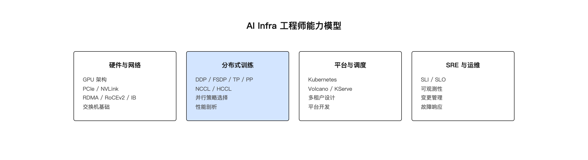
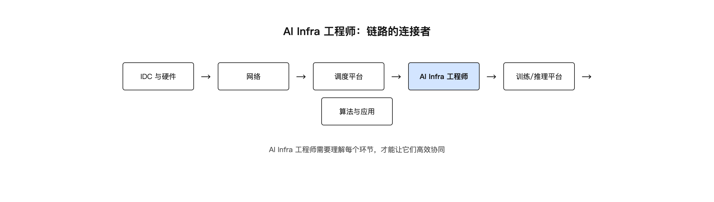

# 第 10 章 AI Infra 工程师

## 引子：一个横跨地皮和模型的人

AI Infra 工程师是一个边界很宽的角色。他可能要参与机房供电方案讨论。他要在凌晨排查 NCCL timeout。他还要和算法团队争论并行策略，写平台代码让研究员自助提交任务。

这个角色之所以重要，是因为大模型训练不是单一技术问题，而是系统工程问题。芯片、网络、存储、调度、框架、应用，任何一环脱节，整个项目都会受影响。AI Infra 工程师需要在这些环节之间建立连接。

他不是最懂算法的人，但要懂算法团队需要什么。他不是最懂网络的人，但要能跟网络团队讲清楚训练通信的特征。他不是最懂代码的人，但要能写出让研究员好用的平台。这种"连接"能力，是这个角色的核心价值。

本章讨论这个角色的工作范围、能力模型和成长路径。我们不会给出一个标准答案，因为每个团队对这个角色的定义都不同。但我们会描绘一个清晰的轮廓。它会帮助读者判断自己是否适合这个方向，以及如何持续成长。

## 10.1 AI Infra 工程师做什么

AI Infra 工程师的工作可以分为几个层面。

**基础设施层**：参与智算中心的规划，包括电力、散热、机柜布局、网络拓扑。负责 GPU 集群的交付验收、固件升级、故障处理。这一层要求工程师理解 IDC 建设和硬件选型的基本知识。

**平台层**：建设或维护训练平台、推理平台、调度平台。让研究员和开发者能方便地使用 GPU 资源。平台层的产出通常是代码：Web 界面、API、调度器、监控系统。一个好的平台能把复杂的底层细节藏起来，让用户只需关心模型和任务；但平台团队自己必须对底层细节了如指掌。

**运行时层**：排查训练任务失败、性能不达标、推理延迟高等问题。优化 NCCL 参数、调整并行策略、分析 profiling 数据。这一层最考验实战经验。

**规范层**：制定变更流程、SLI/SLO、应急预案、Postmortem 机制。保证系统稳定运行。这一层容易被技术人员忽视，但对大规模集群至关重要。

### 10.1.1 日常一天

一个 AI Infra 工程师的普通工作日可能是这样的。

早上八点半，打开 Grafana 面板，先看 GPU 利用率、训练任务状态、队列长度、网络丢包率。确认昨晚没有异常告警遗留。如果发现某个节点 GPU 利用率长时间为 0，要检查是任务正常结束还是调度异常。同时扫一眼企业微信里的 On-Call 群，确认没有未处理的升级。

九点半，处理新上架节点的验收。跑 nvidia-smi 检查 GPU 状态，跑 nccl-tests 做 all-reduce 基线测试，确认网络带宽达标后把节点加入可用资源池。

十一点，算法团队提交了一个 70B 模型的训练任务，报 NCCL timeout。查看日志定位到 rank 23，ibstat 发现对应网卡端口有 symbol error。联系网络团队确认光模块问题，临时把任务调度到其他节点。下午把这次排查过程补充到 Runbook。

下午两点，参加一次变更窗口。升级 Volcano 调度器到新版本，先在测试环境验证，再灰度到一个节点，确认无误后全量推广。

四点，帮研究团队调优一个训练任务的并行策略。根据模型大小和序列长度，建议 TP=8、PP=2、DP=4 的组合，并调整 NCCL 环境变量。

六点，写自动化脚本隔离故障 GPU 节点。脚本调用 kubectl cordon 和 kubectl drain，自动创建工单通知硬件团队更换。

晚上八点，收到一个推理服务 TPOT 飙升的告警。查看 vLLM 指标发现 KV Cache 使用率接近上限，临时调小 max_num_seqs 并扩容一个副本。处理完后在值班群里同步：已恢复，根因待明天复盘的 Postmortem。

这就是这个角色的日常。他要在多个技术栈之间切换，在多个团队之间协调，在 coding 和运维之间往返。它没有固定答案，每个问题都需要根据现场情况判断。它也没有终点，技术栈在演进，业务需求在变化，工程师需要持续学习。

这个日常里有几个隐性要求。第一，要能快速切换上下文：上午可能在看硬件指标，下午就要看 Python 代码。第二，要能承受不确定性：很多问题没有标准答案，需要先缩小范围再定位。第三，要有服务意识。AI Infra 的最终用户是研究员和开发者。平台的易用性直接影响他们的效率。

## 10.2 能力模型

AI Infra 工程师需要的能力跨度很大。

*图 10-1：AI Infra 工程师能力模型*

**硬件和网络基础**：理解 GPU 架构、PCIe、NVLink、RDMA/RoCEv2、InfiniBand、交换机基础。能读懂 nvidia-smi、ibstat、ethtool 的输出。

**操作系统和内核**：理解 Linux 网络栈、中断、NUMA、文件系统、内核参数调优。能处理 CPU 绑核、大页内存、网络 buffer 等基础问题。

**Kubernetes 和容器**：掌握 Pod、Deployment、Service、CNI、CSI、Device Plugin，以及 Volcano 等批处理调度器。能写 YAML，能排障 K8s 事件。

**分布式训练**：理解 DDP、FSDP、TP、PP、SP，理解 NCCL/HCCL 通信原理，能读 NCCL 日志。知道 Ring AllReduce、All-Gather、Reduce-Scatter 等基本原语。

**推理服务**：理解 vLLM、TensorRT-LLM、SGLang，理解 TTFT、TPOT、吞吐、并发、扩缩容。能根据业务特征选引擎、配参数。

**平台开发**：至少能写一种后端语言（如 Go 或 Python），能设计数据库和 API，理解多租户和权限模型。

**SRE 方法**：理解 SLI/SLO、错误预算、变更管理、可观测性、Postmortem。能用数据驱动可靠性决策。例如训练任务 SLO 可设为 99.9% 可用性，对应每月允许约 43.8 分钟不可用；MTTR 目标可分解为检测 1 分钟、告警 1 分钟、响应 2 分钟、定位 2 分钟、修复 1 分钟、验证 1 分钟，总计 8 分钟。

**软技能**：跨团队沟通能力、问题定位能力、写文档能力、判断优先级的能力。

这些能力不是并列的，而是分层支撑的。硬件和网络基础是底层，决定了你能不能理解问题。K8s、分布式训练、推理服务是中间层，决定了你能不能解决问题。平台开发和 SRE 方法是上层，决定了你能不能规模化地解决问题。软技能贯穿所有层，决定了你能不能把个人经验变成团队能力。

这个能力模型不是要求所有人在所有领域都精通。实际工作中，每个人都有自己的深度方向，但必须要有足够的广度来理解全链路。

## 10.3 技术广度与技术深度的平衡

AI Infra 工程师最大的挑战是广度太大。从机房到框架，从网络到代码，都要懂一些。但人的精力有限，必须在某些领域有深度。

常见的深度方向：

**网络方向**：专攻 RDMA/RoCEv2、IB 网络调优、PFC/ECN、拥塞控制。适合对网络协议和硬件有兴趣的人。

**训练方向**：专攻分布式训练通信优化、并行策略、性能剖析。适合喜欢跟算法团队一起调模型性能的人。

**平台方向**：专攻调度平台、多租户体系、训练平台产品化。适合喜欢写代码、做产品的人。

**推理方向**：专攻推理引擎优化、服务部署、扩缩容、成本优化。适合关注延迟、吞吐和成本的人。

**SRE 方向**：专攻可观测性、自动化运维、变更管理、故障响应。适合喜欢建体系、保稳定的人。

初入行时应该先建立全局视野，知道每个环节的基本原理和常见问题。然后再选择一个方向深耕。选择方向时可以参考两个因素：一是个人兴趣，二是团队缺口。团队最缺什么方向，你做什么方向就最容易出成果。

### 10.3.1 各能力方向学习路径

下面是五个常见方向的入门到进阶路径建议。

**网络方向**：
- 入门：学习 TCP/IP 基础、RDMA 原理、RoCEv2 与 IB 的区别。推荐阅读本书第 3 章智算网络与 RDMA-RoCEv2，以及 `wechat-ai-infra/concepts/infiniband/infiniband.md`
- 实践：配置一次 RoCEv2 网络，跑通 nccl-tests，观察 PFC/ECN 对性能的影响。学会用 ibstat、ib_write_bw、ethtool 诊断问题
- 进阶：读 NCCL net_ib 源码，理解 verbs API、QP、Credit 机制。学习如何在 RoCEv2 环境下调优 NCCL_IB_HCA、NCCL_NET_GDR_LEVEL 等参数
- 里程碑：能独立排查 NCCL 带宽不达标的网络侧根因，能在交换机和服务器端配合完成无损网络配置

**训练方向**：
- 入门：学习 DDP/FSDP/TP/PP/SP 基本概念，跑通 PyTorch 分布式训练。理解 Ring AllReduce 的两步法和通信量
- 实践：用 minimind 或 Intern 模型做一次多机训练，调 NCCL 参数。学会看训练日志中的 data_time、throughput、loss scale
- 进阶：读 Megatron-LM/DeepSpeed 源码，理解并行策略的组合优化。学会用 Nsight Systems 做 profiling
- 里程碑：能为一个 70B 模型设计合适的 3D 并行方案并调优到目标 MFU，能独立排查 NCCL timeout 和慢节点问题

**平台方向**：
- 入门：学习 K8s 基础、Volcano 调度、RESTful API 设计。掌握 Pod、Deployment、Service、CNI、CSI、Device Plugin
- 实践：用 Go/Python 写一个能提交训练任务的小平台，包含用户认证、任务提交、日志查看、资源监控
- 进阶：设计多租户队列、资源配额、任务优先级、抢占策略。理解 Volcano 的 Queue、PodGroup、DRF 调度
- 里程碑：能主导一个内部训练平台的架构设计，让研究员可以自助提交任务而不用找运维

**推理方向**：
- 入门：学习 vLLM 基础、Prefill/Decode、KV Cache、量化。理解 TTFT、TPOT、吞吐、并发之间的关系
- 实践：部署一个 7B 模型服务，做并发压测，调 max_num_seqs、gpu_memory_utilization、max_num_batched_tokens 等参数
- 进阶：理解 PD 分离、前缀缓存、Mooncake KV Cache 分层。能根据业务特征选 vLLM/TensorRT-LLM/SGLang
- 里程碑：能为业务设计一套高可用、低成本的推理服务架构，并完成上线前的压测报告

**SRE 方向**：
- 入门：学习 SLI/SLO/错误预算、Prometheus/Grafana、On-Call 制度。理解 MTTR、MTBF、Postmortem 的基本概念
- 实践：为一个训练平台定义 SLI/SLO，建立监控告警。例如 GPU 可用率、训练任务成功率、NCCL 带宽达标率
- 进阶：写自动化脚本处理 GPU 故障、NCCL timeout 等常见问题。建立变更管理流程和灰度发布机制
- 里程碑：能把一次 P1 事故的 MTTR 从小时级压到分钟级，能在团队中建立 blameless Postmortem 文化

这些路径不是线性的。实际成长中需要在多个方向之间反复横跳，因为 AI Infra 的问题往往是跨域的。

## 10.4 判断力比知识更重要

AI Infra 领域技术更新很快。今天的主流框架，明天可能有新版本；今天的最优参数，明天可能因为硬件变化而失效。因此，比记住具体参数更重要的是判断力。

判断力的来源：

**理解原理**：知道一个技术为什么这样设计，就能判断它适不适合当前场景。比如知道 PagedAttention 是为了解决显存碎片，就能判断它在小模型单卡场景下收益有限。

**掌握排查方法**：遇到新问题知道从哪里入手，比记住所有答案更重要。NCCL timeout 先查慢节点、再查网络、最后查路由，这个优先级就是一种排查方法。

**实践经验**：亲手处理过故障、调优过任务、部署过服务，才能形成直觉。书本上学不到的细节，往往在现场。

**数据意识**：做任何优化都要用数据验证，而不是凭感觉。"我觉得 batch size 应该更大"没有用，"增大 batch size 后吞吐提升 30% 但 TPOT 上升 50%"才有用。

判断力还体现在对风险的评估上。一个变更可能带来 10% 的性能提升，但也可能导致训练任务失败。AI Infra 工程师要判断这个变更值不值得做、怎么做才能降低风险。这就需要理解业务优先级、错误预算、变更窗口和回滚方案。

## 10.4.1 常用工具箱

AI Infra 工程师需要熟练使用几类工具。

**GPU 诊断工具**：nvidia-smi 看 GPU 状态和进程；nvidia-smi topo -m 看 GPU 与 NIC 的 NUMA 关系；nvidia-smi nvlink -s 看 NVLink 状态；dcgmi 诊断 GPU 健康问题。

**网络诊断工具**：ibstat/ibv_devinfo 看 IB/RoCE 设备状态；ib_write_bw/ib_read_bw 测 RDMA 带宽；ethtool -S 看网口计数器；ping/ibping 测连通性。

**训练排障工具**：NCCL_DEBUG=INFO 看通信日志；nccl-tests 跑 all-reduce 基线；Nsight Systems 做 timeline 分析；torch.profiler 看 Python 层热点。

**推理排障工具**：vLLM 的 Prometheus 指标看 TTFT/TPOT/队列长度；Grafana 面板可视化；benchmark_serving.py 做压测。

**平台工具**：kubectl 操作 K8s 资源；helm 管理应用；Prometheus + Grafana + Loki 做监控日志；Volcano 的 vcctl 查看队列和 PodGroup。

工具只是手段，关键是知道什么时候用什么工具。新手常犯的错误是拿到工具就到处跑，而不是先根据现象判断最可能的问题域。

## 10.5 面试考察什么

从面试题可以看出行业对这个角色的期待。

**基础问题**：DDP 和 FSDP 的区别、TP/PP/DP 的适用场景、Ring AllReduce 原理、RoCEv2 的优势和挑战、Volcano 的 Gang Scheduling。

**场景问题**：70B 模型在 H200 上怎么并行、NCCL timeout 怎么排查、推理服务怎么设计高可用扩缩容。

**工程问题**：训练平台的多租户怎么设计、状态机怎么实现、变更管理怎么做。

面试不仅考知识，更考能不能把多个知识点串起来解决实际问题。

面试官通常关注几个信号：候选人有没有处理过真实故障？有没有从故障中沉淀出方法论？能不能把技术方案用非技术人员也能理解的方式讲清楚？能不能承认不知道的东西？这些信号比背会多少知识点更重要。

### 10.5.1 面试题示例与解析

下面从面试题库中选出几道典型题，说明考察点和答题思路。

**题目一：解释 PyTorch 中 DDP 与 FSDP 的区别和适用场景。**

考察点：分布式训练基础、显存与通信 trade-off。

答题要点：DDP 每卡一份完整模型副本，通过 all-reduce 同步梯度，适合模型能装入单卡的场景。FSDP 分片参数、梯度、优化器状态，适合大模型（权重超出单卡显存）。FSDP 显存占用更低，但通信量大于 DDP。追问：70B 模型在 H200 上怎么并行？答案要看具体配置。70B FP16 权重 140GB，单卡 H200 141GB，基本放不下，需要 TP 或 FSDP。8 卡 TP=8 是常见选择，NVLink 通信开销小。

**题目二：NCCL timeout 怎么排查？**

考察点：分布式训练排障方法论。

答题要点：第一步看日志定位是哪个 rank 超时、什么操作（all-reduce/all-gather）。第二步用 nccl-tests 跑基线，看是否是慢节点或网络问题。第三步检查 ibstat/nvidia-smi topo，看网卡/GPU 状态。第四步检查 NCCL 环境变量，确认网卡绑定正确。第五步如果是偶发超时，看是否有网络抖动或光模块误码。

**题目三：设计一个 vLLM 推理服务的 K8s 部署，支持高峰期自动扩缩容。**

考察点：推理服务架构、K8s、可观测性。

答题要点：用 Deployment + Service + Ingress 部署。扩缩容指标包括 GPU 利用率（dcgm-exporter）、请求排队长度（vllm:num_requests_waiting）、端到端延迟 P99、token 吞吐量。用 HPA 基于 Prometheus adapter + custom metrics 实现。健康检查用 readiness probe，模型加载完成后再接入流量。新 Pod 加载模型需要几分钟，需要 pre-warm 或预留 buffer replica。

**题目四：训练集群中训练和推理如何 time-sharing？**

考察点：资源调度、业务特征理解。

答题要点：方案一是物理隔离，训练池和推理池分离，Cluster Autoscaler 动态调整池大小。方案二是混部，Volcano 优先级队列让训练 Job 使用 idle 资源且可被抢占，推理服务有固定资源预留。挑战是训练占用 GPU 时推理延迟抖动、显存分配冲突、抢占导致训练中断需要 checkpoint。

**题目五：如何设计一个支持 1000 张 H200 GPU 的训练集群？**

考察点：全局架构设计能力。

答题要点：网络方面，节点内 8×H200 通过 NVLink/NVSwitch 全互联，节点间用 RoCEv2 或 InfiniBand NDR400，Fat-Tree 拓扑，NCCL 拓扑感知。存储方面，用 Lustre/GPFS/CephFS 放数据集和 checkpoint，节点本地 NVMe 缓存热数据。调度方面，用 Volcano/Kueue 做队列和 gang scheduling，节点池按 GPU 类型分组。作业管理方面，用 GitOps + Helm 管理 Job 模板，统一 Dashboard 看资源使用率和 Job 状态。

**题目六：你的推理服务依赖 LLM、向量数据库、embedding 模型，如果 embedding 模型挂了怎么设计降级？**

考察点：高可用架构设计、故障降级意识。

答题要点：影响分析：新文档入库时无法生成 embedding，在线推理时 RAG 检索会降级。降级方案：缓存最近的 embedding；降级为不带 RAG 的纯 LLM 问答；切换到轻量 embedding 模型如 BM25 + TF-IDF。同时要监控 embedding 延迟和错误率，配置熔断防止雪崩。

## 10.6 成长路径

一个 AI Infra 工程师的典型成长路径：

**初级阶段**：能独立完成节点验收、跑通训练任务、处理常见故障。理解 K8s 基础、NCCL 基础、常见推理引擎用法。

**中级阶段**：能优化通信性能、设计并行策略、参与平台建设。能在某个深度方向（网络/训练/平台/推理/SRE）独当一面。

**高级阶段**：能主导智算中心规划、制定技术路线、带领团队处理复杂问题。能在多个技术方向之间做权衡决策。

成长的关键是多见问题、多动手、多写文档。每次故障都是学习机会，每个优化都应该留下记录。初级工程师和高级工程师的差距，往往不在于知道多少知识点。真正的差距在于，遇到没见过的故障时能不能快速找到切入点。

### 10.6.1 软技能的重要性

技术能力是这个角色的基础，但软技能决定了能走多远。

**跨团队沟通能力**：AI Infra 工程师要跟算法团队、网络团队、机房团队、平台开发团队打交道。同一个问题，对算法团队要讲清楚并行策略怎么影响训练速度。对网络团队要讲清楚 NCCL all-reduce 需要什么网络特征。对管理层要讲清楚这个变更有什么风险。能用对方的语言说话，是核心能力。

**写文档能力**：Runbook、Postmortem、架构文档、操作手册，都是 AI Infra 工程师的产出。好的文档能把个人经验变成团队资产，降低 MTTR，减少重复踩坑。写文档不是"做完事情后补一个说明"，而是工作的一部分。遇到新问题时，如果已有 Runbook，就能按步骤排查；如果没有，排查完就应该补充。

**判断优先级的能力**：同时有十个问题要处理，哪个先处理？判断标准包括：影响范围、恢复难度、是否阻塞业务、错误预算消耗。这个能力靠经验和数据共同培养。

**事故复盘文化**：Postmortem 不是追责会，而是对事不对人的系统改进。一个好的 Postmortem 要还原时间线、用 5 Whys 找根因、产出可执行的 Action Items。能否在团队中建立 blameless 文化，是 SRE 成熟度的标志。

**学习能力**：AI Infra 技术更新快，新硬件、新框架、新模型不断出现。工程师需要保持学习，但不能盲目追新。学习时要问三个问题：这个技术解决什么问题？适合什么场景？在我们的环境里有没有用？没有目标的学习会分散精力。

**owner 意识**：AI Infra 的问题往往没有明确边界。一个 NCCL timeout 可能是网络问题、可能是 GPU 问题、可能是配置问题。工程师要有 owner 意识，主动把问题跟到底，而不是等着别人推进。

### 10.6.2 成长案例

下面是一个基于行业常见成长路径的虚构示例，用来说明 AI Infra 工程师的典型进阶轨迹。

小张入职时负责 GPU 节点验收。他每天的工作是跑 nvidia-smi、跑 nccl-tests、记录结果。三个月后，他已经能独立判断节点是否合格，并总结出一份验收 checklist。

半年后，他开始参与训练任务排障。第一次遇到 NCCL timeout 时毫无头绪，在导师带领下学会了看日志、定位 rank、跑 nccl-tests。他把这次排查过程写成文档，更新了 Runbook。

一年后，他开始负责一个中型训练任务的并行策略调优。通过调整 TP/PP/DP 组合和 NCCL 环境变量，把训练吞吐提升了 15%。这次经历让他理解了"原理比参数重要"。不是记住某个最优参数，而是理解为什么这个参数有效。

两年后，他开始带新人，并参与平台架构设计。他发现之前写的 Runbook 和文档成了新人最快的学习材料。同时，他也意识到自己软技能的不足：开会时经常讲太多技术细节，忽略了听众背景。他开始有意识地练习"用一句话说清问题"。

三年后，他主导了一次 NCCL timeout 事故复盘。通过 5 Whys 分析，发现根因是光模块老化没有提前监控。他推动团队把光模块温度和误码率纳入监控。他更新了 Runbook，并把这次经验写成文档分享给全团队。

这个案例说明：AI Infra 工程师的成长不是线性的。它是在解决问题、写文档、跨团队沟通中螺旋上升的。每个阶段都会遇到新的瓶颈。突破瓶颈的关键是持续学习和反思。

### 10.6.3 常见误区

新手 AI Infra 工程师容易犯以下几类错误。

**误区一：只关注技术，不关注业务**。AI Infra 的终极目标是让业务能高效使用算力。一个优化如果让研究员更难用，或者增加了运维复杂度，即使指标好看也未必有价值。

**误区二：追求最新技术，忽视稳定性**。新框架、新版本可能有性能优势，但也可能引入新的 bug。生产环境更看稳定性，不是性能最高就是最好的。

**误区三：把 NVIDIA 经验直接套到国产算力**。昇腾 910B 是 NPU，用 CANN 和 HCCL，不是 CUDA 和 NCCL。环境变量、拓扑、精度特性都不一样，照搬会踩很多坑。

**误区四：忽视文档和流程**。个人经验如果不能沉淀成文档和流程，团队就无法规模化。好的 AI Infra 团队一定有完善的 Runbook、变更规范和 Postmortem 机制。

**误区五：单点优化，不看全局**。优化 NCCL 参数可能提升训练速度，但也可能影响其他任务。做任何改动都要看全局影响，避免解决一个问题引入另一个问题。

## 10.7 这一环在整个链路中的位置

AI Infra 工程师是整条链路的连接者。

*图 10-2：AI Infra 工程师：链路的连接者*

他懂硬件，能和供应商、机房工程师对话；他懂网络，能和网络团队协作；他懂平台，能和开发团队一起建设系统；他懂训练，能和算法团队一起调优；他懂推理，能和业务团队一起优化成本和体验。

没有这样的人，各个环节会变成信息孤岛。IDC 建好了不知道训练要什么。训练框架选好了不知道网络能不能支持。平台做出来了不知道用户真正怎么用。推理服务上线了不知道成本能不能承受。

AI Infra 工程师的价值，就是让这些环节连成一张高效的网。这张网的质量，最终决定了大模型能不能从实验室走出来，变成可持续运行的业务。

这个角色不容易培养。它需要跨域知识、实践经验、软技能和判断力的结合。但也正因为它稀缺，优秀的 AI Infra 工程师在未来相当长一段时间内都会是行业争抢的对象。对从业者来说，持续学习和跨域能力是最大的护城河。

## 小结

AI Infra 工程师是整条链路的连接者。他需要在硬件、网络、系统、框架、平台和 SRE 之间建立理解，既能定位具体问题，也能在跨团队沟通中用对方的语言说话。成长路径没有捷径，多见问题、多动手、多写文档是关键。判断力和 owner 意识，比记住具体参数更有长期价值。

## 本章事实核对清单

### 参考资料

- `yidian/PJH-面试题/面试题-AI Infra工程师.md`
- `docs/10-大模型Infra工程师/第60节-SRE方法论/第60节-SRE方法论.md`
- `docs/10-大模型Infra工程师/` 系列课程
- `AGENTS.md`（技术栈、关键能力方向）

### 关键概念来源

- 面试题中的能力要求：来自 `yidian/PJH-面试题/面试题-AI Infra工程师.md`
- SRE 方法论中的 SLI/SLO/错误预算/MTTR/Postmortem：来自 `docs/10-大模型Infra工程师/第60节-SRE方法论/第60节-SRE方法论.md`
- AI Infra 工程师角色定义：基于项目经验归纳
- 各方向学习路径：基于行业常见要求和仓库技术栈整理
