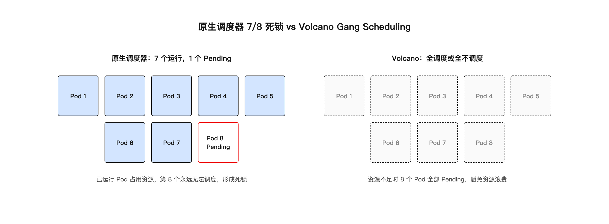
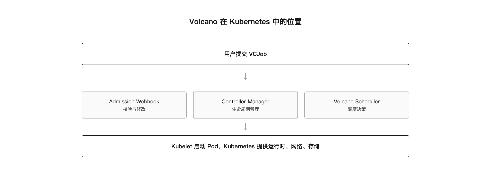

# 第 4 章 Kubernetes 与 Volcano 调度平台

## 引子：微服务调度器跑训练任务

Kubernetes 最早为微服务设计。它的调度器逐个调度 Pod，讲究高可用、弹性伸缩、快速启动。这些特性对在线服务很合适，但对分布式训练却未必。

分布式训练任务通常由多个 Worker 组成，8 个、64 个、甚至上千个 Pod 必须同时启动、同时运行，互相之间才能建立通信。如果调度器只调度了其中 7 个，第 8 个因为资源不足卡住，前面 7 个就会占着 GPU 空等。更糟的是，这 7 个 Pod 占用的资源又会让第 8 个更难被调度，形成死锁。

这个问题不是 Kubernetes 的 bug，而是原生调度器的设计目标不同。要在 Kubernetes 上跑好训练任务，需要引入 Volcano 这类批处理调度器。

调度平台是智算中心的中枢。它决定谁能拿到 GPU、什么时候拿到、拿到之后怎么跑。调度做不好，再好的网络、再强的 GPU 也发挥不出价值。

## 4.1 为什么用 Kubernetes 跑训练

Kubernetes 已经成为数据中心操作系统的事实标准。在智算中心里用它跑训练任务，有几个明显的好处。

**统一资源抽象**：GPU、RDMA 网卡、高速存储都可以声明为资源，通过 Pod 的 resources 字段申请。用户不需要关心底层机器编号，只需要说"我要 8 张 GPU"。

**镜像与隔离**：训练环境封装在容器镜像里，不同任务用不同镜像，互不干扰。PyTorch 2.3 和 2.1 的任务可以跑在同一集群，不会互相污染。

**生态丰富**：镜像仓库、CI/CD、监控、日志、服务发现等工具链成熟。这些能力可以复用到训练场景，不需要从零搭建。

**多租户能力**：Namespace、RBAC、ResourceQuota 提供了基本的租户隔离。多个团队可以共享一个集群，各自看到自己的任务和资源。

**可扩展性**：Operator、CRD、Webhook 让平台团队可以定制自己的工作负载。Volcano 本身就是这种扩展能力的体现。

**标准化接口**：Kubernetes 提供了统一的 API 和资源模型。平台可以在统一接口上开发训练平台、监控系统、计费系统。不同团队不需要学习各不相同的资源管理方式。

但 Kubernetes 原生调度器对训练任务不够友好，主要体现在调度粒度和资源竞争上。训练任务不是微服务，不能按单个 Pod 的思维方式来调。微服务可以逐个扩缩，训练任务必须整体调度。这个区别是理解 AI 调度平台设计的起点。

## 4.2 原生调度器的问题

原生调度器的基本假设是：单个 Pod 可以独立运行，调度一个是一个。这对无状态服务没问题，但对分布式训练不行。


*图 4-1：原生调度器 7/8 死锁 vs Volcano Gang Scheduling*

### 部分调度死锁

一个 8 卡训练任务需要 8 个 Pod。原生调度器可能先调度 7 个，第 8 个因资源不足 Pending。已调度的 7 个 Pod 占用 GPU 等待第 8 个，但资源被占后又让第 8 个更难调度。

这种 all-or-nothing 的资源需求，原生调度器无法原子性满足。训练任务会长期卡在 NCCL init 阶段，GPU 被白白占用。

### 资源碎片

假设每个节点有 8 张 GPU。几个任务分别用了每个节点上的 1-2 张卡，结果每个节点都剩下 6-7 张卡，但没有一个节点能容纳新的 8 卡任务。这就是 GPU 碎片问题。

原生调度器的 BestEffort 或默认策略不针对 GPU 装箱优化，长期运行后碎片会越来越多。碎片不直接让任务失败，但会降低集群整体利用率。长期运行后，碎片积累可能导致大任务无法调度，小任务也无法充分利用剩余资源。

### 优先级与抢占粗糙

虽然 Kubernetes 支持 PriorityClass 和抢占，但它按 Pod 抢占，不是按作业抢占。一个训练任务被抢占部分 Pod 后，整体可能已经失败，抢占反而制造了更多混乱。

训练任务被抢占 2 个 Pod，剩下 6 个 Pod 会卡在集体通信等待。被抢占的 Pod 释放资源后，又可能被其他高优先级任务抢走，原任务永远凑不齐。

部分抢占还会破坏 gang 完整性。即使被抢占后资源又还回来，训练进程可能已经因为通信超时退出，需要重启整个作业。

### 队列与公平调度缺失

多团队共享集群时，需要队列、权重、配额、公平调度。原生 Kubernetes 没有这些概念，需要额外搭建。没有队列，大团队的小任务可能挤满集群，小团队的大任务永远排不上。公平调度缺失还会导致团队之间互相投诉资源分配不公。

## 4.3 Volcano 的定位

Volcano 是面向 Kubernetes 的批处理调度系统，专为计算密集型任务设计。它通过自定义调度器和 CRD，扩展了 Kubernetes 的调度语义。


*图 4-2：Volcano 在 Kubernetes 中的组件架构*

Volcano 的核心组件：

**Volcano Controller Manager**：管理 VCJob 等自定义资源的生命周期。它监听 VCJob 变化，创建 PodGroup 和 Pod，更新作业状态。

**Volcano Scheduler**：实际做调度决策的调度器。它通过 Action 和 Plugin 机制组合各种调度策略。

**Volcano Admission Webhook**：校验和修改作业提交。用户提交 VCJob 时，Webhook 自动创建同名 PodGroup。

**VCJob / PodGroup / Queue**：自定义资源，描述批处理作业、Pod 组和资源队列。

Volcano 不会替代 Kubernetes，而是和它协同工作。Kubelet、CNI、CSI 等组件仍然由 Kubernetes 提供。Volcano 只接管调度决策这一层。

### GPU Device Plugin 原理

GPU 对 Kubernetes 来说不是默认资源。要让 Pod 能申请 GPU，需要 Device Plugin 机制。

Device Plugin 是 Kubernetes 提供的一套设备发现框架。NVIDIA 的 nvidia-device-plugin 或昇腾的 Ascend Device Plugin 以 DaemonSet 形式运行在每个节点上。它向 Kubelet 注册本节点可用的 GPU/NPU 设备，并把这些设备暴露为 `nvidia.com/gpu` 或 `huawei.com/Ascend910` 这样的扩展资源。

Pod 申请 GPU 时，在 resources.limits 中声明 `nvidia.com/gpu: 1`。Kubelet 调度 Pod 到节点后，调用 Device Plugin 的 Allocate 接口，把具体的 GPU 设备号分配给容器。容器启动时，Device Plugin 会把设备文件和驱动库挂载到容器内。

Device Plugin 本身不做调度决策，只负责设备分配。调度决策由 Volcano Scheduler 完成。Device Plugin 和 Volcano 的关系是：Volcano 决定 Pod 去哪个节点，Device Plugin 决定 Pod 用哪张卡。

在 NVIDIA 节点上，nvidia-device-plugin 会扫描 `/dev/nvidia*` 设备，向 Kubelet 上报 `nvidia.com/gpu` 资源。Pod 申请 GPU 后，Device Plugin 会调用 NVIDIA 容器运行时将对应 GPU 设备挂载进容器。昇腾节点上类似，由 Ascend Device Plugin 上报 `huawei.com/Ascend910` 资源。

Device Plugin 需要与节点驱动版本匹配。升级 CUDA 驱动或昇腾驱动后，通常需要同步更新 Device Plugin 镜像版本。否则 Device Plugin 可能无法正确识别设备，导致 Pod 调度到节点后启动失败。

## 4.4 Gang Scheduling

Gang Scheduling 是 Volcano 最核心的能力，也称"成组调度"。

它的规则很简单：一个 PodGroup 声明 minMember=N，调度器只有在确认当前集群能同时满足 N 个 Pod 的资源需求时，才会创建并绑定这 N 个 Pod；否则整个 PodGroup 保持 Pending。

这就解决了 7/8 死锁问题。资源不够时，一个 Pod 都不调度；资源够时，全部一起调度。GPU 不会被部分占用空等。

典型 PodGroup 配置：

```yaml
apiVersion: scheduling.volcano.sh/v1beta1
kind: PodGroup
metadata:
  name: train-job-001
spec:
  minMember: 8
  queue: training
  priorityClassName: high
```

对于分布式训练任务，minMember 通常等于总 Worker 数。全量训练（DDP/FSDP）必须所有 Worker 同时就绪，否则 NCCL init 无法完成。

弹性训练场景可以例外。如果训练代码支持动态加入和退出，minMember 可以设为总 Worker 数的 2/3 或 3/4。但大多数生产训练任务是全量训练，minMember 等于 replicas。

## 4.5 Queue 与多租户

Queue 提供多租户资源隔离和排队机制。每个 Queue 可以配置权重、容量、是否可抢占等属性。

常见队列划分：

| 队列 | 用途 | 策略 |
|------|------|------|
| training | 正式训练任务 | 高权重，可抢占 |
| eval | 模型评估 | 中权重，不抢占训练 |
| infer | 在线推理 | 独立队列，避免被训练抢占 |

队列之间通过 DRF（Dominant Resource Fairness）算法实现公平调度。DRF 的核心思想是：每个队列按照自己的主导资源份额来分配，避免某个队列长期独占某类资源。

DRF 的具体做法是：先计算每个队列在每种资源上的使用比例，然后找出每个队列的"主导资源"（使用比例最高的那种资源）。调度时优先满足主导资源份额最小的队列，让它获得更多资源，直到各队列的主导资源份额趋于均衡。

举个例子：集群有 100 张 GPU 和 1000 核 CPU。队列 A 申请了 40 张 GPU 和 100 核 CPU，队列 B 申请了 10 张 GPU 和 400 核 CPU。

队列 A 的主导资源份额是 GPU：40/100 = 40%。队列 B 的主导资源份额是 CPU：400/1000 = 40%。此时两者相等，资源分配达到公平。

如果队列 A 又申请了 20 张 GPU，它的 GPU 份额变成 60%，高于 B 的 CPU 份额 40%。DRF 会暂停给 A 分配 GPU，优先给 B 分配 CPU，直到两者主导资源份额重新平衡。

这个机制避免了"GPU 富人"永远优先。在 AI 集群里，GPU 通常是主导资源，但不同团队对 CPU、内存的需求也不同，DRF 让多资源维度的分配更公平。

Queue 还有 capability 和 weight 两个关键属性。capability 是队列的资源硬上限，防止一个队列用完全部资源。weight 是队列的相对权重，资源紧张时按权重比例分配。capability 是硬约束，weight 是软约束。

一个 Queue 配置示例：

```yaml
apiVersion: scheduling.volcano.sh/v1beta1
kind: Queue
metadata:
  name: training
spec:
  weight: 60
  capability:
    cpu: 2000
    memory: 8000Gi
    nvidia.com/gpu: 80
  reclaimable: true
```

这个队列的 weight 是 60，capability 限制最多使用 80 张 GPU。reclaimable 为 true 表示允许回收该队列未使用的资源给其他队列。如果某个团队长期不用完配额，资源可以被更需要的人使用。

Volcano Queue 之外，Kubernetes 原生 ResourceQuota 和 LimitRange 也可以配合使用。ResourceQuota 限制 Namespace 级别的资源总量，LimitRange 限制单个 Pod 的资源上下限。两者结合，可以在 Kubernetes 层和 Volcano 层形成双重保护。

## 4.6 BinPack 与 GPU 碎片

BinPack 插件解决 GPU 碎片问题。它的目标是把 Pod 尽量集中放到少量节点上，让空闲节点保持完整，从而能容纳更大的任务。

Gang Scheduling 回答"能不能调"，BinPack 回答"调到哪"。两者配合，既能避免死锁，又能提高资源利用率。

BinPack 的打分逻辑是：优先选择当前 GPU 占用率较高的节点。这样新 Pod 会填到已经用过的节点上，而不是散开到空节点。久而久之，空节点保持完整，大任务更容易找到整节点资源。

BinPack 不是万能的。如果集群本来就剩得很散，BinPack 也拼不出完整节点。它需要 Gang Scheduling 配合，先把任务按整体调度，再在整体内部做装箱。

## 4.7 在 Volcano 上跑训练任务

一个典型的 VCJob 如下：

```yaml
apiVersion: batch.volcano.sh/v1alpha1
kind: Job
metadata:
  name: llm-train-001
spec:
  minAvailable: 8
  schedulerName: volcano
  queue: training
  policies:
    - event: PodEvicted
      action: RestartJob
  tasks:
    - replicas: 8
      name: worker
      template:
        spec:
          containers:
            - name: trainer
              image: train:v1
              resources:
                limits:
                  nvidia.com/gpu: 1
              env:
                - name: NCCL_IB_HCA
                  value: "mlx5_0,mlx5_1,mlx5_2,mlx5_3,mlx5_4,mlx5_5,mlx5_6,mlx5_7"
                - name: NCCL_NET_GDR_LEVEL
                  value: "PHB"
          restartPolicy: OnFailure
```

关键点：

- `schedulerName: volcano` 指定用 Volcano 调度。如果漏写，Pod 会走默认调度器，Gang 语义失效。
- `minAvailable: 8` 确保 8 个 Worker 一起调度。训练任务通常 minAvailable 等于 replicas。
- `queue: training` 指定资源队列。队列决定任务进入哪个资源池参与调度。
- `policies` 定义事件响应策略，如 Pod 被驱逐时重启整个作业，保证 gang 完整性。
- 环境变量配置 NCCL 参数，保证网络通信效率。

### 训练任务 YAML 完整解释

上面的 YAML 是简化版。生产环境的 VCJob 或 PyTorchJob 通常还包含更多字段。下面逐字段解释一份更完整的 PyTorchJob YAML：

```yaml
apiVersion: kubeflow.org/v1
kind: PyTorchJob
metadata:
  name: pytorch-ddp-8gpu
  namespace: algo-team
spec:
  pytorchReplicaSpecs:
    Worker:
      replicas: 8
      restartPolicy: OnFailure
      template:
        spec:
          schedulerName: volcano
          priorityClassName: production-critical
          containers:
            - name: pytorch
              image: pytorch/pytorch:2.3.0-cuda12.1-cudnn8-runtime
              command:
                - torchrun
                - --nnodes=$(WORLD_SIZE)
                - --nproc_per_node=1
                - --rdzv_backend=c10d
                - --rdzv_endpoint=$(MASTER_ADDR):29500
                - train.py
              resources:
                limits:
                  nvidia.com/gpu: 1
                  memory: 100Gi
              volumeMounts:
                - mountPath: /mnt/data
                  name: data
                - mountPath: /dev/shm
                  name: dshm
          volumes:
            - name: data
              persistentVolumeClaim:
                claimName: training-data
            - name: dshm
              emptyDir:
                medium: Memory
                sizeLimit: 64Gi
```

`pytorchReplicaSpecs.Worker` 定义 Worker 角色。PyTorch DDP 是去中心化的，所有 Worker 对等，没有 Parameter Server。

`replicas: 8` 表示 8 个 Worker Pod。配合 `nproc_per_node=1`，每个 Pod 用 1 张 GPU，总共 8 张 GPU。

`restartPolicy: OnFailure` 表示 Pod 失败时重启该 Pod，但达到 maxRetry 后整个 Job 标 Failed。不要用 Always，否则训练成功退出后还会重启。

`schedulerName: volcano` 再次强调。PyTorchJob 的 Controller 创建 Pod 时会带上这个字段，把 Pod 交给 Volcano 做 gang 调度。

`priorityClassName: production-critical` 设置优先级。高优先级任务可以抢占低优先级任务资源。

`torchrun --nnodes=$(WORLD_SIZE)` 中的环境变量由 PyTorchJob Controller 自动注入。用户不需要手写 MASTER_ADDR、RANK、WORLD_SIZE。Controller 会按 Pod 名排序，把第一个 Pod 设为 master，其他 Pod 的 MASTER_ADDR 都指向它。

`/dev/shm` 挂载 emptyDir 内存卷，给 NCCL 提供共享内存。NCCL 通信需要足够的共享内存，默认值可能不够。如果共享内存不足，NCCL 会报错并回退到性能更差的通信方式。

`priorityClassName: production-critical` 需要集群预先创建对应的 PriorityClass。不同 PriorityClass 的数字值决定实际优先级。高优先级任务可以抢占低优先级任务，但不能抢占同优先级任务。

### Pod 中 NCCL 环境变量配置

NCCL 是 NVIDIA 的集合通信库，分布式训练依赖它做 all-reduce、broadcast 等操作。在 Kubernetes Pod 中，NCCL 需要正确配置才能发挥性能。

常用环境变量：

**NCCL_IB_HCA**：指定 IB/RoCE 网卡。例如 `mlx5_0,mlx5_1,mlx5_2,mlx5_3,mlx5_4,mlx5_5,mlx5_6,mlx5_7`。这个值需要根据节点实际网卡确定。

**NCCL_NET_GDR_LEVEL**：控制 GPU Direct RDMA 的启用级别。PHB 表示允许通过 PCIe 交换机做 GDR，SYS 表示允许跨 NUMA 节点，PIX 表示只允许同一 PCIe 根复合体。

**NCCL_SOCKET_IFNAME**：指定 NCCL 通过哪个网络接口回退到 Socket 通信。通常设置为 IB 网卡或管理网卡，避免走容器虚拟网卡。

**NCCL_DEBUG**：设为 INFO 可以打印 NCCL 初始化日志，排查通信问题。

这些变量不来自 Kubernetes 默认配置，需要平台在生成 Pod 模板时注入。注入的值来自节点硬件信息和集群网络规划。

NCCL 配置错误是最常见的训练启动失败原因之一。典型表现是 Pod 全部 Running，但训练日志卡在 "NCCL init" 或 "connecting to rank" 不动。此时需要检查 IB 网卡是否可用、NCCL_IB_HCA 是否正确、RoCE 配置是否生效。

**NCCL_IB_DISABLE**：强制禁用 IB/RoCE，只用 Socket 通信。调试时可用，但会严重降低通信性能。生产环境不建议长期开启。

**NCCL_P2P_DISABLE**：控制是否允许 GPU 之间直接 P2P 通信。某些拓扑下 P2P 可能有问题，可以临时禁用排查。

**NCCL_BUFFSIZE**：设置 NCCL 通信缓冲区大小。网络带宽高时，适当增大缓冲区可以提升吞吐。默认值通常够用，大模型训练可能需要调优。

**NCCL_TREE_THRESHOLD**：控制 NCCL 选择 Ring 还是 Tree 算法。AllReduce 数据量大时默认用 Ring，超过阈值后用 Tree。不同网络拓扑下表现不同。

### MPIJob 与 TFJob 简介

除了 VCJob，Kubeflow Training Operator 还提供了面向特定框架的训练 CRD。

**MPIJob**：基于 OpenMPI 的 launcher-worker 模式。一个 launcher Pod 用 mpirun 启动所有 worker。适合 Megatron-LM、DeepSpeed 等基于 MPI 的训练框架。MPIJob 的 slotsPerWorker 字段表示每个 Worker 多少 GPU。

**PyTorchJob**：面向 PyTorch DDP/FSDP。自动注入 MASTER_ADDR、MASTER_PORT、WORLD_SIZE、RANK。所有 Worker 对等，没有 launcher 角色。

**TFJob**：面向 TensorFlow PS-Worker 模式。有 PS、Worker、Chief 三种角色，自动注入 TF_CONFIG。TensorFlow 2.x 推荐去中心化策略后，TFJob 使用逐渐减少。

三种 CRD 都需要指定 `schedulerName: volcano` 才能配合 Gang Scheduling。它们不是普通 Deployment，有框架特定的语义。

**MPIJob 的 launcher-worker 模式**：一个 launcher Pod 用 mpirun 启动所有 worker。slotsPerWorker 表示每个 Worker 多少 GPU。总进程数是 worker 数乘以 slotsPerWorker。适合 Megatron-LM 这种需要 MPI 通信语义的场景。

**PyTorchJob 的 Worker 角色**：PyTorch DDP 是去中心化的，所有 Worker 对等。Controller 自动为每个 Worker 注入 RANK 和 MASTER_ADDR。worker-0 默认是 master，其他 Worker 指向它的 DNS 名。

**TFJob 的 PS-Worker-Chief 角色**：TensorFlow 1.x 的 Parameter Server 模式需要三种角色。PS 保存参数，Worker 计算梯度，Chief 负责 checkpoint 和汇总。TensorFlow 2.x 推荐去中心化策略后，TFJob 使用减少。

### 常见错误与排查

**minMember 设置错误**：把 minMember 设得小于实际 Pod 数，训练任务启动后 NCCL init 因缺 rank 超时。全量训练建议 minMember 等于 replicas。

**schedulerName 漏写**：VCJob 或 PyTorchJob 没有指定 schedulerName，Pod 走默认调度器，Gang 语义失效。表现为部分 Pod Running、部分 Pending，训练卡住。

**队列资源不足**：高优训练任务提交到权重低的队列，长时间 Pending。需要检查 Queue 的 capability 和 weight 配置。

**训练抢占推理**：Volcano 的 Gang 抢占会驱逐低优先级 Pod。如果在线推理 Pod 可被抢占，会造成服务中断。生产环境应通过 Queue 和 PriorityClass 隔离。

**Pod 通信走 K8s Service 误解**：训练通信走 IB/RoCEv2 网络，由 Device Plugin 分配网卡。K8s Service 仅用于控制面发现，不要把 NCCL 流量规划到 K8s Overlay 网络。

**日志中看 PodGroup 状态**：`kubectl get podgroup` 可以看到 PodGroup 的 Phase。Running 表示所有 Pod 已调度，Unschedulable 表示资源不足。describe 可以查看具体原因，如 "0/8 nodes are available: 8 Insufficient nvidia.com/gpu"。

**Volcano 与默认调度器混用**：同一个 PodGroup 里的 Pod 必须都走 Volcano。如果部分 Pod 被默认调度器调走，gang 语义会失效。确保所有训练 Pod 的 schedulerName 一致。

## 4.8 运行中的挑战

Volcano 解决了调度问题，但训练任务在 Kubernetes 上运行还面临其他挑战。

**网络配置**：每个 Pod 需要正确的 RDMA 网卡、IP 地址、NCCL 环境变量。通常通过 Device Plugin 和 CNI 配合完成。CNI 给 Pod 分配容器网络 IP，RDMA 网卡通过 Device Plugin 透传。训练通信走 RDMA，不走 K8s Service 或 Overlay 网络。RDMA 网络需要交换机端配置 PFC 和 ECN 才能稳定运行。

**存储挂载**：训练数据量大，需要高性能并行文件系统或对象存储。PVC 的挂载方式和性能直接影响 data_time。如果数据加载慢，GPU 会空等，形成 IO 瓶颈。大模型训练通常使用 Lustre、GPFS、CephFS 等并行文件系统。

**GPU 可见性**：通过 nvidia-device-plugin 或 Ascend Device Plugin 把 GPU/NPU 暴露给 Kubernetes，Pod 申请后由调度器分配。Device Plugin 需要与驱动版本匹配。驱动升级后必须同步验证 Device Plugin 版本。

**故障恢复**：训练任务跑几天甚至几周，中间可能遇到节点故障、网络抖动、OOM。Volcano 的 restartPolicy 可以配置重试策略，但 Checkpoint 保存仍然需要在训练框架层处理。没有 Checkpoint，重试也只能从头开始。

**调度延迟**：大任务需要等待资源全部就位，等待时间可能较长。需要结合队列优先级、抢占、资源预留等机制优化。同时要避免无限等待，设置调度超时时间。

**训练与推理混跑**：在线推理要求低延迟、高可用，训练任务会抢占资源。两者混跑时必须用 Queue 和 PriorityClass 隔离，否则训练抢占会导致推理服务中断。

**调度器可观测性**：Volcano Scheduler 的决策过程需要可观测。通过 Scheduler 日志可以查看 PodGroup 为什么 Pending、哪个 Plugin 拒绝了调度、资源缺口是多少。平台团队需要建立 Volcano 相关指标监控。

**镜像拉取与启动时间**：大模型训练镜像通常几个 GB。Pod 调度成功后，拉取镜像可能耗时数分钟。在 gang 调度场景下，所有 Pod 都需要先拉取镜像才能开始训练。可以通过镜像缓存、本地化仓库、预热节点等方式优化。

**安全与隔离**：多租户共享集群时，不同租户的 Pod 可能跑在同一节点。需要 NetworkPolicy 限制 Pod 间通信，避免训练数据被其他租户访问。特权容器和 hostNetwork 的使用要谨慎，防止越权访问节点资源。

**多集群调度**：单集群容量有限时，需要考虑多集群调度。Volcano 本身不跨集群，需要在平台层做集群选择。不同集群可能有不同 GPU 型号、网络拓扑、存储挂载点。

### 真实场景：一个 64 卡任务的调度过程

假设集群有 8 个节点，每个节点 8 张 GPU，总 GPU 数 64。用户提交一个 64 卡训练任务，minAvailable=64。

Volcano Scheduler 收到 PodGroup 后，gang Plugin 会检查是否所有 64 个 Pod 都能同时调度。如果集群当前空闲 GPU 只有 60 张，整个 PodGroup 保持 Pending，一个 Pod 都不创建。

等待期间，其他小任务继续运行。当有小任务完成，释放 4 张 GPU，达到 64 张空闲时，Volcano 一次性调度全部 64 个 Pod。binpack Plugin 尽量把它们集中到少量节点上，但实际受限于空闲分布。

Pod 调度到节点后，nvidia-device-plugin 给每个 Pod 分配具体 GPU。CNI 给 Pod 分配容器网络 IP。训练容器启动后，读取 NCCL 环境变量，执行 torchrun，所有 Worker 同时建立 NCCL 通信域。

这个过程中任何一个环节出错，都会导致训练启动失败。调度器负责"能不能调"，Device Plugin 负责"用什么卡"，CNI 负责"用什么 IP"，NCCL 配置负责"能不能通信"。

## 4.9 Volcano Scheduler 的 Action 与 Plugin

Volcano Scheduler 的调度流程由 Action 和 Plugin 组合完成。理解这个机制有助于排查调度问题和调优策略。

Action 定义调度流程的阶段：

**enqueue**：PodGroup 进入调度队列，检查 minAvailable 是否满足。

**allocate**：给 Pod 分配节点。Gang Plugin 在这个阶段检查是否所有 Pod 都能同时调度。

**preempt**：高优先级 PodGroup 资源不足时，抢占低优先级 PodGroup 的资源。

**reclaim**：回收空闲队列的资源，提高整体利用率。

Plugin 实现具体的调度算法：

**gang**：实现 Gang Scheduling，保证 all-or-nothing 调度。

**drf**：实现 Dominant Resource Fairness，保证队列间公平。

**priority**：实现优先级调度，高优先级任务优先。

**binpack**：实现 GPU 装箱优化，减少碎片。

**proportion**：按队列权重分配资源。

这些 Plugin 可以组合启用。生产环境通常启用 gang、drf、priority、binpack。不同 Action 按顺序执行，构成完整的调度循环。

Volcano 部署时作为第二个调度器与默认调度器共存。训练任务指定 `schedulerName: volcano`，普通服务走默认调度器。两者互不干扰，共享节点资源。

### Volcano 运维要点

**安装验证**：通过 Helm 安装 Volcano 后，需要检查 Controller、Scheduler、Webhook 三个组件是否正常运行。可以用 `kubectl get pods -n volcano-system` 查看。

**日志排查**：PodGroup 长期 Pending 时，查看 Scheduler 日志定位原因。常见原因包括资源不足、minMember 设置过大、队列 capability 限制、节点污点不匹配等。

**配置更新**：调度器配置通过 ConfigMap 管理。修改 Plugin 组合或权重后，需要重启 Scheduler 生效。生产环境建议先在小范围验证再推广。

### 调度平台可观测性指标

平台团队需要关注 Volcano 和集群层面的关键指标，才能及时发现调度问题。

**PodGroup Pending 数量**：反映资源紧张程度。长期高 Pending 说明集群容量不足或队列配置不合理。

**队列资源使用率**：每个 Queue 的 GPU/CPU/内存使用率。帮助判断队列权重和 capability 是否合理。

**调度延迟**：从 PodGroup 提交到所有 Pod Running 的时间。大任务调度延迟可能长达数小时。

**GPU 碎片率**：统计每个节点剩余 GPU 分布。碎片率高时需要调整 BinPack 策略或合并小任务。

**任务失败率**：按队列、按用户、按 GPU 类型统计训练任务失败率。高失败率可能指向硬件或网络问题。

**节点资源健康度**：监控每个节点的 GPU 温度、ECC 错误、网卡状态。异常节点及时隔离，避免调度任务上去。

这些指标可以通过 Volcano 自身指标和 Prometheus 采集节点、Pod 资源信息组合得到。平台团队可以基于这些指标设置告警阈值。

### Volcano 与其他调度方案

除了 Volcano，Kubernetes 生态还有其他批处理调度方案。

**Kueue**：Kubernetes 官方的批处理调度器，基于队列和配额。它的优势是更接近原生 Kubernetes，社区支持力度大。但 Gang Scheduling 能力相对 Volcano 弱一些。

**Yunikorn**：Apache 孵化的批处理调度器，支持队列、优先级、抢占。适合大数据和 AI 训练混合场景。学习曲线相对陡峭。

**自定义调度器**：团队也可以基于 Kubernetes Scheduler Framework 自研调度器。灵活性最高，但维护成本也大。

yunyun 项目选择 Volcano，主要原因是它成熟、Gang Scheduling 能力强、队列和 DRF 机制完善。对于以 GPU 训练为主的智算中心，Volcano 是较稳妥的选择。其他方案可以按具体场景评估。选型时需要考虑团队维护能力、生态成熟度、与现有 Kubernetes 版本的兼容性。

## 4.10 这一环在整个链路中的位置

调度平台是连接底层基础设施和上层训练任务的桥梁。

向上，它接收用户提交的训练作业，管理资源申请、队列、优先级和生命周期。

向下，它依赖 Kubernetes 的容器运行时、网络、存储和 GPU 设备管理。网络和 GPU 配置不对，调度再准确也没用。

再往上，训练任务运行后，还需要监控、日志、告警、费用核算等平台能力。这些通常由自研平台补充，下一章要讨论的平台开发就是围绕这些需求展开的。

调度平台的稳定直接影响集群利用率。调度器配置错误、队列权重失衡、PriorityClass 设置不当，都会让 GPU 闲置或任务饥饿。平台团队需要定期 review 队列使用情况、Pending 任务分布、GPU 碎片率，根据实际负载调整调度策略。调度不是一次性配置好就结束，而是需要随着业务负载演进的持续工作。

## 小结

Kubernetes 原生调度器适合微服务，不适合分布式训练。Volcano 通过 Gang Scheduling、Queue、BinPack、DRF 等机制，把训练任务从单 Pod 调度升级为作业级调度。Volcano Scheduler 的 Action 和 Plugin 机制让调度策略可以灵活组合。Device Plugin 把 GPU 暴露给 Kubernetes，NCCL 配置决定 Pod 间通信效率，存储和网络决定数据能不能及时喂给 GPU。要在 K8s 上跑好训练，需要调度、设备、网络、存储、安全多个层面协同。平台团队还要建立可观测性，持续优化调度效率。

## 本章事实核对清单

### 参考资料

- `wechat-ai-infra/concepts/volcano/volcano.md`
- `Ai领域sre细分知识/volcano.md`
- `docs/07-Kubernetes容器体系/第22节-K8s上运行AI训练与推理/第22节-K8s上运行AI训练与推理.md`
- `docs/10-大模型Infra工程师/第27节-K8s与Volcano训练调度/`

### 关键概念来源

- Gang Scheduling 的 7/8 死锁场景：来自 `wechat-ai-infra/concepts/volcano/volcano.md`
- PodGroup、VCJob、Queue：来自 `wechat-ai-infra/concepts/volcano/volcano.md` 和 `Ai领域sre细分知识/volcano.md`
- DRF 公平调度：来自 `wechat-ai-infra/concepts/volcano/volcano.md`
- Device Plugin 机制：来自 `docs/07-Kubernetes容器体系/第22节-K8s上运行AI训练与推理/第22节-K8s上运行AI训练与推理.md`
- PyTorchJob 自动注入 MASTER_ADDR/RANK/WORLD_SIZE：来自 `docs/07-Kubernetes容器体系/第22节-K8s上运行AI训练与推理/第22节-K8s上运行AI训练与推理.md`
- NCCL_IB_HCA、NCCL_NET_GDR_LEVEL、NCCL_SOCKET_IFNAME：来自训练调度实践经验和仓库素材
- BinPack 减少 GPU 碎片：来自 `wechat-ai-infra/concepts/volcano/volcano.md`
- Queue 的 capability 和 weight：来自 `Ai领域sre细分知识/volcano.md`
